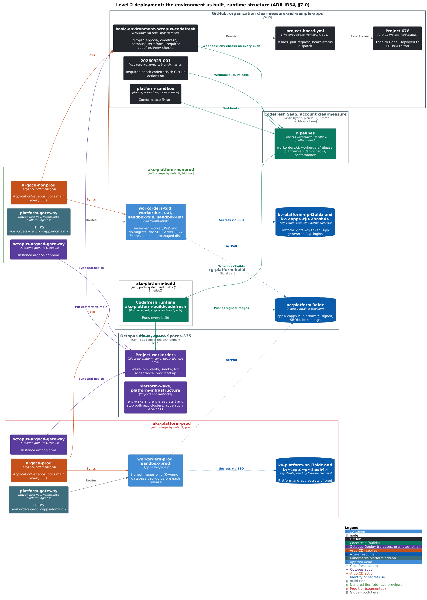
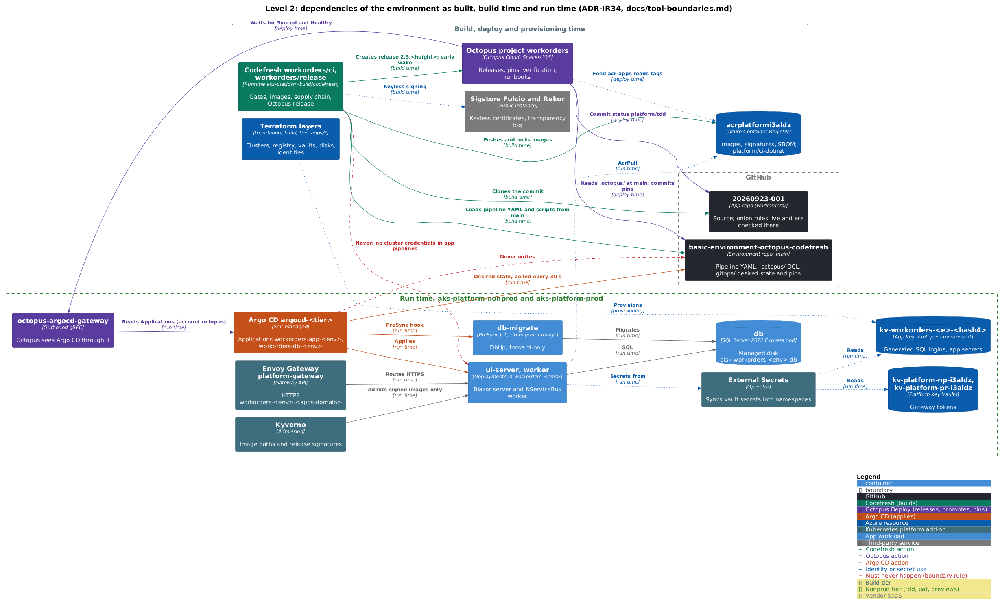
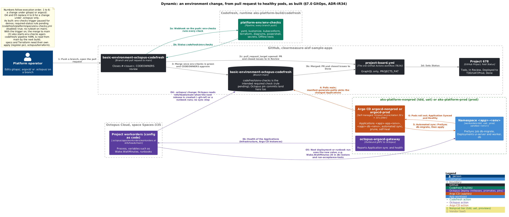
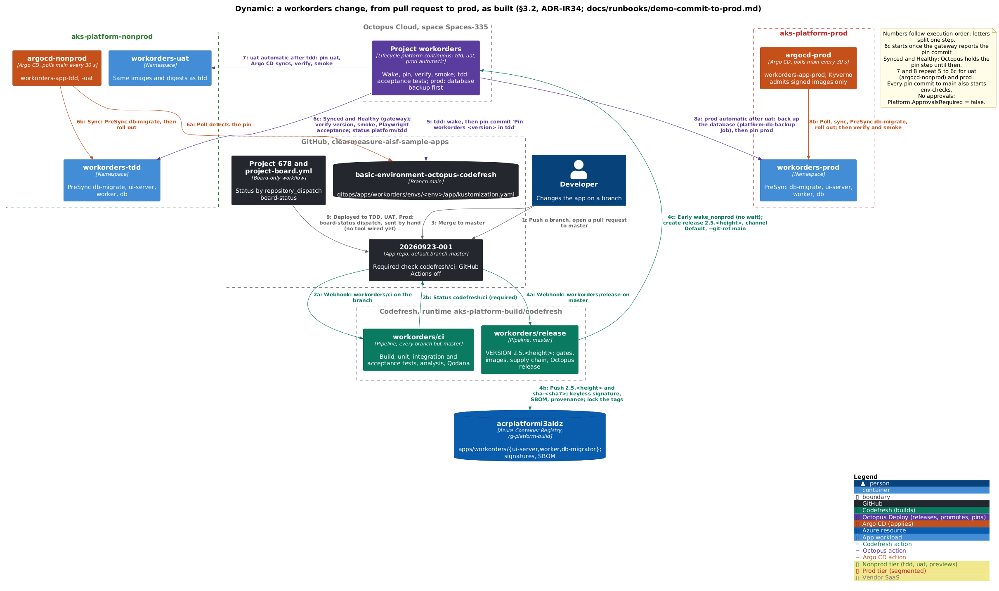

# Multi-app delivery platform: environment repo

Environment repo `clearmeasure-aisf-sample-apps/basic-environment-octopus-codefresh` (public since 2026-09-29, #47: no secret is ever committed; see [Public repository](design/platform-design.md#public-repository-47)) of the multi-app training platform (design ADR-IR34). It holds every platform file and every app's pipelines, Octopus configuration and desired state: the app descriptors, Codefresh pipelines and images, Argo CD, the GitOps tree, Octopus config-as-code, Terraform, admission policies, the checks, the onboarding kit, the .NET conformance harness and the design record. App repositories hold none of it and stay untouched (ADR-D18).

The platform is app-neutral and the apps are platform-neutral. Each app declares itself in `apps/<app>.yaml` and owns its Codefresh and Octopus pipelines ("scaffold, then own"). App #1 is the work-order app (`workorders`, repository `clearmeasure-aisf-sample-apps/20260923-001`); the docs use it as the worked example. The conformance fixture is `sandbox`.

Status (2026-09-26): P0 done; P1 (provisioning and conformance) in progress, in its evidence window. Values in angle brackets are the placeholders of design §7.0, filled in at provisioning.


*Level 1, system context. The platform, the people who use it and the external systems it depends on. [design/architecture-views.md](design/architecture-views.md) shows every level of the design, top-down, each picture with a link to its text.*

## Architecture

The environment as built, with its real resource names; [design/architecture-views.md](design/architecture-views.md) has every other level.



*Runtime structure: GitHub, Codefresh on `aks-platform-build`, `acrplatformi3aldz`, Octopus `Spaces-335`, and Argo CD with Envoy Gateway, the app namespaces and the Key Vaults on `aks-platform-nonprod` and `aks-platform-prod`. Source: [c4-2-as-built-runtime.puml](design/diagrams/c4-2-as-built-runtime.puml).*



*Dependencies at build, deploy and run time, with the boundary rules in red. Source: [c4-2-as-built-dependencies.puml](design/diagrams/c4-2-as-built-dependencies.puml).*



*An environment change, steps 1 to 6 (pull request, checks, merge, Argo CD poll, sync, rollout), plus O4 and O5 for `.octopus/`. As built: env-checks trigger paused for demos; required-status rule pending. Source: [dyn-as-built-env-change.puml](design/diagrams/dyn-as-built-env-change.puml).*



*A workorders change, steps 1 to 9, from the pull request to `20260923-001` to prod and the board. Source: [dyn-as-built-app-change.puml](design/diagrams/dyn-as-built-app-change.puml).*

## One verb per tool


*One verb per tool: GitHub enforces merges, Codefresh builds, Octopus releases, promotes and pins, Argo CD applies, and the Azure platform runs and guards. Red dashed lines are boundary rules of docs/tool-boundaries.md.*

| Tool | Verb | Owns | Stays off |
|---|---|---|---|
| Codefresh | builds | Each app's own pipelines on the runner in `aks-platform-build` (runtime `<cf-runtime>` = `aks-platform-build/codefresh`); the required check `codefresh/ci` of each app repository; signed images with an SBOM under `apps/<app>/` in the shared registry; the Octopus release (context `platform-octopus`, ADR-IR34 decision 4); the early nonprod wake; `platform-env/*` for this repo and the conformance suite | Deploy, approval, Helm and launch-composition steps; cluster and Azure credentials in app pipelines; GitOps Runtime; Promotions |
| Octopus Deploy | releases, promotes, approves, runs runbooks | One or more projects per app (`.octopus/apps/<app>/<project>/`), shared lifecycles, the pin commit through Argo CD, verification, day-2 runbooks; platform projects `platform-infrastructure` (environments, app Azure objects, sleep and wake) and `platform-wake` | Kubernetes YAML and Helm steps against app namespaces |
| Argo CD | applies | One instance per app cluster; ApplicationSet `apps` renders a tenant per descriptor (AppProject, namespaces, quotas, NetworkPolicies, stores, database, Applications, signer policy); migrations as a PreSync Job; self-heal | Image Updater; sync windows |
| GitHub | enforces merge rules | Branch protection on each app repository (`codefresh/ci` required) and the `main` ruleset here (`codefresh/env-checks` required; the target adds required reviews, code-owner review and the Octopus GitHub App as the only bypass actor, see [Public repository](design/platform-design.md#public-repository-47)) | GitHub Actions stays disabled in app #1's repository, a fork |

The Offline tests `Kit.Boundaries.ToolBoundaryTests` (rules TB01 to TB24) enforce the lanes, the name lint and the PowerShell 7 standard. Details, consoles and reasons: [docs/tool-boundaries.md](docs/tool-boundaries.md).

## Commit to production

A merge to an app's default branch runs that app's release pipeline on the runner in `aks-platform-build`. It mints a version, asks Octopus to wake the nonprod cluster (without waiting), runs the app's gates, pushes signed images with an SBOM to `<acr-name>.azurecr.io/apps/<app>/`, locks their tags and creates the Octopus release with an explicit version for each package (`octopus release create --package`). Octopus deploys tdd automatically, uat and prod on approval. Each deployment first wakes its cluster through `platform-wake`, then commits image tags to that app's pin files under `gitops/apps/<app>/envs/<env>/`, waits until Argo CD reports Synced and Healthy, and verifies. Argo CD runs the app's migrations as a PreSync Job before the new pods start; a prod release first backs up the database. For `workorders`, tdd also runs the Playwright suite. The legacy GitHub Actions → Octopus → Container Apps path of the origin runs untouched until app #1's prod cutover.


*Dynamic, commit to production. The release build runs on the platform's runner, reuses locked images on a rerun and hands over to Octopus; every deployment wakes its cluster first, pins image tags only, and lets Argo CD migrate the database with a PreSync Job before the rollout.*

## Apps and onboarding


*Level 3, the onboarding kit. The operator runs `tools/Platform.Onboarding`: `new` writes `apps/<app>.yaml`; every command validates it against `apps/schema.json` and the cross-app rules; `scaffold` copies the Codefresh, Octopus and GitOps starters once into the app-scoped folders, which the app owns from then on. `check` verifies the scaffold, the pins, other apps' names and the blast radius; env-checks runs it on every push of the onboarding pull request; `check --live` reads the Octopus and Codefresh objects after the apply.*

| Step | What happens | Doc |
|---|---|---|
| Describe | `apps/<app>.yaml` (schema `apps/schema.json`): repositories, Codefresh and Octopus projects, deployables with their images and packaging, an optional database and Azure access | [docs/onboarding.md](docs/onboarding.md) |
| Scaffold | `tools/Platform.Onboarding` copies starters once into the app's own folders; the copies then belong to the app | [07 Own the pipeline](docs/walkthroughs/07-own-the-pipeline.md) |
| Check | `Platform.Onboarding check`: schema, cross-app rules, scaffold completeness, pin shape, cross-app references and the blast radius of the pull request | [docs/onboarding.md](docs/onboarding.md) |
| Apply | After the merge: `apps-apply` per tier, `octopus/terraform`, `codefresh/register.ps1 --app <app>`, and `terraform/apps/grants` for apps with Azure access; Argo CD creates the tenant by itself | [docs/onboarding.md](docs/onboarding.md) |

```bash
dotnet run --project tools/Platform.Onboarding -- list
dotnet run --project tools/Platform.Onboarding -- render workorders --subscription-id <AZURE_SUBSCRIPTION_ID>
```

## Sleep by default, wake on the first job

Both app clusters sleep when nobody needs them and wake on the first Codefresh or Octopus job (ADR-IR33, as amended by ADR-IR34).
- **Sleep.** Runbook `env-sleep` of `platform-infrastructure` runs hourly per tier (minute 0, UTC). It skips while any task runs, then stops the cluster outside the working window (weekdays 07:00–19:00, America/Chicago) or after 120 idle minutes, with the alert suppression rule `apr-sleep-<tier>` enabled first.
- **Wake.** Runbook `env-wake` is the only thing that starts a cluster. Step 0 of every app process deploys `platform-wake`, whose one step runs `env-wake` and waits. Release pipelines request an early nonprod wake (`wake_nonprod`) that never fails the build.
- **Build capacity.** The `builds` pool of `aks-platform-build` scales from zero on the first job and back after 10 idle minutes; only its system node runs all the time.
- **Cost.** Design §3.5: about $220 a month sleeping for one app, against about $1,010 always on [UNVERIFIED]. Procedures: [docs/runbooks/sleep-and-wake.md](docs/runbooks/sleep-and-wake.md). Lab: [06 Sleep and wake](docs/walkthroughs/06-sleep-and-wake.md).


*Dynamic, three ways a sleeping cluster meets its first job. The release pipeline's step `wake_nonprod` asks Octopus to run env-wake in `infra-nonprod` and never waits. Step 0 of every app deployment deploys `platform-wake`, whose keyed step runs env-wake in `infra-<tier>` and waits; the deployment continues once the cluster is Running and `apr-sleep-<tier>` is disabled. App runbooks hold no key: they wait up to `Wake.WaitMinutes` for the app to answer, then fail with guidance.*

## Capabilities and tests

Every platform capability has an entry in `catalogue/` and at least one automated test in the .NET conformance harness `tests/Platform.Conformance.sln` (NUnit, TRX results; no JUnit). The catalogue holds 82 capabilities: 62 proven by live tests (5 of them destructive) and 20 offline. Offline tests run on every push of this repo; the live suite runs nightly in `platform-env/conformance` and the destructive suite weekly in nonprod, once P1-13 enables their crons; the end-to-end pass on app #1 runs on demand. Rendered catalogue: [docs/capabilities.md](docs/capabilities.md). Runbook: [docs/runbooks/conformance.md](docs/runbooks/conformance.md).


*Level 3, the conformance suite. The capabilities of the six catalogue fragments feed `tests/Platform.Conformance.sln` (NUnit 4, Shouldly, TRX), and `render-catalogue` writes `docs/capabilities.md`. `CatalogueConsistencyTests` enforces the one-to-one mapping between capabilities and tests by reflection over both test assemblies. env-checks runs the Offline category and fails on a stale catalogue page; the conformance pipelines run the Live tests with `TEST_FILTER`. The harness clients reach Octopus, Codefresh, Azure Resource Manager and the registry, the cluster API servers and GitHub, with secrets from Codefresh contexts only.*

## Layout and writers

Writers: **H** people through a reviewed pull request to `main`; **O-pin** Octopus, direct commit to `main`, pin fields only; **O-branch** Octopus UI edits of config-as-code on non-`main` branches, merged by H. Readers: Argo CD, Codefresh, Octopus, the tier Terraform.


*Code level, environment repo (a): the delivery folders the tools read. People write by pull request; Octopus commits only image tags under `gitops/apps/<app>/envs/<env>/<deployable>/` (purple); in `.octopus/`, UI edits happen on branches with one conversion commit per project (light purple); red borders need security-owner approval; light blue marks app-scoped paths (CAP-KIT-004); each folder names its reader.*


*Code level, environment repo (b): the Terraform layers, the onboarding tool, the .NET conformance harness, the catalogue, contracts and checks, the sandbox fixture, the docs and the design record, all written by pull request; red borders need security-owner approval.*

```text
basic-environment-octopus-codefresh/
├── README.md  CODEOWNERS  .gitleaks.toml  .yamllint.yaml       H
├── apps/{schema.json, workorders.yaml, sandbox.yaml}           H     one descriptor per app
├── catalogue/capabilities.d/*.yaml                             H     capability catalogue, one fragment per role (harness.yaml is the seed)
├── contracts/platform-contracts.yaml                           H     platform names and the handshake (design §7.0)
├── design/                                                     H     platform-design.md, debate/, multi-app/
├── docs/                                                       H     bootstrap, onboarding, capabilities, runbooks/, walkthroughs/, owner/
├── scripts/{checks/validate-all.ps1, diagrams/*.ps1}           H     every check by sub-command, run by env-checks; diagram rendering
├── tools/Platform.Onboarding{,.Tests}/                         H     .NET 10 console: new, scaffold, render, check, list, retire; its tests
├── tests/                                                      H     .NET conformance harness: Offline and Live tests, report tool
├── fixtures/sandbox-app/                                       H     source seeded into <sandbox-app-repo>
├── codefresh/                                                  H     register.ps1, runner/, platform/, templates/ (starters), apps/<app>/
├── containers/                                                 H     platform/{ci-dotnet,db-tools-mssql}, apps/<app>/
├── .octopus/                                                   H, O-branch     platform-infrastructure/, platform-wake/, apps/<app>/<project>/
├── octopus/                                                    H     terraform/ (space objects, for_each over apps/*.yaml), templates/, step-templates/
├── argocd/                                                     H     bootstrap/, clusters/{nonprod,prod}/ (ApplicationSet apps, add-ons)
├── gitops/
│   ├── platform/{tenant,components,ingress}/                   H     tenant chart, database components, ingress
│   ├── templates/{kustomize,helm,raw}/                         H     starters
│   └── apps/<app>/envs/<env>/<deployable>/                     O-pin for pins; H for anything else
├── policies/{kyverno,octopus}/                                 H     admission policies (security owners)
└── terraform/{foundation,build,tier,apps/{tier,grants,descriptor}}/   H     layers of design §7.0
```

No other identity writes to this repo. Argo CD and Codefresh never write here; Codefresh posts commit statuses.

## Phase status


*Roadmap as drawn on 2026-09-24; state on 2026-09-26: P0 is done; P1 is in progress. Done: provisioning, the end-to-end pass to prod, the Owner re-run and least-privilege grants (P1-03) with the CanNotDelete locks, sleep and wake back on, and the sleeping-tier conformance run (15 of 16; CAP-AZ-005 awaits a read-only Kyverno grant). Pending: the first full destructive run, the nightly and destructive crons (P1-13), and the time-bound evidence (five green nightlies, ten green master builds, 90 % night sleep, spend). P2 to P5 follow in order with their exit criteria; the optional P6 may run any time after the P1 exit. Notes give sleep and wake per phase.*

| Phase | Scope | Status (2026-09-26) |
|---|---|---|
| P0 Design | Design, implementation, integration review, ADR-IR34 packages | Done |
| P1 Provisioning and conformance | P1-01 to P1-13: foundation, build cluster and runner, Codefresh and Octopus objects, both app clusters, `workorders` and `sandbox` onboarded, conformance suites, end-to-end pass | In progress, evidence window: P1-01 to P1-12 done; P1-13 (crons) after the first destructive run. [docs/bootstrap.md](docs/bootstrap.md) |
| P2 TDD maturity for app #1 | 20 TDD releases, drills, 14 days of Kyverno audit (tdd auto-deploy is on since P1) | Not started |
| P3 UAT and the Worker | UAT sign-off, the Worker, SLO alerts | Not started |
| P4 Prod cutover of app #1 | Legacy data import, host move (custom domain) | Not started |
| P5 Decommission | The legacy path of the origin retired | Not started |
| P6 Optional | Previews, blue-green, Platform Hub, keyless handoff, custom domain; apps #2 and later any time after P1 | Optional; not started |

Exit criteria and rollback per phase: [docs/cutover-and-decommission.md](docs/cutover-and-decommission.md).

## Start here

| Need | Read |
|---|---|
| Why the platform looks like this | [design/platform-design.md](design/platform-design.md): ADR-IR34, §7.0 contracts, §9 phases, §10 recommendations |
| Provision the platform, step by step | [docs/bootstrap.md](docs/bootstrap.md) |
| Add, freeze or retire an app | [docs/onboarding.md](docs/onboarding.md) |
| Which tool does what | [docs/tool-boundaries.md](docs/tool-boundaries.md) |
| Operate: break-glass, rollback, backup and restore, rotation, SLO burn, sleep and wake, conformance | [docs/runbooks/](docs/runbooks/) |
| Learn the platform (labs 18–24) | [01 Follow a commit](docs/walkthroughs/01-follow-a-commit.md) · [02 Schema and configuration change](docs/walkthroughs/02-schema-change.md) · [03 Promotion and hotfix](docs/walkthroughs/03-promotion-and-hotfix.md) · [04 Drift and rollback](docs/walkthroughs/04-drift-and-rollback.md) · [05 Environment lifecycle](docs/walkthroughs/05-environment-lifecycle.md) · [06 Sleep and wake](docs/walkthroughs/06-sleep-and-wake.md) · [07 Own the pipeline](docs/walkthroughs/07-own-the-pipeline.md) |
| Findings of the checks, by owner | [docs/consistency-notes.md](docs/consistency-notes.md) |

## Contributing

- **App changes** go to the app's own repository. For app #1: pull requests against `clearmeasure-aisf-sample-apps/20260923-001`, base `master`. The repository is a fork, and a fork's pull requests default to the upstream: pick the base explicitly, or run `gh repo set-default clearmeasure-aisf-sample-apps/20260923-001` before `gh pr create`. Never open a pull request against `ClearMeasureLabs/bootcamp-palermo-workorders`. Fork pull requests get no `codefresh/ci` (fork events are off; ADR-IR26).
- **App pipelines, OCL and desired state** live here under the app-scoped paths; one app per pull request.
- **Platform changes** go to `main` of this repo, reviewed by the CODEOWNERS teams, with `codefresh/env-checks` green. An onboarding pull request touches only the new app's paths (CAP-KIT-004).

## Checks

`codefresh/platform/pipelines/env-checks.yml` runs them on every push and posts `codefresh/env-checks`, which the `main` ruleset requires. Locally, from the repo root:

```bash
pwsh scripts/checks/validate-all.ps1 all              # every check; missing tools are skipped with a warning
pwsh scripts/checks/validate-all.ps1 onboarding       # descriptors and the apps' own files (the onboarding tool)
pwsh scripts/checks/validate-all.ps1 dotnet-offline   # dotnet test tests/Platform.Conformance.sln --filter TestCategory=Offline
pwsh scripts/checks/validate-all.ps1 diagrams         # design diagrams rendered, current and embedded
CI=true pwsh scripts/checks/validate-all.ps1 yaml     # CI mode: a missing tool fails
pwsh scripts/checks/validate-all.ps1 consistency      # platform files against contracts/ and apps/ (Kit.Consistency)
pwsh scripts/checks/validate-all.ps1 boundaries       # tool-boundary rules and the bot-path audit (Kit.Boundaries)
```

Tools: PowerShell 7.4 or later with PSScriptAnalyzer, git, yamllint, kustomize, kubeconform, terraform, gitleaks, the .NET 10 SDK, Java 11 or later for PlantUML, and a Mermaid parser. The `platform/ci-dotnet` image carries all of them but the Mermaid parser. Change a name in `contracts/platform-contracts.yaml` only in the same pull request that changes design §7.0.
