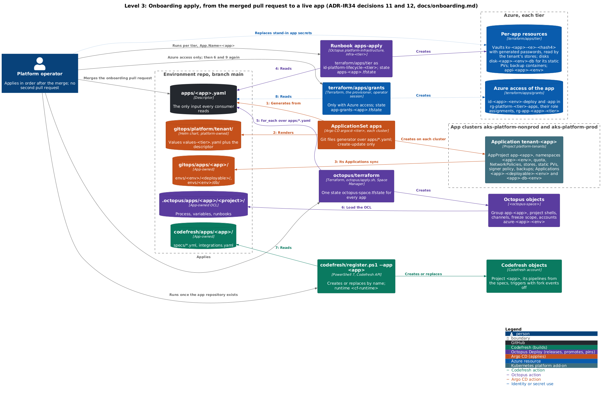
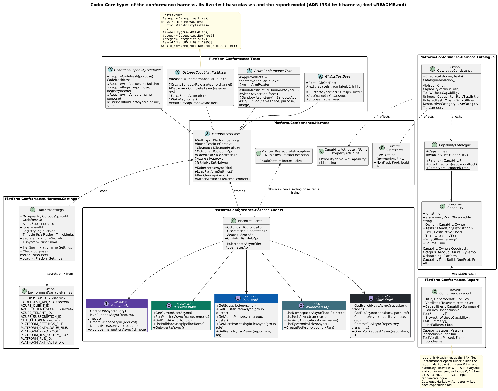

# Architecture views

Every level of the platform design as a picture, top-down: system context, containers, components, code, then the flows and the cross-cutting views. Each picture also sits next to its text in [platform-design.md](platform-design.md) or in the docs; the links under each caption lead there.

The pictures are C4 and UML diagrams written in PlantUML under [diagrams/](diagrams/) and rendered to PNG with PlantUML's built-in Smetana layout; [diagrams/README.md](diagrams/README.md) gives the conventions and the commands (`pwsh scripts/diagrams/render.ps1`). env-checks fails when a source changes without a new render, when a PNG is edited by hand, and when a PNG is embedded nowhere.

## Contents

- [Level 1: system context](#level-1-system-context)
- [Level 2: containers and deployment](#level-2-containers-and-deployment)
- [Level 3: build and supply chain (Codefresh)](#level-3-build-and-supply-chain-codefresh)
- [Level 3: release and runbooks (Octopus)](#level-3-release-and-runbooks-octopus)
- [Level 3: GitOps and the app clusters (Argo CD, Kubernetes)](#level-3-gitops-and-the-app-clusters-argo-cd-kubernetes)
- [Level 3: identities and secrets](#level-3-identities-and-secrets)
- [Level 3: infrastructure (Terraform, monitoring)](#level-3-infrastructure-terraform-monitoring)
- [Level 3: onboarding kit](#level-3-onboarding-kit)
- [Level 3: conformance](#level-3-conformance)
- [Level 4: code](#level-4-code)
- [Flows](#flows)
- [Views](#views)

## Level 1: system context

Who uses the platform and which systems it depends on.

*Level 1, system context. The platform, the people who use it and the external systems it depends on.*

Text: [1. Executive summary](platform-design.md#1-executive-summary); [3.1 System context](platform-design.md#31-system-context).

## Level 2: containers and deployment

The delivery platform's containers, then the same containers placed on Azure.

*Level 2, containers. The environment repo, the Codefresh pipelines and their runner, the shared registry, the Octopus space, and one app cluster per tier in which Argo CD, the Octopus gateway and workers, the admission and secret add-ons, the apps and their databases run. Each line carries the verb of the tool that owns it.*

Text: [3.0 The current platform in pictures (ADR-IR34)](platform-design.md#30-the-current-platform-in-pictures-adr-ir34).

*Level 2, deployment on Azure. The containers placed in the subscription: the global and build resource groups, then one set of resource groups per tier, with the node pools of the three clusters. The one cross-tier read is prod's pull from the shared registry.*

Text: [3.0 The current platform in pictures (ADR-IR34)](platform-design.md#30-the-current-platform-in-pictures-adr-ir34); [7.0 Multi-app contracts (ADR-IR34)](platform-design.md#70-multi-app-contracts-adr-ir34).

## Level 3: build and supply chain (Codefresh)

What starts each pipeline, what a build uses, and how an image travels from build to admission.

*Level 3, Codefresh projects and pipelines (plan BASIC_1: one build at a time) and what starts each. App repos start `<app>/ci` on every branch but the release branch, `<app>/release` on it and `workorders/preview` on labelled same-repo pull requests; fork events are off. Each pipeline posts its `codefresh/*` status; `codefresh/ci` is the required check of master. The environment repo starts env-checks and ci-image-dotnet; crons start ci-image-dotnet weekly and conformance-arm, conformance-destructive and registry-retention once P1-13 enables them. conformance-arm pushes the sandbox commits and queues conformance; `codefresh/register.ps1` creates or replaces every project, pipeline, context and integration by name.*

Text: [7.7 Codefresh](platform-design.md#77-codefresh); [codefresh/apps/workorders/README.md](../codefresh/apps/workorders/README.md).

*Level 3, what a build uses: the runtime `aks-platform-build/codefresh`; YAML and scripts from main of the environment repo through the Git integration `github-aisf-sample-apps`; step images pulled with `acr-platform-pull`; secret contexts only in the pipelines whose specs attach them (`platform-registry` and `platform-octopus`: release; `platform-registry-retention`: retention; `platform-octopus` and `platform-conformance`: conformance; `app-workorders-ci`: app #1 only); registry integrations push with repository-scoped tokens (`acr-apps-release` to `apps/*`, `acr-apps-preview` to `apps-previews/*`, `acr-platform-ci` to `platform/*`).*

Text: [7.7 Codefresh](platform-design.md#77-codefresh); [docs/preview-codefresh.md](../docs/preview-codefresh.md).

*Dynamic, build half of the supply chain (steps 1 to 9; previews P). The image builds of `<app>/release` push `<VERSION>` and `sha-<sha7>` with `cf-apps-release` and sign each digest keyless (Codefresh ID token, issuer `https://oidc.codefresh.io`, a short-lived Fulcio certificate, the Rekor log); `supply_chain` attaches the SPDX SBOM and step-authored SLSA provenance and locks both tags; `octopus_release` creates the release, whose feed `acr-apps` reads the tags. Previews (phase 6) push signed, unlocked `pr-<n>-<sha>` tags to `apps-previews`.*

Text: [7.5 Images, packages and versions](platform-design.md#75-images-packages-and-versions); [ADR-D11 Supply chain and admission](platform-design.md#adr-d11-supply-chain-and-admission--decided).

*Dynamic, run half of the supply chain (steps 10 to 14; retention R1 to R3). Octopus pins `newTag=<VERSION>` per environment and `argocd-prod` applies main; Kyverno admits a workload only if its `apps/<app>/` images carry a keyless signature of the app's own release pipeline and come from the app's registry path (deny in prod, audit in nonprod); the kubelet pulls the pinned, locked tag. The nightly registry-retention keeps pinned tags, referrers, same-digest tags, the 10 newest SemVer tags and the fixture, and unlocks and then deletes the rest after 30 days (7 for `apps-previews`).*

Text: [7.6 Environment pin contract](platform-design.md#76-environment-pin-contract); [ADR-IR30 Image policies evaluate at admission only](platform-design.md#adr-ir30-image-policies-evaluate-at-admission-only--decided-n4-amends-adr-d11).

## Level 3: release and runbooks (Octopus)

The Octopus space, seen from the projects and from the environments.

*Level 3, the Octopus space seen from the projects. The app projects `workorders` and `sandbox` (one group `app-<app>` per app) have the channels `Default` and `Hotfix`, and `sandbox` adds `Strict`. Step 0 of every app process deploys `platform-wake`, whose one step runs env-wake of `platform-infrastructure` through the REST API and waits. The hourly triggers run env-sleep, and the Terraform runbooks wake the cluster first. `octopus/terraform` creates the space objects, and the stored Git credential reads and commits the OCL in the environment repo.*

Text: [7.2 Octopus](platform-design.md#72-octopus).

*Level 3, the Octopus space seen from the environments. The four lifecycles sit above the environments, grouped by tier: nonprod holds tdd, uat and infra-nonprod; prod holds prod, infra-prod and the weekend freezes. Each tier has its Kubernetes worker pools, its Argo CD instance registered by the in-cluster gateway, and its lifecycle OIDC account. Shared by all: the optional app accounts, `hosted-ubuntu`, the three feeds and the seven teams.*

Text: [7.2 Octopus](platform-design.md#72-octopus); [docs/preview-octopus.md](../docs/preview-octopus.md).

## Level 3: GitOps and the app clusters (Argo CD, Kubernetes)

How each cluster's Argo CD renders the platform and one tenant per app, what runs where, and how traffic reaches an app.

*Level 3, Argo CD. Each app cluster runs one Argo CD instance, `argocd-<tier>`, rooted in `argocd/clusters/<tier>/`. The `terraform/tier` bootstrap installs Argo CD and the Application `platform-root` once; `platform-root` then syncs the namespaces, AppProjects, storage, platform secrets, add-on Applications and the ApplicationSet `apps` from main. The ApplicationSet reads `apps/*.yaml` and creates one Application `tenant-<app>` per descriptor, which renders `gitops/platform/tenant/` with `values-<tier>.yaml` and the descriptor. Four AppProjects fence the result: `platform-addons` (every cluster-scoped kind), `platform-tenants` (only what the tenant chart renders), `app-<app>` per app, and a locked `default`.*

Text: [7.3 Argo CD](platform-design.md#73-argo-cd).

*Level 3, one tenant. For each environment of its tier, `tenant-<app>` renders the app's fences: the AppProject `app-<app>`, namespaces, quota and LimitRange, NetworkPolicies, the ClusterSecretStore `<app>-<env>`, the ListenerSet `<app>-<env>`, a static PersistentVolume, the signer policy and the backup CronJobs; and two Applications: `<app>-db-<env>` at wave 0 and `<app>-<deployable>-<env>` at wave 5 (with the Octopus annotations). The database overlay combines `mssql-2022-express` and `db-credentials/keyvault`; the deployable overlay references its config folder, the shared base and opt-in components. Octopus writes only `images[].newTag` in `envs/<env>/<deployable>/kustomization.yaml`; `manifest-generate-paths` limits automated syncs to commits under the deployable's own paths.*

Text: [7.3 Argo CD](platform-design.md#73-argo-cd); [docs/onboarding.md](../docs/onboarding.md).

*Level 3 deployment, inside `aks-platform-<tier>`. The add-ons tolerate `CriticalAddonsOnly` and run on the one-node system pool: argocd, external-secrets, kyverno, cert-manager, octopus-argocd-gateway and platform-ingress (Envoy, Gateway `platform-gateway`). The apps pool holds the app namespaces, the Octopus workers `octopus-worker-<env>` and the platform-backup Jobs. Every connection starts inside the cluster: Argo CD polls main, the gateway dials Octopus over gRPC, the workers poll for work, ESO reads the vaults, and SQL Server writes backups to Blob storage with a SAS that the backup Job obtains.*

Text: [7.4 Kubernetes namespaces](platform-design.md#74-kubernetes-namespaces).

*Level 3 deployment, app #1 in namespace `workorders-<env>`. The HTTPRoute `ui-server` attaches to the ListenerSet `workorders-<env>` in platform-ingress and forwards to the Deployment `ui-server`; the Deployment `worker` stays at zero replicas. On every sync of `workorders-app-<env>`, the PreSync Job `db-migrate` migrates the database before the rollout. The StatefulSet `db` runs SQL Server 2022 Express on the claim `data-db-0`, statically bound to `disk-workorders-<env>-db`, with the certificate `db-tls` from `platform-internal-ca` and a PostSync Job `db-init` for the logins. The Secrets `db-sa`, `db-migrator`, `db-app` and `workorders-app` come from the app vault through ExternalSecrets; the tenant quota and NetworkPolicies fence the namespace. The sandbox has the same shape with the Deployment `web` and no app secret.*

Text: [7.4 Kubernetes namespaces](platform-design.md#74-kubernetes-namespaces); [docs/walkthroughs/02-schema-change.md](../docs/walkthroughs/02-schema-change.md).

*Network view. Each tier has its own `vnet-platform-<tier>`, not peered, with nodes in `snet-aks-<tier>` and pods on Azure CNI overlay with Cilium policy. Users resolve `<app>-<env>.<ingress-ip-dashed-<tier>>.sslip.io` to `pip-platform-<tier>-ingress`. The Gateway `platform-gateway` answers port 80 with the HTTPS redirect and the ACME HTTP-01 solvers; the ListenerSet `<app>-<env>` terminates TLS with a Let's Encrypt certificate and admits only routes from its own namespace; in uat and prod the app's HTTPRoute redirects diagnostics paths to `/`. Tenant NetworkPolicies deny ingress by default and admit platform-ingress, the app environment's own namespaces, and database traffic from platform-backup and, when the descriptor opts in, from `octopus-worker-<env>`; egress leaves through `pip-platform-<tier>-egress`, and the Octopus gateway and workers connect outbound only.*

Text: [7.4 Kubernetes namespaces](platform-design.md#74-kubernetes-namespaces); [7.0 Multi-app contracts (ADR-IR34)](platform-design.md#70-multi-app-contracts-adr-ir34).

## Level 3: identities and secrets

Every Azure identity and its grants, the credentials outside Azure, and the path of each secret.

*Level 3, Azure identities in three columns: who uses each (the operator, Octopus Cloud over OIDC, Codefresh with the conformance secret), the identity, and the scope of each grant. Nonprod is drawn in full; prod holds the same identities on its own groups, and no tier identity holds a grant in the other tier. The only cross-tier reads are AcrPull on the shared registry and the recorded exception for `sp-platform-conformance`. The provisioner creates every grant.*

Text: [5.2 Identity inventory](platform-design.md#52-identity-inventory).

*Level 3, the credentials outside Azure: where each is held and what it reaches. One Space Manager key sits in the Codefresh context `platform-octopus`, in the library set `Platform Automation`, in the step-scoped `Platform.OctopusApiKey`, and in both gateways through the platform vault. One org PAT backs the Octopus Git credential, the Codefresh Git integration, the `platform-conformance` context and the interim Argo CD repository credential (until R11). Five repository-scoped ACR tokens live only in Codefresh integrations and contexts.*

Text: [5.3 Rules for the stored credentials (the user's choice, respected)](platform-design.md#53-rules-for-the-stored-credentials-the-users-choice-respected); [docs/runbooks/credential-rotation.md](../docs/runbooks/credential-rotation.md).

*Level 3, app secrets. apps-apply runs `terraform/apps/tier` as `id-platform-lifecycle-<tier>` and writes the generated SQL passwords and app keys into `kv-<app>-<e>-<hash4>` as write-only values; platform-operators replace the stand-ins; rotate-db-passwords rotates `<app>_migrator` and `<app>_app`. ESO reads the vault only through the ClusterSecretStore `<app>-<env>` as `id-eso-platform-<tier>` (workload identity federation) and syncs, hourly, the Secrets used by `db`, `db-init`, `db-migrate` and the workloads; platform-backup gets its own copy of the sa password. The optional tdd step Read deployment secrets reads the same vault as `id-<app>-<env>-deploy`; store conditions refuse other apps' namespaces, and `app-<app>` denies every SecretStore kind.*

Text: [7.8 Key Vault, ESO and workload identity](platform-design.md#78-key-vault-eso-and-workload-identity).

*Level 3, platform and pipeline secrets. The platform vault `<kv-platform-<tier>>`, seeded by platform-operators after env-apply, holds the repository credential and the gateway's two tokens; ESO syncs them through the ClusterSecretStore `platform-keyvault`, which admits only argocd and octopus-argocd-gateway; `terraform/tier` seeds `argocd-repo-creds` once so the first sync can read the repository. Pipeline secrets stay in their tools (names only here): Codefresh secret contexts and registry integrations, Octopus sensitive variables, the stored Git credential for pin commits. One Space Manager key sits in four places (ADR-IR32), an accepted residual risk (decision 15).*

Text: [7.8 Key Vault, ESO and workload identity](platform-design.md#78-key-vault-eso-and-workload-identity).

## Level 3: infrastructure (Terraform, monitoring)

The Terraform layers and their apply order, then the monitoring and cost objects they create.

*Level 3, the Terraform layers, grouped by where their state lives. `terraform/foundation`, `terraform/build`, `terraform/apps/grants` and `octopus/terraform` run from operator sessions and keep state in `<tfstate-storage-account-global>`, which only the provisioner writes. `terraform/tier` and `terraform/apps/tier` keep one state per tier in `<tfstate-storage-account-<tier>>`, written by `id-platform-lifecycle-<tier>` through the env-* and apps-* runbooks. The numbers give the apply order and what each layer hands to the next: objects are found by name or passed through tfvars, never through remote state. `octopus/terraform` runs again after env-apply and after the grants, and apps-apply runs again after the grants.*

Text: [7.0 Multi-app contracts (ADR-IR34)](platform-design.md#70-multi-app-contracts-adr-ir34); [7.10 Azure resources and the Terraform layer contract](platform-design.md#710-azure-resources-and-the-terraform-layer-contract).

*Level 3, monitoring and cost objects, grouped by the Terraform layer that creates them. `terraform/tier` creates `log-platform-<tier>`, `ag-platform-oncall` and `apr-sleep-<tier>` once per tier; `terraform/apps/tier` creates `appi-<app>-<env>` and `slo-fast-burn-<app>-<env>` per app environment; `terraform/foundation` creates the three budgets, each filtered by resource-group name. env-sleep enables `apr-sleep-<tier>` before it stops the cluster and env-wake disables it after the start, so a sleeping tier pages nobody.*

Text: [7.0 Multi-app contracts (ADR-IR34)](platform-design.md#70-multi-app-contracts-adr-ir34); [ADR-D15 Observability and SLOs](platform-design.md#adr-d15-observability-and-slos--decided).

## Level 3: onboarding kit

How an app joins the platform: descriptor, scaffold, check, one pull request, apply.

*Level 3, the onboarding kit. The operator runs `tools/Platform.Onboarding`: `new` writes `apps/<app>.yaml`; every command validates it against `apps/schema.json` and the cross-app rules; `scaffold` copies the Codefresh, Octopus and GitOps starters once into the app-scoped folders, which the app owns from then on. `check` verifies the scaffold, the pins, other apps' names and the blast radius; env-checks runs it on every push of the onboarding pull request; `check --live` reads the Octopus and Codefresh objects after the apply.*

Text: [docs/onboarding.md](../docs/onboarding.md).

*Level 3, the onboarding apply. After the merge, the ApplicationSet `apps` renders `tenant-<app>`, whose Applications sync the app's folders. The operator runs apps-apply per tier, `octopus/terraform` and `codefresh/register.ps1 --app`; for apps with Azure access, `terraform/apps/grants` follows, then apps-apply and `octopus/terraform` again. The numbers follow the steps of docs/onboarding.md; no second pull request is needed.*

Text: [docs/onboarding.md](../docs/onboarding.md).

## Level 3: conformance

The capability catalogue, the .NET harness, and how the suite runs.

*Level 3, the conformance suite. The capabilities of the six catalogue fragments feed `tests/Platform.Conformance.sln` (NUnit 4, Shouldly, TRX), and `render-catalogue` writes `docs/capabilities.md`. `CatalogueConsistencyTests` enforces the one-to-one mapping between capabilities and tests by reflection over both test assemblies. env-checks runs the Offline category and fails on a stale catalogue page; the conformance pipelines run the Live tests with `TEST_FILTER`. The harness clients reach Octopus, Codefresh, Azure Resource Manager and the registry, the cluster API servers and GitHub, with secrets from Codefresh contexts only.*

Text: [7.0 Multi-app contracts (ADR-IR34)](platform-design.md#70-multi-app-contracts-adr-ir34); [tests/README.md](../tests/README.md).

*Level 3, how the suite runs. conformance-arm force-sleeps both tiers through env-sleep, pushes run commits to `<sandbox-app-repo>`, and queues a sandbox/release rerun and platform-env/conformance; conformance-destructive and env-checks run the same solution with other filters. The fixture app (its repository, sandbox/ci and sandbox/release, the `apps/sandbox/*` images and the Octopus project) is one boundary; its namespaces sit in nonprod and prod, and only sandbox-tdd and sandbox-uat take destructive tests. Both crons ship disabled until P1-13.*

Text: [7.0 Multi-app contracts (ADR-IR34)](platform-design.md#70-multi-app-contracts-adr-ir34); [docs/runbooks/conformance.md](../docs/runbooks/conformance.md).

## Level 4: code

The descriptor and the names derived from it, the environment repo's folders and writers, and the harness core.

*Code level, the app descriptor. White classes are the keys of `apps/<app>.yaml` (schema 1) with the rules and defaults of `apps/schema.json` and `check`; coloured classes group the names derived for each consumer (tenant chart, `octopus/terraform`, Codefresh and the registry, `terraform/apps/*`); yellow objects show `workorders`. `<hash4>` is the first four hex digits of sha1(`<AZURE_SUBSCRIPTION_ID>/<app>/<env>`).*

Text: [7.0 Multi-app contracts (ADR-IR34)](platform-design.md#70-multi-app-contracts-adr-ir34); [docs/onboarding.md](../docs/onboarding.md).

*Code level, environment repo (a): the delivery folders the tools read. People write by pull request; Octopus commits only image tags under `gitops/apps/<app>/envs/<env>/<deployable>/` (purple); in `.octopus/`, UI edits happen on branches with one conversion commit per project (light purple); red borders need security-owner approval; light blue marks app-scoped paths (CAP-KIT-004); each folder names its reader.*

Text: [6.1 Environment repo: full tree and writers](platform-design.md#61-environment-repo-full-tree-and-writers).

*Code level, environment repo (b): the Terraform layers, the onboarding tool, the .NET conformance harness, the catalogue, contracts and checks, the sandbox fixture, the docs and the design record, all written by pull request; red borders need security-owner approval.*

Text: [6.1 Environment repo: full tree and writers](platform-design.md#61-environment-repo-full-tree-and-writers).

*Code level, the harness core. Tests carry `[Capability]` and categories; four area base classes derive from `PlatformTestBase`, which loads `PlatformSettings` (secrets only from `EnvironmentVariableNames`) and creates five clients through `PlatformClients`; a missing setting throws `PlatformPrerequisiteException` (Inconclusive). `CatalogueConsistency` checks the `CapabilityCatalogue` against the reflected attributes; `ConformanceReport` gives one status per capability.*

Text: [tests/README.md](../tests/README.md).

## Flows

Dynamic views: what happens, in order.

*Dynamic, commit to production. The release build runs on the platform's runner, reuses locked images on a rerun and hands over to Octopus; every deployment wakes its cluster first, pins image tags only, and lets Argo CD migrate the database with a PreSync Job before the rollout.*

Text: [3.2 End-to-end sequence: commit to production](platform-design.md#32-end-to-end-sequence-commit-to-production); [docs/walkthroughs/01-follow-a-commit.md](../docs/walkthroughs/01-follow-a-commit.md).

*Dynamic, the step graph of `workorders/ci`. Both clones feed `prepare` (`VERSION`, `CODE_CHANGED`); six gates run in two chains (`build_sql`, then `acceptance`; `code_analysis`, `build_sqlite`, `qodana`, `security_scan`), so at most two heavy steps share the build node; `gate` waits for every chain, prints the TRX summary and applies the build-result rules: a docs-only change passes with the gates skipped; otherwise each required gate must write its success marker, and `security_scan` is advisory. The build result is the required status `codefresh/ci`.*

Text: [7.7 Codefresh](platform-design.md#77-codefresh).

*Dynamic, the step graph of `workorders/release`, the build of record. After `prepare`, `wake_nonprod` asks Octopus to run env-wake in `infra-nonprod` (it never waits or fails) while the gates run; a passing gate with code changes leads to `package` and `stage_images`; `image_reuse` picks either build, sign, attest and lock (`supply_chain`) or, on a rerun of the same commit, a check of the lock (`supply_chain_reuse`); both reach the Octopus handoff, which ends with the release `VERSION`. The pipeline never deploys.*

Text: [7.7 Codefresh](platform-design.md#77-codefresh).

*Dynamic, the deployment process of app #1 in the order of `deployment_process.ocl` (steps 0 to 12), split by target environment. Every deployment first deploys `platform-wake`. In tdd it reads the acceptance secrets, pins, verifies, runs the acceptance tests and reports `platform/tdd`. In uat it pins, verifies and ends with the sign-off and its guard. In prod the go/no-go, the separation-of-duties guard and the pre-release backup come before the pin. The hotfix justification runs in uat and prod on channel `Hotfix` only, through a variable run condition.*

Text: [7.2 Octopus](platform-design.md#72-octopus); [docs/walkthroughs/03-promotion-and-hotfix.md](../docs/walkthroughs/03-promotion-and-hotfix.md).

*Dynamic, pin and sync. The step Update Argo CD image tags finds the Applications annotated with the deployment's project and environment through the Octopus Argo CD gateway (outbound gRPC from the cluster), then commits `images[].newTag` to `gitops/apps/<app>/envs/<env>/<deployable>/kustomization.yaml` on main as Octopus, without triggering a sync. Argo CD's next poll (scoped by `manifest-generate-paths`) syncs, runs the PreSync `db-migrate` and rolls out; the gateway reports Synced and Healthy at the pin commit, which ends the step's 900-second wait; Verify version and Smoke test follow. A failed migration fails the sync while the old pods keep serving; a rollback redeploys the previous release; `platform-pin-writer` is the fallback writer.*

Text: [7.6 Environment pin contract](platform-design.md#76-environment-pin-contract); [docs/walkthroughs/04-drift-and-rollback.md](../docs/walkthroughs/04-drift-and-rollback.md).

*Dynamic, three ways a sleeping cluster meets its first job. The release pipeline's step `wake_nonprod` asks Octopus to run env-wake in `infra-nonprod` and never waits. Step 0 of every app deployment deploys `platform-wake`, whose keyed step runs env-wake in `infra-<tier>` and waits; the deployment continues once the cluster is Running and `apr-sleep-<tier>` is disabled. App runbooks hold no key: they wait up to `Wake.WaitMinutes` for the app to answer, then fail with guidance.*

Text: [ADR-IR33 Sleep by default, wake on first job](platform-design.md#adr-ir33-sleep-by-default-wake-on-first-job--decided-user-directive-amends-adr-d1-adr-d14-adr-d15-adr-ir32-34-62-72-77-710-r18-amended-by-adr-ir34-names-the-build-runner-cost-testability-hooks); [docs/runbooks/sleep-and-wake.md](../docs/runbooks/sleep-and-wake.md).

*Dynamic, runbook env-sleep in `infra-<tier>`, started hourly by `env-sleep-hourly-<tier>` or by hand. Step Decide sleep applies the rules in order: `Sleep.Enabled`, a queued or running task, `Sleep.Force`, the working window, then idle time; it outputs `Sleep.Decision` and `Sleep.Reason`, and a dry run may simulate the clock with `Sleep.NowOverride`. Step Stop cluster runs only on a sleep decision and changes nothing in a dry run; otherwise it enables `apr-sleep-<tier>`, reads the task list again and stops the cluster without waiting; any exit before the stop is accepted disables the rule again.*

Text: [7.2 Octopus](platform-design.md#72-octopus); [docs/walkthroughs/06-sleep-and-wake.md](../docs/walkthroughs/06-sleep-and-wake.md).

*Dynamic, phase-1 provisioning from an empty subscription to a green conformance suite, steps P1-01 to P1-13, as docs/bootstrap.md runs them. The foundation comes first; then three branches run in parallel: the Owner re-run (nothing waits for it); the build cluster and the Codefresh objects; and the Octopus, tier and app layers. The last two join before the first sandbox release. Colour shows the acting tool, and each step names its owner.*

Text: [ADR-IR34 App-neutral, platform-neutral multi-app platform](platform-design.md#adr-ir34-app-neutral-platform-neutral-multi-app-platform--decided-user-directives-the-multi-app-directive-114-and-the-user-corrections-of-2026-09-24-supersedes-and-amends-the-adrs-listed-below); [docs/bootstrap.md](../docs/bootstrap.md).

*Dynamic, one weekday night. The arm mints `PLATFORM_RUN_ID`, force-sleeps both tiers (`Sleep.Force=true`), waits for Stopped and the 15-minute stop grace, pushes the failing-test, green and canary commits, and queues the rerun and platform-env/conformance with the run ID and SHAs. The sandbox builds run first (CI statuses, the early env-wake, one Octopus release). The run step records the power state, runs `dotnet test` with `TEST_FILTER` (TRX), the capability report and the annotations; publish pushes the results to `conformance-results`; teardown force-sleeps the tiers that were not Running before the run.*

Text: [docs/runbooks/conformance.md](../docs/runbooks/conformance.md).

## Views

Cross-cutting views: responsibilities, environments, network, roadmap and work packages.

*One verb per tool: GitHub enforces merges, Codefresh builds, Octopus releases, promotes and pins, Argo CD applies, and the Azure platform runs and guards. Red dashed lines are boundary rules of docs/tool-boundaries.md.*

Text: [4. Responsibility matrix](platform-design.md#4-responsibility-matrix); [docs/tool-boundaries.md](../docs/tool-boundaries.md).

*Environment topology (ADR-IR34). Channels `Default` and `Hotfix` of every app project reach tdd, uat and prod through their lifecycles; `platform-wake` reaches any app environment; `platform-infrastructure` runs its runbooks in `infra-nonprod` and `infra-prod` against the two app clusters. Each environment pins the Applications `<app>-<deployable>-<env>` of its Argo CD instance (`argocd-nonprod` for tdd and uat, `argocd-prod` for prod); they apply to the namespaces `<app>-<env>`, and in-cluster steps run on the workers in `octopus-worker-<env>`.*

Text: [3.3 Logical environment topology](platform-design.md#33-logical-environment-topology).

*Roadmap on 2026-09-24. P0 is done; P1 is in progress (done: provisioning and the end-to-end pass to prod; running: conformance; pending: the Owner re-run P1-03 (R30), the nightly and destructive runs and the evidence criteria). P2 to P5 follow in order with their exit criteria; the optional P6 may run any time after the P1 exit. Notes give sleep and wake per phase.*

Text: [9. Phased roadmap with exit criteria](platform-design.md#9-phased-roadmap-with-exit-criteria).

*Work packages of the single-app baseline: the five role packages of §11.1 to §11.5 and the chief architect's document, with their outputs and disjoint roots. Arrows are the five interfaces of §11.6, coloured by the acting package; italic lines give where the outputs live now, after the renames of §11.8.*

Text: [11.6 Coverage and overlap check](platform-design.md#116-coverage-and-overlap-check).

*Multi-app work packages (ADR-IR34): each role owns disjoint roots, one test-area pair and one catalogue fragment. Arrows are the §11.10 interfaces: the kit scaffolds from the starters; the tenant chart reads descriptors, names Terraform disks and runs db-tools backups; runbooks run the tier layers; pipelines run the checks, the harness and the Octopus hooks.*

Text: [11.10 Coverage and overlap (ADR-IR34)](platform-design.md#1110-coverage-and-overlap-adr-ir34).
