# Multi-App Delivery Platform: Adjudicated Design

| Field | Value |
|---|---|
| Role | `chief-architect` (adjudicator) |
| Date | 2026-09-24 (evidence checked 2026-09-23; integration review 2026-09-24, §2.5; multi-app platform 2026-09-24, ADR-IR34) |
| Status | Design and implementation sketch after the integration review, extended to the multi-app platform (ADR-IR34). Nothing is provisioned yet; ADR-IR34's phase-1 plan provisions it. Every environment-specific value is a placeholder. |
| Inputs | Shared brief; the ten debate papers in `design/debate/`; the app repo (origin at `46104c1`, the copy at `24da122`, same files for every fact in §2.4); the five implementation reports; official documentation (Evidence register, §2.3); the multi-app memos and fact check (`design/multi-app/`); live checks of the Azure subscription and the Codefresh account (2026-09-24). |
| App repos | App #1: `clearmeasure-aisf-sample-apps/20260923-001` (public; a fork of `ClearMeasureLabs/bootcamp-palermo-workorders`, copied at `24da122`; default branch `master`). It holds no platform file, and GitHub Actions is disabled there. The origin keeps the live legacy delivery (`.github/**`, `.octopus/**`, root `Dockerfile`), untouched. Further apps and the private conformance fixture `<sandbox-app-repo>` follow the same rule (ADR-IR34). |
| Environment repo | `clearmeasure-aisf-sample-apps/basic-environment-octopus-codefresh` (user directive), private, default branch `main`. It holds every platform file, including the Codefresh pipelines and the Worker and migrator Dockerfiles (ADR-D18). |
| Path conventions | Paths without a prefix are environment-repo paths. `app:` marks app-repo paths. |
| Citation conventions | `R1-OA` = `design/debate/round-1-octopus-architect.md`; `GA` gitops-architect, `CE` codefresh-engineer, `SRE` sre-security, `P` pragmatist; `R2-*` = round 2. `E<n>` = Evidence register entry. `F<n>` = repo fact (§2.4). `[UNVERIFIED]` = not confirmed in official docs. `[VERIFY]` = must be proven in the phase-2 TDD spike before it is relied on. |

## 1. Executive summary

The platform delivers many independent training apps with one verb per tool: Codefresh builds, Octopus Deploy releases and promotes, Argo CD applies, and GitHub enforces merges. App #1 is the work-order app (`20260923-001`). Every app is onboarded from one descriptor, `apps/<app>.yaml`, and owns its Codefresh and Octopus pipelines ("scaffold, then own", ADR-IR34).

Three AKS clusters run on the Free tier:
- nonprod, for tdd, uat and previews;
- prod;
- a small build cluster for the platform's own Codefresh Runner, whose build nodes scale from zero.

Production resource groups hold nothing non-production. One registry serves both tiers; prod admits only images signed by the app's own release pipeline, and released tags are locked.

A release pipeline mints the app's version, pushes signed images with an SBOM to `apps/<app>/…` and creates the Octopus release with the Space Manager key. Octopus wakes the target cluster, deploys tdd automatically and uat and prod on approval, and commits only image tags. Argo CD syncs, and a PreSync Job migrates the app's database. The database runs in a pod (SQL Server 2022 Express for app #1) on a disk that outlives the cluster. Clusters sleep at night and when idle; the first job wakes them.

A .NET conformance harness tests every catalogued capability against the live platform each night.

Key recommendations to the user:
- Re-run the Owner script once with the new role list.
- Choose a Codefresh plan with more runner concurrency before classes.
- Confirm the Octopus license tier and task cap.
- Replace the interim Argo CD repo credential with a read-only GitHub App.
- Approve the app work items that gate app #1's prod cutover.

Deferred: PR previews, blue-green Rollouts, Platform Hub, the keyless release handoff. Cut: tenants.

### The platform in one paragraph

Codefresh builds and posts the required merge checks; Octopus Deploy releases and promotes; Argo CD reconciles; GitHub enforces the merge rules. Each app declares itself in `apps/<app>.yaml`, and the onboarding tool scaffolds its pipelines, desired state and Octopus configuration, which the app then owns. A merge to an app's default branch triggers its release pipeline on the platform's Codefresh Runner in `aks-platform-build`. The pipeline mints a version, pushes signed images with an SBOM to `<acr-name>.azurecr.io/apps/<app>/`, locks their tags and creates the Octopus release with the Space Manager key (ADR-IR32, ADR-IR34). Octopus deploys tdd automatically and uat and prod on approval. Every deployment first wakes its cluster through `platform-wake`, then commits image tags to that app's pin files, waits for Argo CD to report Synced and Healthy, and verifies; app #1 also runs Playwright in tdd. From each descriptor, Argo CD on each cluster renders the app's tenant: AppProject, namespaces, quotas, network policies, secret stores, database and signer policy. It runs the app's migrations as a PreSync Job and self-heals. Databases run in pods on disks in the tier's data resource group; ESO syncs their generated credentials from per-app vaults, and backups go to Blob storage nightly. Prod admits only images signed by the app's own release pipeline. Both app clusters sleep outside working hours and after two idle hours, and the first job wakes them (ADR-IR33); the build pool scales from zero. The provisioner applies the Azure foundation and every grant from operator sessions, and per-tier lifecycle identities run everything else through Octopus runbooks. Every capability has an automated test in the .NET conformance harness, which Codefresh runs nightly. Every platform file lives in the private environment repo, and app repositories receive only commit statuses. The legacy GitHub Actions → Octopus → Container Apps path of the origin runs untouched until app #1's prod cutover.

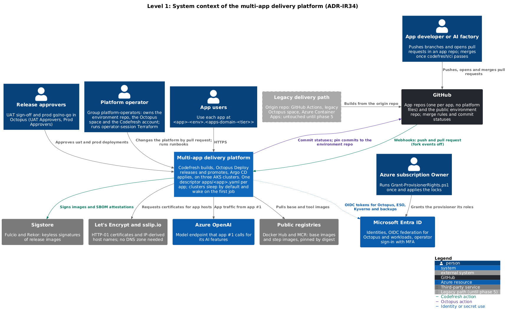

*Level 1, system context. The platform, the people who use it and the external systems it depends on. Every level below this one has its own picture next to its text; [architecture-views.md](architecture-views.md) walks through them top-down, and [diagrams/README.md](diagrams/README.md) explains the sources and how to render them.*

## 2. Decision log

Status values: **Decided** (binding on implementers), **Recommended to user** (needs the user's approval or action), **Deferred** (design fixed or sketched, not built in the current phases).

### 2.1 Contested items C1–C12

#### ADR-C1 Packaging and overlay format — Decided

- **Context.**
  - The Octopus "Update Argo CD Application Image Tags" step is the only writer of environment pins (ADR-D4).
  - What it rewrites depends on the Argo CD source type.
  - UI.Server may later become an Argo Rollout.
- **Options.**
  - (a) A Helm chart in OCI, pinned per environment, with Git values files that Octopus rewrites through `image-replace-paths`.
  - (b) A Kustomize base plus per-environment overlays; Octopus rewrites `images[].newTag`.
  - (c) Plain YAML.
- **Who argued what.**
  - **Helm.** R1-GA §6 ("Packaging" row) and §8. R2-OA §1 conceded to Helm, and R2-OA §3 C1 keeps it.
  - **Kustomize.** R1-OA §6 D3 and R1-P §6 D8. In round 2: R2-GA §1 and §3 C1, R2-CE §1 and §3 C1, R2-SRE §3 C1, and R2-P §3 C1.
  - **The crossover.**
    - The gitops-architect moved from Helm to Kustomize after reading the step's Helm rewrite rule.
    - The octopus-architect moved from Kustomize to Helm, citing the round-1 claim that "Kustomize needs a Rollout transformer".
    - The gitops-architect retracted that claim in R2-GA §2.
- **Decision.**
  - Use Kustomize, in three layers:
    - `gitops/workorders/base/` holds the reviewed structure.
    - `gitops/workorders/envs/<env>/kustomization.yaml` is the pin file. Octopus writes only `images[].newTag` there.
    - `gitops/workorders/envs/<env>/config/` holds the human-owned environment configuration.
  - The app has no Helm chart.
  - Rollouts, when adopted, reuse the same pin (ADR-C3, §7.6).
- **Rationale.**
  1. The write surface is smaller.
     - For Kustomize, Octopus "will only update the `newTag` field(s) found in the Kustomize file. No other files will be edited."
     - For Helm, the step updates "every Helm values file referenced by the Application — both the chart's default `values.yaml` and any files listed in the Application's `spec.source.helm.valueFiles`", and it never writes `valuesObject` (E1).
  2. The Helm-OCI path is undocumented.
     - Octopus "cannot update charts sourced from a Helm repository or OCI feed", and only Git repository sources are supported for updates (E2).
     - Every Helm-annotation example uses a Git-hosted chart (E6).
     - The step also fails if any repository referenced by the Application has no Git credential (E1). How it behaves with an OCI chart source is [UNVERIFIED].
  3. The Rollout premise is false.
     - Kustomize's built-in image field specs include `spec/template/spec/containers[]/image` and carry no kind filter (E10).
     - The Rollouts Kustomize configuration adds name references, labels and replicas, not images (E11; R2-GA §2; R2-SRE §2).
  4. There is no chart release pipeline and no chart-version pin, and `kustomize build` renders locally (R2-P §3 C1).
  5. Plain YAML is rejected because the step's YAML scan excludes CRDs (E1).
- **Consequences.**
  - The base declares no `images:` block; every overlay pins both images.
  - Previews override images with `spec.source.kustomize.images` (R2-P §2).
  - Configuration promotion needs its own rule (ADR-D6).
  - A future shared chart, for example for sample-app templates, is rendered into Kustomize by CI so the one-field pin contract holds (R2-SRE §5). Kustomize `helmCharts` is an [UNVERIFIED] alternative (R2-CE §5).
- **Dissent.**
  - The octopus-architect keeps Helm, with ref-source scoping and `image-replace-paths.chart` (R2-OA §3 C1).
  - Revisit only if a Git-hosted chart becomes necessary, and only after a spike proves that ref-source updates work.

#### ADR-C2 Database migrations — Decided (named environments); previews Deferred with ADR-C4; superseded by ADR-IR34 (a PreSync Job migrates before rollout)

- **Context.**
  - DbUp (`ChurchBulletin.Database`) is forward-only.
  - The console accepts only SQL authentication or Windows integrated security, and takes the password as a positional argument (F9).
  - Argo CD alone applies desired state (ADR-D2).
- **Options.**
  - (a) An Argo CD Sync or PreSync hook Job.
  - (b) An Octopus step that runs before the pin commit, on an in-cluster Kubernetes worker.
  - (c) A Job that an Octopus step creates in the worker's own namespace.
  - (d) Migrate on app startup.
- **Who argued what.**
  - (a): R1-GA §6 and §8; withdrawn in R2-GA §1.
  - (b): R1-OA §6 D4, R1-CE §2, R1-P §6 D6, R2-CE §3 C2, R2-P §3 C2, R2-SRE §3 C2 (plus a PreSync read-only guard) and R2-GA §3 C2 (per-environment pools).
  - (c): R2-OA §5.1.
  - (d): rejected by all, because startup migrations race across replicas (R1-GA §6).
- **Decision.**
  - For `tdd`, `uat` and `prod`, the `workorders` process runs these steps in order:
    1. `read-deployment-secrets`: an Azure CLI step using the per-environment OIDC account. It reads `workorders-sql-migrator-password`.
    2. `db-copy-pre-release`: prod only.
    3. `migrate-database`: the `ChurchBulletin.Database` package at the release version runs `update`.
    4. `update-argo-cd-image-tags`.
  - All four steps run on the target environment's Kubernetes worker pool (`k8s-<env>`). `migrate-database` runs inside step container `<acr-name>.azurecr.io/platform/ci-dotnet:<ci-image-version>@sha256:<ci-image-digest>`; `read-deployment-secrets` uses the default worker-tools container.
  - A failed migration ends the deployment before any Git commit.
  - After WI-05 adds Entra authentication to DbUp:
    - The password step is deleted.
    - The worker's script-pod service account federates to `id-workorders-<env>-migrator`.
    - If the worker chart cannot label script pods for workload identity [VERIFY], the step switches to mechanism (c).
- **Rationale.**
  - Hooks "are not run" during selective sync (E12). They also re-run on every sync, and a failed hook leaves a pin in Git whose schema was never applied (R2-OA §3 C2; R2-P §2).
  - The Kubernetes worker "is limited to modifying its local namespace" (E27). So the migration has network reach to private endpoints without a write path into Argo-managed namespaces (R2-GA §3 C2).
  - The package path mirrors the proven legacy step (`app:.octopus/deployment_process.ocl`, step `run-db-migrations`).
  - Per-environment pools isolate credentials and network reach. The TDD pool also runs the destructive acceptance suite (ADR-C11).
- **Consequences.**
  - Migrations must follow expand/contract, because rollback redeploys older images over a newer schema.
  - Until WI-05, the migrator password passes through Octopus as a sensitive output variable and appears as a process argument inside the script pod.
  - The PreSync read-only schema guard is Deferred as a phase-6 option (R2-SRE §5; R2-P §5).
- **Dissent.**
  - The octopus-architect prefers the Job mechanism now (R2-OA §5.1).
  - The sre-security role wants the PreSync guard now (R2-SRE §3 C2).

#### ADR-C3 Progressive delivery for UI.Server — Decided (rolling update through cutover); blue-green Deferred; canary rejected

- **Context.**
  - UI.Server runs as one replica.
  - It holds WebSocket connections in an in-process `ConcurrentDictionary` (`RealtimeNotificationHub`; R2-GA §1).
  - It serves version-coupled Blazor WebAssembly assets.
  - No metrics pipeline exists for analysis.
- **Options.**
  - A rolling update.
  - A blue-green Rollout.
  - A canary with SLO analysis.
- **Who argued what.**
  - **Canary:** R1-SRE §1; withdrawn in R2-SRE §1.
  - **Blue-green, with different timing:**
    - R1-GA §6; at cutover per R2-GA §3 C3.
    - Phase 3 per R2-OA §3 C3.
    - Phase 5 per R2-P §3 C3.
    - After a realtime backplane and at least two replicas per R2-SRE §3 C3.
  - **Rolling update first:** R1-P §6 D14 and R2-CE §3 C3.
- **Decision.**
  - **Phases 2–5.**
    - `ui-server` and `worker` are Deployments using `RollingUpdate` with `maxUnavailable: 0` and `maxSurge: 1`.
    - Startup, liveness and readiness probes all use `/alive`.
    - Octopus verifies with "Argo CD Application is healthy" (900 s), then runs `verify-version` and `smoke-test`.
  - **Phase 6 option: prod blue-green for `ui-server`.**
    - Uses the Argo Rollouts add-on and a Rollout with `workloadRef` to the existing Deployment, so the pin contract is unchanged.
    - Sets `autoPromotionEnabled: true`.
    - Runs a Job-provider smoke analysis before promotion.
    - Runs post-promotion analysis in `dryRun` for 14 days.
    - Entry criteria: at least two replicas, and WI-09 (realtime backplane) is done.
  - The Worker is never a Rollout, because it is a competing consumer on its queue.
- **Rationale.**
  - A paused Rollout reports Suspended, never Healthy, so the Octopus verification needs auto-promotion (R1-GA §7.1).
  - The Job provider needs no metrics store (R2-GA §2).
  - A canary would split WebAssembly clients and the notification hub across versions (R2-GA §1; R2-SRE §1).
  - The real release risk is the database, not traffic (R1-P §6 D14).
- **Consequences.**
  - `gitops/workorders/components/bluegreen/` exists but is referenced by no overlay.
  - SLO burn-rate alerts serve as the post-deploy signal from phase 3 (ADR-D15).
- **Dissent.**
  - The gitops-architect wants blue-green at cutover (R2-GA §3 C3).
  - The octopus-architect wants it in phase 3 (R2-OA §5.2).

#### ADR-C4 PR preview environments — Deferred (phase 6); design Decided

- **Context.**
  - Each preview needs a namespace, images and data.
  - Previews must not touch subscription credentials.
- **Options.**
  - (a) The ApplicationSet PR generator only.
  - (b) The PR generator plus Octopus ephemeral environments.
  - (c) Not building previews.
- **Who argued what.**
  - (b): R1-OA §6 D14; withdrawn in R2-OA §1.
  - (a): R1-GA §6, R1-CE §6 D13, R2-GA §3 C4, R2-CE §3 C4, R2-SRE §3 C4 and R2-P §3 C4 (deferred to phase 5).
  - SQLite, UI only: R2-P §3 C4; the default in R2-GA §3 C4.
  - SQL Server container: R2-OA §3 C4 and R2-CE §3 C4.
- **Decision.** Phase 6, opt-in, built as follows:
  - **Generator.** ApplicationSet `workorders-previews` uses the pull-request generator with label `preview`, applied by maintainers.
  - **Scope.**
    - Same-repo branches only.
    - AppProject `workorders-previews`, which allows namespaced kinds only and has no Azure identity.
    - Namespace `workorders-pr-<number>`, with a resource quota.
    - At most three open previews, by maintainer policy.
    - Deleted when the PR closes.
  - **Images.** `workorders-previews/ui-server`, `workorders-previews/worker` and `workorders-previews/db-migrator` (ADR-IR8), tagged `pr-<number>-<head_sha>`, built by the `workorders/preview` pipeline.
  - **Data.**
    - An in-namespace SQL Server container whose password comes from an ESO `Password` generator.
    - A Sync-hook Job at wave `-1` runs `workorders/db-migrator` with `rebuild`, then `seed` (WI-07).
  - **Excluded.** No Octopus ephemeral environment and no release per PR.
- **Rationale.**
  - Octopus ephemeral environments get no lifecycles, freezes, Insights or tenants, and document no Argo CD support (E41; R2-SRE §2).
  - The Codefresh create-release step has no custom-field argument (E18), and no Codefresh Octopus step deprovisions (R2-CE §2 F2).
  - The generator deletes Applications when a PR closes.
  - A SQL Server container is chosen over SQLite for three reasons:
    - The Worker requires the SQL transport (F5).
    - A SQLite preview contains no rows at all (F4).
    - A DbUp-built database contains only the ten role-less employees inserted by `008_AddSomeEmployeeRecords.sql` (F10), so a seed step is needed in either case.
    - The SQL container also exercises the PR's migrations.
- **Consequences.**
  - Each preview costs about one SQL Server pod.
  - WI-07 (seed command) gates phase 6.
  - The PR generator has "only admins may create ApplicationSets" semantics, and the project field is never templated (E14).
- **Dissent.**
  - The pragmatist wants SQLite, UI only (R2-P §3 C4).
  - The gitops-architect wants SQLite by default, with a second label for SQL (R2-GA §3 C4).

#### ADR-C5 GitOps repository topology and location — Decided (single environment repo, per-path writers); repo private and credential narrowed (done 2026-09-24)

- **Context.**
  - The user named the repo `clearmeasure-aisf-sample-apps/basic-environment-octopus-codefresh`.
  - The stored Octopus Git credential was restricted to `https://github.com/clearmeasure-aisf-sample-apps/*`; since 2026-09-24 it is restricted to this repo (R3).
- **Options.**
  - Separate config and releases repos.
  - One environment repo.
  - The app repo.
- **Who argued what.**
  - **Two repos:** R1-GA §5; void per R2-GA §2, and kept as a fallback in R2-SRE §3 C5.
  - **One GitOps repo:** R1-OA §5, R1-CE §5, R1-SRE §5 and R1-P §5.
  - **The single directed repo:** all five papers in round 2 (§3 C5 of each).
- **Decision.**
  - The environment repo holds `argocd/`, `gitops/`, `.octopus/`, `octopus/terraform/`, `terraform/`, `policies/`, `codefresh/`, `containers/`, `scripts/`, `contracts/`, `design/` and `docs/` (ADR-D18).
  - Writers per path are listed in §6.1:
    - Octopus writes only the three pin files on `main`, plus config-as-code edits on non-`main` branches.
    - Argo CD reads with its own read-only credential.
    - Codefresh reads and posts commit statuses.
- **Rationale.**
  - The user's directive names the repo.
  - An org-wide credential makes a second repo add no credential separation (R2-GA §2; R2-CE §3 C5).
  - Push rulesets that restrict file paths exist only for private or internal repos, and bypass is granted to roles, teams or GitHub Apps (E31).
- **Consequences.**
  - The repo is private (R2, done), so the push ruleset that restricts file paths applies (§6.2), on top of CODEOWNERS, the bot-path audit in `platform-env/env-checks`, Octopus Git drift detection, and Argo CD reconciling only what Git holds.
  - Argo CD needs a read credential for the private repo (ADR-IR15).
  - The two-repo fallback (a `basic-environment-octopus-codefresh-releases` repo for the pin files) is no longer needed.
- **Dissent.**
  - None remaining. The two-repo split from R1-GA §5 is recorded as the fallback.

#### ADR-C6 CI engine and required merge check — Superseded for the app repo by ADR-IR26 (`codefresh/ci` required from day one)

- **Context.**
  - `build-result` is the single required check (`app:docs/ci-single-gate.md`). It covers eight jobs, including ARM and Windows LocalDB (F12).
  - Fork PRs exist on this public repo.
- **Options.**
  - (a) `build-result` stays required forever.
  - (b) Flip to `codefresh/ci` after evidence.
  - (c) Two required checks.
- **Who argued what.**
  - (a): R2-SRE §3 C6, on fork safety.
  - (b): R2-CE §3 C6 (decoupled from runtime cutover) and R2-P §3 C6 (a single check whose gate asserts a GitHub `platform-matrix` workflow).
  - (c): R2-OA §3 C6 and R2-GA §3 C6.
- **Decision.**
  - **Phases 1–5.**
    - GitHub Actions `build-result` remains the only required check, and `app:.github/workflows/build.yml` stays unchanged.
    - Codefresh `workorders/ci` runs every Linux gate on same-repo branch pushes and posts `codefresh/ci` as an informational status.
    - Codefresh `workorders/release`, triggered by `master`, is the build of record and the only publisher for the new platform.
    - ARM SQLite and Windows LocalDB stay on GitHub Actions.
  - **Recommended flip** (needs user approval and a `.github/**` change). `codefresh/ci` becomes the single required check only when all of these hold:
    - 50 consecutive code-changing same-repo commits show equal verdicts and equal TRX totals.
    - Codefresh p95 duration is at most 1.2× that of GitHub Actions.
    - Fork PRs build through an identity-free `workorders/ci-fork` pipeline gated by a maintainer label.
    - The ARM and Windows jobs move to a GitHub `platform-matrix` workflow, and the `gate` step of `codefresh/ci` asserts that workflow's check run for the same SHA.
- **Rationale.**
  - Fork commits never fire Codefresh push triggers (R2-SRE §3 C6).
  - ARM builds are "only available to Enterprise customers" (E22).
  - Windows builds are in incubation, on Windows Server 1709 (E23).
  - Keeping exactly one required check preserves the single-gate semantics (R2-P §4).
  - The CI flip is independent of runtime readiness (R2-CE §3 C6).
- **Consequences.**
  - Linux gates run twice during the parallel run.
  - No gate is lost (R2-CE §4).
- **Dissent.**
  - The sre-security role keeps `build-result` permanently.
  - The octopus-architect and the gitops-architect want a second required check.
- **Addendum (2026-09-24, ADR-IR26).** The application repo is now the fork `clearmeasure-aisf-sample-apps/20260923-001`, where GitHub Actions is disabled and `build-result` cannot run. For that repo `codefresh/ci` is the single required status from day one; the phase split, the flip criteria and R14 no longer apply to it. The legacy origin keeps `build-result` for the live path.

#### ADR-C7 Version authority and continuity — Decided

- **Context.**
  - Legacy versions are `2.4.<GitHub run number>`.
  - Octopus release-number collisions caused incidents EP20 and EP21 (`app:arch/DeployFailure-2026-08-21.md`).
- **Options.**
  - `2.5.<first-parent height>`.
  - `3.0.<height>`.
  - Octopus `NextPatch`.
  - A Codefresh build ID.
- **Who argued what.**
  - `2.5.<height>`: R1-CE §6 D6, R2-OA §3 C7, R2-GA §3 C7, R2-CE §3 C7 and R2-SRE §3 C7.
  - `3.0`: R1-P §6 D7; withdrawn in R2-P §1.4.
- **Decision.**
  - `codefresh/apps/workorders/scripts/version.ps1` produces the version:
    - On `master`: `MAJOR.MINOR.<git rev-list --count --first-parent HEAD>`, with `MAJOR=2` and `MINOR=5` read from `codefresh/workorders/version.env`.
    - On branches: `2.5.<n>-ci.<sha7>`. These versions are never released.
  - The image tag, the Octopus package version and the release number are the same string.
  - `IGNORE_EXISTING: true` makes release creation idempotent.
  - Hotfix-channel releases are numbered `<package-version>-hotfix.<n>` and are created over existing images.
  - Legacy keeps `2.4.<run>` in its own space until it is retired.
- **Rationale.**
  - The version is deterministic per commit and safe on reruns.
  - `2.5.x` sorts above every `2.4.x`.
  - A major bump would signal a breaking change that has not happened (R2-OA §3 C7).
- **Consequences.**
  - The clone must have full depth. The session's checkouts are shallow (F17), so `version.ps1` unshallows or fails.
  - A rewritten `master` history could repeat a number. The ACR tag lock makes that push fail loudly (ADR-D11).
- **Dissent.** None.

#### ADR-C8 Octopus tenants per cohort — Decided (cut)

- **Context.** No cohort requirement exists in the brief.
- **Options.** One tenant per cohort, per-student tenants, or no tenants.
- **Who argued what.**
  - For: R1-OA §6 D7.
  - Against: R1-GA §3.2, R1-SRE §3, R1-P §3 and all round-2 papers.
- **Decision.** No tenants. The `argo.octopus.com/tenant` annotation stays available for a future cohort model.
- **Rationale.**
  - Tenants are a licensed add-on.
  - Ephemeral environments cannot use them (E41).
  - They add RBAC surface without isolation for a single customer (R2-SRE §3 C8).
- **Consequences.** Untenanted projects and untenanted OIDC subjects.
- **Dissent.** None.

#### ADR-C9 Octopus Platform Hub — Deferred

- **Context.**
  - Platform Hub policies (Rego) could enforce prod guardrails.
- **Options.**
  - Adopt Platform Hub now.
  - Defer it.
  - Cut it.
- **Who argued what.**
  - Adopt now: R1-OA §6 D13 and R1-SRE §8.
  - Defer or cut: R1-P §3, R2-OA §3 C9, R2-GA §3 C9, R2-CE §3 C9, R2-SRE §3 C9 and R2-P §3 C9.
- **Decision.**
  - Deferred.
  - `policies/octopus/prod-deployment-guardrails.rego` is kept as an inactive policy.
  - Interim controls:
    - Pull-request review of config-as-code.
    - Manual interventions.
    - The separation-of-duties step.
    - Deployment freezes.
    - Kyverno.
- **Rationale.**
  - The pricing page lists Platform Hub under Enterprise (E25).
  - Its permissions "can only be assigned to system teams" (E24).
  - The platform service account is Space Manager only.
- **Consequences.** Revisit Platform Hub when an Enterprise license and system-team rights are confirmed.
- **Dissent.** None. It was deferred, not rejected.

#### ADR-C10 Provisioning credential lifecycle — Recommended to user; superseded by ADR-IR34 (the provisioner stays the operator-run grant identity)

- **Context.**
  - By the user's choice, the client-secret principal (Contributor at subscription scope) is stored in two places:
    - Octopus: account `Azure Runtime Provisioner` and variable set `Azure Runtime Provisioning`.
    - Codefresh: context `azure-runtime-provisioner`.
  - Contributor cannot write `Microsoft.Authorization/*` (E36).
- **Options.**
  - Bootstrap, then delete.
  - Octopus holds it long term.
  - Migrate to OIDC by a set date.
- **Who argued what.**
  - Bootstrap, then delete: R1-SRE §6 and R2-SRE §3 C10.
  - Single holder, then OIDC in phase 3: R1-OA §6 D16 and R2-OA §5.3.
  - OIDC at the end of phase 1: R2-CE §3 C10.
  - OIDC at the phase-2 exit: R2-P §3 C10.
  - Scoped to runbooks: R2-GA §3 C10.
- **Decided within the design.**
  - Only `workorders-infrastructure` runbooks in `infra-nonprod` may use `Azure Runtime Provisioner`, through the account variable `Azure.LifecycleAccount`.
  - It is never used in `workorders`, in `infra-prod`, in any Codefresh pipeline, in Argo CD or in any cluster.
  - The foundation creates `id-env-lifecycle-nonprod` and `id-env-lifecycle-prod`, with federated credentials for the Octopus issuer. `octopus/terraform` creates the matching Octopus accounts `azure-oidc-env-lifecycle-nonprod` and `azure-oidc-env-lifecycle-prod`.
- **Recommended to the user.**
  1. Restrict the account (currently unrestricted) to `infra-nonprod`.
  2. Include `Azure Runtime Provisioning` in no project; the built-in Terraform steps use the account directly.
  3. Keep the Codefresh context unattached, then delete it at the phase-2 exit.
  4. Set secret expiry to 90 days or less and alert on its sign-ins.
  5. Have an Owner place `CanNotDelete` locks on the prod and legacy resource groups.
  6. Switch `infra-nonprod` to OIDC at the phase-2 exit.
  7. Use OIDC for `infra-prod` from its first apply.
  8. Then delete the client secret from Entra and from both stores. If other sample apps need it, restrict it to those projects instead.
- **Rationale.**
  - It is a bearer secret whose reach includes data-plane escalation paths (R1-SRE §6).
  - The OIDC replacement needs only role assignments that the Owner already applies in the foundation.
- **Consequences.** Nonprod provisioning can start before OIDC is proven; prod never depends on the secret.
- **Dissent.** None on direction. Timing differs between papers, as listed above.
- **Status (2026-09-24).** Item 1 is applied: the account is restricted to `infra-nonprod` (R4). Items 2 and 3 hold (R5 verified). The account variable of `Azure Runtime Provisioning` is still unscoped; scoping it to `infra-nonprod` is recommended (R4).
- **Status addendum (2026-09-24, R6).** The Owner script `docs/owner/Grant-ProvisionerRights.ps1` widened the secret's reach.
  - Besides Contributor, the secret can now assign ten built-in roles anywhere in the subscription, prod included, to any service principal or group. The roles include Contributor and the Key Vault data roles; the assignees include itself and the groups it creates.
  - It can also create groups and app registrations that it owns.
  - A leaked secret could therefore read prod secrets, or create access that outlives a secret rotation.
  - Mitigations: the foundation's activity-log alert on role-assignment writes; revocation of the role and the Graph permissions after the foundation apply (R6). Items 6 to 8 stand, with more urgency.

#### ADR-C11 Acceptance tests against TDD and the promotion gate — Decided

- **Context.**
  - The acceptance suite wipes its target database.
  - `ServerFixture.OneTimeSetUp` calls `ZDataLoader.LoadData()`, which calls `DatabaseEmptier.DeleteAllData()`.
  - That deletes every row in every `[dbo]` table except `SchemaVersions` and `sysdiagrams`, whether or not `StartLocalServer` is set (F8; R2-OA §2).
- **Options.**
  - Octopus step on the worker.
  - Codefresh waits for the deployment, then tests.
  - Argo CD PostSync hook.
  - Rollouts analysis.
- **Who argued what.**
  - Octopus step: all five in round 2 (§3 C11 of each).
  - Tests in UAT: R1-OA §8; retracted in R2-OA §2.
- **Decision.**
  - **Where and when.**
    - Step `acceptance-tests` runs in `tdd` only.
    - It follows the healthy verification of `update-argo-cd-image-tags`, then `verify-version` and `smoke-test`.
    - It runs `ChurchBulletin.AcceptanceTests` at the release version on `k8s-tdd`, in step container `platform/ci-dotnet`.
  - **Inputs.**
    - `StartLocalServer=false`.
    - `ApplicationBaseUrl=#{App.BaseUrl}`.
    - The TDD connection string for login `workorders_acceptance`.
    - The AI settings.
  - **Results.**
    - TRX files become Octopus artifacts.
    - A failure fails the deployment, and the lifecycle then blocks UAT.
    - `report-commit-status` posts `platform/tdd` to the app commit.
    - Runbook `run-acceptance-tests` exists for on-demand runs in `tdd` only.
  - **Interlocks.**
    1. The step and the runbook are environment-scoped to `tdd`.
    2. The script exits unless `Octopus.Environment.Name` is `tdd` and `Acceptance.AllowDestructiveReset` is `True`. That variable is defined only for `tdd`.
    3. Login `workorders_acceptance`, and its password in Key Vault, exist only for TDD.
    4. TDD data is declared disposable.
    5. WI-08 adds an opt-in guard inside the suite.
- **Rationale.**
  - One orchestrator records the results on the release.
  - The private TDD endpoint is reachable from the in-cluster worker.
  - The tests use the same image and browsers as CI (R2-CE §3 C11).
- **Consequences.**
  - UAT and Prod never run the suite.
  - UAT data needs a seed or copy (Q8).
- **Dissent.** None.

#### ADR-C12 App-side prerequisites — Decided (list and gates); each work item Recommended to user

- **Context.** Several app facts make naive probes and exposure unsafe:
  - `/_healthcheck` aggregates the LLM, database and `NeedsReboot` checks (F2).
  - An anonymous `GET /_demo/setneedsreboot/true` flips `NeedsReboot` in every environment (F3).
  - The Worker has no health endpoint (F5).
  - DbUp cannot use Entra (F9).
- **Options.**
  - All app changes first.
  - Platform mitigations now, with app changes gating later phases.
- **Who argued what.**
  - R2-OA §3 C12, R2-GA §3 C12, R2-CE §3 C12, R2-SRE §3 C12 and R2-P §3 C12. The sre-security role wanted passwordless SQL and gated `/_demo` routes before any AKS environment.
- **Decision.** Platform-side mitigations apply from phase 2, with no `app:src/**` change:
  - Probes use `/alive`.
  - The Gateway redirects `/_demo/*`, `/_diagnostics/*`, `/_healthcheck/detailed` and `/mcp` in uat and prod.
  - NetworkPolicies restrict in-cluster callers.
  - Connection strings start with `Server=`.
  - The Worker image comes from a new Dockerfile.
  - `RemotableBus__ApiUrl` is set for the Worker.
  - App work items WI-01 to WI-13 (§8) each gate a named phase.
- **Rationale.**
  - Probing `/_healthcheck` would let one anonymous request, or an Azure OpenAI outage, remove every pod from service (R2-GA §2; R2-CE §2 F7).
  - TDD holds no user data, so passwordless migration can wait until before prod (R2-P §3 C12).
- **Consequences.**
  - Prod cutover is blocked until WI-01, WI-02, WI-03, WI-05 and WI-08 are merged.
- **Dissent.**
  - The sre-security role wanted these before any AKS environment. That is adopted for prod only.

### 2.2 Consensus decisions that shape implementation

#### ADR-D1 Target runtime — Decided

- **Context.**
  - Argo CD reconciles Kubernetes objects.
  - Azure Container Apps exposes no Kubernetes API.
- **Options.**
  - Stay on Container Apps.
  - AKS for the new path.
  - AKS nonprod with Container Apps prod.
- **Who argued what.**
  - AKS: R1-OA §3, R1-GA §3.1, R1-CE §3, R1-SRE §3 and R1-P §3. All agree.
- **Decision.**
  - Two AKS clusters on the Standard (not Automatic) SKU:
    - `aks-workorders-nonprod`: Free pricing tier, for `tdd` and `uat`.
    - `aks-workorders-prod`: Standard pricing tier (uptime SLA).
  - Both clusters run with:
    - Workload identity and the OIDC issuer.
    - Entra integration with Azure RBAC, and local accounts disabled.
  - The Codefresh runner stays on the existing runner cluster `<aks-cluster-context>`, never on an app cluster.
  - Container Apps stays live until Prod cutover.
- **Rationale.**
  - AKS Automatic uses node auto-provisioning, and clusters with it cannot be stopped (E42).
  - Its controls are enabled explicitly on Standard instead (R2-SRE §1).
- **Consequences.**
  - The platform takes on cluster operations: upgrades and node pools.
- **Dissent.**
  - None. The sre-security role preferred AKS Automatic in round 1 and conceded Standard (R2-SRE §1).

#### ADR-D2 Tool lanes — Decided

- **Context.** Every tool has overlapping "deploy" features.
- **Options.** Let each tool deploy a bit, or give one verb to each tool.
- **Who argued what.** R1-P §1 and §2, adopted by R2-OA §1, R2-GA §1 and R2-SRE §1.
- **Decision.** Each tool has one verb, and the other tools' overlapping features stay off:

  | Tool | Verb | Features that stay off |
  |---|---|---|
  | Codefresh | builds | `deploy`, `approval`, `helm` and `launch-composition` steps; the GitOps Runtime; Promotions |
  | Octopus | releases, promotes, approves, migrates and runs runbooks | Kubernetes YAML and Helm steps against app namespaces |
  | Argo CD | reconciles | Image Updater; sync windows |
  | GitHub | enforces merge rules (branch protection, rulesets) | GitHub Actions in the app repo (ADR-IR26); in this repo every workflow but the board-only `project-board.yml` (TB24, [docs/tool-boundaries.md](../docs/tool-boundaries.md#board-automation-the-one-github-actions-workflow)) |

  `scripts/checks/tool-boundaries.sh` enforces these rules.
- **Rationale.** Three deployers are the top confusion risk (R1-P §6 D1).
- **Consequences.** The boundary lint runs in `platform-env/env-checks`.
- *Implementation (2026-09-25):* the lint is the Offline test class `ToolBoundaryTests` (rules TB01 to TB24, `tests/Platform.Conformance.Offline/Kit/Boundaries`), which `scripts/checks/validate-all.ps1` and `env-checks` run; `tool-boundaries.sh` is retired ([docs/tool-boundaries.md](../docs/tool-boundaries.md)). Since ADR-IR34 decision 1 an Argo CD PreSync Job migrates the database, so Octopus no longer migrates.
- **Dissent.** None.

#### ADR-D3 Argo CD distribution and topology — Decided

- **Context.**
  - Codefresh GitOps Promotions are disabled after runtime 0.24.0 (E34).
  - "The GitOps Cloud product is no longer available" (E35).
  - The runtime's existing-Argo CD install mode needs a non-expiring admin token (R2-GA §2; R2-SRE §2).
- **Options.**
  - Upstream Argo CD, one instance per cluster.
  - A hub-and-spoke instance.
  - A Codefresh GitOps Runtime.
- **Who argued what.**
  - Upstream, one per cluster: R1-GA §6, R1-P §6 D3 and R1-SRE §3.
  - Optional Codefresh runtime: R1-CE §6 D10; retracted in R2-CE §2.2.
- **Decision.**
  - Upstream Argo CD 3.5.x on each cluster, from the `argo/argo-cd` chart with app version 3.5.3 (E13).
  - Instances: `argocd-nonprod` and `argocd-prod`.
  - Terraform bootstraps each instance once; after that, Argo CD manages itself through its own add-on Application.
  - No Codefresh GitOps Runtime and no hub.
- **Rationale.**
  - A hub concentrates prod credentials.
  - Octopus already spans instances.
- **Consequences.**
  - Argo CD 3.6.0-rc1 (2026-09-16) is not adopted until it reaches GA.
- **Dissent.** None.

#### ADR-D4 Promotion writer and Git write mode — Decided

- **Context.** Exactly one actor may change what version runs in each environment.
- **Options.**
  - Writers: Octopus's Argo CD step, Argo CD Image Updater, commits from CI, or Codefresh Promotions.
  - Write mode: direct commit or pull request.
- **Who argued what.**
  - All five choose Octopus: R1-OA §6 D2, R1-GA §6, R1-CE §6 D9, R1-SRE §6 and R1-P §2.
  - PR mode for prod was offered as an option (R1-GA §6).
- **Decision.**
  - Octopus step `update-argo-cd-image-tags` ("Update Argo CD Application Image Tags") is the only writer of pins.
  - It commits directly to `main`, with Trigger sync off.
  - It verifies with "Argo CD Application is healthy" and a timeout of 900 s. The default for the separate Wait step is 180 s (E4).
  - Octopus retries the step once.
  - Not used: Image Updater, commits from CI, or Codefresh Promotions.
- **Rationale.**
  - Verification waits for the commit the step itself created (E3; R2-OA §2 F1).
  - The gateway account can stay read-only, because `sync` is needed only for Trigger sync (E7).
  - The single human approval happens in Octopus, so a PR would ask for a second approval of the same decision (R1-GA §6).
- **Consequences.**
  - Without Trigger sync, lead time grows by Argo CD's polling interval (`timeout.reconciliation: 30s` plus up to 10 s jitter since 2026-09-27; the chart default is 120 s).
  - What happens when two concurrent deployments commit to the same branch is [VERIFY]. The step retry covers it.
- **Dissent.**
  - The pragmatist and the octopus-architect preferred Trigger sync in round 1 (R1-P §4; R1-OA §4).

#### ADR-D5 Sync policy and rollback — Decided

- **Context.**
  - Argo CD's manual rollback is blocked on applications with auto-sync (E40).
  - Two freeze calendars would disagree.
- **Options.**
  - Auto-sync everywhere, or manual sync in prod.
  - Argo CD sync windows, or Octopus freezes.
- **Who argued what.**
  - Auto-sync everywhere: R1-GA §6, R2-GA §4 and R1-P §6 D9.
  - Manual sync in prod was anticipated for sre-security; R1-SRE never proposed it.
- **Decision.**
  - Every named-environment Application uses `automated: {prune: true, selfHeal: true}` and `PruneLast=true`.
  - Named-environment Applications carry no `resources-finalizer`.
  - No sync windows are used.
  - Octopus deployment freeze `prod-weekend-freeze` covers weekends, matching the weekday releases in `app:docs/release-cadence.md`.
  - Rollback means Octopus "redeploy previous release", which writes the older tags.
  - Break-glass is a reviewed Git commit, surfaced by drift detection (`docs/runbooks/break-glass.md`).
- **Rationale.** Git is the gate, and Octopus holds the calendar.
- **Consequences.** Deleting an Application does not delete its workloads.
- **Dissent.** None.

#### ADR-D6 Configuration promotion across environments — Decided (gap closed by adjudication)

- **Context.**
  - A Kustomize base is shared by `tdd`, `uat` and `prod`.
  - A merged base change reaches every environment at once, outside the Octopus lifecycle.
  - The Helm design pinned chart versions per environment instead; no Kustomize proponent addressed this.
- **Options.**
  - Versioned remote bases.
  - Base directories copied per version.
  - Components promoted per environment.
- **Who argued what.** Not debated. This is a chief-architect decision.
- **Decision.**
  - A change that must roll through the environments is added as a Kustomize component under `gitops/workorders/components/<change>/`.
    - It is enabled first in `envs/tdd/config`, then `uat`, then `prod`, each by pull request.
    - It is folded into `base/` after all three have it.
  - A direct `base/` change that alters runtime behaviour needs the `all-environments` pull-request label and a platform-owner review, enforced by CODEOWNERS.
  - Configuration follows expand/contract: new configuration is added to every environment before the release that needs it reaches that environment.
- **Rationale.**
  - Keeps the one-field pin contract and needs no remote fetches.
- **Consequences.**
  - `docs/walkthroughs/02-schema-change.md` also teaches configuration expand/contract.
- **Dissent.** None recorded. It was not debated.

#### ADR-D7 Octopus space model and config-as-code location — Decided

- **Context.**
  - The platform space `<octopus-space>` is empty apart from built-ins.
  - The live project is in another space; its `.octopus/` directory in the legacy origin (copied unchanged into `20260923-001`) stays untouched.
- **Options.**
  - Config-as-code in the app repo, or in the environment repo.
  - Base path `.octopus/<project>`, or a path outside `.octopus`.
  - One worker pool per cluster, or one per environment.
- **Who argued what.**
  - App repo: R1-OA §5, R1-CE §5 and R1-P §5. All moved to the environment repo in round 2.
  - `.octopus/<project>`: R2-OA §6 and R2-P §6.
  - `octopus/projects/<project>`: R2-GA §6, R2-CE §6 and R2-SRE §6.
  - Per-environment pools: R2-GA §3 C2.
- **Decision.** The model is fixed in §7.2:
  - **Projects:** `workorders` and `workorders-infrastructure`. Their config-as-code base paths are `.octopus/workorders` and `.octopus/workorders-infrastructure` in the environment repo, with default branch `main`, which is protected.
  - **Environments:** `tdd`, `uat`, `prod`, `infra-nonprod` and `infra-prod`.
  - **Lifecycles:** `workorders-standard`, `workorders-hotfix` and `workorders-infrastructure`.
  - **Channels:** `Default` and `Hotfix`.
  - **Kubernetes worker pools:** `k8s-tdd`, `k8s-uat` and `k8s-prod`.
  - Terraform provider `OctopusDeploy/octopusdeploy` 1.20.0 manages everything that config-as-code excludes (E26, E30).
- **Rationale.**
  - The docs keep `.octopus` as the default and recommend a per-project subfolder for multiple projects (E26).
  - A path outside `.octopus` remains [UNVERIFIED] (R1-OA §5; R1-P §9).
  - The environment repo is covered by the stored Git credential.
  - The user directive places Octopus configuration in that repo.
  - Terraform steps can source files from the project's own Git repository (E29).
- **Consequences.**
  - Releases pass `GIT_REF: refs/heads/main` and no `GIT_COMMIT`, because an app SHA does not resolve in the environment repo (R2-OA §6; R2-CE §2 F1).
  - Traceability to the app commit comes from build information and release notes.
- **Dissent.** None.

#### ADR-D8 Identity federation between tools — Decided

- **Context.**
  - Incident EP18: an invalid or rotated Octopus API key caused 41 consecutive red runs over about 13 days (`app:arch/DeployFailure-2026-08-21.md`).
  - Codefresh push tokens embed `scm_user_name` in `sub` (E15).
  - Entra federated credentials need an exact subject match, and flexible credentials accept only GitHub, GitLab and Terraform Cloud (E37).
- **Options.**
  - API keys, or OIDC everywhere.
  - For Codefresh to ACR: Codefresh OIDC to Entra, runner workload identity, or repository-scoped tokens.
- **Who argued what.**
  - OIDC from Codefresh to Octopus: R1-CE §6 D7, R1-OA §6 D10, R1-SRE §6 and R1-P §6 D10.
  - For ACR, the sre-security role proposed runner workload identity (R1-SRE §6), and the pragmatist proposed Codefresh OIDC (R1-P §3, withdrawn in R2-P §2).
  - Repository-scoped tokens: R2-CE §2 F4 and R2-P §2.
- **Decision.**
  - **Codefresh to Octopus.** Superseded by ADR-IR32: the Space Manager API key of the existing user `AISF-Service-Account`, in the secret context `workorders-octopus`, attached to `workorders/release` only. The original design (service account `svc-codefresh-release` with an OIDC identity for `https://oidc.codefresh.io`) is the path back.
  - **Octopus to Azure.**
    - Per-environment Azure OIDC accounts `azure-oidc-deploy-{tdd,uat,prod}`.
    - Environment-lifecycle accounts `azure-oidc-env-lifecycle-{nonprod,prod}`.
    - An ACR feed with OIDC (E21, E30, E38).
  - **Codefresh to ACR.**
    - Repository-scoped ACR tokens held as Codefresh registry integrations; step images use a pull-only token (ADR-IR19).
    - The release token is also in the secret context `workorders-release`, for `supply_chain` (ADR-IR10).
    - Runner workload identity is Deferred [UNVERIFIED inside docker-in-docker].
  - **Signing.** Codefresh signs keyless through Sigstore.
  - **One Octopus API key in one pipeline (ADR-IR32).** `OCTOPUS_API_KEY` from `workorders-octopus` in `workorders/release`, and nowhere else (TB14). The legacy GitHub secret `OCTO_API_KEY` stays with the legacy path until decommission.
- **Rationale.** No stored bearer secret crosses from CI into Octopus or Azure.
- **Consequences.**
  - The foundation layer, applied by the Owner, creates the Octopus-issuer federated credentials once. Nothing federated is created by hand.
- **Dissent.** None.

#### ADR-D9 Secrets and SQL authentication — Decided; superseded by ADR-IR34 (databases in pods with SQL logins)

- **Context.**
  - Today the SQL connection string is a plain Container App environment variable that `deploy.yml` reads back.
  - The live `.octopus/variables.ocl` binds `az_login_appkey` to the account password (R1-SRE intro).
- **Options.**
  - The Key Vault CSI driver, the External Secrets Operator (ESO), Octopus sensitive variables, or SOPS.
- **Who argued what.**
  - ESO: R1-GA §6, R1-SRE §6, R2-GA §1 and R2-SRE §6.
  - CSI driver: R1-P §2.
- **Decision.**
  - **Key Vaults.** One Key Vault per environment (`<kv-workorders-{env}>`) plus one per cluster for platform secrets (`<kv-workorders-platform-{cluster}>`). All use the RBAC permission model.
  - **ESO stores.**
    - A namespaced `SecretStore` named `key-vault` in each app namespace, authenticated with workload identity.
    - A `ClusterSecretStore` named `platform-keyvault`, limited to the namespaces `argocd` and `octopus-argocd-gateway`.
  - **App SQL access.** Passwordless, with `Authentication=Active Directory Workload Identity` in a connection string that starts with `Server=` (F4).
  - **Interim SQL passwords.** Only two, both until WI-05:
    - `workorders_migrator` in every environment.
    - `workorders_acceptance` in TDD only.
- **Rationale.**
  - The app reads configuration from environment variables.
  - EF Core 10 requires `Microsoft.Data.SqlClient` 6.1.1 or later, which supports workload identity with no new package (E43).
  - The resolved version is [VERIFY], because no lock file exists.
  - Under access policies, a Contributor can grant itself data-plane access (R1-GA §6).
- **Consequences.**
  - Contributor alone cannot write secrets into an RBAC vault, so the foundation grants `Key Vault Secrets Officer` to the lifecycle identities, and PIM-eligible to the group `secret-writers` for people (ADR-IR29).
- **Dissent.** The pragmatist preferred the CSI driver (R1-P §2).

#### ADR-D10 Azure infrastructure layering — Decided; superseded by ADR-IR34 (layers `foundation`, `build`, `tier`, `apps`)

- **Context.** Contributor cannot create role assignments, locks or policy assignments (E36).
- **Options.**
  - One Terraform layer, or a privileged foundation plus a Contributor environment layer.
  - For the lifecycle runner: Octopus runbooks, Codefresh pipelines, or Crossplane.
- **Who argued what.**
  - The layer split: R1-GA §3.4, R1-SRE §3, R1-P §3 and R1-OA §3. All agree.
  - The runner: Octopus runbooks, argued by all five (R1-CE §6 D15).
- **Decision.**
  - **`terraform/foundation/`**
    - Applied by a human Owner or User Access Administrator, using Privileged Identity Management (PIM).
    - Creates resource groups, networks, ACR, Log Analytics, Terraform state and every user-assigned managed identity (UAMI).
    - Creates **every role assignment**, the Octopus-issuer federated credentials, locks, Azure Policy assignments and Entra groups.
  - **`terraform/environment/`**
    - Applied by Octopus runbooks (`env-plan`, `env-apply`, `env-destroy`).
    - Creates AKS clusters, SQL, Key Vaults, App Insights and the workload federated credentials.
    - Performs the one-time Argo CD bootstrap and installs the Octopus Kubernetes workers.
    - Contains zero `azurerm_role_assignment` resources; the boundary lint enforces this.
  - **Guardrails.**
    - `env-destroy` exists only for `infra-nonprod`.
    - It removes resources inside resource groups, never the groups themselves.
- **Rationale.** Pre-created identities keep their role assignments across cluster rebuilds.
- **Consequences.**
  - Rebuilding a cluster changes its OIDC issuer, so the workload federated credentials are re-created (limit: 20 per UAMI).
- **Dissent.** None.
- **Status (2026-09-24, R6).** The user ran the Owner script `docs/owner/Grant-ProvisionerRights.ps1`.
  - The provisioner service principal (`Azure Runtime Provisioner`) now applies the foundation, including every role assignment, the Entra groups and the Argo CD app registration.
  - It cannot create the `CanNotDelete` locks, the Azure Policy assignments or the PIM-eligible assignments (E52). An Owner or User Access Administrator still applies those.
  - **Decided for now: two passes on the same state.** The provisioner applies first; the run stops with authorization errors on exactly those resources. The Owner then applies the same configuration (bootstrap step 2). Later provisioner applies only read them, so they plan no change; a change to them, such as the issuer pin when both clusters exist, needs another Owner pass. The notes sit in `terraform/foundation/{versions,governance,role-assignments}.tf`.
  - **Recommended split** (sre-security, before P4): move the Owner-only resources to a separate root `terraform/foundation-owner`, with state key `foundation-owner.tfstate`, reading the foundation's resources by name. A boolean switch in one state is rejected: an apply with the switch off would plan to delete the locks.

#### ADR-D11 Supply chain and admission — Decided

- **Context.**
  - Legacy ships `:latest` from every branch, with no SBOM, signature or provenance (F12).
- **Options.**
  - Signing: keyless cosign, or Notation with Key Vault.
  - Admission: Kyverno, or Gatekeeper with Ratify.
  - Digests: mutate references to digests, or verify only.
- **Who argued what.**
  - Keyless signing with Kyverno: R1-SRE §6 and R1-CE §6 D11.
  - The mutation conflicts with self-heal: R2-GA §2.
  - Tag lock: R1-P §2.
- **Decision.**
  - **Codefresh `workorders/release`** produces the supply-chain evidence:
    - It signs keyless with `cosign.sign: true`.
    - It attaches an SBOM attestation from Syft.
    - It attaches a provenance attestation, labelled as step-authored and SLSA level 2 at most.
    - It locks the release tags in ACR.
  - **Kyverno `ImageValidatingPolicy`** verifies at the Deployment, Job and Rollout level against the release pipeline's Fulcio identity (E33):
    - It runs in Audit mode in nonprod from phase 2.
    - It runs in Enforce mode in prod before cutover.
  - **Provenance** stays in Audit mode.
  - **No `mutateDigest`.**
- **Rationale.**
  - Kyverno's rewrite would make the live object differ from Git, and self-heal would keep reverting it (R2-GA §2).
  - Octopus writes tags, so ACR tag locks carry immutability.
- **Consequences.**
  - The platform depends on public Sigstore (Fulcio and Rekor).
  - Break-glass is a PIM-gated, time-bound `PolicyException` (`docs/runbooks/break-glass.md`), honoured only in namespace `kyverno` (ADR-IR2).
  - The image policies evaluate at admission only (ADR-IR30).
- **Dissent.** The sre-security role wanted `mutateDigest` (R2-SRE §3 C1), which is rejected.

#### ADR-D12 Probes, health and exposure — Decided

- **Context.** Two app facts (F1–F3):
  - `/alive` runs only the `self` check and is mapped in every environment.
  - `/_healthcheck` runs every check.
- **Options.**
  - Readiness on `/_healthcheck`.
  - Readiness on `/alive`, with a `/ready` endpoint later.
- **Who argued what.**
  - Readiness on `/_healthcheck`: R1-SRE §8, withdrawn in R2-SRE §1.
  - `/alive`: R1-GA §8 and all round-2 papers.
- **Decision.**
  - **Probes.** Startup, liveness and readiness probes use `/alive` on port 8080 until WI-01 delivers `/ready`.
  - **Smoke.** `/_healthcheck` is used only by the Octopus smoke step.
  - **Gateway (uat and prod).** HTTPRoute rules answer `/_demo`, `/_diagnostics`, `/_healthcheck/detailed` and `/mcp` with a `RequestRedirect` to `/`, so those paths never reach the app.
  - **NetworkPolicies in each `workorders-<env>` namespace.**
    - Ingress is denied by default.
    - `ui-server:8080` accepts traffic only from the Gateway's namespace, `octopus-worker-<env>` and the `worker` pods.
    - Egress is not restricted until an FQDN-capable policy engine is adopted (Deferred to the phase-4 hardening).
- **Rationale.** In-cluster callers bypass the Gateway (R2-GA §2).
- **Consequences.** Readiness does not reflect database health until WI-01.
- **Dissent.** The sre-security role wants default-deny egress now (R1-SRE §3). Deferred.

#### ADR-D13 Human gates — Decided

- **Context.** Legacy uses GitHub environment approvals and a `force_skip_tdd` bypass (F13).
- **Options.**
  - GitHub environments.
  - Octopus manual interventions.
  - Octopus Approvals, which are in Public Preview (E39).
  - Platform Hub policies (ADR-C9).
- **Who argued what.**
  - Manual interventions: R1-OA §6 D13, R1-P §6 D5, R2-P §1 and R2-SRE §1.
  - A separation-of-duties guard: R1-SRE §8.
- **Decision.** The `workorders` process has four human or policy gates:
  - `uat-signoff`: a manual intervention in UAT for the `UAT Approvers` team.
  - `prod-go-no-go`: a manual intervention in Prod for the `Prod Approvers` team.
  - `sod-guard`: a script that fails when the approver created the deployment, or when either is the automation user (ADR-IR32).
  - `hotfix-justification`: a manual intervention on the `Hotfix` channel for `Release Managers`.
- **Rationale.** One audit trail. The Hotfix channel is the auditable replacement for `force_skip_tdd` (R1-P §3).
- **Consequences.**
  - Octopus Approvals, with "block approvals by the deployment creator", replaces the script guard when it reaches GA.
  - Since ADR-IR32 the approver teams hold the built-in Project Deployer role, scoped to their environment, so they can also create deployments there and override the prod freeze; `sod-guard` and the freeze-override reason are the controls.
- **Dissent.** None.

#### ADR-D14 Octopus-owned components inside clusters — Decided

- **Context.**
  - Octopus upgrades Kubernetes agents and workers automatically unless `upgrade_locked` is set (E30).
  - If Argo CD owned those Helm releases, it would fight the upgrades.
- **Options.**
  - Argo CD manages the workers and the gateway.
  - Terraform installs both.
  - A split between the two.
- **Who argued what.**
  - Gateway through Terraform: R1-OA §8.
  - Everything in-cluster from Git: R1-GA §3.4.
- **Decision.**
  - **Kubernetes workers.**
    - Installed by `terraform/environment/bootstrap.tf` as `helm_release` resources, one per environment, in namespace `octopus-worker-<env>`.
    - Octopus upgrades them after that. The release ignores version drift.
    - Argo CD does not manage them.
  - **Argo CD gateway.**
    - Installed as an Argo CD add-on Application from the pinned gateway chart.
    - Its secrets come through ESO.
    - Argo CD account `octopus` is read-only.
- **Rationale.** Neither component ends up with two controllers.
- **Consequences.**
  - Registering a worker needs a short-lived bearer token held as sensitive variable `Octopus.WorkerRegistrationToken`, passed as `TF_VAR_octopus_worker_registration_token` (ADR-IR1).
  - The token reaches Helm through a write-only argument, so it stays out of plan and state; it does live in the in-cluster Helm release Secret.
  - The auto-upgrader runs with namespaced roles only (ADR-IR20).
- **Dissent.** None recorded.

#### ADR-D15 Observability and SLOs — Decided

- **Context.**
  - The app exports to Azure Monitor when `ApplicationInsights:ConnectionString` is set, and over OTLP when `OTEL_EXPORTER_OTLP_ENDPOINT` is set (`app:src/ChurchBulletin.ServiceDefaults/Extensions.cs`).
- **Options.**
  - App Insights in the app only.
  - An in-cluster OTel collector with Prometheus.
  - Azure Managed Prometheus.
- **Who argued what.**
  - Prometheus-based analysis: R1-GA §8 and R2-SRE §1.
  - Burn-rate alerts: R1-SRE §8.
- **Decision.**
  - Each environment has one App Insights resource, and every environment writes to the shared Log Analytics workspace.
  - A fast-burn SLO alert (99.5 % of requests without a 5xx over 28 days) is defined in `terraform/environment/monitoring.tf` as a log alert. Health routes are excluded.
  - The OTel collector and Prometheus are Deferred until Rollouts analysis needs them (phase 6).
- **Rationale.** No new in-cluster component and no app change.
- **Consequences.** WI-12 removes the `user.name` metric tag (F15).
- **Dissent.** None.
- *Implementation (2026-09-25):* `terraform/apps/tier/monitoring.tf` creates `appi-<app>-<env>` per app environment, workspace-based in the tier's `log-platform-<tier>` (one workspace per tier), and the fast-burn alert `slo-fast-burn-<app>-<env>`, which notifies `ag-platform-oncall` of the tier (§7.0 Monitoring).

#### ADR-D16 Parallel-run data, cutover and the Worker — Decided

- **Context.**
  - NServiceBus queues and DbUp journals would collide on a shared database.
  - The `WorkOrderProcessing` Worker has never been deployed (F5).
- **Options.**
  - For the new path's data: share the legacy databases, or create new ones.
  - For prod data at cutover: copy it, or keep sharing.
- **Who argued what.**
  - Separate databases until cutover: R1-GA §7.1, R1-SRE §7 R4 and R1-P §3.
  - A single migration owner at cutover: R2-P §4.
- **Decision.**
  - **During the parallel run.** The new path owns its own TDD and UAT databases.
  - **At cutover.** Prod data moves by a rehearsed copy into the new prod SQL server during a short write freeze (Q10).
  - **Migrations.** Exactly one migration owner. The legacy prod deployment is disabled through an approved change.
  - **Worker replicas.** Every overlay sets `replicas: 0` for the Worker until it is enabled:
    - In TDD in phase 2.
    - In UAT in phase 3.
    - In prod only after product-owner sign-off, because the AI bot saga goes live then.
- **Rationale.**
  - Events published with no subscriber leave no backlog; the Worker subscribes on start.
- **Consequences.** Cutover needs a maintenance window (§9).
- **Dissent.** None.

#### ADR-D17 Codefresh pipeline trust boundaries — Recommended to user (runtimes); Decided (pipeline rules); runtimes superseded by ADR-IR34 (one runtime on `aks-platform-build`)

- **Context.**
  - Docker-in-docker build pods are privileged.
  - Branch code (`build.ps1`, the tests, the docs-only classifier) runs inside the gates of every build.
- **Options.**
  - One shared runtime, or separate runtimes for CI and release.
- **Who argued what.**
  - Split runtimes: R1-SRE §3 and R2-CE §1.
  - Contexts unattached: R1-CE §6 D16.
- **Decision.**
  - **Pipeline rules (Decided).**
    - Every `workorders/*` spec loads its YAML from `main` of the environment repo (`specTemplate`), and the scripts come from the same branch, so app-repo branch authors cannot change a pipeline (ADR-D18).
    - `workorders/release` triggers only on `master` of the app repo and runs with concurrency 1.
    - Release credentials exist only in `workorders/release`; `workorders/ci` and `workorders/preview` get no release context.
    - Step images are pulled with the pull-only integration `acr-platform-pull` and pinned by digest (ADR-IR19).
    - The contexts `azure-runtime-provisioner` and `github-aisf-sample-apps-token` are attached to no pipeline.
  - **Runtimes (Recommended to user).** Two runtime environments on the runner cluster, on separate node pools:
    - `<cf-runtime-ci>`: no cloud identity.
    - `<cf-runtime-release>`: tainted.
- **Rationale.** A branch build could otherwise poison the Docker layer cache that release builds reuse.
- **Consequences.** The runner cluster needs one extra node pool.
- **Dissent.** None.

#### ADR-D18 Repository layout: everything in the environment repo — Decided (user-approved 2026-09-24)

- **Context.**
  - User directive: the app repo is `clearmeasure-aisf-sample-apps/20260923-001`, a copy of the origin at `24da122`, and it stays untouched.
  - Every non-Markdown path counts as code for `app:.github/scripts/detect-code-changes.sh` (F16), so platform files in the app repo would trigger full CI runs.
  - Codefresh pipeline specs carry their own `specTemplate` (repo, path, revision, Git context), independent of their triggers (E32).
- **Options.**
  - (a) Codefresh pipelines and container definitions in the app repo, everything else in the environment repo.
  - (b) Everything in the environment repo; the app repo receives settings only.
- **Who argued what.** R1-P §5 (a seed copy moved in phase 2); the codefresh-engineer proposed (b) during implementation; the user approved (b).
- **Decision.** (b):
  - The environment repo holds `codefresh/workorders/**` (pipelines, specs, scripts, `version.env`), `codefresh/images/ci-dotnet/Dockerfile` and `containers/workorders/{worker,db-migrator}/Dockerfile`, next to everything in §6.1.
  - Every `workorders/*` spec loads its YAML from `main` of the environment repo through the Git integration `github-aisf-sample-apps` (a GitHub App, ADR-IR35); the triggers of `workorders/ci`, `workorders/release` and `workorders/preview` watch the app repo.
  - Each pipeline clones the app repo at the triggering commit (`main_clone`, full depth) and this repo at `main` (`platform_clone`) for its scripts.
  - The UI image keeps the app repo's root `Dockerfile`, copied into the build context; the file in the app repo never changes.
- **Rationale.**
  - The app repo stays untouched and its CI is not triggered by platform changes.
  - App-repo branch authors cannot change pipeline YAML or scripts; one review surface (CODEOWNERS on `main`) guards the whole platform.
- **Consequences.**
  - The YAML and the scripts are read from `main` at build start; a push to `main` between the two reads can mix two commits in one build [VERIFY how Codefresh resolves the template revision]. The provenance records both commits.
  - `workorders/ci-image` triggers on `main` of this repo (`codefresh/images/**`), and `platform/ci-dotnet` carries this repo as its OCI source.
  - No staging copy exists anywhere: this tree becomes the first commits on `main` of the environment repo.
- **Dissent.** None.

### 2.3 Evidence register

Entries E1–E33 were verified this session on 2026-09-23. E34–E43 were verified by the debaters (the source paper is noted), and their URLs were re-checked for consistency. E44–E49 come from the implementation and the integration review (2026-09-24); the observer is noted. E50–E53 were checked on 2026-09-24 for ADR-IR33 and R6.

| # | Fact | Source |
|---|---|---|
| E1 | The image-tag step behaves differently by source type. **Kustomize:** it edits only `newTag`. **Helm:** it rewrites the chart's default `values.yaml` and every file in `valueFiles`, and never `valuesObject`. **Plain YAML:** it scans known kinds only (CRDs are excluded). It picks the Git credential by repository restriction, and fails when a referenced repository has no credential. | https://octopus.com/docs/argo-cd/steps/update-application-image-tags |
| E2 | Octopus "cannot update charts sourced from a Helm repository or OCI feed"; only Git sources are supported for updates. | https://octopus.com/docs/argo-cd/troubleshooting |
| E3 | Commit methods are direct commit and pull request. Verification options are "Argo CD Application is healthy" (2026.1+) and "Pull request merged" (2026.2+). Trigger sync is optional. | https://octopus.com/docs/argo-cd/steps |
| E4 | The Wait for Argo CD Applications step has a default timeout of 180 s and accepts commit hashes of 7–40 hex characters. | https://octopus.com/docs/argo-cd/steps/wait-for-argo-cd-applications |
| E5 | Scoping annotations are `argo.octopus.com/project`, `environment` and `tenant`, with an optional `.<source-name>` suffix; an unnamed single source takes the unscoped form. | https://octopus.com/docs/argo-cd/annotations |
| E6 | The Helm-annotation examples use charts from Git repositories. | https://octopus.com/docs/argo-cd/annotations/helm-annotations |
| E7 | The documented gateway account (`accounts.octopus: apiKey`) is granted `applications get`, `applications sync`, `clusters get` and `logs get`. `sync` serves Trigger sync only (R2-GA §2), so a read-only account is [VERIFY] in the spike. | https://octopus.com/docs/argo-cd/instances/argo-user |
| E8 | The gateway chart values cover registration (`serverApiUrl`, `spaceId`, `environments`, `name`, a token secret) and `argocd.serverGrpcUrl`. | https://octopus.com/docs/argo-cd/instances/helm-chart-values |
| E9 | Octopus 2026.2 still "evolves the Argo CD Preview". 2026.3 adds cross-space gateways, the Wait step for self-hosted instances, and a deployment approval system. GA in 2026.4 is [UNVERIFIED]. | https://octopus.com/downloads/whatsnew/2026.3 |
| E10 | Kustomize's built-in image field specs include `spec/template/spec/containers[]/image`, with no kind filter. | https://github.com/kubernetes-sigs/kustomize/blob/master/api/internal/konfig/builtinpluginconsts/images.go |
| E11 | The Argo Rollouts Kustomize integration: transformer config for Rollout CRDs; OpenAPI patching from Kustomize 4.5.5. | https://argoproj.github.io/argo-rollouts/features/kustomize/ |
| E12 | During selective sync, "Hooks are **not** run" and the sync is not recorded in history. | https://argo-cd.readthedocs.io/en/stable/user-guide/selective_sync/ |
| E13 | Argo CD v3.5.3 is the latest stable release (2026-09-14); v3.6.0-rc1 was published on 2026-09-16. | https://github.com/argoproj/argo-cd/releases |
| E14 | PR generator parameters include `head_sha`, `head_short_sha` and `head_short_sha_7`. Label filtering requires all listed labels. "Only admins may create ApplicationSets." | https://argo-cd.readthedocs.io/en/stable/operator-manual/applicationset/Generators-Pull-Request/ |
| E15 | Codefresh OIDC tokens use issuer `https://oidc.codefresh.io`. A git-push `sub` embeds `scm_repo_url`, `scm_user_name` and `scm_ref`. Tokens expire after 5 minutes. | https://codefresh.io/docs/docs/integrations/oidc-pipelines/ |
| E16 | In `obtain-oidc-id-token` 1.2.3, `AUDIENCE` defaults to `https://g.codefresh.io`, and the step exports `ID_TOKEN`. | https://codefresh.io/steps/step/obtain-oidc-id-token |
| E17 | `octopusdeploy-login` 1.0.0 takes `ID_TOKEN`, `OCTOPUS_URL` and `OCTOPUS_SERVICE_ACCOUNT_ID`, and exports `OCTOPUS_ACCESS_TOKEN`. | https://codefresh.io/steps/step/octopusdeploy-login |
| E18 | `octopusdeploy-create-release` 1.0.1 takes `GIT_REF`, `GIT_COMMIT`, `CHANNEL`, `PACKAGE_VERSION`, `PACKAGES`, `IGNORE_EXISTING`, `RELEASE_NOTES` and `RELEASE_NOTES_FILE` ("release notes to attach, from file"), and has no custom-field argument. Its step definition renders `RELEASE_NOTES` unescaped into generated YAML (codefresh-engineer, from the step's `step.yaml`). | https://codefresh.io/steps/step/octopusdeploy-create-release |
| E19 | Octopus OIDC subjects for other issuers support the wildcards `*` and `?` (added in 2024.1), and a custom audience. | https://octopus.com/docs/octopus-rest-api/openid-connect/other-issuers |
| E20 | Default OIDC subject keys are space, project, tenant and environment, giving `space:<s>:project:<p>:environment:<e>`. Keys can be customised. | https://octopus.com/docs/infrastructure/accounts/openid-connect |
| E21 | Azure OIDC accounts need Octopus 2023.4+. The issuer URL has no trailing slash. They need AzureRM provider 3.22+ and az CLI 2.30+. | https://octopus.com/docs/infrastructure/accounts/azure |
| E22 | Codefresh: "ARM support is only available to Enterprise customers." | https://codefresh.io/docs/docs/installation/runner/arm-support/ |
| E23 | Codefresh Windows builds are in incubation, available on request, on a Windows Server 1709 VM. | https://codefresh.io/docs/docs/incubation/windows/ |
| E24 | Platform Hub permissions (PlatformHubEdit, PlatformHubView) "can only be assigned to system teams". | https://octopus.com/docs/platform-hub |
| E25 | The pricing page lists Platform Hub, ITSM, SIEM audit streaming and Insights with DORA under Enterprise, at a list price of $24,600/year for Octopus Cloud, as shown on 2026-09-23. | https://octopus.com/pricing |
| E26 | The config-as-code directory defaults to `.octopus` and "can be changed"; a per-project subfolder is recommended when several projects share a repo. Sensitive variables, channels, triggers, environments and lifecycles are not stored in Git. | https://octopus.com/docs/projects/version-control/config-as-code-reference |
| E27 | The Kubernetes worker "is limited to modifying its local namespace". Each step can set its own container image. No Docker is available, and inline execution containers are not supported. | https://octopus.com/docs/infrastructure/workers/kubernetes-worker |
| E28 | Kubernetes agent script pods have cluster-wide admin access unless restricted; the chart exposes `scriptPods.serviceAccount.targetNamespaces` and `annotations`. | https://octopus.com/docs/kubernetes/targets/kubernetes-agent/permissions |
| E29 | Terraform steps can source templates from Git, including the project's own repository (2024.1). Variable substitution is applied to `*.tf` files by default. | https://octopus.com/docs/deployments/terraform/working-with-built-in-steps |
| E30 | Provider `OctopusDeploy/octopusdeploy` 1.20.0 (2026-09-21) includes `octopusdeploy_azure_container_registry` with `oidc_authentication` (subject keys `space` and `feed`), `octopusdeploy_azure_openid_connect` with `execution_subject_keys`, `octopusdeploy_service_account_oidc_identity`, `octopusdeploy_kubernetes_agent_worker` with `upgrade_locked`, and `octopusdeploy_deployment_freeze`. | https://registry.terraform.io/providers/OctopusDeploy/octopusdeploy/latest/docs |
| E31 | Push rulesets apply only to private or internal repositories. Bypass can be granted to roles, teams or GitHub Apps. | https://docs.github.com/en/repositories/configuring-branches-and-merges-in-your-repository/managing-rulesets/about-rulesets |
| E32 | Codefresh pipeline specs (`codefresh create pipeline -f`) define `triggers`, `contexts`, `runtimeEnvironment`, `specTemplate` and `concurrency`. Trigger events include `push.heads`, `pullrequest.opened`, `pullrequest.synchronize` and `pullrequest.labeled` [VERIFY exact spellings]. | https://codefresh.io/docs/docs/integrations/codefresh-api/ |
| E33 | The Fulcio SAN template for Codefresh is `{{.platform_url}}/{{.account_name}}/{{.pipeline_name}}:{{.account_id}}/{{.pipeline_id}}`. | https://github.com/sigstore/fulcio/blob/main/config/identity/config.yaml |
| E34 | Codefresh Promotions are disabled in GitOps runtimes after 0.24.0 (R1-GA §6; R1-P R2). | https://codefresh.io/docs/docs/promotions/promotions-overview/ |
| E35 | "The GitOps Cloud product is no longer available"; Codefresh CI continues (R1-GA §6; R1-P R1). | https://octopus.com/codefresh |
| E36 | Contributor NotActions include `Microsoft.Authorization/*/Write` (R1-GA §3.4; R1-P R37). | https://learn.microsoft.com/en-us/azure/role-based-access-control/built-in-roles/privileged |
| E37 | Flexible federated identity credentials support only GitHub, GitLab and Terraform Cloud issuers (R2-CE §2; R2-SRE §2). | https://learn.microsoft.com/en-us/entra/workload-id/workload-identities-flexible-federated-identity-credentials |
| E38 | Octopus supports an ACR feed over OIDC from 2025.2 (R2-SRE §2). | https://octopus.com/blog/oidc-external-feeds |
| E39 | Octopus Approvals is in Public Preview (R2-SRE §2; R2-P §2). | https://octopus.com/docs/approvals/octopus-approvals |
| E40 | Argo CD cannot roll back an application that has automated sync enabled (R1-P R17). | https://argo-cd.readthedocs.io/en/stable/user-guide/auto_sync/ |
| E41 | Octopus ephemeral environments get no lifecycles, freezes, Insights or tenants, and no native Argo CD support (R2-SRE §2). | https://octopus.com/docs/projects/ephemeral-environments |
| E42 | Clusters that use node auto-provisioning cannot be stopped (R2-SRE §2). | https://learn.microsoft.com/en-us/azure/aks/start-stop-cluster |
| E43 | EF Core SqlServer 10 depends on `Microsoft.Data.SqlClient` 6.1.1 or later (R2-GA §2). | https://www.nuget.org/packages/Microsoft.EntityFrameworkCore.SqlServer/10.0.0 |
| E44 | Observed 2026-09-24: the Actions API lists no workflow for the fork `clearmeasure-aisf-sample-apps/20260923-001`, although `.github/workflows/` holds three. GitHub keeps a fork's workflows off until someone enables them in the Actions tab [UNVERIFIED in the docs; observed]. | GitHub API, read by the orchestrator |
| E45 | The OCL action-type catalog lists `Octopus.ArgoCDUpdateImageTags`, with no property keys (octopus-architect, 2026-09-24). | https://github.com/OctopusDeploy/github-agent-plugin/blob/main/skills/writing-ocl/references/action-types.md |
| E46 | Output variables are addressed by step name: `Octopus.Action[StepName].Output.VariableName`. | https://octopus.com/docs/projects/variables/output-variables |
| E47 | The live permission set of the session's Octopus user in the platform space (teams `Everyone` and `Space Managers`; read 2026-09-23) names the space permissions `InterruptionView`, `InterruptionSubmit`, `InterruptionViewSubmitResponsible`, `ProjectEdit`, `ReleaseCreate`, `BuiltInFeedPush`, `BuildInformationPush` and others. Its system permissions are `UserView`, `UserRoleView`, `TeamView`, `DeploymentFreezeAdminister` and the SSH known-host permissions, without `UserEdit` or `UserRoleEdit`. | Octopus API `/api/users/{id}/permissions`, read by the orchestrator |
| E48 | A GitHub App authenticates with a JWT signed by its private key (at most 10 minutes), then creates an installation access token (one hour) that can be narrowed to listed repositories and permissions. | https://docs.github.com/en/apps/creating-github-apps/authenticating-with-a-github-app/generating-a-json-web-token-jwt-for-a-github-app, https://docs.github.com/en/rest/apps/apps#create-an-installation-access-token-for-an-app |
| E49 | Chart `kubernetes-agent` 3.15.1 binds a cluster-wide `*` ClusterRole to the auto-upgrader service account with default values; `useNamespacedRoles` and `clusterRole.enabled` switch to namespaced Roles (sre-security, `helm template`, 2026-09-24). | `helm template` of the chart |
| E50 | Stopping an AKS cluster deallocates the control plane and agent nodes and keeps every object except standalone pods; the state is kept for up to 12 months. A stopped cluster accepts only start or delete. On start, the API server IP may change and the node count may sit outside the autoscaler range. A stop may be rejected when a validating or mutating webhook can apply to cluster-scoped resources that AKS manages (nodes, leases, cluster roles), wildcard rules included. Microsoft advises waiting 15–30 minutes after a stop before a start, warns that a start can fail in capacity-constrained regions, and does not recommend stopping mission-critical workloads. | https://learn.microsoft.com/en-us/azure/aks/start-stop-cluster (updated 2026-07-21) |
| E51 | `Octopus.Task.ConcurrencyTag` decides which tasks may run concurrently. Its default for untenanted deployments is `#{Octopus.Project.Id}/#{Octopus.Environment.Id}`, and tasks that share a tag run one at a time. The page does not say whether runbook runs use the same default [VERIFY]. | https://octopus.com/docs/tenants/guides/tenants-sharing-machine-targets/setting-the-concurrency-tag |
| E52 | The built-in role Role Based Access Control Administrator has only the actions `Microsoft.Authorization/roleAssignments/write`, `Microsoft.Authorization/roleAssignments/delete`, `*/read` and `Microsoft.Support/*`: no locks, policy assignments or PIM schedule requests. User Access Administrator has `Microsoft.Authorization/*`. | https://learn.microsoft.com/en-us/azure/role-based-access-control/built-in-roles/privileged |
| E53 | Deploy a Release: by default Octopus selects the latest child release by creation time, not by semantic version; the step deploys always by default (other options: when the selected release is not current, or is newer); "Variables passed in will override existing variables in the child project if the names collide"; the child's lifecycle must allow the target environment. The page says nothing about the identity that creates the child deployment or about runbooks. | https://octopus.com/docs/projects/coordinating-multiple-projects/deploy-release-step |

### 2.4 Repo facts used above (app repo: origin at `46104c1`, copy `20260923-001` at `24da122`)

The cited files are identical in both commits.

| # | Fact | Location |
|---|---|---|
| F1 | `/alive` runs only the `self` check (tag `live`). `MapDefaultEndpoints` maps it in every environment. | `app:src/ChurchBulletin.ServiceDefaults/Extensions.cs` |
| F2 | `/_healthcheck` and `/health` run the LlmGateway, DataAccess, Server, API, Jeffrey, NeedsReboot and ProcessThreadCount checks. | `app:src/UI/Server/UIServiceRegistry.cs` |
| F3 | Anonymous endpoints are mapped in every environment: `GET /_demo/setneedsreboot/{bool}`, `POST /_diagnostics/reset-db-connections`, `GET /_version`, `GET /api/version`, `/_healthcheck/detailed` and `/mcp`. | `app:src/UI/Server/ServerApplication.cs`, `app:src/UI/Api/Controllers/DiagnosticController.cs` |
| F4 | A connection string that starts with `Data Source=` selects SQLite and LearningTransport. The `Testing` environment only calls `EnsureCreated`, and a SQLite preview has no rows. | `app:src/UI/Server/ServerApplication.cs`, `app:src/UI/Server/TestingDatabaseStartupFilter.cs` |
| F5 | The Worker is a generic host running NServiceBus endpoint `WorkOrderProcessing`. It always uses the SQL transport with outbox and installers, and requires `RemotableBus:ApiUrl`. It publishes no `appsettings`, has no HTTP endpoint, and its output is `Worker.dll`. | `app:src/Worker/*` |
| F6 | The root Dockerfile copies `/built/`, which CI stages from the `ChurchBulletin.UI` nupkg. | `app:Dockerfile`, `app:.github/workflows/build.yml` (Publish Release Candidate) |
| F7 | The AppHost defines resources `ui-server` and `worker`, with connection strings `SqlConnectionString` and `AppInsights`. | `app:src/ChurchBulletin.AppHost/AppHost.cs` |
| F8 | The acceptance setup always calls `ZDataLoader.LoadData()`, which triggers `DatabaseEmptier.DeleteAllData()`: every `[dbo]` table is emptied except `SchemaVersions` and `sysdiagrams`, then reseeded. | `app:src/AcceptanceTests/ServerFixture.cs`, `app:src/IntegrationTests/{ZDataLoader,DatabaseEmptier}.cs` |
| F9 | The DbUp console takes positional arguments: server, database, script directory, user, password. It supports SQL authentication or integrated security only. | `app:src/Database/Console/*` |
| F10 | `008_AddSomeEmployeeRecords.sql` inserts 10 employees. No migration inserts roles. `scripts/{Create,Everytime,TestData}` hold only placeholders. | `app:src/Database/scripts/**` |
| F11 | `build.ps1` detects only GitHub Actions and otherwise forces `/tmp/nuget-packages`. It supports `SQL_EXTERNAL`, `SQL_SERVER_HOST` and `SQL_SA_PASSWORD`. | `app:build.ps1` |
| F12 | `build-result` depends on eight jobs, including ARM and Windows. Legacy CI pushes `churchbulletin.ui:latest` from every branch, publishes to Octopus with an API key, and has `security-scan` disabled. | `app:.github/workflows/build.yml` |
| F13 | TDD acceptance tests use the Container App's connection string. Versions are `2.4.<run>`. `force_skip_tdd` exists. | `app:.github/workflows/deploy.yml` |
| F14 | The live process includes a disabled firewall step, DbUp on `hosted-windows`, and `az containerapp update`; `az_login_appkey` is bound to the account password. | `app:.octopus/*.ocl` |
| F15 | `LoginCounter` is tagged with `user.name`. | `app:src/DataAccess/Handlers/TelemetryHandler.cs` |
| F16 | Every path counts as code except `*.md`, `docs/*`, `LICENSE*` and `.github/ISSUE_TEMPLATE/*`, so any YAML, HCL or OCL placed in the app repo would trigger the full CI (one reason for ADR-D18). | `app:.github/scripts/detect-code-changes.sh` |
| F17 | The session's checkouts of the app repo are shallow clones. | `git rev-parse --is-shallow-repository` returns `true` |
| F18 | `20260923-001` is a public fork of the origin, with `build.yml`, `deploy.yml` and `render-diagrams.yml` in `.github/workflows/` and no registered workflow (E44). `build.yml` publishes with secrets the copy does not have (`AZURE_CREDENTIALS`, `OCTO_API_KEY`); `deploy.yml` runs after every successful `Build` on `master`. | `app:.github/workflows/*.yml` |

### 2.5 Integration-review addenda (2026-09-24)

The integration review compared the five implementation packages with this design and with each other. Every queue item is decided below and applied in the files; §2.1 and §2.2 point here where an ADR changed. Queue item Q*n* maps to ADR-IR*n*; ADR-IR26 to ADR-IR31 cover later findings (the fork, R16, N1, N2, N4, N5); ADR-IR32 to ADR-IR34 record user directives. `docs/consistency-notes.md` maps each item to its evidence.

#### Fixes, names and product facts

| ID | Item | Decision | Applied in |
|---|---|---|---|
| ADR-IR1 | Terraform input names | The runbooks `env-plan`, `env-apply` and `env-destroy` set `TF_VAR_octopus_worker_registration_token` from `Octopus.WorkerRegistrationToken` and `TF_VAR_argocd_repo_read_credential` from `ArgoCD.RepoReadCredential` (JSON through the `JsonEscape` filter [VERIFY]) | `.octopus/workorders-infrastructure/runbooks/env-*.ocl`; check C22 |
| ADR-IR3 | Worker against `require-probes` | Confirmed as built: a match condition skips `app.kubernetes.io/name: worker`; it is removed with WI-04, before the Worker runs in prod | `policies/kyverno/base/workload-baseline.yaml` |
| ADR-IR4 | Owner of `policies/**` | Security owners alone; admission policies are security controls | `CODEOWNERS`, §6.1, §6.2 |
| ADR-IR5 | Provider pins | `azurerm ~> 5.6`, `azuread ~> 3.9`, `helm ~> 3.3`, `kubernetes ~> 3.2`, `random ~> 3.9` (current majors on 2026-09-24) | `terraform/*/versions.tf`, §11.4 |
| ADR-IR6 | New placeholders and the Docker feed | Ratified in §7.1: `<argocd-{cluster}-host>`, `<entra-group-object-id-*>`, `<OCTOPUS_HOST>` (host of `<OCTOPUS_URL>`, for the gateway's gRPC address), `<previews-hostname-suffix>`, `<CF_PREVIEW_PIPELINE_ID>` (the preview attestor now pins the exact Fulcio subject instead of a pattern), `<platform-bots-author-regex>`, `<provisioner-secret-expires-on>`, `<github-status-app-id>`, `<github-status-app-installation-id>`. The Docker feed is a name, not a placeholder: `docker-hub`, created by `octopus/terraform/feeds.tf` | Contracts `placeholders`; feeds, runbooks, Kyverno nonprod overlay |
| ADR-IR7 | UAMI client IDs | One placeholder per identity: `<client-id-of-<uami name>>`, for example `<client-id-of-id-workorders-tdd-app>`; `<uami-client-id>` is retired | `gitops/**`, `argocd/clusters/*/addons/*`, `octopus/terraform/terraform.tfvars.example` |
| ADR-IR8 | Preview migrator | `workorders/preview` also builds `workorders-previews/db-migrator:pr-<n>-<head sha>`, and the ApplicationSet maps `workorders/db-migrator` to it, so a preview runs its own pull request's migrations (amends ADR-C4) | `codefresh/workorders/pipelines/preview.yml`, `argocd/optional/workorders-previews-appset.yaml`, `gitops/workorders/previews/*` |
| ADR-IR9 | `octopus/terraform` state key | `octopus-space.tfstate`, in the shared state container | `octopus/terraform/versions.tf`, §7.10 |
| ADR-IR11 | Home of `StepImage.CiDotnet` | In each project's `variables.ocl` (config-as-code, reviewed with the process that uses it), pinned by digest; check C14 fails when any reference to the toolchain image in `.octopus/**` or the Codefresh pipelines differs | Both `variables.ocl`, the three pipelines, contracts `images.ciToolchain` |
| ADR-IR12 | Contract-file keys | `promptedVariables`, `notationTokens` and `placeholderPatterns` are ratified; the placeholder families are `<*-chart-version>`, `<*-version>`, `<*-digest>`, `<*-sha256>`, `<client-id-of-*>` and `<entra-group-object-id-*>` | `contracts/platform-contracts.yaml` |
| ADR-IR21 | Argo CD step action type | `Octopus.ArgoCDUpdateImageTags` (E45) replaces the placeholder; the phase-2 spike compares it and the property keys with an OCL export [VERIFY] | `deployment_process.ocl`, §7.2 |
| ADR-IR22 | Output variables | Keyed by step name (E46), for example `Octopus.Action[Prod go/no-go].Output.Manual.ResponsibleUser.Id`; `sod-guard` keeps the slug form as a fallback | §7.2, `deployment_process.ocl` |
| ADR-IR23 | Release notes | Passed as `RELEASE_NOTES_FILE`; `RELEASE_NOTES` is forbidden, because the step renders it unescaped into YAML (E18). The first line stays `app-commit: <40-hex sha>`, written by `buildinfo.sh`; check C16 verifies both | §7.7, `release.yml`, contracts `codefresh.handoff` |
| ADR-IR24 | Preview SQL certificate | WI-07 adds an explicit trust option for the preview's self-signed SQL Server; no Service named `mssql-localhost`, which would depend silently on the console's host-name heuristic. Superseded by ADR-IR34: in-pod SQL Server serves a certificate from `platform-internal-ca`. | §8, `gitops/workorders/previews/database.yaml` |
| ADR-IR25 | `CreateNamespace` with no cluster-scoped kinds | Stays [VERIFY] for the phase-6 spike; fallback: allow kind `Namespace` in AppProject `workorders-previews` only | ApplicationSet comment |
| ADR-IR32 | One Octopus credential | The Space Manager API key of `AISF-Service-Account`; see the ADR below | `octopus/terraform/teams.tf`, `.octopus/workorders/*`, `contracts/`, `scripts/checks/`, `docs/` |
| ADR-IR31 | NServiceBus diagnostics (N5) | An `emptyDir` at `/app/.diagnostics` on `ui-server` and `worker`, next to `/tmp`; whether a failed write is fatal is [VERIFY] in the phase-2 spike | `gitops/workorders/base/{ui-server,worker}.yaml` |
| ADR-IR33 | Sleep by default, wake on first job | Each AKS cluster stops outside working hours and after two idle hours, and the first Codefresh or Octopus job starts it; app projects wake it without a key through `platform-wake`; see the ADR below | `.octopus/workorders-infrastructure/runbooks/env-{wake,sleep}.ocl`, `.octopus/platform-wake/*`, the `wake-environment` steps, `octopus/terraform`, `codefresh/workorders/pipelines/release.yml`, `terraform/environment/{monitoring,bootstrap}.tf`, `CODEOWNERS`, `docs/runbooks/sleep-and-wake.md`, `contracts/`, `scripts/checks/` |
| ADR-IR34 | App-neutral, platform-neutral multi-app platform | Every app onboards from `apps/<app>.yaml` with its own pipelines. Three clusters (nonprod, prod, build) sit in segmented resource groups. Databases run in pods with PreSync migrations. The key stays in context `platform-octopus`, and one set of registry tokens serves every app. A .NET conformance harness tests every catalogued capability. See the ADR below. | Design; the §11.7 packages implement it |

#### ADR-IR2 Kyverno policy exceptions — Decided (amends ADR-D11)

- **Context.** Break-glass relies on a time-bound `PolicyException`, but both Kyverno add-ons left `features.policyExceptions` at the chart default (off), so an exception would do nothing.
- **Decision.** Both add-ons set `features.policyExceptions.enabled: true` and `features.policyExceptions.namespace: kyverno`. Only PIM-activated cluster administrators can write that namespace.
- **Consequences.** An exception in any other namespace is ignored. Whether the flags also govern the CEL `PolicyException` kind (`policies.kyverno.io`) is [VERIFY] in the phase-2 spike; the fallback is a reviewed, temporary Audit patch in the overlay.

#### ADR-IR10 Registry credentials for `supply_chain` — Decided (amends ADR-D8, §7.7)

- **Context.** Syft, `cosign attest`, crane and the tag lock need the release token as a Docker config. A freestyle step cannot use a registry integration, and §7.7 named no context key, so `supply_chain` failed closed and the Octopus handoff never ran (a P1 blocker).
- **Options.** (a) Two keys in `workorders-release`; (b) a separate context; (c) attestations and locks by another identity; (d) runner workload identity (Deferred, ADR-D8).
- **Decision.** (a). `workorders-release` becomes a secret context with `ACR_TOKEN_NAME=cf-workorders-release` and `ACR_TOKEN_PASSWORD`. The step writes a step-local Docker config from them and deletes it on exit.
- **Rationale.** No new token and no new context name; the context is attached to the release pipeline only, on the release runtime.
- **Consequences.**
  - The password lives in the integration and the context; both are rotated together (`docs/runbooks/credential-rotation.md` §3).
  - Every step of `workorders/release`, including the gates that run the merged master's `build.ps1`, can read the context, as it can already read the Octopus values. A Codefresh secret-store context referenced only by `supply_chain` would narrow this [VERIFY]; it is a phase-4 hardening option.

#### ADR-IR13 SQL DB Contributor in UAT — Decided (amends §5.2); superseded by ADR-IR34 (no Azure SQL)

- **Context.** `db-backup` and `db-restore-pitr` run in `uat` as `azure-oidc-deploy-uat`; §5.2 granted SQL DB Contributor to the prod deployment identity only, so every UAT run would fail.
- **Decision.** `id-octopus-deploy-uat` also holds SQL DB Contributor on `rg-workorders-uat` (foundation `deploy_identity_sql_db_contributor_envs = ["uat", "prod"]`). TDD does not.
- **Rationale.** The UAT runbooks rehearse the prod procedures (the PITR drill is a P4 exit criterion); a separate identity would add a credential for the same blast radius.
- **Consequences.** The UAT deployment identity can copy, restore, rename and delete UAT databases; UAT holds no production data.

#### ADR-IR14 Committed environment inputs — Decided (amends ADR-D10)

- **Context.** The runbooks pass `-var-file=#{Environment.Class}.tfvars` from Git. Committing resource IDs was acceptable only in a private repo, and the repo is now private (R2).
- **Decision.** `terraform/environment/{nonprod,prod}.tfvars` are committed by reviewed pull request: resource IDs, names, sizing, IP ranges and alert receivers, never a secret. Secrets reach Terraform only as `TF_VAR_*` from Octopus sensitive variables. If the repo ever turns public, the identifiers move to Octopus variables first.
- **Rationale.** One reviewed source for the layer's inputs; the plan artifact shows every change.
- **Consequences.** The files are created at bootstrap from the `.example` files (`docs/bootstrap.md` step 2); Gitleaks scans them.

#### ADR-IR15 Bootstrap read credential for Argo CD — Decided (amends §5.2)

- **Context.** With a private repo, Argo CD needs a credential before ESO exists. The environment layer seeds Secret `argocd-repo-creds` from the ephemeral, write-only variable `argocd_repo_read_credential`, but nobody was named to hold it.
- **Decision.** A read-only GitHub App (R11), installed on the environment repo only with `Contents: read`. Its JSON credential lives in the Octopus sensitive variable `ArgoCD.RepoReadCredential` (project `workorders-infrastructure`, for cluster builds) and in `argocd-repo-read-credential` in each platform vault, from which ESO keeps the Secret current (`creationPolicy: Orphan`, `mergePolicy: Merge`).
- **Consequences.** Two copies, rotated together; never the stored org-wide PAT.

#### ADR-IR16 Octopus system objects — Superseded by ADR-IR32

- **Context.** Service accounts need `UserEdit` and custom roles need `UserRoleEdit`, both system permissions. Platform engineers are Space Managers, which hold `UserView` and `UserRoleView` but not the edit permissions (E47).
- **Decision.** A System Manager (the user, R23) runs the first `octopus/terraform` apply, which creates `svc-codefresh-release`, `svc-argocd-gateway`, their OIDC identity and the custom roles. Platform engineers keep Space Manager and apply everything else; a change to a system object goes back to the System Manager.
- **Rationale.** Least privilege; system objects change rarely.
- **Consequences.** One more person in bootstrap step 3. Later Space Manager applies read the system objects [VERIFY that the refresh needs no more than the view permissions].

#### ADR-IR17 Approvers and the prod freeze — Superseded by ADR-IR32 (no custom roles)

- **Context.** A responsible team member needs `InterruptionViewSubmitResponsible`. Every built-in role that carries it also carries `ProjectEdit`, which lets its holder override a project deployment freeze.
- **Decision.** Custom role `Work Orders Approver` with `ProjectView`, `ProcessView`, `ReleaseView`, `DeploymentView`, `EnvironmentView`, `LifecycleView`, `TaskView`, `ArtifactView`, `EventView`, `InterruptionView`, `InterruptionSubmit` and `InterruptionViewSubmitResponsible`, for `UAT Approvers` (scoped to `uat`) and `Prod Approvers` (scoped to `prod`). Release Managers create UAT and prod deployments and override the prod freeze with a reason; Space Managers (Platform Engineers) keep that power by role, approvers lose it.
- **Rationale.** Approving and deploying become separate roles by construction; `sod-guard` remains the second control.
- **Consequences.** The names come from the live permission set (E47); whether the set suffices is [VERIFY] in the spike.

#### ADR-IR18 Floating Octopus CLI image — Decided, phased (amends §7.7)

- **Context.** The Octopus marketplace steps run `octopuslabs/octopus-cli` at a floating tag. A replaced image would run with the release's Octopus access token and could push a different `ChurchBulletin.Database` package, which DbUp then executes.
- **Decision.** Accepted while releases reach TDD only (phases 1–2). Before the phase-3 exit, the four Octopus steps become freestyle steps on the digest-pinned toolchain image, which installs the Octopus CLI at a pinned version with a verified checksum. The handoff contract (order, arguments, `RELEASE_NOTES_FILE`, no `GIT_COMMIT`) does not change. Owner: codefresh-engineer; check C16 then checks commands instead of step types.
- **Rationale.** TDD data is disposable; promotions to UAT and prod start in phase 3.
- **Consequences.** A P3 exit criterion (§9) and a P4 precondition (`docs/bootstrap.md` step 11).

#### ADR-IR19 Account-wide registry integrations — Decided; residual risk accepted (amends ADR-D8, ADR-D17)

- **Context.** Codefresh registry integrations are account-wide: any pipeline YAML can name one. `workorders/ci` pulled its step image with `acr-platform-ci`, a push token for `platform/*`.
- **Decision.**
  1. New pull-only integration `acr-platform-pull` (token `cf-platform-pull`, content and metadata read on `platform/*`) for every step image in `ci`, `release` and `preview`; `acr-platform-ci` is named only by `workorders/ci-image`.
  2. The step image is pinned by digest wherever it is used (`StepImage.CiDotnet`, the three pipelines), so a later push to its tag changes nothing.
  3. Every pipeline YAML loads from `main` of the environment repo, so only reviewed YAML names an integration (ADR-D18).
- **Consequences.** Four tokens to rotate. Accepted residual risk: a Codefresh account administrator or a reviewed change could still name a push integration; integration-level access control is [VERIFY].

#### ADR-IR20 Kubernetes agent auto-upgrader roles — Decided (amends ADR-D14)

- **Context.** With default values the `kubernetes-agent` chart binds a cluster-wide `*` ClusterRole to the auto-upgrader (E49).
- **Decision.** `bootstrap.tf` sets `useNamespacedRoles = true` and `clusterRole.enabled = false`: only Roles in `octopus-worker-<env>` (E27).
- **Consequences.** Octopus-driven upgrades under namespaced roles are [VERIFY] in the phase-2 spike; the fallback is `upgrade_locked` with upgrades through `env-apply`.

#### ADR-IR26 Merge gate of the app repo — Decided (addendum to ADR-C6)

- **Context.** `clearmeasure-aisf-sample-apps/20260923-001` is a public fork of the origin. GitHub keeps a fork's workflows off, and the Actions API lists none (E44, F18), so `build-result` cannot run. Enabling Actions would also activate `deploy.yml` and the legacy publish jobs, whose secrets the copy lacks.
- **Options.** (a) Enable Actions with `build.yml` only, keeping `deploy.yml` disabled; (b) require `codefresh/ci` from day one.
- **Decision.** (b). Branch protection on `master` requires a pull request, one review and `codefresh/ci`. GitHub Actions stays disabled in the app repo (R21).
- **Trade-offs accepted.**
  - Pull requests from forks of `20260923-001` never trigger Codefresh (branch code would otherwise run with the CI context). A maintainer reviews such a pull request, then pushes the same commits to a branch of `20260923-001`, and `workorders/ci` posts `codefresh/ci` on that SHA [VERIFY that the status shows on the fork's pull request]. Contributors push branches to the repo itself.
  - ARM SQLite, Windows LocalDB and the ARM acceptance run are not gated for the copy. The platform ships `linux/amd64` images only; the origin keeps those jobs for the live path.
  - The ADR-C6 parity comparison and flip criteria do not apply to the copy; R14 is closed, and the P1 exit criteria change (§9).
- **Consequences.** Contributor guidance in the README: open pull requests against `20260923-001`, base `master`. A fork's pull requests default to the upstream repository, which receives no pull request from this work (user directive).

#### ADR-IR27 Commit statuses from Octopus — Decided (R16 revisited)

- **Context.** The app repo now sits in the same org as the environment repo. The stored Octopus Git credential stays restricted to the environment repo (R3).
- **Decision.** Octopus posts `platform/tdd` through a separate statuses-only GitHub App (`Commit statuses: write`, installed on `20260923-001` only). `report-commit-status` signs a short-lived app JWT with `GitHub.StatusAppPrivateKey` and exchanges it for a one-hour installation token narrowed to that repo and `statuses: write` (E48). The App `aisf-octopus-status-reporter` exists (App ID 5130161, installation ID 166359160, in `variables.ocl`; neither is a secret). `GitHub.StatusEnabled` stays `False` until the owner has stored the private key in the sensitive variable `GitHub.StatusAppPrivateKey` and then sets it to `True` (R16, owner-only step; `docs/runbooks/credential-rotation.md` section 8).
- **Rationale.** No org-wide or content-writing credential; the Git credential keeps one repo.
- **Consequences.** One private key to rotate yearly. The status informs; it never gates a merge.

#### ADR-IR28 Point-in-time restore without a pool reset — Decided (N1, amends §7.2); superseded by ADR-IR34 (restore from Blob backups)

- **Context.** `db-restore-pitr` reset connection pools through `/_diagnostics/reset-db-connections`, which WI-02 removes outside `tdd`. A pooled connection that survives the rename keeps writing to the renamed database, and Octopus cannot restart pods in app namespaces.
- **Decision.** The swap runs with the app stopped: one pull request sets `ui-server` and `worker` to zero replicas, the approver confirms that no pod runs before the swap, and reverting the pull request starts fresh pods. The pool-reset step is removed.
- **Consequences.** A restore is a full outage of the environment, which an incident needing it already is. Whether Azure SQL renames a database with open sessions no longer matters.

#### ADR-IR29 Human secret writers — Decided (N2, N8; amends §5.2, ADR-D9)

- **Context.** Seeding the OpenAI key, the platform tokens and the repo credential could run only through the break-glass group.
- **Decision.** Entra group `secret-writers` (security owner, platform engineers) with PIM-eligible Key Vault Secrets Officer on the cluster and environment resource groups (foundation `secret_writers_group_object_id`). Break-glass stays for incidents. The writer of every secret is recorded in §7.8 and in the contracts.
- **Consequences.** One more group for the Entra administrator (R24).

#### ADR-IR32 One Octopus credential: the Space Manager API key — Decided (user directive; amends ADR-D8, ADR-D13, ADR-IR16, ADR-IR17, §5.2, §7.2, §7.7)

- **Context.** User directive (binding): everything stays in the prototype space, and the only Octopus credential is the API key the user provided, belonging to the existing user `AISF-Service-Account`, a Space Manager of that space only. There is no System Manager, and no new API keys, users, service accounts or custom user roles can be created. The key holds `TeamCreate` and `TeamEdit` but not `UserEdit` or `UserRoleEdit`.
- **Decision.**
  - **Codefresh → Octopus.** Codefresh secret context `workorders-octopus` holds `OCTOPUS_URL`, `OCTOPUS_SPACE_ID` and `OCTOPUS_API_KEY`. It is attached only to `workorders/release`, where a fail-closed `octopus_preflight` step checks it before the push, build-information and release steps. `obtain-oidc-id-token`, `octopusdeploy-login`, `svc-codefresh-release` and the OIDC identity `codefresh-release-master` are removed. `workorders-release` keeps only the ACR token.
  - **Argo CD gateway.** The same key registers the gateway. It is stored in `<kv-workorders-platform-{cluster}>` as `octopus-gateway-registration-token` (ESO → Secret `octopus-gateway-registration`) from phase 1; `svc-argocd-gateway` is removed. Whether the chart accepts an API key in `serverAccessTokenSecretName` is [VERIFY] in the phase-2 spike.
  - **Octopus → Azure** is unchanged: the OIDC accounts need no Octopus user.
  - **Roles.** Built-in roles only: `CI Release Publishers` get Release Creator and Package Publisher and hold `AISF-Service-Account` (read by name through a data source). `UAT Approvers` and `Prod Approvers` get Project Deployer scoped to `uat` and `prod`. Every other team keeps its built-in roles. `octopus/terraform` creates no user, custom role or OIDC identity (check C15), so a Space Manager applies all of it.
  - **Separation of duties.** `sod-guard` stays. It also fails when the prod deployment was created, or the Prod go/no-go answered, as `AISF-Service-Account` (project variable `Platform.AutomationUsername`). The key can therefore create releases and TDD deployments but cannot complete a prod deployment on its own.
- **Risks.**
  1. One bearer key with Space Manager rights sits in Codefresh and, from phase 1, in two cluster vaults. Leaking it grants full control of the space: deployments, variables and runbooks, including `env-destroy` in `infra-nonprod`.
  2. Octopus's audit log attributes Codefresh and gateway actions to the same user.
  3. Approvers can create deployments in their environment and override the prod freeze.
  4. API keys do not expire unless an expiry is set.
- **Mitigations.**
  - The key reaches one pipeline only. `workorders/release` loads its YAML from `main` of the private environment repo and runs on the tainted release runtime (ADR-D17). TB14 fails any other file that names an Octopus key.
  - Vault access is through ESO (`ClusterSecretStore platform-keyvault` limited to two namespaces) and PIM-gated secret writers (ADR-IR29).
  - `sod-guard` and the freeze-override reason are recorded on every prod deployment.
  - The key is rotated every 90 days and on any suspicion, following `docs/runbooks/credential-rotation.md`: Codefresh and both vaults change in one window.
  - The prototype space holds only this platform.
- **Path back.** When a System Manager or a second key becomes available, restore the dedicated accounts in this order. The contracts keep the team names, so no process change is needed.
  1. Service account `svc-codefresh-release` with an OIDC identity and a narrow custom role; drop `OCTOPUS_API_KEY` from `workorders-octopus`.
  2. A separate registration token for the gateway.
  3. The custom approver role without `ProjectEdit` (the former ADR-IR17).
- **Dissent.** The octopus-architect and sre-security positions (ADR-D8, TB5) preferred no stored key; the directive overrides them.

#### ADR-IR30 Image policies evaluate at admission only — Decided (N4, amends ADR-D11)

- **Context.** Only `kyverno-admission-controller` is federated to `id-kyverno-<cluster>` for registry reads. A background scan by another controller would report signature failures that admission passes, polluting the P2 exit criterion.
- **Decision.** `evaluation.background.enabled: false` for `verify-release-signatures` and `audit-release-provenance`. Admission reports still record Audit results.
- **Consequences.** An image admitted before a policy change is re-checked at its next admission; every rollout re-admits.

#### ADR-IR35 Codefresh Git integration on a GitHub App — Decided (owner, issue #46; amends R3, §5.2, TB1)

- **Context.** The Codefresh Git integration `github-aisf-sample-apps` was the org PAT. Every clone step (`git:`), trigger and `specTemplate` load (`context:`) and the commit statuses name it, in the environment repo and the app repo.
- **Decision.** The integration becomes the Codefresh GitHub App (installed on org `clearmeasure-aisf-sample-apps`), under the SAME name, so no pipeline YAML changes. It is declared in `codefresh/platform/integrations.yaml` (`gitIntegrations`, kind `codefresh-github-app`, no value) and `register.ps1 --full` only verifies it: it never creates, replaces or deletes it. The owner installs the App, swaps the integration and proves it with a branch push (`docs/runbooks/credential-rotation.md`, section 2a).
- **Why not an anonymous clone.** Both repos are public, so a clone would work without a credential, but triggers, `specTemplate` loads and commit statuses still go through the named integration.
- **Consequences.** The PAT leaves Codefresh; it stays for the Octopus Git credential, the harness `GITHUB_TOKEN` (`platform-conformance`, `github-aisf-sample-apps-token`) and the interim Argo CD credential until R11. Between deleting the old integration and creating the App one every pipeline fails, so the owner does both in one sitting. The Codefresh context type of a GitHub App integration (`git.github-app`) is [VERIFY] at the owner's first run.

#### ADR-IR33 Sleep by default, wake on first job — Decided (user directive; amends ADR-D1, ADR-D14, ADR-D15, ADR-IR32, §3.4, §6.2, §7.2, §7.7, §7.10, R18); amended by ADR-IR34 (names, the build runner, cost, testability hooks)

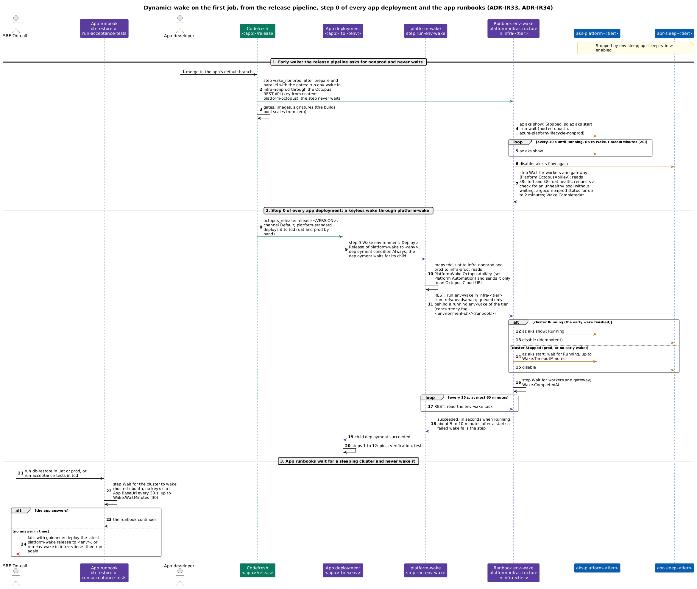

*Dynamic, three ways a sleeping cluster meets its first job. The release pipeline's step `wake_nonprod` asks Octopus to run env-wake in `infra-nonprod` and never waits. Step 0 of every app deployment deploys `platform-wake`, whose keyed step runs env-wake in `infra-<tier>` and waits; the deployment continues once the cluster is Running and `apr-sleep-<tier>` is disabled. App runbooks hold no key: they wait up to `Wake.WaitMinutes` for the app to answer, then fail with guidance.*

- **Context.**
  - User directive (binding): "Use runbooks to aggressively stop stoppable services when not needed. Turn off at night and don't restart until the first Codefresh or Octopus job."
  - The platform runs a sample app with no real users. Cluster compute (nodes, the prod tier fee and OS disks) is about 84 % of the always-on estimate (§3.4).
  - `az aks stop` deallocates the control plane and the nodes, keeps every object except standalone pods, and keeps the cluster state for up to 12 months (E50).
- **Decision.** Every rule is stated per cluster and per environment, never per app.
  - **Stoppable.** Each AKS cluster, with everything in it: Argo CD, ESO, Kyverno, the Octopus Argo CD gateway, the Kubernetes workers `k8s-<env>` and the workloads. `aks-workorders-nonprod` carries `tdd` and `uat`; `aks-workorders-prod` carries `prod`.
  - **Not stoppable** (documented only):
    - Azure SQL. DTU tiers (Basic, S0, S1) cannot pause, and serverless auto-pause would cost more at this usage, so the databases stay on DTU (≈$5–$29 a month each).
    - ACR, Key Vault, Log Analytics and the Terraform state storage have no compute to stop.
    - The private endpoints (≈$58 a month for all eight) and each cluster's load balancer and public IP (≈$22 a month per cluster) bill while the cluster is stopped.
    - The Codefresh runner cluster is in another subscription, out of reach. Recommendation only: autoscale its build node pools to zero (R28). Superseded by ADR-IR34: the runner cluster is the platform's own `aks-platform-build`, whose builds pool scales to zero; only its `B2s` system node runs all the time.
  - **Runbook `env-sleep`** (project `workorders-infrastructure`; environments `infra-nonprod` and `infra-prod`; pool `hosted-ubuntu`; account `#{Azure.LifecycleAccount}`). Triggers `env-sleep-hourly-nonprod` and `env-sleep-hourly-prod` run it hourly (cron `0 * * * *`, `America/Chicago`).
    1. It stops nothing when `Sleep.Enabled` is false, or when the cluster does not exist.
    2. It skips while any Octopus task in the cluster's environments is Queued or Executing, itself excluded. Today these are tasks of `workorders`, `platform-wake` and `workorders-infrastructure`.
    3. Otherwise it sleeps when the time is outside `Sleep.WorkDays` from `Sleep.WorkdayStart` to `Sleep.WorkdayEnd` in `Sleep.TimeZone`, or when the last completed task, or the last `env-wake`, is older than `Sleep.IdleMinutes`.
    4. Prompted `Sleep.Force` (default `false`): a manual run with `true` skips rule 3 but never rules 1 and 2, so it never stops a cluster while tasks run.
    5. Sleeping means: enable `apr-sleep-<cluster>`, re-read the task list, then `az aks stop`. A failed stop disables the rule again and fails the run. Every decision is logged.
  - **Runbook `env-wake`** (same project, environments, pool and account; never an in-cluster pool). Idempotent: it returns in seconds when the cluster already runs.
    1. When the power state is Stopped, after waiting out Stopping: `az aks start`, then wait for Running, up to `Wake.TimeoutMinutes`.
    2. Disable `apr-sleep-<cluster>`.
    3. Wait until every worker of the cluster's `k8s-<env>` pools is Healthy, triggering a health check through the Octopus REST API [VERIFY endpoints].
    4. Wait until the cluster's Argo CD instance is connected, where observable [VERIFY].
    5. Output `Wake.CompletedAt`.
  - **Keyless app wake: project `platform-wake`.** App projects hold no platform secret and no Azure right to start a cluster. A platform-owned project does the keyed part for them.
    - `platform-wake` (project group `Platform`, lifecycle `platform-wake`: one phase with `tdd`, `uat` and `prod` in any order) has exactly one step, `run-env-wake`, on `hosted-ubuntu`. It maps `tdd` and `uat` to `infra-nonprod` and `prod` to `infra-prod`, runs `env-wake` there through the Octopus REST API with `Platform.OctopusApiKey`, waits for the task, and fails when it fails.
    - It has no runbooks and no project variables. A parent deployment's passed variables override the child's on a name collision (E53), so the script reads the environment name and the key as data, checks the name, and sends the key only to `<OCTOPUS_URL>` and `<octopus-space-id>`, which are literals in the script. An override can break a wake but never redirect the key.
    - Releases are `0.0.<n>`. A Platform Engineer creates one from `main` after each change, and before the first `workorders` release.
  - **Wake first.** Every process or runbook that needs a cluster starts with step `wake-environment`, in one of three forms:

    | Where | Form | Key |
    |---|---|---|
    | `workorders` deployment process (every channel; order 0) | Built-in Deploy a Release of `platform-wake` to the same environment, condition Always. A `workorders` release selects the latest `platform-wake` release when it is created, like a package version (E53) | None |
    | `workorders` runbooks `db-backup`, `db-restore-pitr`, `run-acceptance-tests` | A script on `hosted-ubuntu` that waits up to 30 minutes for the environment to answer and names both ways to wake it: deploy `platform-wake`, or `env-wake` by on-call. Deploy a Release is not offered in runbooks [VERIFY, §12 Q32] | None |
    | `workorders-infrastructure` runbooks `env-plan`, `env-apply`, `env-destroy`, `rotate-sql-passwords` | A script on `hosted-ubuntu` that runs `env-wake` through the Octopus REST API and waits. The three Terraform runbooks skip it while the cluster does not exist; the first `env-apply` creates it | Step-scoped (below) |

    - `env-sleep`, `env-wake` and `provisioner-credential-check` wake nothing.
    - The teams that deploy `workorders` hold the built-in Deployment Creator role on `platform-wake` in the same environments. Which identity creates the child deployment is [VERIFY, §12 Q31].
    - Deployments hold no Azure right to start a cluster; only `env-wake` does.
  - **Early wake from Codefresh.** `workorders/release` starts `wake_nonprod` first, in parallel with the gates. It sends one fire-and-forget request, through context `workorders-octopus`, that runs `env-wake` in `infra-nonprod` (`fail_fast: false`; it never fails the build). `ci`, `ci-image` and `env-checks` wake nothing; `preview` carries a commented wake step for phase 6.
  - **Force-wake and force-sleep.** `SRE On-call` gets Runbook Consumer on `workorders-infrastructure` in `infra-nonprod` and `infra-prod`. On-call can then run `env-wake`, or `env-sleep` with `Sleep.Force`, without a deployment. The role also lets on-call start the other runbooks of that project, but `env-apply` and `env-destroy` stop at a manual intervention that only `Platform Engineers` can answer.
  - **Credential.** Sensitive `Platform.OctopusApiKey` holds the Space Manager key (ADR-IR32). `octopus/terraform` sets it from `TF_VAR_platform_octopus_api_key`; it is never committed. It is used only to run runbooks and read tasks, and it reaches platform-owned steps only (S5):
    - `platform-wake` includes library set `WorkOrders Platform Automation`; its one step is the only reader.
    - `workorders-infrastructure` gets a sensitive project variable scoped to the four steps that call the REST API: `wake-environment`, `wait-for-workers-and-gateway` (`env-wake`), `decide-sleep` and `stop-cluster` (`env-sleep`). A library set cannot be scoped to steps. The Terraform steps and the in-cluster steps (`configure-db-principals-<env>`, `rotate-<env>`) never receive the key. The scope values are runbook and step slugs [VERIFY the ID form for runbooks stored in Git, §12 Q26]; the fallback is to include the library set in the project.
    - Project `workorders` never receives it.
    - A key rotation (R23) re-applies `octopus/terraform`, which updates both copies.
  - **Threat model (user decision, 2026-09-24).** The user is the only operator of the Octopus space and the Codefresh account; nobody else gets access. Under that model:
    - the key reaching `platform-wake` through a library set is acceptable, and so is the fallback above;
    - the stored variable sets stay, included in no project (R5);
    - the key's presence in both clusters' Argo CD gateways (ADR-IR32) is an accepted residual risk: a cluster compromise exposes the key. Mitigations: platform add-ons on a dedicated or tainted node pool, NetworkPolicy, and demo-grade apps.
    - The keyless app wake stays, because it is also the simpler design for app projects.
  - **Alerts.** `terraform/environment` creates `apr-sleep-<cluster>` disabled, with `ignore_changes = [enabled]`; only the two runbooks toggle it.
    - It mutes metric and log alert notifications for the cluster's environments, never the activity-log security alerts.
    - No new role assignment: the lifecycle identity's Contributor on the environment resource groups covers start, stop and the rule.
  - **Octopus objects.** `octopus/terraform` creates:
    - project `platform-wake`, its lifecycle and project group, and Deployment Creator on it for the teams that deploy `workorders`;
    - the two triggers [VERIFY the provider resource and support for runbooks stored in Git];
    - the library set and the step-scoped project variable;
    - machine policy `Sleep-tolerant Kubernetes workers`: no alert and no removal while a cluster sleeps [VERIFY settings]. `terraform/environment` registers every worker with it (chart value `agent.machinePolicyName`, S9).
  - **Review.** `CODEOWNERS` gives security owners alone `.octopus/workorders-infrastructure/variables.ocl` (`Sleep.*`, `Azure.LifecycleAccount`), `.octopus/platform-wake/` and `octopus/terraform/library-variable-sets.tf` (S4, §6.2).
  - **Boundaries** (TB17–TB20, C23).
    - `az aks start`, `az aks stop` and the rule toggles appear only in `env-wake.ocl` and `env-sleep.ocl`.
    - REST calls that run runbooks appear only in step `run-env-wake` of `platform-wake`, the `workorders-infrastructure` runbooks and `wake_nonprod`.
    - `Platform.OctopusApiKey` appears only in `run-env-wake` and the four scoped steps; never in project `workorders`.
- **Defaults.**
  - Both `infra-nonprod` and `infra-prod` use the same values:

    | Variable | Value |
    |---|---|
    | `Sleep.Enabled` | `true` |
    | `Sleep.WorkDays` | `Mon,Tue,Wed,Thu,Fri` |
    | `Sleep.WorkdayStart` | `07:00` |
    | `Sleep.WorkdayEnd` | `19:00` |
    | `Sleep.TimeZone` | `America/Chicago` |
    | `Sleep.IdleMinutes` | `120` |
    | `Wake.TimeoutMinutes` | `20` |

  - **Prod sleeps too.** It has no users, and the directive is about cost.
  - **Flip it for a real production.**
    - A pull request sets `Sleep.Enabled` to `false` for `infra-prod` in `.octopus/workorders-infrastructure/variables.ocl`. The next hourly run stops nothing, and the next job wakes prod if it is asleep (R29).
    - Microsoft does not recommend stopping mission-critical workloads, because a stopped cluster may fail to start in a capacity-constrained region (E50).
    - The same change for `infra-nonprod` pauses sleeping, for example for a day of manual testing (`docs/runbooks/sleep-and-wake.md`).
- **Wake latency.**
  - A start takes about 5–10 minutes, plus worker health and gateway reconnection [UNVERIFIED; measured in the phase-2 drill]. `Wake.TimeoutMinutes` caps it at 20.
  - **TDD.** `wake_nonprod` starts nonprod when the release pipeline starts, so the start overlaps the gates, the image builds and the signing. The TDD deployment's `wake-environment` (a `platform-wake` deployment) then usually finds the cluster Running and returns in seconds.
  - **UAT.** It usually follows TDD within the idle window and finds nonprod awake; otherwise it pays one start.
  - **Prod.** `wake-environment` runs before the go/no-go, so the start overlaps the approval; an immediate approval waits up to about 10 minutes. On-call or a platform engineer can run `env-wake` in `infra-prod` ahead of a change window.
  - **Worst case.** A job that lands just after a sleep waits for the stop to finish, and Microsoft advises 15–30 minutes between a stop and a start (E50). The drill measures it and sizes `Wake.TimeoutMinutes`.
- **Risks and mitigations.**
  1. **Self-deadlock.** Octopus runs tasks that share a concurrency tag one at a time, and the default tag is the project and environment (E51).
     - Risk: `env-plan`, `env-apply`, `env-destroy` and `rotate-sql-passwords` run in `workorders-infrastructure`, so each would wait for an `env-wake` queued behind itself.
     - Mitigation: `env-wake` and `env-sleep` share the tag `cluster-power/#{Octopus.Environment.Id}` (`Octopus.Task.ConcurrencyTag`, scoped to those two runbooks) [VERIFY for runbooks]. They exclude each other and never queue behind a caller.
  2. **Stop-start race.** A wake requested during a stop queues behind it on the shared tag, then waits out Stopping and starts. `env-sleep` re-reads the task list just before `az aks stop`.
  3. **Stop rejected.** AKS may reject a stop when a validating or mutating webhook can match the cluster-scoped objects it manages, such as nodes, leases or cluster roles (E50), and Kyverno registers webhooks.
     - Kyverno policies match namespaced kinds only.
     - The phase-2 drill stops and starts nonprod with Kyverno installed.
     - A rejected stop fails `env-sleep` visibly.
  4. **Start fails for capacity** (E50). The wake step fails the deployment or runbook; retry later. This is why a real production does not sleep.
  5. **Waits keep a cluster awake.** A deployment paused at a manual intervention (UAT sign-off, prod go/no-go) is Executing [VERIFY] and blocks sleep. Approvers answer or cancel. The cost is bounded: ≈$0.54 an hour for nonprod, ≈$1.18 for prod.
  6. **Where the Space Manager key reaches** (S5, settled in the integration pass). App code never sees it: project `workorders` wakes through `platform-wake` and holds no key. `platform-wake` has one step. In `workorders-infrastructure` a step-scoped variable keeps it out of the Terraform and in-cluster steps [VERIFY scope IDs, §12 Q26]. TB20 checks the files; C23 checks the Terraform scope. The key stays in the gateways (accepted, Threat model).
  7. **Manual testing is not a task.** A tester who works in UAT for longer than `Sleep.IdleMinutes` without a deployment loses the cluster at the next hourly run, and nothing stays up after 19:00. Mitigations: on-call runs `env-wake`, which restarts the idle clock; a long session pauses sleeping (Defaults).
  8. **Stopped-cluster limits** (E50).
     - A stopped cluster accepts only start or delete, so scaling and upgrades wait for a wake; the Terraform runbooks wake first.
     - The API server IP may change. Nothing pins it, because the workers and the gateway connect outbound.
     - Standalone pods are deleted, so `env-sleep` never stops during a task.
     - The state is lost after 12 months stopped.
  9. **Muted alerts.** A rule left enabled on a running cluster would hide incidents.
     - `env-wake` disables it idempotently.
     - `env-sleep` enables it only just before the stop, and disables it again when the stop fails.
     - SLO windows count awake time only.
  10. **Wasted wakes.** A master build that fails, or creates no release, still wakes nonprod for two to three hours (≈$1–$2). Accepted.
  11. **Previews (phase 6).** The preview SQL `emptyDir` is lost at every stop; previews re-seed after a wake and need nonprod awake.
  12. **`platform-wake` release selection.** A `workorders` release fails at creation or at step 0 when `platform-wake` has no release [VERIFY]. A default package version would also be applied to the child release (0.0.<n>) [VERIFY], so `workorders/release` passes `PACKAGES` with an explicit version for each `workorders` package and no `PACKAGE_VERSION` (§7.7; C16). Bootstrap step 3 creates the first `platform-wake` release.
  13. **App runbooks cannot wake.** `db-backup`, `db-restore-pitr` and `run-acceptance-tests` wait up to 30 minutes and then fail on a sleeping cluster. On-call wakes it first (Runbook Consumer on `workorders-infrastructure`), or a deployer deploys `platform-wake`.
  14. **Idle clock and audit names** [VERIFY in the P2 drill]. `env-sleep` skips its own runs and `provisioner-credential-check` by task description (S6, §12 Q34); if descriptions do not name the runbook, nonprod stays awake through every working window (≈$215 a month instead of ≈$100). The forced-sleep log names the user from `Octopus.Deployment.CreatedBy.*`, which runbook runs may not populate (S7, §12 Q35); the task history names the user in any case.
- **Consequences.**
  - The estimated bill falls from ≈$1,640 to ≈$325 a month (§3.4).
  - Project `workorders` holds no platform secret; only `platform-wake` and `workorders-infrastructure` do.
  - The P2 latency exit criterion counts cold starts (§9).
  - The task list shows two `env-sleep` runs an hour, each lasting seconds.
- **Dissent.** None recorded; the directive postdates the debate.
- *Implementation (2026-09-25):* names follow ADR-IR34 (`platform-infrastructure`, `apr-sleep-<tier>` in `rg-platform-<tier>-aks` from `terraform/tier`, library set `Platform Automation` with `PlatformWake.OctopusApiKey`); §7.2 describes the runbooks as built. Differences from the decision:
  - The triggers use cron `0 0 * * * *` (Octopus cron has a seconds field) in time zone UTC; the working window still uses `Sleep.TimeZone`.
  - `env-sleep` counts Queued, Executing and Cancelling tasks, and ignores a task queued to start more than 15 minutes ahead. It stops with `az aks stop --no-wait`; the rule is disabled again only on an exit before Azure accepts the stop (gap: a stop that fails later leaves `apr-sleep-<tier>` enabled; tracked).
  - `env-wake` waits for neither healthy workers nor a connected Argo CD instance: it requests one health check, without awaiting it, for a worker that is not healthy, and reads the instance status for up to 2 minutes, best effort (gap: tracked). The worker machine policy schedules no health checks.
  - `platform-wake` reads `Octopus.Web.ServerUri` and `Octopus.Space.Id`, accepts only `https://<name>.octopus.app` and `Spaces-<n>`, and waits up to 60 minutes for `env-wake`.
  - No Deployment Creator grant exists: Project Deployer includes DeploymentCreate (§12 Q31).
  - `Octopus.Task.ConcurrencyTag` is unscoped: `#{Octopus.Environment.Id}/#{Octopus.Runbook.Name}`, one tag per runbook and environment (live 2026-09-25: Octopus ignored a value scoped to `env-wake` and `env-sleep` and stored a filtered value unevaluated; walkthrough 06, P14).
  - `wake_nonprod` runs after `prepare`, on master only, when `CODE_CHANGED` and `IS_RELEASE` are true. It makes three REST calls (two lookups and the run) and times out after 3 minutes; a build without code changes wakes nothing.
  - The release handoff passes an explicit `--package` version per package and no default package version (§7.7).
  - The app runbooks that wait are `db-restore` and `run-acceptance-tests` (backups are the tenant's CronJobs); `rotate-sql-passwords` is `rotate-db-passwords`; `provisioner-credential-check` does not exist.

#### ADR-IR34 App-neutral, platform-neutral multi-app platform — Decided (user directives: the multi-app directive §§1–14 and the user corrections of 2026-09-24; supersedes and amends the ADRs listed below)

- **Context.**
  - The user approved a multi-app training platform: dozens of teaching apps, each with its own repository, architecture and Codefresh and Octopus pipelines ("scaffold, then own"). The platform is app-neutral, the apps are platform-neutral, and `workorders` becomes app #1.
  - Databases run in pods; production is fully segmented from non-production at the resource-group level; one shared build registry serves both tiers.
  - Threat model (§13): the user is the only operator of the Octopus space and the Codefresh account. Rules that defended only against untrusted pipeline editors are relaxed where that is simpler. Kept: prod segmentation, the shared registry, sleep and wake, signed images with prod admission, namespace isolation, databases in pods, the neutrality principles, fork-PR triggers off, and ingress hardening.
  - §14 requires a capability catalogue with automated tests, a harness, testability hooks, phase-1 provisioning of both clusters, and a continuous end-to-end pass.
  - Inputs: the five memos in `design/multi-app/` and the fact check `design/multi-app/verification.md` (V1–V12 below).
  - Live facts, checked 2026-09-24:
    - The provisioner `sp-automation-mvp-sub` holds unconditioned Contributor on the subscription. It also holds the constrained Role Based Access Control Administrator of R6 (ten roles; service-principal and group assignees) and Graph `Group.Create` and `Application.ReadWrite.OwnedBy`.
    - Every resource provider is registered except `Microsoft.AlertsManagement`.
    - The region `<azure-region>` (South Central US) allows 65 regional vCPUs. The families DSv5, DDSv5, BS, DASv5, DADSv5 and DSv3 are each capped at 65; no memory-optimized family is listed.
    - Two foreign resource groups exist, `NetworkWatcherRG` and `ai-model`. Neither is the platform's.
    - The Codefresh account is on plan BASIC_1: the hybrid runner runs one build at a time. The only runtime is dead, so there is no working build capacity.
    - Sessions reach the cluster APIs through a TLS-re-terminating proxy, so client certificates fail.
  - User corrections (binding):
    - The harness and new platform tooling are .NET-native, with no JUnit anywhere.
    - Everything in the current Codefresh account may be changed or discarded.
    - No further questions: every open point is decided here.
- **Supersedes and keeps.**

  | ADR | Effect | What changes |
  |---|---|---|
  | ADR-C2 Database migrations | Superseded | An Argo CD PreSync Job in the app namespace migrates before rollout (decision 1). Octopus-run migration on the shared `k8s-<env>` pool stays an optional pattern. |
  | ADR-D9 Secrets and SQL authentication; ADR-IR13; ADR-IR24; ADR-IR28 | Superseded | Azure SQL leaves the platform, together with SQL DB Contributor, point-in-time restore and the preview certificate workaround. Databases in pods use SQL logins, a vault per app-environment and a platform internal CA (decision 8). |
  | ADR-D10 Azure layering; ADR-C10 | Superseded | Layers `foundation`, `build`, `tier` and `apps` (decisions 2 and 3). The provisioner stays as the operator-run bootstrap and grant identity; tier automation runs as per-tier OIDC identities. |
  | ADR-D17 runtimes | Superseded | One runtime, `<cf-runtime>`, on the platform's build cluster (decision 16). The pipeline rules stay. |
  | ADR-IR33 note "the runner is in another subscription"; R28 | Superseded | The runner cluster `aks-platform-build` is in `rg-platform-build`, and its builds pool scales to zero. |
  | ADR-C1, ADR-C4, ADR-D1, ADR-D3, ADR-D7, ADR-D8, ADR-D11, ADR-D12, ADR-D13, ADR-D15, ADR-IR10, ADR-IR15, ADR-IR29, ADR-IR32, ADR-IR33 | Amended | App-neutral names (§7.0), per-app packaging, three clusters on the AKS Free tier, the tenant chart, per-app groups and project shells, tier identities, per-app signer policies, sslip.io host names, configurable separation of duties, per-tier workspaces, shared registry tokens, an interim Argo CD repo credential, the `platform-operators` group, the key in `platform-octopus`, and testability hooks. |
  | ADR-C5, ADR-C6, ADR-C7, ADR-C11, ADR-D2, ADR-D4, ADR-D5, ADR-D6, ADR-D14, ADR-D16, ADR-D18, ADR-IR2, ADR-IR14, ADR-IR19, ADR-IR26, ADR-IR27, ADR-IR30 | Kept | One verb per tool; one private environment repo holding every platform file; app repos untouched (the sandbox repo holds only its source); Octopus the only pin writer; Argo CD the only applier. |

- **Decisions on the conflicts the memos raised.** Simplicity wins wherever §13 allows it.

  | # | Question | Decision | Why |
  |---|---|---|---|
  | 1 | Migrations: Argo CD PreSync Job or Octopus-run | **PreSync Job** in the app namespace, running the app's migrator image, pinned by Octopus with the app's images. A failed Job fails the sync; Octopus's healthy verification then fails the deployment while the old pods keep serving. Migrators are idempotent. The directive's capability "migrations run before the pin" is restated as "before rollout" (CAP-GIT-009). A prod release first runs the database backup Job (step template `platform-db-backup`). Octopus-run migration on `k8s-<env>` stays an optional pattern. | Engine-neutral; one pattern for every app; no database password reaches Octopus; no cross-namespace database traffic |
  | 2 | Who creates resource groups, including `rg-app-<app>-<tier>` | The provisioner: `terraform/foundation` creates every platform group, and `terraform/apps/grants` creates `rg-app-<app>-<tier>` only for apps that declare Azure services. Tier identities cannot create groups. No Owner apply is needed per app. | The provisioner holds unconditioned subscription Contributor (live fact); a tier identity with subscription rights would span tiers |
  | 3 | Per-tier identities or the provisioner | Both, with separate jobs:<br>• **The provisioner** is the operator-run bootstrap and grant identity. It applies `foundation`, `build` and `apps/grants` from an operator session, never from Octopus or Codefresh, and it is the only identity that creates role assignments.<br>• **`id-platform-lifecycle-<tier>`** runs all tier automation (the `env-*`, `apps-*`, `env-wake` and `env-sleep` runbooks) through OIDC, with Contributor on its own tier's groups only and no RBAC Administrator.<br>• The stored Octopus account `Azure Runtime Provisioner` is used by no project from P1 on. | §11 needs per-tier automation identities; keeping every grant with the provisioner avoids delegating RBAC Administrator per tier, which only an Owner could grant |
  | 4 | Codefresh → Octopus handoff | **The key in a context** is the default: Codefresh context `platform-octopus` (renamed from `workorders-octopus`), attached to every app's release pipelines and to the conformance pipelines. The release manifest plus an external feed trigger (keyless; external feed triggers were confirmed for ACR images from the default branch, V2) stays an optional, demonstrable pattern, built when a lesson needs it and catalogued only then. | Simple and already implemented; gives build information, explicit versions and an immediate release |
  | 5 | Push tokens: shared or per app | **Shared:** `cf-apps-release` (`apps/*`: content write, metadata write, no delete) and `cf-apps-preview` (`apps-previews/*`). `cf-platform-ci`, `cf-platform-pull` and `cf-platform-retention` cover the platform. Cross-app mistakes are caught by the handshake lint, tag locks and the per-app prod signer policy. | §13: a single operator; per-app tokens would add a token and a context per app |
  | 6 | Where the ESO identity lives | The tier ESO controller identity `id-eso-platform-<tier>` (service account `external-secrets/external-secrets`, one federated credential) reads every app vault of its tier. It does so only through a ClusterSecretStore `<app>-<env>` per app-environment, whose conditions admit only that app-environment's namespaces, plus `platform-backup` for the backup Job's `sa` credential. App AppProjects deny SecretStore and ClusterSecretStore, so no app can create or change a store. No per-app ESO identity exists. | Gitops placement (no identity in app namespaces), simplified to one identity per tier; isolation is tested live (CAP-GIT-004) |
  | 7 | OCI charts or Git | **Git.** Helm apps vendor their chart under `gitops/apps/<app>/`. Octopus writes image tags into the env values file at `argo.octopus.com/image-replace-paths`. An OCI chart is allowed only with its version pinned by pull request; Octopus never promotes chart versions. | Octopus cannot update OCI-sourced charts (E2) |
  | 8 | Database credentials and TLS | SQL logins (`sa`, `<app>_migrator`, `<app>_app`). `terraform/apps/tier` generates the passwords into the app vault as write-only values, and ESO syncs them. The vault is `kv-<app>-<e>-<hash4>`, where `<e>` is `t`, `u` or `p` and `hash4` is the first four hex digits of `sha1("<AZURE_SUBSCRIPTION_ID>/<app>/<env>")`, computed by both Terraform and the tenant chart.<br>• Server certificates come from the cert-manager ClusterIssuer `platform-internal-ca`.<br>• Migrators trust that CA through `SSL_CERT_FILE` [VERIFY .NET, Q43]. Fallback: WI-07's trust switch.<br>• App connection strings use `TrustServerCertificate=True` inside the cluster, which NetworkPolicy fences.<br>• No managed-database component is kept: an app that needs Azure SQL owns it in `rg-app-<app>-<tier>`. | Rebuild-proof credentials; no second onboarding pull request (decision 11); app #1's DbUp console validates the server certificate of every non-local server (ADR-IR24) |
  | 9 | vCPU quota across the clusters | A fixed budget within 65 vCPUs, using D-series and B-series only (see Clusters). Upgrades run one surge node while the builds pool is at zero. Beyond about 12 apps the user requests a memory-optimized family and a higher regional quota (R34). | The live quota lists no E-series family |
  | 10 | App slug | `^[a-z][a-z0-9]{2,11}$`: 3 to 12 characters, no dash. Reserved words: `apps`, `argo`, `argocd`, `cert`, `default`, `external`, `infra`, `kube`, `kyverno`, `octopus`, `platform`, `system`, and `sandbox` for the conformance fixture only. Repositories keep date-based names. | Fits vault names (24 characters) and splits `<app>-<env>` one way |
  | 11 | The second onboarding pull request | **None.** Vault names are deterministic, ESO and backups use tier identities, and databases use Terraform-created disks with deterministic resource IDs. An app that asks for its own workload identity receives the client ID through its vault (ESO → env `AZURE_CLIENT_ID`) [VERIFY webhook behaviour, Q44]. Fallback: a one-line follow-up pull request. | One pull request per app (directive §5) |
  | 12 | Terraform state for apps | Per app: `apps-<app>.tfstate` in each tier's state account (`terraform/apps/tier`), and `app-grants-<app>.tfstate` in the global account (`terraform/apps/grants`). `octopus/terraform` keeps one state and `for_each` over `apps/*.yaml`. | No app's plan or failure couples to another's |
  | 13 | Octopus and Codefresh licensing [VERIFY] | Octopus counts every active project, orchestrators included (V1):<br>• 1 app: 4 projects;<br>• 12 apps: 21 projects;<br>• 36 apps: 57 projects.<br>Professional is $104 per project a year plus the Cloud platform fee, so the Free tier (10 projects) covers only 1 app (R7). The task cap binds first: each waking deployment holds three slots (Q29).<br>Codefresh BASIC_1 runs one build at a time: enough for one app and nightly tests, but a queue at class scale (R32). | — |
  | 14 | The 20-federated-credential limit | No identity comes near 20:<br>• tier identities carry one or two;<br>• per-app deploy identities carry one per Octopus project, and the kit rejects a 21st project;<br>• app workload identities carry one per service account.<br>No wildcards; credentials on one identity are created in sequence (chained `depends_on`) to avoid 409 errors (V12). | — |
  | 15 | The key shared by both gateways | Accepted residual risk (ADR-IR33 threat model): a cluster compromise exposes the Space Manager key. Mitigations: add-ons on the tainted system pool, NetworkPolicy, demo-grade apps and 90-day rotation (R23). | User decision |
  | 16 | Build capacity | A platform-owned runner: **`aks-platform-build`** in `rg-platform-build`, a build cluster only, with no app workloads and no data (Build runner below). Runner inside the nonprod cluster: rejected, because a stopped cluster cannot wake on a Codefresh job. Plan upgrade: the user's commercial decision (R32). | The account has no working runtime (live fact) |
  | 17 | Wake identity | `platform-wake` keeps Deploy a Release plus the key, running `env-wake` (ADR-IR33). No `id-platform-wake-<tier>` and no gateway ready endpoint. Every variable that `platform-wake` reads is named `PlatformWake.*` or is a system variable, and the kit rejects `PlatformWake.*` in app processes (V1: passed variables override the child's). | Simpler; already implemented |
  | 18 | Worker pools | Shared `k8s-<env>` pools only, for app steps that must run in-cluster (app #1's acceptance tests, pre-release backups, restores). No per-app pools. | §13 |
  | 19 | Pipeline configuration location | The platform repo for every app: `codefresh/apps/<app>/` and `.octopus/apps/<app>/<project>/`. App repos stay untouched (ADR-D18). | Directive §8; no widening of the Octopus Git credential |
  | 20 | Pins | Tags only. The image-tag step writes `newTag` and deletes digests (V3). Prod safety rests on tag locks and signature admission. The integration is still Preview (V3, E9): the fallback writer is step template `platform-pin-writer` (git commit of `newTag` as the bot, then a wait for Argo CD sync and health through the in-cluster worker), switched on per app by pull request if the Preview step breaks after an Octopus Cloud upgrade. The pin capability tests (CAP-OCT-012) run whichever writer is active. | Digests are not writable by the step |
  | 21 | Host names and TLS | Hosts `<app>-<env>.<apps-domain-<tier>>`. `<apps-domain-<tier>>` defaults to `<ingress-ip-dashed-<tier>>.sslip.io`, the tier's static ingress IP with dashes, and each host gets a Let's Encrypt HTTP-01 certificate. No DNS zone, no DNS role, no user action. A custom domain (R35) switches to delegated child zones and wildcard DNS-01. Diagnostics paths stay denied in uat and prod. | Keeps ingress hardening without a domain purchase |
  | 22 | Stop blocked by admission webhooks (V9) | Kyverno policies match namespaced kinds only. The Kyverno values exclude `kube-system` and `kube-node-lease` and every cluster-scoped kind from its webhooks. The drill and CAP-AZ-005 prove the stop. Fallback, only if a stop is still rejected: `env-sleep` removes Kyverno's webhook configurations just before `az aks stop`, and Kyverno registers them again at start. | Recorded AKS behaviour |
  | 23 | Separation of duties with one operator | `Platform.SoDMode`:<br>• `single-operator` (default): the creator may approve, with a recorded reason;<br>• `enforce`: the creator may not approve.<br>`Platform.InterventionTestMode` (default `true`) lets the automation user answer interventions only with a `conformance:<run-id>` or `e2e:<run-id>` reason. Both states are tested (CAP-OCT-004, CAP-OCT-005). | §14 |
  | 24 | Library sets and step templates | Allowed again for platform values (§13):<br>• `Platform Environment` (renamed from `WorkOrders Environment`) holds per-environment platform values and is included in app projects;<br>• `Platform Infrastructure` is renamed from `WorkOrders Infrastructure`;<br>• `Platform Automation` holds `PlatformWake.OctopusApiKey` for `platform-wake` only.<br>The step-scoped key of `platform-infrastructure` stays as implemented. | §13 |
  | 25 | Azure Policy, PIM and people groups | Dropped: no policy assignments and no PIM. `platform-operators` (the user) replaces `secret-writers`. Locks stay, applied by the Owner script (`-ApplyLocks`). | §13; locks protect prod data and state |
  | 26 | Project groups and the preview path | `app-<app>` per app (directive §10 supersedes §6's single `Apps` group), plus `Platform`. Previews push to `apps-previews/<app>/<image>`. | Settles the pragmatist memo's open items |
  | 27 | The memos' student-edit questions | Moot. Only the operator edits pipelines, OCL and `gitops/apps/<app>/` (§13), so there are no per-app Entra groups, Octopus teams or Codefresh permission models. | §13 |
  | 28 | App-level scale-to-zero | Not automatic. Cluster sleep covers idle time. An app is parked with descriptor `status: frozen`: replicas and database at zero, disks kept. | Self-heal owns replicas; cold databases slow the first request |

  *Implementation (2026-09-25):*
  - Decision 21: each app's uat and prod overlays add an HTTPRoute rule that answers the diagnostics paths with a 302 redirect to `/` at the Gateway (CAP-GIT-012). The Gateway has one listener, HTTP on port 80; the HTTPS listeners are the tenant chart's ListenerSets.
  - Decision 28: a frozen app's workloads and database go to zero replicas, its backup CronJob is suspended and its Octopus projects are disabled. `codefresh/register.ps1 --app <app>` (and `--full`) registers its pipelines with every Git and cron trigger off (2026-09-25).

- **Resource groups (final).** Created by the provisioner (decision 2). Tests and Terraform never touch the foreign groups `NetworkWatcherRG` and `ai-model`, and every inventory ignores them.

  | Resource group | Tier | Contents | Created by | Written by |
  |---|---|---|---|---|
  | `rg-platform-global` | global | State account `<tfstate-storage-account-global>` (`foundation`, `build`, `app-grants-*` states) | `terraform/foundation` (bootstrap on local state, then migrated) | Provisioner |
  | `rg-platform-build` | build | Registry `<acr-name>` (Standard; no admin user; no anonymous pull; scope maps); build cluster `aks-platform-build`; `id-octopus-acr-pull` | `terraform/foundation` (group, registry, identity); `terraform/build` (cluster) | Provisioner |
  | `rg-platform-build-aks-nodes` | build | Build nodes, load balancer and egress IP | AKS (`node_resource_group`) | AKS |
  | `rg-platform-<tier>-shared` | nonprod, prod | VNet `vnet-platform-<tier>` (not peered); IPs `pip-platform-<tier>-egress` and `pip-platform-<tier>-ingress`; workspace `log-platform-<tier>`; state account `<tfstate-storage-account-<tier>>`; backup account `<backup-storage-account-<tier>>`; `id-platform-lifecycle-<tier>` | Foundation (group, both accounts, identity); `terraform/tier` (network, IPs, workspace) | Lifecycle identity |
  | `rg-platform-<tier>-aks` | nonprod, prod | `aks-platform-<tier>`; platform vault `<kv-platform-<tier>>`; `apr-sleep-<tier>`; identities `id-aks-<tier>-controlplane`, `id-aks-<tier>-kubelet`, `id-eso-platform-<tier>`, `id-kyverno-<tier>`, `id-db-backup-<tier>` | Foundation (group, identities); tier (cluster, vault, rule, workload federated credentials) | Lifecycle identity |
  | `rg-platform-<tier>-aks-nodes` | nonprod, prod | Nodes, load balancer | AKS | AKS |
  | `rg-platform-<tier>-data` | nonprod, prod | Database disks `disk-<app>-<env>-db` (Standard SSD, no zone; 8 GiB in tdd and uat, 32 GiB in prod) and any dynamic `platform-retain` disks; `CanNotDelete` on prod | Foundation (group); `terraform/apps/tier` (disks) | Lifecycle identity; CSI driver (control-plane identity) |
  | `rg-platform-<tier>-apps` | nonprod, prod | App vaults `kv-<app>-<e>-<hash4>`; `appi-<app>-<env>` and alerts; optional `id-<app>-<env>-deploy` and `id-<app>-<env>-app` | Foundation (group); apps layers | Lifecycle identity; provisioner (identities, grants) |
  | `rg-app-<app>-<tier>` | nonprod, prod | App-owned Azure services (optional) | `terraform/apps/grants` | The app's deploy identity (Contributor) |

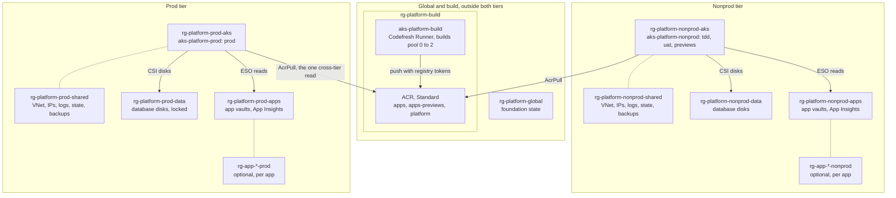
```mermaid
flowchart TB
    subgraph GLOBAL["Global and build, outside both tiers"]
        rgGlobal["rg-platform-global<br/>foundation state"]
        subgraph BUILD["rg-platform-build"]
            acr["ACR, Standard<br/>apps, apps-previews, platform"]
            aksBuild["aks-platform-build<br/>Codefresh Runner, builds pool 0 to 2"]
        end
    end
    subgraph NONPROD["Nonprod tier"]
        npShared["rg-platform-nonprod-shared<br/>VNet, IPs, logs, state, backups"]
        npAks["rg-platform-nonprod-aks<br/>aks-platform-nonprod: tdd, uat, previews"]
        npData["rg-platform-nonprod-data<br/>database disks"]
        npApps["rg-platform-nonprod-apps<br/>app vaults, App Insights"]
        npApp["rg-app-*-nonprod<br/>optional, per app"]
    end
    subgraph PROD["Prod tier"]
        prShared["rg-platform-prod-shared<br/>VNet, IPs, logs, state, backups"]
        prAks["rg-platform-prod-aks<br/>aks-platform-prod: prod"]
        prData["rg-platform-prod-data<br/>database disks, locked"]
        prApps["rg-platform-prod-apps<br/>app vaults, App Insights"]
        prApp["rg-app-*-prod<br/>optional, per app"]
    end
    aksBuild -->|"push with registry tokens"| acr
    npAks -->|"AcrPull"| acr
    prAks -->|"AcrPull, the one cross-tier read"| acr
    npAks -->|"CSI disks"| npData
    prAks -->|"CSI disks"| prData
    npAks -->|"ESO reads"| npApps
    prAks -->|"ESO reads"| prApps
    npAks -.- npShared
    prAks -.- prShared
    npApps -.- npApp
    prApps -.- prApp
```

- **Clusters and capacity.** All three clusters use AKS Free, Entra ID authentication with Azure RBAC, and local accounts disabled. Automatic upgrades are off; upgrades are manual and run while the builds pool is at zero. App-cluster and builds nodes use managed OS disks: AKS in this subscription allows only v6/v7 x86 sizes and ARM B-series (live, 2026-09-24), so the D-series pools use `Standard_D4as_v6` (no temporary disk) and the build system pool `Standard_B2pls_v2` (ARM64; the runner images are multi-arch). The managed OS disks (64 GiB) bill while a cluster is stopped.

  | Cluster and pool | SKU | Nodes | vCPU at maximum |
  |---|---|---|---|
  | `aks-platform-build`, pool `system` (Codefresh Runner agent; always on) | `Standard_B2pls_v2` | 1 | 2 |
  | `aks-platform-build`, pool `builds` (engine and dind; taint `codefresh.io/builds`) | `Standard_D4as_v6` | 0–2 | 8 |
  | `aks-platform-nonprod`, pool `system` (add-ons; taint `CriticalAddonsOnly`) | `Standard_D4as_v6` | 1 | 4 |
  | `aks-platform-nonprod`, pool `apps` | `Standard_D4as_v6` | 1–7 | 28 |
  | `aks-platform-prod`, pool `system` | `Standard_D4as_v6` | 1 | 4 |
  | `aks-platform-prod`, pool `apps` | `Standard_D4as_v6` | 1–4 | 16 |
  | **Total at maximum** | | | **62 of 65**. An upgrade surge node (+4) fits while `builds` is at zero (58). |

  - One app-environment with SQL Server Express needs about 2.75 GiB of requests, and a `Standard_D4as_v6` apps node holds four.
    - That holds only with an explicit `max_pods`. AKS reserves kubelet memory per possible pod (about 20 MiB × `max_pods` + 50 MiB). At the overlay default of 250 pods that is about 5 GiB of a `Standard_D4as_v6`, which leaves room for three app-environments, and a builds node could not fit its 11 GiB dind pod at all.
    - The pools therefore set `max_pods`: `apps` 50, the app-cluster `system` pools 60, and `builds` 30 (pre-provisioning review, 2026-09-24).
  - Nonprod therefore fits about 13 apps with databases besides the sandbox, and prod about 15.
  - Beyond that, R34 requests the EDSv5 family and a regional quota of about 80; the apps pools then move to `Standard_E4ds_v5` (about 10 app-environments per node). §3.5 costs 36 apps that way.
- **Build runner** (decision 16).
  - `terraform/build` (provisioner) creates `aks-platform-build`: AKS-managed VNet, system-assigned identities, and no role assignment outside its own node resource group.
  - Pipelines get no cloud identity, and registry pushes use tokens from Codefresh registry integrations (TB2).
  - The operator installs Helm chart `cf-runtime` 10.5.6 with values from `codefresh/runner/values.yaml`: context `aks-platform-build`, namespace `codefresh`, runtime `<cf-runtime>` = `aks-platform-build/codefresh`, `storage.backend: local`, and engine and dind pods on the `builds` pool.
  - The Codefresh API key is passed through `global.codefreshTokenSecretKeyRef` and never committed. The runtime becomes the account default, and every spec sets `runtimeEnvironment` to it.
  - The first job scales `builds` from zero [VERIFY, Q51]. That meets "no restart until the first Codefresh job" for builds, and the release pipeline's `wake_nonprod` then wakes the nonprod app cluster. The autoscaler returns the pool to zero after 10 idle minutes.
  - Only the system node runs all the time.
  - The dead runtime `trf-CodeFresh-dev/codefresh`, its agent and the old projects, contexts and integrations are exported by the main loop, then deleted.
- **Capability catalogue** (§14).
  - **Format and location.**
    - `catalogue/capabilities.yaml` holds the harness seed (`CAP-HARNESS-001` to `004`).
    - One fragment per role, `catalogue/capabilities.d/<role>.yaml`, avoids concurrent editors; the harness's loader merges them.
    - Each entry has `id` (`CAP-<AREA>-<nnn>`), `statement`, `owner` (the tool that provides the capability: Codefresh, Octopus, Argo CD, Azure, Kyverno or the kit), `adr`, `observed_by`, `tests` (fully qualified NUnit test names), `live`, `destructive`, `tier` and `why_offline`, which is required when `live` is false.
    - `Platform.Conformance.Report render-catalogue` writes `docs/capabilities.md`, and `env-checks` fails when it is stale.
  - **The 1:1 rule.**
    - Every live or offline test method carries `[Capability("CAP-…")]`, and every capability names at least one test.
    - The offline `CatalogueConsistencyTests` (harness) checks both directions by reflection:
      - each listed test exists and carries that ID;
      - each attributed test is listed under its ID;
      - no ID is duplicated;
      - `live: true` requires at least one `Live` test;
      - `destructive: true` requires `NonProd` on every `Destructive` test.
    - Optional patterns, such as the keyless handoff and previews, join the catalogue only when built.
  - **Areas and prefixes** (disjoint, one per role):

    | Role | Prefix | Live tests | Offline tests | Fragment |
    |---|---|---|---|---|
    | codefresh-engineer | `CAP-CF` | `tests/Platform.Conformance.Tests/Codefresh/` | `tests/Platform.Conformance.Offline/Codefresh/` | `catalogue/capabilities.d/codefresh.yaml` |
    | octopus-architect | `CAP-OCT` | `…Tests/Octopus/` | `…Offline/Octopus/` | `…/octopus.yaml` |
    | gitops-architect | `CAP-GIT` | `…Tests/GitOps/` | `…Offline/GitOps/` | `…/gitops.yaml` |
    | sre-security | `CAP-AZ` | `…Tests/Azure/` | `…Offline/Azure/` | `…/azure.yaml` |
    | pragmatist | `CAP-KIT` | `…Tests/Kit/` | `…Offline/Kit/` | `…/kit.yaml` |
    | harness engineer (dispatched) | `CAP-HARNESS` | — | `…Offline/Catalogue/` | `catalogue/capabilities.yaml` |

  - *Implementation (2026-09-25):* no `catalogue/capabilities.yaml` exists. The harness seed is the sixth fragment `catalogue/capabilities.d/harness.yaml` (`CAP-HARNESS-001` to `012`, live tests included), and `CatalogueConsistencyTests.cs` sits at the root of `Platform.Conformance.Offline`, with no `Catalogue/` folder. The `owner` values are `codefresh`, `octopus`, `argocd`, `azure`, `kyverno`, `onboarding` and `platform`.

- **First full capability list.**
  - Kind:
    - L: live, against the platform;
    - O: offline, with `why_offline` given.
  - Destructive tests (D) run only in nonprod and only against the sandbox app.
  - Test classes live in the role's area folder, and method names follow `Should_<Method>_<Scenario>_<Expected>`.

  | ID | Capability | Observed by | Test class: methods | Kind | D | Tier |
  |---|---|---|---|---|---|---|
  | CAP-CF-001 | A build on the platform runtime succeeds | Build record: runtime and status | `PlatformRuntimeTests`: build succeeds on `<cf-runtime>` | L | — | build |
  | CAP-CF-002 | The runner agent is healthy | Agent status; last report under 5 minutes old | `RunnerHealthTests`: agent healthy | L | — | build |
  | CAP-CF-003 | Build compute scales from zero on the first job and back to zero after idle | `builds` node count (ARM) before, during and 20 minutes after a build | `BuildScalingTests`: from zero; back to zero | L | — | build |
  | CAP-CF-004 | CI fails the required check on a failing test and passes a green branch | `codefresh/ci` status on sandbox branches | `CiGateTests`: failing branch fails; green branch passes | L | — | build |
  | CAP-CF-005 | Fork pull requests never start a pipeline | Trigger specs; no build or status for a fork pull request (fixture, R33) | `ForkPullRequestTests`: fork events off in every trigger (O); no build for a fork pull request (L) | L, O | — | build |
  | CAP-CF-006 | Release images land under `apps/<app>/` with a keyless signature and an SBOM | Registry referrers; signer identity | `ReleasePublishTests`: signed image with SBOM under the app path | L | — | build |
  | CAP-CF-007 | Released tags are write-locked | `writeEnabled` and `deleteEnabled` of every pinned tag | `TagLockTests`: every pinned tag locked | L | — | build |
  | CAP-CF-008 | The handoff creates exactly one Octopus release numbered with the build version | Octopus releases of `sandbox`; a rerun of the build | `ReleaseHandoffTests`: one release with the build version; none on rerun | L | — | nonprod |
  | CAP-CF-009 | A release build wakes nonprod early without failing | `env-wake` task in `infra-nonprod` within 5 minutes of the build start | `EarlyWakeTests`: early wake requested | L | — | nonprod |
  | CAP-CF-010 | Retention never deletes a pinned version, its referrers or the last 10 releases | Retention dry-run plan against the pins under `gitops/apps/*/envs/**` | `RegistryRetentionTests`: plan keeps pinned and recent versions | L | — | build |
  | CAP-CF-011 | Codefresh never deploys | Pipeline YAML, specs and contexts: no deploy, Helm, kubectl, Argo CD or az step and no cluster or Azure credential | `NeverDeployTests`: no deploy step; no cluster or Azure credential | O (a live attempt would need the forbidden credential) | — | — |
  | CAP-CF-012 | The build cluster holds no role assignment outside its node resource group | ARM role assignments of its identities; `terraform/build` | `BuildIdentityTests`: none live (L); none declared (O) | L, O | — | build |
  | CAP-OCT-001 | A new release deploys to tdd automatically | Lifecycle-created tdd deployment | `LifecycleTests`: auto-deploys to tdd | L | — | nonprod |
  | CAP-OCT-002 | Promotion to uat and prod moves only pins; image references are identical everywhere | Pin commits per environment; running image digests | `PromotionTests`: promotes to prod with identical images | L | — | prod |
  | CAP-OCT-003 | uat waits for sign-off and prod for go/no-go | Deployment interruptions | `ApprovalTests`: uat pauses; prod pauses | L | — | prod |
  | CAP-OCT-004 | Separation of duties is configurable | `sod-guard` on channel `Default` (`single-operator`) and on channel `Strict` (`enforce`) | `SeparationOfDutiesTests`: proceeds with a reason; fails when the creator approves under `enforce` | L | — | prod |
  | CAP-OCT-005 | Automation answers interventions only with a recorded reason | Interruption notes; `sod-guard` result | `InterventionTestModeTests`: proceeds with a reason; fails without one | L | — | prod |
  | CAP-OCT-006 | The prod freeze blocks deployments unless overridden with a reason | A temporary freeze on `sandbox` in prod, deleted afterwards | `FreezeTests`: blocked; allowed with an override reason | L | — | prod |
  | CAP-OCT-007 | Redeploying the previous release rolls back | Pin and `/version` after redeploying release N−1 | `RollbackTests`: previous version restored | L | — | nonprod |
  | CAP-OCT-008 | A deployment to a stopped cluster wakes it first and succeeds | Power state Stopped then Running (Activity Log); `platform-wake` child; `env-wake` task; deployment result; elapsed time within `Wake.TimeoutMinutes` | `WakeOnDeploymentTests`: nonprod for a tdd deployment; prod for a promotion | L | — | nonprod, prod |
  | CAP-OCT-009 | Clusters sleep outside working hours or when idle, never while a task runs | `env-sleep` decision in dry run with a simulated time; last 24 hours of task history | `SleepScheduleTests`: sleeps outside the window; stays awake during a task; slept last night | L | — | nonprod, prod |
  | CAP-OCT-010 | Force-sleep and force-wake work on demand | Power state after `env-sleep` with `Sleep.Force` and after `env-wake` | `ForceSleepWakeTests`: stops; starts | L | — | nonprod, prod |
  | CAP-OCT-011 | App runbooks wait for a sleeping cluster and fail with guidance | Run result and message with `Wake.WaitMinutes=1` | `RunbookWaitGuardTests`: fails with guidance | L | — | nonprod |
  | CAP-OCT-012 | A deployment writes only its own app's pins | Pin commits after a sandbox deployment; bot-path audit of `main` | `PinWriterTests`: only own pins (L); audit passes (O) | L, O | — | nonprod |
  | CAP-OCT-013 | The Space Manager key never reaches an app project | Variables and included sets of every app project | `KeyPlacementTests`: none in app projects (L); scoped to platform steps (O) | L, O | — | — |
  | CAP-OCT-014 | `platform-wake` reads only `PlatformWake.*` and system variables | OCL of `platform-wake`; lint of app processes | `PlatformWakeVariableTests`: namespaced reads only; `PlatformWake.*` rejected in apps | O (a live collision needs a deliberately broken app process) | — | — |
  | CAP-OCT-015 | A prod release backs up the app database before the pin | Backup Job completion before the prod pin commit | `PreReleaseBackupTests`: backup before the pin | L | — | prod |
  | CAP-GIT-001 | Argo CD self-heals drift in app namespaces | A manual change in `sandbox-tdd` reverted within 5 minutes | `SelfHealTests`: reverts a manual change | L | — | nonprod |
  | CAP-GIT-002 | A descriptor yields its tenant (AppProject, namespaces, quotas, NetworkPolicies, stores, Applications, image policy) | Objects for `workorders` and `sandbox`; chart render | `TenantTests`: objects exist (L); render matches (O) | L, O | — | nonprod, prod |
  | CAP-GIT-003 | Cross-app traffic is blocked | Probe Job in `sandbox-tdd` against `workorders-tdd` Services, and against its own database | `NetworkIsolationTests`: blocked across apps; own database reachable | L | — | nonprod |
  | CAP-GIT-004 | An app cannot read another app's secrets | ExternalSecret in `sandbox-tdd` naming store `workorders-tdd` | `SecretStoreIsolationTests`: foreign store refused | L | — | nonprod |
  | CAP-GIT-005 | AppProjects fence each app | AppProject specs read from both clusters; chart render with forbidden objects | `AppProjectFenceTests`: live specs deny forbidden kinds and destinations (L); render refuses them (O) | L, O | — | nonprod, prod |
  | CAP-GIT-006 | Quotas and limit ranges are enforced | Server-side dry run of an oversized pod in `sandbox-tdd` (Q46) | `QuotaTests`: over-quota pod rejected | L | — | nonprod |
  | CAP-GIT-007 | ESO syncs vault secrets into the namespace | Canary secret written to the sandbox tdd vault, then a forced sync (hash compared) | `EsoSyncTests`: canary synced | L | — | nonprod |
  | CAP-GIT-008 | The database runs before the app's first pin | `<app>-db-<env>` Healthy before the app Application's first sync | `DatabaseOrderingTests`: database first | L | — | nonprod, prod |
  | CAP-GIT-009 | Migrations finish before new pods start | PreSync Job completion before the new ReplicaSet's creation | `MigrationOrderTests`: migration before rollout | L | — | nonprod |
  | CAP-GIT-010 | A failed migration keeps the old version serving and fails the deployment | Sandbox fixture release with a failing script | `FailedMigrationTests`: old version kept | L | D | nonprod |
  | CAP-GIT-011 | Data survives a cluster sleep | Canary row written before force-sleep, read after wake | `SleepDataSurvivalTests`: row kept | L | — | nonprod |
  | CAP-GIT-012 | Ingress serves valid HTTPS, redirects HTTP and hides diagnostics in uat and prod | TLS handshake, redirects and status codes per host | `IngressTests`: valid certificate; redirect; diagnostics hidden | L | — | nonprod, prod |
  | CAP-GIT-013 | An app routes only its own host names | Server-side dry run of an HTTPRoute in `sandbox-tdd` claiming a `workorders` host | `HostnameOwnershipTests`: foreign host rejected | L | — | nonprod |
  | CAP-AZ-001 | Prod admits only images signed by the app's own release pipeline | Server-side dry runs in `sandbox-prod` | `SignedAdmissionTests`: signed admitted; unsigned fixture rejected | L | — | prod |
  | CAP-AZ-002 | Prod admits only images from the app's own registry path | Dry run of a `workorders` image in `sandbox-prod` | `RegistryPathAdmissionTests`: other app's image rejected | L | — | prod |
  | CAP-AZ-003 | Only SQL Server Express runs in app namespaces | Dry run with another `MSSQL_PID` in `sandbox-prod` | `SqlEditionTests`: other editions rejected | L | — | prod |
  | CAP-AZ-004 | Alerts are muted while a cluster sleeps and unmuted after wake | `apr-sleep-<tier>` state around a wake | `SleepAlertTests`: muted asleep; unmuted awake | L | — | nonprod, prod |
  | CAP-AZ-005 | A stop succeeds with Kyverno installed | `env-sleep` result and power state with Kyverno webhooks registered | `StopWithAdmissionTests`: stop succeeds | L | — | nonprod |
  | CAP-AZ-006 | The tier layer is idempotent | `env-plan` summary: no changes | `TierIdempotenceTests`: no changes in nonprod; none in prod | L | — | nonprod, prod |
  | CAP-AZ-007 | Nonprod can be destroyed and rebuilt; prod has no destroy runbook | `env-destroy` then `env-apply` in `infra-nonprod`; runbooks of `infra-prod` | `TierRebuildTests`: rebuilds nonprod (L); no prod destroy (O) | L, O | D | nonprod |
  | CAP-AZ-008 | Database data survives a nonprod rebuild | Canary row before destroy, read after apply | `RebuildDataSurvivalTests`: row kept | L | D | nonprod |
  | CAP-AZ-009 | Scheduled backups reach Blob storage | Backup Job for `sandbox-uat`; the new backup listed by the restore template | `BackupTests`: backup completes | L | — | nonprod |
  | CAP-AZ-010 | A backup restores | Canary row changed, then restored from the latest backup | `RestoreTests`: row restored | L | D | nonprod |
  | CAP-AZ-011 | Database passwords rotate without breaking the app | `rotate-db-passwords`, then sandbox health and data | `PasswordRotationTests`: healthy after rotation | L | D | nonprod |
  | CAP-AZ-012 | Production is segmented | Role assignments of every tier identity; VNet peerings; the only cross-tier grants are the registry pulls and the conformance reads | `TierSegmentationTests`: no cross-tier write; no peering | L | — | — |
  | CAP-AZ-013 | Every platform and app resource carries cost tags | Tags in `rg-platform-*` and `rg-app-*`; foreign groups ignored | `CostTagTests`: every resource tagged | L | — | — |
  | CAP-AZ-014 | Budgets cover every platform resource group, node groups included | The three budgets and their group filters | `BudgetTests`: every group covered | L | — | — |
  | CAP-AZ-015 | Clusters accept Entra ID only | `disableLocalAccounts` and AAD profile of the three clusters | `ClusterAuthTests`: local accounts off | L | — | — |
  | CAP-AZ-016 | The registry has no admin user and no anonymous pull | Registry properties | `RegistryHardeningTests`: both off | L | — | build |
  | CAP-AZ-017 | App identities reach only their own resources | Role assignments of `id-<app>-<env>-*` | `AppIdentityScopeTests`: own resources only | L | — | nonprod, prod |
  | CAP-KIT-001 | The onboarding tool scaffolds a valid app from every starter | `new`, `scaffold`, `render`, `check` on a generated app in a temporary copy | `OnboardingToolTests`: every starter valid | O (a live onboarding creates licensed projects; CAP-KIT-003 checks the live side) | — | — |
  | CAP-KIT-002 | Descriptors are validated | Invalid fixtures rejected; committed descriptors accepted | `DescriptorValidationTests`: rejects invalid; accepts committed | O (pure validation) | — | — |
  | CAP-KIT-003 | Every descriptor's live objects exist and match | Octopus projects and groups, Codefresh pipelines, tenants, vaults and disks per descriptor | `LiveInventoryTests`: live objects match | L | — | — |
  | CAP-KIT-004 | An onboarding change touches only app-scoped paths | Blast-radius check on fixture diffs | `BlastRadiusTests`: platform paths fail | O (a property of the diff) | — | — |
  | CAP-KIT-005 | Files agree with the contracts | `consistency.sh` | `ContractConsistencyTests`: passes | O (static) | — | — |
  | CAP-KIT-006 | Tool boundaries hold across the tree | `tool-boundaries.sh` | `ToolBoundaryTests`: passes | O (static) | — | — |
  | CAP-KIT-007 | The repository holds no secret | Gitleaks with `.gitleaks.toml` | `SecretScanTests`: none found | O (static) | — | — |
  | CAP-KIT-008 | No orphaned platform resource exists | Disks, vaults, namespaces, registry repositories and Octopus and Codefresh projects without a descriptor | `OrphanTests`: none | L | — | — |
  | CAP-KIT-009 | A change to app #1 reaches prod through every stage | On-demand end-to-end pass (`[Explicit]`): pull request on `20260923-001` `master`, CI, merge, release, tdd with acceptance tests, uat, prod | `EndToEndTests`: change delivered to prod | L | — | prod |

  - *Implementation (2026-09-25):* the catalogue holds 82 capabilities: 62 proven by live tests (5 of them destructive) and 20 offline. CAP-CF-013, CAP-CF-014, CAP-OCT-016, CAP-GIT-014 and CAP-HARNESS-005 to 012 were added, each capability has one tier, and test names start with `Should` or `When`. CAP-KIT-005 and CAP-KIT-006 run the C# ports of the retired `consistency.sh` and `tool-boundaries.sh` (`Offline/Kit/Consistency`, `Offline/Kit/Boundaries`). The generated [docs/capabilities.md](../docs/capabilities.md) is the current list.

- **Test harness** (built by the dispatched harness engineer; the layout is theirs).
  - **Location.** `tests/Platform.Conformance.sln`, targeting `net10.0` with SDK 10.0.100, NUnit 4.3.2 and Shouldly 4.3.0, with central package management. Projects:
    - `Platform.Conformance.Harness`: clients, `[Capability]`, settings, polling and a cleanup registry;
    - `Platform.Conformance.Offline`: static tests;
    - `Platform.Conformance.Tests`: live tests;
    - `Platform.Conformance.Report`: TRX to Markdown and JSON, plus `render-catalogue`.
  - Non-secret settings are in `tests/platform.settings.json`; secrets come from environment variables.
  - The onboarding tool `tools/Platform.Onboarding` is also .NET. The bash checks stay as lint wrappers, and each one that proves a capability is invoked from an offline test.
  - **Runner and conventions.** `dotnet test`, with categories `Live`, `Offline`, `Destructive`, `Slow`, `NonProd`, `Prod` and `Build`. Filtering uses `--filter`, for example `TestCategory=Live&TestCategory!=Destructive`.
    - Test doubles are prefixed `Stub`, and tests follow AAA without section comments.
    - File-scoped namespaces; nullable reference types enabled.
    - Clients: Azure SDK for .NET (`Azure.Identity`, `Azure.ResourceManager.*`, `Azure.Containers.ContainerRegistry`, `Azure.Security.KeyVault.Secrets`), `KubernetesClient`, and `HttpClient` for Octopus, Codefresh and GitHub.
    - No JUnit anywhere.
  - **Authentication** (single operator; platform credentials allowed):
    - **Octopus:** `OCTOPUS_API_KEY`, the Space Manager key, from context `platform-octopus`.
    - **Azure and the clusters:** `sp-platform-conformance`, with `AZURE_TENANT_ID`, `AZURE_CLIENT_ID` and `AZURE_CLIENT_SECRET` from context `platform-conformance`.
      - Entra ID tokens only: the AKS server application is the audience, local accounts are off, and client certificates are never used.
      - Operator sessions behind the TLS-re-terminating proxy set `PLATFORM_TLS_SYSTEM_TRUST=true`. `az aks command invoke`, run by the provisioner or the lifecycle identity, is their fallback.
    - **GitHub:** `GITHUB_TOKEN` (the stored org PAT) from `platform-conformance`.
    - **Codefresh:** the build's own API access [VERIFY `CF_API_KEY`, Q49]. Fallback: `CODEFRESH_API_KEY` in `platform-conformance`.
  - **Scheduling.** Three pipelines on `<cf-runtime>`. With one build at a time (BASIC_1), arming first lets the queue order the work.
    - `platform-env/conformance-arm`: cron on weekdays at 07:00 UTC (01:00 or 02:00 America/Chicago), and manual.
      - It records the run ID and force-sleeps both app clusters through `env-sleep`, then waits until both are Stopped and the stop has settled (Stopped/Succeeded on two consecutive readings, no data disk Attached), at most `CONFORMANCE_STOP_GRACE_MINUTES` (15), because Microsoft advises 15–30 minutes between a stop and a start (E50).
      - It pushes the run's sandbox commits: a failing branch, a green branch, and a release commit on `main` with the canary.
      - It then queues `platform-env/conformance`, which runs after the sandbox builds [VERIFY, Q41].
    - `platform-env/conformance`: Live tests without Destructive, plus Offline.
    - `platform-env/conformance-destructive`: Sunday at 08:00 UTC, and manual; Destructive tests with NonProd only.
    - On demand, any of them takes `TEST_FILTER`. `platform-env/env-checks` runs the Offline category on every branch push to the environment repo except `main`.
  - **Reporting.**
    - TRX (`--logger trx`) plus `summary.md` and `summary.json` from `Platform.Conformance.Report`.
    - The summary goes to the build log and to Codefresh build annotations: counts per area and failed capability IDs.
    - The files are pushed to branch `conformance-results` of `<sandbox-app-repo>` (`results/<date>-<run-id>/`), which keeps history without any write to the environment repo.
  - **Cost control.**
    - Runs happen at night on weekdays, and each live test has a `[CancelAfter]` budget.
    - Teardown force-sleeps every cluster the run woke, never while a task runs. The builds pool returns to zero by itself.
    - The destructive suite runs weekly, in nonprod only.
    - `CONFORMANCE_SLEEP_AFTER=false` keeps clusters up for debugging.
    - Expected cost is about $28 a month at one app and about $100 at 12 apps (§3.5).
  - **Idempotence and cleanup.**
    - Every object a test creates carries `conformance-run=<run-id>`, and the harness's cleanup registry deletes it.
    - Kubernetes fixtures also carry a one-hour time-to-live label, and a rerun first removes leftovers of older runs.
  - *Implementation (2026-09-25):*
    - The Bash checks are retired: `scripts/checks/validate-all.ps1` runs the checks, and the consistency and tool-boundary rules are Offline tests ([docs/scripting.md](../docs/scripting.md)). `tools/Platform.Onboarding.Tests` builds outside the solution; `validate-all.ps1 dotnet-offline` runs it.
    - The registry and Key Vault are read over REST: `Azure.Containers.ContainerRegistry` and `Azure.Security.KeyVault.Secrets` are not referenced.
    - `conformance-arm` and the harness take `CODEFRESH_API_KEY` when it is set and fall back to the build's `CF_API_KEY`.
    - The build annotations carry per-verdict counts and the failed capability IDs, not counts per area.
    - The crons of `conformance-arm` and `conformance-destructive` ship disabled until P1-13.
    - `conformance-arm` also queues a second `sandbox/release` build of the release commit (the rerun of CAP-CF-008, passed on as `CONFORMANCE_RERUN_BUILD_ID`), deletes the branches of older runs, and honours `CONFORMANCE_SKIP_SLEEP` and `CONFORMANCE_STOP_TIMEOUT_MINUTES` (30).
- **Testability hooks** (octopus-architect, codefresh-engineer and gitops-architect packages).

  | Hook | Where | Default | Used by |
  |---|---|---|---|
  | `Sleep.Force` (prompted) and `env-wake` on demand | `platform-infrastructure` | `false` | CAP-OCT-008, CAP-OCT-010, CAP-GIT-011, CAP-AZ-004, CAP-AZ-005 |
  | `Sleep.DryRun` and `Sleep.NowOverride` (prompted; the override is honoured only in a dry run) | `env-sleep` | `false`; empty | CAP-OCT-009 |
  | `Wake.WaitMinutes` (prompted) | App runbook wait guards (starter OCL) | `30` | CAP-OCT-011 |
  | `Platform.InterventionTestMode` | Library set `Platform Environment` | `true` while the platform has one operator | CAP-OCT-005, CAP-KIT-009 |
  | `Platform.SoDMode` | Same; channel `Strict` of `sandbox` sets `enforce` | `single-operator` | CAP-OCT-004 |
  | `AISF-Service-Account` in `UAT Approvers` and `Prod Approvers` | `octopus/terraform/teams.tf` | Member | CAP-OCT-003 to CAP-OCT-006 |
  | Temporary deployment freeze | Created and deleted by the test through the API | — | CAP-OCT-006 |
  | Sandbox fixtures: failing-test branch, failing-migration script, canary endpoint `/data/canary` | `fixtures/sandbox-app/` → `<sandbox-app-repo>` | Off | CAP-CF-004, CAP-GIT-009 to CAP-GIT-011, CAP-AZ-008, CAP-AZ-010 |
  | Unsigned fixture image `apps/sandbox/unsigned:0.0.0-fixture` | `platform-env/fixtures` pushes it once without signing; never pinned | — | CAP-AZ-001 |
  | `RETENTION_DRY_RUN` | `platform-env/registry-retention` | `false` nightly; `true` from tests | CAP-CF-010 |

  - **Observable signals:**
    - Octopus task logs and output variables (`Wake.CompletedAt`, `Sleep.Decision`);
    - Argo CD Application status, through the Kubernetes API;
    - AKS power state and the Activity Log;
    - alert processing rule state;
    - registry attributes;
    - GitHub commit statuses;
    - Codefresh builds and annotations.
- **Phase-1 provisioning plan** (authorized by §14; the main loop acts for the user, who is asleep). Each [VERIFY] item has a default and a verification step (V).

  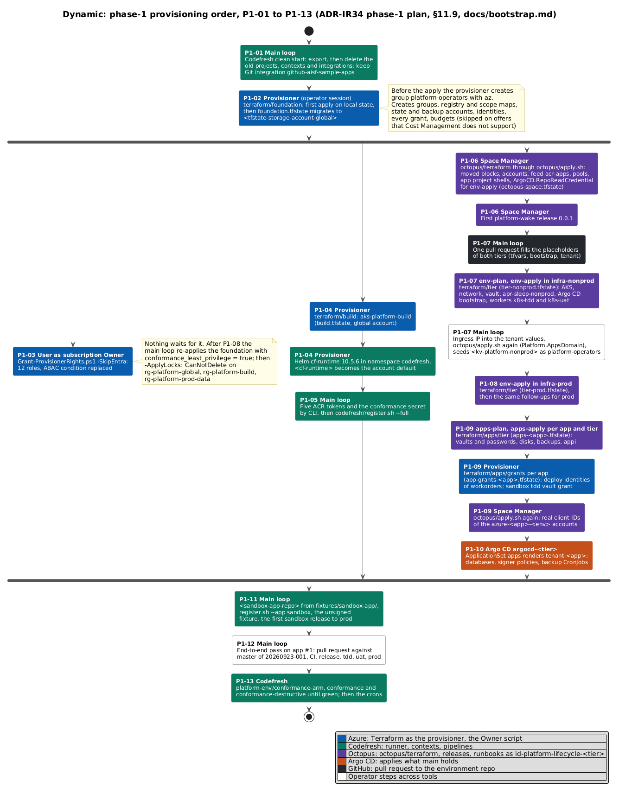

  *Dynamic, phase-1 provisioning from an empty subscription to a green conformance suite, steps P1-01 to P1-13, as docs/bootstrap.md runs them. The foundation comes first; then three branches run in parallel: the Owner re-run (nothing waits for it); the build cluster and the Codefresh objects; and the Octopus, tier and app layers. The last two join before the first sandbox release. Colour shows the acting tool, and each step names its owner.*

  | Step | Who | What | Proves or verifies |
  |---|---|---|---|
  | P1-01 | Main loop (Codefresh API) | Export, then delete, the dead runtime and agent, projects `codefresh-k8s-pipeline`, `codefresh-onion8-aks` and `default`, and the old contexts and integrations. Git integration `github-aisf-sample-apps` is kept, then replaced by the Codefresh GitHub App under the same name (ADR-IR35; owner-only). | — |
  | P1-02 | Main loop as the provisioner | `terraform/foundation`:<br>• registers `Microsoft.AlertsManagement`;<br>• creates the resource groups above, the registry and scope maps, and the state and backup accounts;<br>• creates the platform identities with their Octopus-issuer federated credentials, the app registration `sp-platform-conformance`, and group `platform-operators` with the user as member;<br>• creates every grant and three budgets (build and global, nonprod, prod), each filtered by resource-group name so that the AKS node groups count.<br>Bootstrap: local state, then migration to `<tfstate-storage-account-global>`. Until P1-03 is complete, the conformance principal holds AKS RBAC Cluster Admin on the cluster resource groups (interim). | V01: group ownership lets the provisioner add members (Q28) |
  | P1-03 | The user, as Owner, when available; then the main loop | The user re-runs `docs/owner/Grant-ProvisionerRights.ps1 -SkipEntra` with the changed role list (below), then `-ApplyLocks`. Once both app clusters exist, the main loop re-applies the foundation with `conformance_least_privilege = true`: cluster-scope reads, the namespace-scoped Writer, and Reader on the AKS node groups. Nothing else waits for this step. | V02: the ABAC condition was replaced and the three AKS roles assign; Q47 |
  | P1-04 | Main loop as the provisioner | `terraform/build`; Helm `cf-runtime` as the account default runtime | CAP-CF-001 to CAP-CF-003; V03: peak memory of app #1's release build on `Standard_D4as_v6` (fallback `Standard_D8as_v6`, +8 vCPU, Q40) |
  | P1-05 | Main loop | ACR tokens `cf-apps-release`, `cf-apps-preview`, `cf-platform-ci`, `cf-platform-pull` and `cf-platform-retention` (90 days) from the scope maps, and the `sp-platform-conformance` client secret, all by CLI, never in state. Then the Codefresh contexts and registry integrations (§7.0), and `codefresh/register.ps1 --full`. | V04: a token with `metadata/write` locks tags (Q6) |
  | P1-06 | Main loop (Space Manager key) | `octopus/terraform`: `moved` blocks and renames, the `Platform *` sets, accounts `azure-platform-lifecycle-{nonprod,prod}`, shells for `workorders` and `sandbox`, step templates, teams, the automation user in the approver teams, and the first `platform-wake` release | V05: step-scope IDs (Q26); V06: triggers for runbooks in Git (Q27); V07: the automation user answers interventions through the API (Q45) |
  | P1-07 | Octopus `env-apply` in `infra-nonprod` (lifecycle identity) | `terraform/tier` for nonprod. The operator seeds the platform vault: the interim repo credential (the stored PAT; R11), the gateway token and the registration key. | V08: the stop with Kyverno (Q37); V09: ephemeral OS disks through stop and start (Q39); V10: `JsonEscape` (Q21); CAP-AZ-005 |
  | P1-08 | Octopus `env-apply` in `infra-prod` | `terraform/tier` for prod | CAP-AZ-006, CAP-AZ-015 |
  | P1-09 | Octopus `apps-apply` per tier; the main loop as the provisioner for `terraform/apps/grants` | `workorders` and `sandbox`: vaults and passwords, disks, backup containers, App Insights; app #1's deploy identity; the conformance grant on the sandbox tdd vault | V11: static PVs bind the Terraform disks (Q38); CAP-KIT-003 |
  | P1-10 | Argo CD | Tenants and databases from `apps/*.yaml`; per-app image policies; `platform-backup` CronJobs | CAP-GIT-002, CAP-GIT-008; V12: `BACKUP TO URL` from the Linux container (Q42); V13: migrators trust `platform-internal-ca` (Q43) |
  | P1-11 | Main loop | Create `<sandbox-app-repo>` (R31) and seed it from `fixtures/sandbox-app/`; push the unsigned fixture; run the first sandbox release through prod | CAP-CF-004 to CAP-CF-009, CAP-OCT-001 to CAP-OCT-008 |
  | P1-12 | Main loop | End-to-end pass on app #1: a harmless change, pull request against `master` of `20260923-001` (never the upstream bootcamp repo), CI, merge, release, tdd, uat, prod; fix and repeat | CAP-KIT-009 |
  | P1-13 | Codefresh `platform-env/conformance*` | The full suite; fix until green; then enable the crons | Every capability |

  - *Implementation (2026-09-25),* as [docs/bootstrap.md](../docs/bootstrap.md) runs the steps:
    - P1-02: the provisioner creates group `platform-operators` and adds the user with `az` before the first apply; Terraform only takes its object ID (`platform_operators_group_object_id`). The budgets are skipped on the sponsored live subscription (§7.0 Budgets). Until P1-13 the provisioner also holds AKS RBAC Cluster Admin on the app cluster groups (`provisioner_app_cluster_admin`) and is a member of `platform-operators`, to seed the platform vaults.
    - P1-03: the least-privilege re-apply of the foundation deletes the interim assignment in `rg-platform-build`, which a `CanNotDelete` lock refuses, so `-ApplyLocks` runs after that re-apply.
    - P1-06: `ArgoCD.RepoReadCredential` must exist in `platform-infrastructure` before the first `env-apply`, because `terraform/tier` seeds the Argo CD repository credential from it once. `octopus/apply.ps1` runs `octopus/terraform` from a session that is also signed in to Azure.
    - Re-applies: `octopus/terraform` again after `env-apply` and after `terraform/apps/grants`, and `apps-apply` again after the grants (§7.10).

  - **Owner-script change** (`docs/owner/Grant-ProvisionerRights.ps1`; the user runs it once, with `-SkipEntra`, because the Graph grants exist):
    1. `$assignableRoles`:
       - drop `SQL DB Contributor`;
       - add `Azure Kubernetes Service Cluster User Role`, `Azure Kubernetes Service RBAC Reader` and `Azure Kubernetes Service RBAC Writer`;
       - that makes 12 roles.
    2. When the constrained assignment already exists, replace its condition if it differs. Today the script prints "condition not re-checked" and skips it.
    3. New switch `-ApplyLocks`: `CanNotDelete` on `rg-platform-global`, `rg-platform-build` and `rg-platform-prod-data`. Missing groups are skipped with a warning, so the switch can run after P1-02.
    4. Add `Microsoft.AlertsManagement` to the provider list. This is harmless, because the foundation registers it too.
    5. Update the texts: the layers are `terraform/foundation`, `terraform/build` and `terraform/apps/grants`, and the SQL mentions go.
    - Nothing else changes: the service-principal and group assignee rule, the delete rule and the Graph permissions. No per-tier RBAC Administrator is needed (decision 3).
  - **Exit criteria:**
    - every non-explicit test is green on five consecutive nightly runs (CAP-CF-005's live test may be Inconclusive until R33);
    - the destructive suite has passed once;
    - the end-to-end pass has delivered a change to prod;
    - both app clusters were Stopped for at least 90 % of the 19:00–07:00 hours;
    - month-to-date spend is within 1.2 times the §3.5 sleeping estimate.
- **Work packages, rename map and live-object migration:** §11.7–§11.10.
- **Cost:** §3.5.
  - Sleeping, per month:
    - 1 app: ≈$220;
    - 12 apps: ≈$810;
    - 36 apps: ≈$1,630;
    - 36 apps with two thirds of them frozen: ≈$900.
  - Always on: ≈$1,010, ≈$2,970 and ≈$4,210.
- **Risks.**
  1. **One build at a time** (BASIC_1). Class-scale builds queue behind each other and behind the nightly suite. Mitigations: the suite runs at night, and a plan with more concurrency is the user's call (R32).
  2. **The provisioner is the grant identity for every tier.** It is operator-run only. Its secret stays with the user, and it is attached to no pipeline or project.
  3. **The conformance principal** reads every platform group and writes only in the `sandbox-*` namespaces and the sandbox tdd vault. It is the second recorded cross-tier exception. Until P1-03 it is AKS RBAC Cluster Admin (interim).
  4. **Interim repo credential.** Argo CD reads the environment repo with the stored org PAT until the read-only GitHub App exists (R11). A cluster compromise would expose the PAT, as it would the gateway key.
  5. **sslip.io** is a third-party DNS service. An outage breaks host names but no data. Let's Encrypt limits one IP-derived domain to 50 certificates a week [VERIFY, Q48]. Each tier has its own IP, so nonprod, with two hosts per app, allows about 25 onboardings a week.
  6. **Capacity.** D-series nodes fit about 13 database apps besides the sandbox in nonprod. Growth needs R34.
  7. **In-pod databases.** RPO is 24 hours with no point-in-time restore, single-zone disks, and a brief outage when a node drains.
  8. **The Preview Argo CD step** may change behaviour at any Cloud upgrade. The nightly suite detects it, and the fallback writer is ready.
- **Consequences.**
  - The platform has three clusters, 13 platform resource groups, and one per app and tier when an app declares Azure services.
  - Onboarding is one pull request followed by:
    - `apps-apply` in both tiers;
    - `octopus/terraform`;
    - `register.ps1 --app`;
    - `terraform/apps/grants`, only for apps with Azure access.
  - A rebuilt cluster has a new OIDC issuer: `env-apply` recreates the platform federated credentials, and `apps-apply` those of app workload identities.
  - Azure SQL, private endpoints, PIM, Azure Policy assignments, `secret-writers` and the second runtime go away.
  - `workorders` is onboarded like every other app. The legacy cutover (P4) and decommission (P5) stay as planned.
  - *Implementation (2026-09-25):* an app with Azure access runs `apps-apply` and `octopus/terraform` twice: before `terraform/apps/grants`, when its deploy accounts carry a placeholder client ID and its workload identity is skipped, and again after it ([docs/onboarding.md](../docs/onboarding.md#7-apply)).
- **Dissent.**
  - The octopus-architect and sre-security memos preferred:
    - keyless wake through `id-platform-wake-<tier>`;
    - Owner-created groups;
    - per-app ESO and backup identities;
    - removal of the key from library sets.
  - The codefresh-engineer memo preferred per-app tokens and a manifest handoff.
  - §13 and the live facts decide for the simpler forms above. Each preferred form stays possible later without a rename.

## 3. Architecture

§3.1–§3.4 show app #1 on the single-app baseline. ADR-IR34 gives the multi-app layout (resource groups, three clusters, the build runner), and §3.5 its cost. The PlantUML pictures in this section show the current multi-app platform; the Mermaid diagrams keep the single-app baseline for reference.

### 3.0 The current platform in pictures (ADR-IR34)

**Level 2, containers.** The delivery platform splits into the environment repo, the Codefresh pipelines and their runner, the shared registry, the Octopus space, and one app cluster per tier in which Argo CD, the Octopus gateway and workers, the admission and secret add-ons, the apps and their databases run. Each line carries the verb of the tool that owns it.

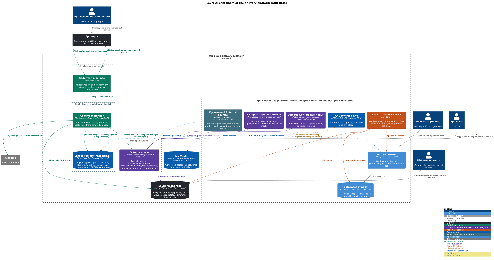

**Level 2, deployment on Azure.** The same containers placed in the subscription: the global and build resource groups, then one set of resource groups per tier, with the node pools of the three clusters. The one cross-tier read is prod's pull from the shared registry.

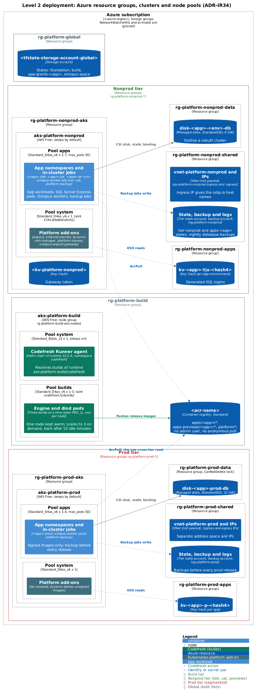

### 3.1 System context


*Current system context (ADR-IR34). The Mermaid diagram below is the single-app baseline: Azure SQL and two Codefresh runtimes have since left the design.*

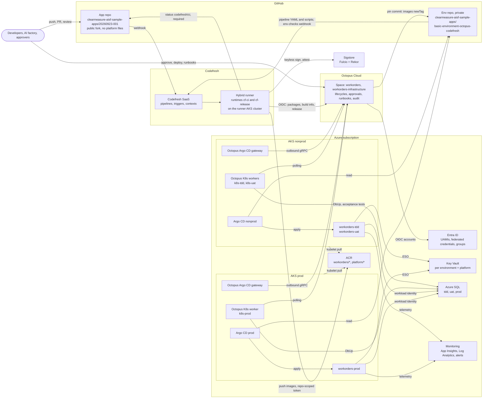
```mermaid
flowchart LR
    dev(["Developers, AI factory, approvers"])
    subgraph GH["GitHub"]
        appRepo["App repo<br/>clearmeasure-aisf-sample-apps/20260923-001<br/>public fork, no platform files"]
        envRepo["Env repo, private<br/>clearmeasure-aisf-sample-apps/<br/>basic-environment-octopus-codefresh"]
    end
    subgraph CF["Codefresh"]
        cfSaas["Codefresh SaaS<br/>pipelines, triggers, contexts"]
        cfRunner["Hybrid runner<br/>runtimes cf-ci and cf-release<br/>on the runner AKS cluster"]
    end
    subgraph OCT["Octopus Cloud"]
        octo["Space: workorders, workorders-infrastructure<br/>lifecycles, approvals, runbooks, audit"]
    end
    sig["Sigstore<br/>Fulcio + Rekor"]
    subgraph AZ["Azure subscription"]
        entra["Entra ID<br/>UAMIs, federated credentials, groups"]
        acr["ACR<br/>workorders/*, platform/*"]
        kv["Key Vault<br/>per environment + platform"]
        sql["Azure SQL<br/>tdd, uat, prod"]
        mon["Monitoring<br/>App Insights, Log Analytics, alerts"]
        subgraph NP["AKS nonprod"]
            argoNp["Argo CD nonprod"]
            gwNp["Octopus Argo CD gateway"]
            wkNp["Octopus K8s workers<br/>k8s-tdd, k8s-uat"]
            appNp["workorders-tdd<br/>workorders-uat"]
        end
        subgraph PR["AKS prod"]
            argoPr["Argo CD prod"]
            gwPr["Octopus Argo CD gateway"]
            wkPr["Octopus K8s worker<br/>k8s-prod"]
            appPr["workorders-prod"]
        end
    end
    dev -->|"push, PR, review"| appRepo
    dev -->|"approve, deploy, runbooks"| octo
    appRepo -->|"webhook"| cfSaas
    cfRunner -->|"status codefresh/ci, required"| appRepo
    cfSaas --> cfRunner
    cfRunner -->|"push images, repo-scoped token"| acr
    cfRunner -->|"keyless sign, attest"| sig
    cfRunner -->|"OIDC: packages, build info, release"| octo
    envRepo -->|"pipeline YAML and scripts; env-checks webhook"| cfSaas
    octo -->|"pin commit: images newTag"| envRepo
    argoNp -->|"read"| envRepo
    argoPr -->|"read"| envRepo
    argoNp -->|"apply"| appNp
    argoPr -->|"apply"| appPr
    gwNp -->|"outbound gRPC"| octo
    gwPr -->|"outbound gRPC"| octo
    wkNp -->|"polling"| octo
    wkPr -->|"polling"| octo
    wkNp -->|"DbUp, acceptance tests"| sql
    wkPr -->|"DbUp"| sql
    octo -->|"OIDC accounts"| entra
    appNp -->|"workload identity"| sql
    appPr -->|"workload identity"| sql
    appNp -->|"ESO"| kv
    appPr -->|"ESO"| kv
    appNp -->|"telemetry"| mon
    appPr -->|"telemetry"| mon
    NP -->|"kubelet pull"| acr
    PR -->|"kubelet pull"| acr
```

The legacy path runs beside this system until phase 5 (§9), unchanged, from the origin `ClearMeasureLabs/bootcamp-palermo-workorders`: `build.yml` → `deploy.yml` → the legacy Octopus space → Container Apps. In the copy `20260923-001` GitHub Actions is disabled (ADR-IR26).

### 3.2 End-to-end sequence: commit to production

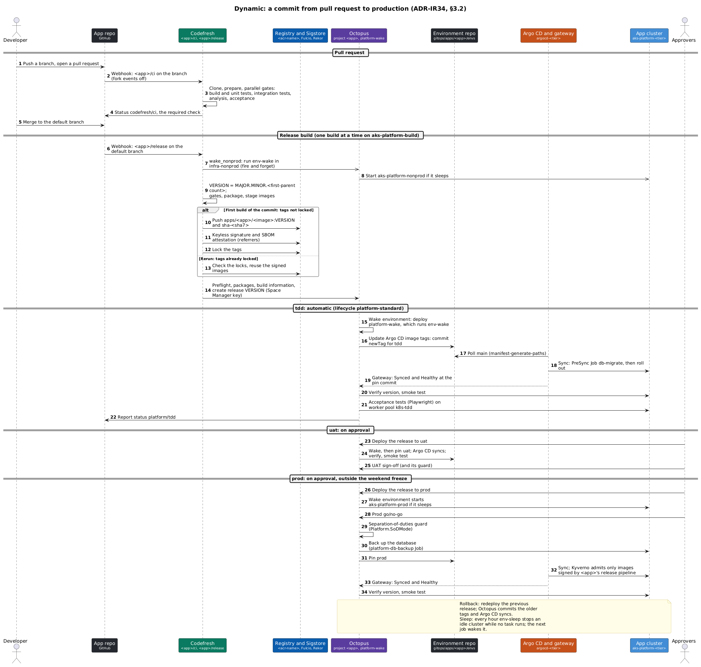

*Current flow (ADR-IR34). The release build runs on the platform's runner, reuses locked images on a rerun, and hands over to Octopus; every deployment wakes its cluster first, pins image tags only, and lets Argo CD migrate the database with a PreSync Job before the rollout. The Mermaid sequence and the handoff list below keep the single-app baseline, whose Octopus-run migrations and Azure SQL steps ADR-IR34 replaced.*

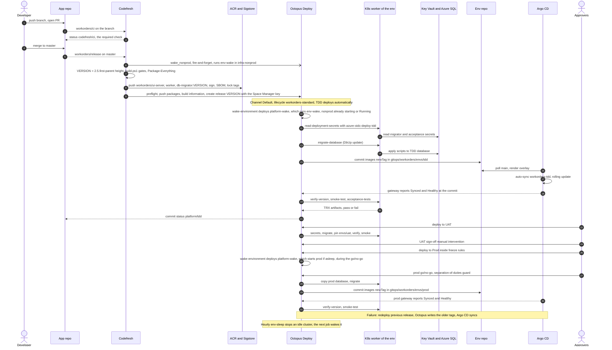
```mermaid
sequenceDiagram
    autonumber
    actor Dev as Developer
    participant GH as App repo
    participant CF as Codefresh
    participant ACR as ACR and Sigstore
    participant OCT as Octopus Deploy
    participant KW as K8s worker of the env
    participant KV as Key Vault and Azure SQL
    participant ENV as Env repo
    participant ARGO as Argo CD
    actor APR as Approvers
    Dev->>GH: push branch, open PR
    GH-->>CF: workorders/ci on the branch
    CF-->>GH: status codefresh/ci, the required check
    Dev->>GH: merge to master
    GH-->>CF: workorders/release on master
    CF-)OCT: wake_nonprod, fire-and-forget, runs env-wake in infra-nonprod
    CF->>CF: VERSION = 2.5.first-parent height, build.ps1 gates, Package-Everything
    CF->>ACR: push workorders/ui-server, worker, db-migrator:VERSION, sign, SBOM, lock tags
    CF->>OCT: preflight, push packages, build information, create release VERSION with the Space Manager key
    Note over OCT: Channel Default, lifecycle workorders-standard, TDD deploys automatically
    OCT->>OCT: wake-environment deploys platform-wake, which runs env-wake, nonprod already starting or Running
    OCT->>KW: read-deployment-secrets with azure-oidc-deploy-tdd
    KW->>KV: read migrator and acceptance secrets
    OCT->>KW: migrate-database (DbUp update)
    KW->>KV: apply scripts to TDD database
    OCT->>ENV: commit images newTag in gitops/workorders/envs/tdd
    ARGO->>ENV: poll main, render overlay
    ARGO->>ARGO: auto-sync workorders-tdd, rolling update
    ARGO-->>OCT: gateway reports Synced and Healthy at the commit
    OCT->>KW: verify-version, smoke-test, acceptance-tests
    KW-->>OCT: TRX artifacts, pass or fail
    OCT-->>GH: commit status platform/tdd
    APR->>OCT: deploy to UAT
    OCT->>KW: secrets, migrate, pin envs/uat, verify, smoke
    APR->>OCT: UAT sign-off manual intervention
    APR->>OCT: deploy to Prod inside freeze rules
    OCT->>OCT: wake-environment deploys platform-wake, which starts prod if asleep, during the go/no-go
    APR->>OCT: prod go/no-go, separation-of-duties guard
    OCT->>KW: copy prod database, migrate
    OCT->>ENV: commit images newTag in gitops/workorders/envs/prod
    ARGO-->>OCT: prod gateway reports Synced and Healthy
    OCT->>KW: verify-version, smoke-test
    Note over OCT,ARGO: Failure: redeploy previous release, Octopus writes the older tags, Argo CD syncs
    Note over OCT: Hourly env-sleep stops an idle cluster, the next job wakes it
```

Handoffs are listed below in order. §7 gives the exact names and arguments.

1. **Branch push.**
   - Codefresh `workorders/ci` runs the Linux gates and posts `codefresh/ci`, the required status of the app repo (ADR-IR26).
   - GitHub Actions stays disabled in the app repo.
2. **Merge to master.**
   - Codefresh `workorders/release` mints `VERSION`.
   - It re-runs the gates, then runs `Package-Everything`.
   - It stages `built/` from the `ChurchBulletin.UI.<VERSION>.nupkg`.
   - It builds three images, signs and attests them, and locks their tags.
   - An early step, `wake_nonprod`, runs in parallel with the gates: one fire-and-forget request that runs `env-wake` in `infra-nonprod` (ADR-IR33).
3. **Handoff to Octopus.**
   - Codefresh runs `octopus_preflight`, then `octopusdeploy-push-package`, `octopusdeploy-push-build-information` and `octopusdeploy-create-release`, with the Space Manager key from `workorders-octopus` (ADR-IR32; freestyle steps with a pinned CLI from phase 3, ADR-IR18).
   - Codefresh stops there; it never deploys or waits.
4. **TDD (automatic).** Octopus runs `wake-environment` → `read-deployment-secrets` → `migrate-database` → `update-argo-cd-image-tags` (healthy verification) → `verify-version` → `smoke-test` → `acceptance-tests` → `report-commit-status`.
5. **UAT (manual).**
   - The same steps without acceptance tests.
   - Then `uat-signoff`.
6. **Prod (manual, freeze-aware).** `wake-environment` → `prod-go-no-go` → `sod-guard` → `read-deployment-secrets` → `db-copy-pre-release` → `migrate-database` → `update-argo-cd-image-tags` → `verify-version` → `smoke-test`.
7. **Failure and rollback.**
   - A failed step fails the deployment.
   - Recovery is Octopus "redeploy previous release". Migration is a no-op, because the schema is forward-only; the older tags are committed; Argo CD syncs.
8. **Sleep (ADR-IR33).** Every hour, `env-sleep` stops a cluster that is outside working hours or has been idle for two hours, unless a task is running. The next job's `wake-environment` starts it again.

*Implementation (2026-09-25):* the handoff runs the Octopus CLI of `platform/ci-dotnet` as freestyle steps (`octopus_preflight`, `octopus_packages`, `octopus_build_info`, `octopus_release`) with context `platform-octopus`, and uploads only `ChurchBulletin.AcceptanceTests` as a package (§7.7). The deployment steps per environment are those of §7.2: no `migrate-database` or `db-copy-pre-release`; prod runs `pre-release-backup` before the pin.

### 3.3 Logical environment topology

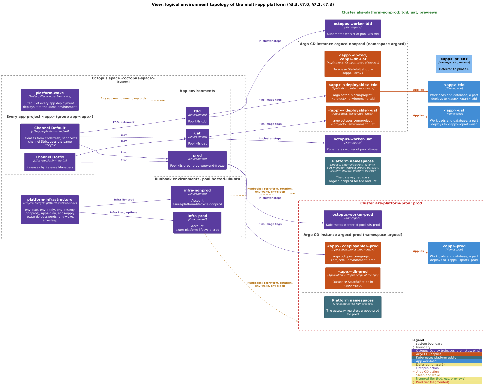

*Environment topology (ADR-IR34). Channels `Default` and `Hotfix` of every app project reach tdd, uat and prod through their lifecycles; `platform-wake` reaches any app environment; `platform-infrastructure` runs its runbooks in `infra-nonprod` and `infra-prod` against the two app clusters. Each environment pins the Applications `<app>-<deployable>-<env>` of its Argo CD instance (`argocd-nonprod` for tdd and uat, `argocd-prod` for prod); they apply to the namespaces `<app>-<env>`, and in-cluster steps run on the workers in `octopus-worker-<env>`.*

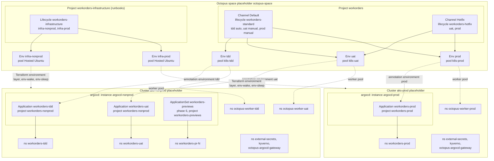
```mermaid
flowchart TB
    subgraph OSPACE["Octopus space placeholder octopus-space"]
        subgraph PWO["Project workorders"]
            chDef["Channel Default<br/>lifecycle workorders-standard<br/>tdd auto, uat manual, prod manual"]
            chHot["Channel Hotfix<br/>lifecycle workorders-hotfix<br/>uat, prod"]
        end
        subgraph PINF["Project workorders-infrastructure (runbooks)"]
            lcInf["Lifecycle workorders-infrastructure<br/>infra-nonprod, infra-prod"]
        end
        envTdd["Env tdd<br/>pool k8s-tdd"]
        envUat["Env uat<br/>pool k8s-uat"]
        envProd["Env prod<br/>pool k8s-prod"]
        envInp["Env infra-nonprod<br/>pool Hosted Ubuntu"]
        envIpr["Env infra-prod<br/>pool Hosted Ubuntu"]
    end
    subgraph CNP["Cluster aks-nonprod placeholder"]
        subgraph ANP["argocd: instance argocd-nonprod"]
            apTdd["Application workorders-tdd<br/>project workorders-nonprod"]
            apUat["Application workorders-uat<br/>project workorders-nonprod"]
            apSet["ApplicationSet workorders-previews<br/>phase 6, project workorders-previews"]
        end
        nsTdd["ns workorders-tdd"]
        nsUat["ns workorders-uat"]
        nsPr["ns workorders-pr-N"]
        nsWt["ns octopus-worker-tdd"]
        nsWu["ns octopus-worker-uat"]
        nsAddNp["ns external-secrets, kyverno,<br/>octopus-argocd-gateway"]
    end
    subgraph CPR["Cluster aks-prod placeholder"]
        subgraph APR["argocd: instance argocd-prod"]
            apProd["Application workorders-prod<br/>project workorders-prod"]
        end
        nsProd["ns workorders-prod"]
        nsWp["ns octopus-worker-prod"]
        nsAddPr["ns external-secrets, kyverno,<br/>octopus-argocd-gateway"]
    end
    chDef --> envTdd
    chDef --> envUat
    chDef --> envProd
    chHot --> envUat
    chHot --> envProd
    lcInf --> envInp
    lcInf --> envIpr
    envTdd -.->|"annotation environment tdd"| apTdd
    envUat -.->|"annotation environment uat"| apUat
    envProd -.->|"annotation environment prod"| apProd
    apTdd --> nsTdd
    apUat --> nsUat
    apSet --> nsPr
    apProd --> nsProd
    envTdd -.->|"worker pool"| nsWt
    envUat -.->|"worker pool"| nsWu
    envProd -.->|"worker pool"| nsWp
    envInp -.->|"Terraform environment layer, env-wake, env-sleep"| CNP
    envIpr -.->|"Terraform environment layer, env-wake, env-sleep"| CPR
```

The Codefresh runner cluster `<aks-cluster-context>` is outside this topology. It hosts runtimes `<cf-runtime-ci>` and `<cf-runtime-release>` and never runs workloads.

Both clusters sleep outside working hours and after two idle hours, and the first job wakes them (ADR-IR33). A sleeping cluster runs nothing shown here; its Octopus workers and Argo CD instance appear offline.

### 3.4 Running cost: always-on versus sleeping

**Baseline before ADR-IR34:** Azure SQL, private endpoints, and prod on the Standard tier. §3.5 supersedes it for the multi-app platform.

These are monthly estimates for the Azure resources of this design, at retail list prices for South Central US, the reference region (the design keeps `<azure-region>`). The amounts are [UNVERIFIED]; check them with the Azure pricing calculator.

**Assumptions**
- A month has 730 hours and 30.4 days.
- Node counts are the minimums, all `Standard_D4as_v6`: nonprod 2 (system 1, apps 1); prod 4 (system 2, apps 2). Each node above the minimum adds $0.271 an hour.
- **Sleeping.** Each cluster is awake about 3 hours per working day, about 66 hours a month.
  - The first job wakes a cluster; it sleeps after two idle hours or at 19:00, and all weekend.
  - Prod usually wakes less often than nonprod, so its sleeping figure is an upper estimate.
- **Not included.** Octopus and Codefresh licences, the Codefresh runner cluster (another subscription), Azure OpenAI usage, egress, and database copies (see the notes).

**Per cluster**

| Item | Unit price | Nonprod, always on | Nonprod, sleeping | Prod, always on | Prod, sleeping |
|---|---|---|---|---|---|
| Nodes, `Standard_D4as_v6` | $0.271 an hour (≈$198 a month) | 2 nodes: $396 | 66 h × 2: ≈$36 | 4 nodes: $792 | 66 h × 4: ≈$72 |
| AKS tier | Free; Standard ≈$0.10 an hour | $0 (Free) | $0 | ≈$73 (Standard) | ≈$7; ≈$73 if billed while stopped [VERIFY] |
| OS disks (P10 approximation) | ≈$19.70 a node-month | ≈$39 | ≈$4; ≈$39 if kept while stopped [VERIFY] | ≈$79 | ≈$7; ≈$79 if kept [VERIFY] |
| Load balancer and public IP | ≈$22 a cluster-month | ≈$22 | ≈$22 | ≈$22 | ≈$22 |
| Azure SQL, DTU (cannot pause) | Basic $0.161, S0 $0.484, S1 $0.968 a day | `tdd` Basic ≈$4.90 and `uat` S0 ≈$14.70: ≈$20 | ≈$20 | `prod` S1: ≈$29 | ≈$29 |
| Log Analytics and App Insights ingestion | $2.76 a GB | ≈$38 (≈14 GB) | ≈$5 | ≈$44 (≈16 GB) | ≈$5 |
| **Total a month** | | **≈$515** | **≈$90–$120, about $100** | **≈$1,040** | **≈$140; ≈$210 if the tier fee or the disks bill while stopped; ≈$280 if both** |

**Whole platform**

| Scope | Always on | Sleeping |
|---|---|---|
| Foundation: ACR Standard ($0.667 a day, ≈$20); private DNS zones, state storage and vault operations (≈$5) | ≈$25 | ≈$25 |
| Private endpoints: 8 at ≈$7.30 a month, plus data processed (SQL and Key Vault; 5 for nonprod, 3 for prod) | ≈$58 | ≈$58 |
| Nonprod cluster and its environments | ≈$515 | ≈$100 |
| Prod cluster and its environment | ≈$1,040 | ≈$140 |
| **Total a month** | **≈$1,640** | **≈$325, about 80 % less (range ≈$310–$485)** |

The private endpoints belong to each cluster's environment layer, but they bill the same awake or asleep, so they appear as a fixed line.

**Notes**
- **Awake hours drive the rest.** Each awake hour costs ≈$0.54 for nonprod and ≈$1.18 for prod. In a busy month, both clusters stay awake for the whole 07:00–19:00 window on every working day (≈264 hours): ≈$215 for nonprod and ≈$410 for prod.
- **OS disks.** `terraform/environment` sets no `os_disk_type`, so AKS may give the `Standard_D4as_v6` nodes ephemeral OS disks, which removes the disk line [VERIFY].
- **Database copies.** Copies made by `db-copy-pre-release` and `db-backup` inherit the source tier: ≈$0.97 a day each at S1 until deleted.
  - Two prod releases a week, with the 14-day expiry, keep about four copies alive: ≈$118 a month.
  - Deleting them needs the prod lock lifted.
  - A lower service objective for copies is an open lever (Q30).
- **Retention.** Long-term retention for the prod database, and log retention past the included period, add small storage charges [UNVERIFIED].
- **Budgets (R18).** Set one budget per resource group at about 1.2 times its sleeping estimate. A breach usually means a cluster did not sleep.

### 3.5 Multi-app cost (ADR-IR34)

These are monthly Azure estimates for the multi-app platform at retail list prices for South Central US. They are [UNVERIFIED]; check them with the Azure pricing calculator. "Apps" counts teaching apps; the `sandbox` fixture comes on top.

**Assumptions**
- **Node prices.** `Standard_D4as_v6` $0.271 an hour; `Standard_B2pls_v2` ≈$0.042 an hour (≈$30 a month); `Standard_E4ds_v5` ≈$0.345 an hour [UNVERIFIED], used only at 36 apps, after R34.
- **Tier and disks.** Every cluster is on the AKS Free tier. App nodes use 64 GiB managed OS disks, which bill while stopped (about $5–10 per node-month); `Standard_D4as_v6` is $0.217 an hour.
- **Awake hours a month** (work, plus about 40 nonprod and 11 prod conformance hours):
  - nonprod: 106, 216 and 304;
  - prod: 31, 77 and 143.
- **Awake nodes** (system plus apps):
  - 1 app: nonprod 1 + 1 and prod 1 + 1;
  - 12 apps: nonprod 1 + 7 and prod 1 + 4, all `Standard_D4as_v6`;
  - 36 apps: nonprod 1 + 8 and prod 1 + 4, with apps nodes on `Standard_E4ds_v5`.
- **Build hours** on the `builds` pool, one build at a time: about 24, 88 and 210.
- **Databases.** 2.75 GiB of requests per database app-environment. Database disks cost $3.60 per app: E2 in tdd and uat, E4 in prod.
- **Logs.** Log Analytics ingestion costs $2.76 per GB.

| Item | 1 app | 12 apps | 36 apps |
|---|---|---|---|
| Nonprod nodes while awake | 106 h × $0.54 ≈ $57 | 216 h × $2.17 ≈ $468 | 304 h × $3.03 ≈ $921 |
| Prod nodes while awake | 31 h × $0.54 ≈ $17 | 77 h × $1.36 ≈ $104 | 143 h × $1.65 ≈ $236 |
| Build cluster: `B2s` system node, OS disk, load balancer and IP (always on) | ≈$55 | ≈$55 | ≈$55 |
| Build nodes (`builds` pool, from zero) | ≈$7 | ≈$24 | ≈$57 |
| App clusters' load balancers and IPs (billed while stopped) | ≈$44 | ≈$44 | ≈$44 |
| Registry, Standard | ≈$20 | ≈$20 | ≈$20 |
| Database disks, sandbox included (billed while stopped) | ≈$7 | ≈$47 | ≈$133 |
| Storage: state, backups, vault operations | ≈$3 | ≈$5 | ≈$10 |
| Log Analytics and App Insights | ≈$8 | ≈$44 | ≈$152 |
| **Total a month, sleeping** | **≈$220** | **≈$810** | **≈$1,630** |
| Always on (app clusters awake 730 hours) | ≈$1,010 | ≈$2,970 | ≈$4,210 |

**Notes**
- **Conformance.** The nightly and weekly suites keep the app clusters awake about 40 hours (nonprod) and 11 hours (prod) a month: ≈$28, ≈$100 and ≈$140 of the totals above.
- **Frozen apps.** At 36 apps with two thirds of them frozen (replicas and databases at zero, disks kept), the sleeping total is about $900.
- **Against the single-app baseline** (§3.4: ≈$325 sleeping, ≈$1,640 always on):
  - removed: Azure SQL, the private endpoints and the prod Standard-tier fee;
  - added: the build cluster, ≈$62 with its build nodes at one app.
- **Quota.** 36 apps need R34; the vCPU budget is in ADR-IR34 (Clusters and capacity).
- **Licences** (yearly, [VERIFY], R7, R32):
  - Octopus: 4, 21 and 57 projects, which is ≈$420, ≈$2,180 and ≈$5,930 on Professional, plus the Cloud platform fee. The Free tier (10 projects) covers one app.
  - Codefresh: BASIC_1 as today; more runner concurrency is the user's decision.
- **Budgets.** `terraform/foundation` creates three budgets at about 1.2 times these sleeping figures (R18).

## 4. Responsibility matrix

Legend:
- **O** marks the owner. Every row has exactly one.
- **c** means the tool contributes.
- — means the tool must not act.

The "Azure platform" column covers Terraform-managed Azure resources and the in-cluster platform add-ons: ESO, Kyverno and the Gateway.

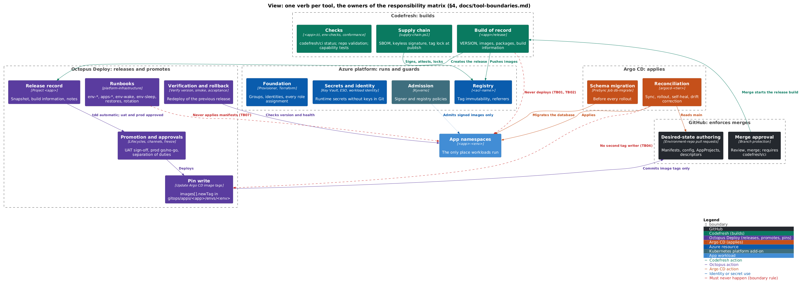

*The owners of the matrix below as one picture: GitHub enforces merges, Codefresh builds, Octopus releases, promotes and pins, Argo CD applies, and the Azure platform runs and guards. Red dashed lines are boundary rules of [docs/tool-boundaries.md](../docs/tool-boundaries.md).*

| Capability | GitHub | Codefresh | Octopus Deploy | Argo CD | Azure platform |
|---|---|---|---|---|---|
| Source control, review and merge approval | **O** | — | — | — | — |
| Required merge check of the app repo (`codefresh/ci`, ADR-IR26) | c (branch protection enforces it) | **O** | — | — | — |
| Legacy CI of the origin (ARM, Windows LocalDB; until P5) | **O** (GitHub Actions in the origin) | — | — | — | — |
| Build of record, version minting, image and package publication | — | **O** | c (built-in feed receives packages) | — | c (ACR stores images) |
| SBOM, signature and provenance | — | **O** | — | — | c (Kyverno verifies) |
| Environment-repo validation CI | — | **O** `platform-env/env-checks` | — | — | — |
| Registry and tag immutability | — | c (locks tags at publish) | — | — | **O** (ACR) |
| Release record (snapshot, build info, notes) | — | c (creates the release) | **O** | — | — |
| Environment promotion (lifecycles, channels, freezes) | — | — | **O** | — | — |
| Human approvals and separation of duties | c (PR review of configuration) | — | **O** | — | — |
| Environment pin write (`images[].newTag`) | — | — | **O** | — | — |
| Desired-state authoring (manifests, config, AppProjects) | **O** (env-repo PRs, CODEOWNERS) | — | — | — | — |
| Kubernetes reconciliation and drift correction | — | — | c (Live Object Status, drift view) | **O** | — |
| Workload rollout strategy | — | — | c (verifies health) | **O** | — |
| Admission policy | — | — | — | c (delivers policies) | **O** (Kyverno) |
| Schema migration (PreSync Job in the app namespace, ADR-IR34) | — | c (migrator image) | c (pins the migrator image, verifies health) | **O** | — |
| Schema and seed, previews (phase 6) | — | c (migrator image) | — | **O** | — |
| Post-deploy verification (version, smoke, TDD acceptance) | — | — | **O** | c (health) | — |
| Rollback | — | — | **O** (redeploy previous release) | c (syncs) | — |
| Day-2 runbooks (restore, password rotation, pre-release backup) | — | — | **O** | — | — |
| Scheduled database backups (`platform-backup` CronJobs, ADR-IR34) | — | — | — | c (applies them) | **O** |
| Environment sleep and wake (AKS stop and start, ADR-IR33) | — | c (early `wake_nonprod`) | **O** (`env-sleep`, `env-wake`, `platform-wake`, `wake-environment`) | — | c (AKS power state, `apr-sleep-<cluster>`) |
| Environment-layer IaC execution | — | c (credential-free checks) | **O** (runbooks) | — | c (Terraform code) |
| Privileged foundation (resource groups, identities, every role assignment; locks through the Owner script) | — | — | — | — | **O** (the provisioner in operator sessions, ADR-IR34; an Owner re-runs the script for the role list and locks) |
| Runtime secrets (Key Vault → ESO → Secret) | — | — | — | c (applies `ExternalSecret`) | **O** |
| Workload identity to Azure | — | — | — | — | **O** |
| PR preview environments (phase 6) | c (label) | c (preview images) | — | **O** | — |
| Telemetry and SLO alerts | — | — | — | — | **O** (App Insights, Log Analytics) |
| Deployment audit trail and DORA metrics | — | c (build history) | **O** | c (sync history) | — |
| Build compute (runner cluster `aks-platform-build`, builds from zero; ADR-IR34) | — | **O** (runtime `<cf-runtime>`) | — | — | c (the cluster) |
| App onboarding (descriptor to tenant, projects, pipelines, Azure objects; ADR-IR34) | **O** (the descriptor pull request) | c (`register.ps1 --app`) | c (project shells, `apps-apply`) | c (tenant chart) | c (`terraform/apps`) |
| Capability conformance (catalogue and .NET harness; ADR-IR34) | c (fixture repo, results branch) | **O** (`platform-env/conformance*`) | c (testability hooks) | c (status) | c (read-only identity) |

## 5. Identities, secrets and trust boundaries

As implemented (2026-09-25), with the names of ADR-IR34. §7.0 Identities lists every Azure identity with its grants; §5.2 adds the people, tokens and keys around them.

### 5.1 Trust boundaries

| # | Crossing | Credential | Controls |
|---|---|---|---|
| TB1 | App repos (`20260923-001`, `<sandbox-app-repo>`) → Codefresh SaaS | Git integration `github-aisf-sample-apps`, the Codefresh GitHub App (read, trigger, commit status; no PAT, ADR-IR35) | Push triggers fire only for same-repo branches; fork events are off. Pipeline YAML and scripts come from `main` of the environment repo (ADR-D18). Branch code never receives release contexts. |
| TB2 | Codefresh SaaS → runner cluster | Runner registration (Codefresh API key in Secret `codefresh-token` of namespace `codefresh`) | One runtime, `<cf-runtime>`, on `aks-platform-build`. The cluster holds no Azure role assignment outside its node group, and pipelines get no cloud identity (CAP-CF-012). |
| TB3 | Runner → ACR | Repository-scoped ACR tokens (registry integrations; `cf-apps-release` also in context `platform-registry`, `cf-platform-retention` in `platform-registry-retention`) | Push is scoped to `apps/*`, `apps-previews/*` or `platform/*`; step images are pulled with a pull-only token and pinned by digest (ADR-IR19). Tokens expire in 90 days or less. Release tags are locked. |
| TB4 | Runner → Sigstore | Codefresh OIDC (audience `sigstore`) | The signer identity is the Fulcio SAN of the app's own release pipeline (`<app>/release` or `release-<x>`), which the tenant chart's signer policy requires. |
| TB5 | Codefresh → Octopus | Space Manager API key of `AISF-Service-Account` in secret context `platform-octopus` (ADR-IR32) | Attached to every app's release pipelines and to the conformance pipelines, all with YAML from `main`; the tool-boundary rule TB14 bans the key elsewhere. The key could deploy anywhere in the space; `platform-sod-guard` lets the automation user answer an intervention only in intervention test mode, with a run reason. Rotated every 90 days. |
| TB6 | Octopus → env repo | Stored Git credential `GitHub clearmeasure-aisf-sample-apps`, restricted to this repo (R3) | Direct pushes to `main` are limited to the pin files; config-as-code edits go to branches (the four Git conversions of 2026-09-24 committed to `main`, §6.1). Also: ruleset bypass by team, push ruleset on `.octopus/**`, the bot-path audit (CAP-OCT-012), drift detection. |
| TB7 | Env repo → Argo CD | The stored org PAT (interim, until R11), then a read-only GitHub App | Read from `<kv-platform-<tier>>` through ESO; `terraform/tier` seeds the first copy from `ArgoCD.RepoReadCredential` (ADR-IR15). |
| TB8 | Argo CD → cluster API | Argo CD controller | AppProject destination and kind allow-lists (`platform-addons`, `platform-tenants`, `app-<app>`). Impersonation is Deferred to phase-4 hardening (beta). |
| TB9 | Pods → Azure | Workload identity: the tier identities of ESO, Kyverno and the backup Jobs; `id-<app>-<env>-app` only when a descriptor declares it | Exact-subject federated credentials. App databases use SQL logins. No secrets in pods except ESO-synced ones. |
| TB10 | Gateway → Octopus | Outbound gRPC; registration token (ESO) | Argo CD account `octopus` is read-only (`applications get` and `logs get` on `app-*/*`, `clusters get`). |
| TB11 | Octopus workers → Octopus, databases, Key Vault | Worker polling certificate; Octopus Azure OIDC accounts | One shared pool per environment (`k8s-<env>`). A worker can modify only its own namespace, and reaches an app database only when the descriptor sets `database.octopusWorkerAccess`. |
| TB12 | Octopus → Azure | OIDC accounts `azure-platform-lifecycle-<tier>` and the optional `azure-<app>-<env>` | Each account is restricted to its environment. Subjects are exact (space, project, environment). |
| TB13 | Runbooks → subscription | `azure-platform-lifecycle-<tier>` → `id-platform-lifecycle-<tier>`, Contributor on its own tier's groups only; the provisioner is operator-run only | Plan, then a manual intervention, then apply; the plan check fails on a role assignment, lock or resource group. Owner locks (`-ApplyLocks`). No prod destroy. |
| TB14 | Octopus → app repo (commit statuses) | Statuses-only GitHub App (ADR-IR27) | One-hour installation token narrowed to `20260923-001` and `statuses: write`; the private key is an Octopus sensitive variable. Off until the owner stores the key and enables it (R16, `GitHub.StatusEnabled`). |
| TB15 | Conformance pipelines → Octopus, Azure, clusters, GitHub | The Space Manager key, `sp-platform-conformance` and the org PAT (contexts `platform-octopus`, `platform-conformance`; the org PAT no longer serves Codefresh clones, which use the Git integration App, ADR-IR35) | Run only from `main` of the environment repo, on `<cf-runtime>`. The conformance principal writes only in the `sandbox-*` namespaces and the sandbox tdd vault. |

### 5.2 Identity inventory

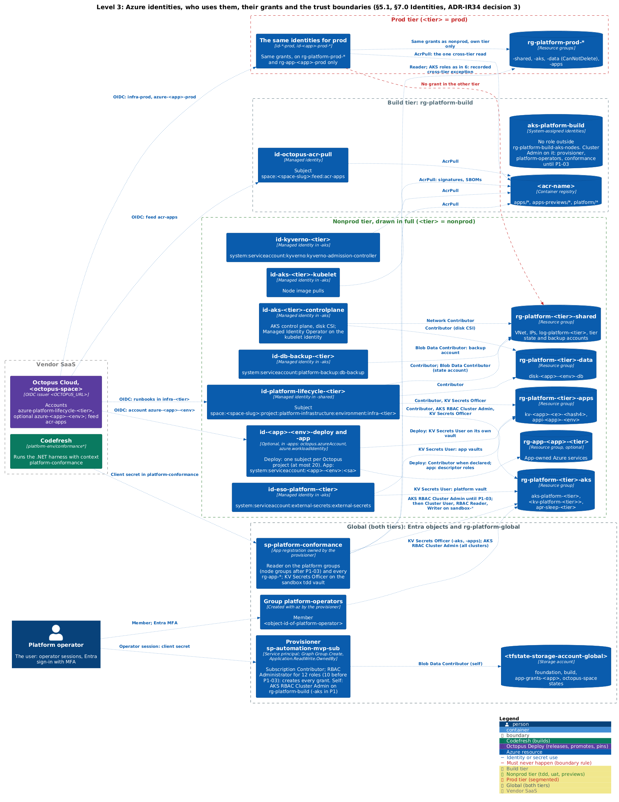

*Level 3, Azure identities in three columns: who uses each (the operator, Octopus Cloud over OIDC, Codefresh with the conformance secret), the identity, and the scope of each grant. Nonprod is drawn in full; prod holds the same identities on its own groups, and no tier identity holds a grant in the other tier. The only cross-tier reads are AcrPull on the shared registry and the recorded exception for `sp-platform-conformance`. The provisioner creates every grant.*

| Identity | Kind | Used by | Permissions | Credential location | Recommended end state |
|---|---|---|---|---|---|
| Azure Owner | Human | The Owner script `docs/owner/Grant-ProvisionerRights.ps1` (R6, done; the P1-03 re-run with `-SkipEntra`, then `-ApplyLocks` for the `CanNotDelete` locks) | Owner on the subscription | Entra MFA | Unchanged; no PIM (ADR-IR34 decision 25) |
| Entra administrator | Human | Admin consent for the provisioner's Graph permissions (R6, done) | Privileged Role Administrator for the consent | Entra MFA | Unchanged |
| Platform engineer | Human | `octopus/apply.ps1`; sensitive Octopus variables; the approvals of `env-apply`, `env-destroy`, `apps-apply` and `db-restore` | Space Manager in `<octopus-space>` (team `Platform Engineers`) | Octopus SSO | Unchanged |
| `platform-operators` | Entra group; member the user (and the provisioner from P1-07 until P1-13) | Seeding and rotating vault secrets; cluster operation | §7.0 Identities | Entra MFA | Unchanged |
| **Provisioner `sp-automation-mvp-sub`** (stored by the user) | Service principal with a client secret | Operator sessions only: `terraform/foundation`, `terraform/build`, `terraform/apps/grants`, the ACR token passwords, group `platform-operators` | §7.0 Identities | Held by the user. Stored copies used by nothing: Octopus account `Azure Runtime Provisioner` and variable set `Azure Runtime Provisioning`; Codefresh context `azure-runtime-provisioner` | Stays the only grant identity (ADR-IR34 decision 3); the stored copies go (§5.3) |
| `sp-platform-conformance` | App registration with a client secret (90 days) | The .NET harness in the conformance pipelines | §7.0 Identities | Codefresh context `platform-conformance` | Unchanged |
| **GitHub fine-grained PAT, org `clearmeasure-aisf-sample-apps`** (stored by the user) | Token | Octopus config-as-code and pin commits; the harness (`GITHUB_TOKEN`); (Codefresh triggers, clones and statuses moved to the Git integration GitHub App, ADR-IR35); Argo CD's interim repository credential (R11) | Contents read/write on the org's repositories; the Octopus Git credential that holds it is restricted to the environment repo (R3) | Octopus Git credential `GitHub clearmeasure-aisf-sample-apps`; Octopus variable set `GitHub AISF Sample Apps`; Codefresh contexts `github-aisf-sample-apps-token` and `platform-conformance`; `argocd-repo-read-credential` in `<kv-platform-<tier>>` and `ArgoCD.RepoReadCredential` | GitHub App or machine user limited to this repo; 90-day expiry. The variable set and the context `github-aisf-sample-apps-token` are used by nothing. |
| **`AISF-Service-Account`** (existing user, stored key; ADR-IR32) | Octopus user with an API key | Codefresh release pipelines of every app and the conformance pipelines; `wake_nonprod`; Argo CD gateway registration; `run-env-wake` of `platform-wake`; the REST-calling steps of `platform-infrastructure`; never an app project (ADR-IR33, S5) | Space Manager of the space; member of `CI Release Publishers`, `UAT Approvers`, `Prod Approvers` and `Platform Engineers` | Codefresh secret context `platform-octopus` (`OCTOPUS_API_KEY`); `octopus-gateway-registration-token` in `<kv-platform-<tier>>`; library set `Platform Automation` (`PlatformWake.OctopusApiKey`); the step-scoped `Platform.OctopusApiKey` of `platform-infrastructure` | Dedicated service accounts with OIDC and a separate gateway token (ADR-IR32 path back); until then, rotation every 90 days |
| `azure-platform-lifecycle-<tier>` → `id-platform-lifecycle-<tier>` | Octopus Azure OIDC account | `platform-infrastructure` runbooks in `infra-<tier>` | §7.0 Identities | None (federated subject `space:<space-slug>:project:platform-infrastructure:environment:infra-<tier>`) | Unchanged |
| `azure-<app>-<env>` → `id-<app>-<env>-deploy` (optional) | Octopus Azure OIDC account | The app's steps that need Azure (app #1: `read-deployment-secrets` in tdd) | §7.0 Identities | None (one federated subject per Octopus project of the app) | Unchanged |
| ACR feed identity `id-octopus-acr-pull` | Octopus feed OIDC | Feed `acr-apps` | AcrPull on the registry | None (subject `space:<space-slug>:feed:acr-apps` [VERIFY format]) | Unchanged |
| ACR tokens `cf-apps-release`, `cf-apps-preview`, `cf-platform-ci` | Repository-scoped tokens | Codefresh registry integrations `acr-apps-release`, `acr-apps-preview`, `acr-platform-ci` | Content and metadata read and write (tag lock [VERIFY]), no delete, on `apps/*`, `apps-previews/*` and `platform/*` respectively | Codefresh registry integrations (encrypted); `cf-apps-release` also in the secret context `platform-registry` (ADR-IR10) | Runner workload identity, if proven |
| ACR token `cf-platform-pull` | Repository-scoped token, pull only | Codefresh registry integration `acr-platform-pull` (step images of every pipeline; ADR-IR19) | Content and metadata read on `platform/*` | Codefresh registry integration | Unchanged |
| ACR token `cf-platform-retention` | Repository-scoped token | `platform-env/registry-retention` | Content read and delete, metadata read and write, on `apps/*` and `apps-previews/*` | Codefresh context `platform-registry-retention` | Unchanged |
| Codefresh keyless signer | OIDC | `<app>/release`, `<app>/preview`, `platform-env/ci-image-dotnet` | Obtains Fulcio certificates | None | Unchanged |
| Codefresh context `app-workorders-ci` (optional) | Encrypted context | `workorders/ci`, `workorders/release` | A CI-only, low-budget OpenAI key for app #1's LLM tests. The CI database's `sa` password is minted per build and masked, in no context. | Codefresh | Unchanged |
| Tier identities `id-aks-<tier>-controlplane`, `id-aks-<tier>-kubelet`, `id-eso-platform-<tier>`, `id-kyverno-<tier>`, `id-db-backup-<tier>` | UAMIs | AKS, ESO, Kyverno, the backup and restore Jobs | §7.0 Identities | None (workload federated credentials, §7.8) | Unchanged |
| `id-<app>-<env>-app` (optional) | UAMI (workload identity) | The app's pods | Descriptor-declared roles on `rg-app-<app>-<tier>` | None | Unchanged |
| Argo CD repo reader | The stored PAT until R11, then a GitHub App (contents: read) on the environment repo only | Argo CD | Read the environment repo | `argocd-repo-read-credential` in `<kv-platform-<tier>>` → ESO; bootstrap copy in the Octopus sensitive variable `ArgoCD.RepoReadCredential`, passed as `TF_VAR_argocd_repo_read_credential` (ADR-IR15) | GitHub App |
| Argo CD account `octopus` | Argo CD API token | Gateway | `applications get`, `logs get` on `app-*/*`; `clusters get` | `argocd-octopus-gateway-token` in the platform vault | Rotate every 90 days |
| Argo CD SSO | Entra app registration `<argocd-sso-app>` | People signing in to Argo CD | Group claims | Workload-identity federation preferred; fallback `argocd-sso-client-secret` in the platform vault | Federation only |
| Octopus worker registration | Bearer token | `env-apply` (one time per install) | Registers a worker in `k8s-<env>` | Prompted sensitive variable `Octopus.WorkerRegistrationToken` of `platform-infrastructure`, passed as `TF_VAR_octopus_worker_registration_token`; write-only, never in plan or state | Short-lived; regenerate per install |
| SQL logins `sa`, `<app>_migrator`, `<app>_app` | Database logins with passwords | The database pod, `db-init` and the backup Jobs (`sa`); the PreSync Job `db-migrate` (`<app>_migrator`, `db_owner`); the app (`<app>_app`, the descriptor's roles plus `EXECUTE`; app #1 also `db_ddladmin`) | Their database only | `db-sa-password`, `db-migrator-password`, `db-app-password` in `kv-<app>-<e>-<hash4>`, generated by `apps-apply` | `rotate-db-passwords` rotates all three, `sa` last |
| Azure OpenAI key (app #1) | API key | ui-server, worker, acceptance tests | Model calls | `ai-openai-apikey` in the app vault → ESO | Keyless (`Azure.Identity` is a new package; needs approval) |
| API validation key (app #1) | Shared key | ui-server | API-key middleware | `api-validation-key` in the app vault | Unchanged |
| GitHub status writer for `platform/tdd` | Statuses-only GitHub App (`Commit statuses: write`), installed on `20260923-001` only (R16, ADR-IR27) | `report-commit-status` | Commit statuses on `clearmeasure-aisf-sample-apps/20260923-001` | Octopus sensitive variable `GitHub.StatusAppPrivateKey`; app and installation IDs in `.octopus/apps/workorders/workorders/variables.ocl` | Unchanged |
| Legacy: `OCTO_API_KEY`, `AZURE_CREDENTIALS`, legacy `AzureAccount` | Keys and secrets | The legacy path | Unchanged | GitHub secrets; legacy Octopus space | Deleted at decommission (phase 5) |

### 5.3 Rules for the stored credentials (the user's choice, respected)

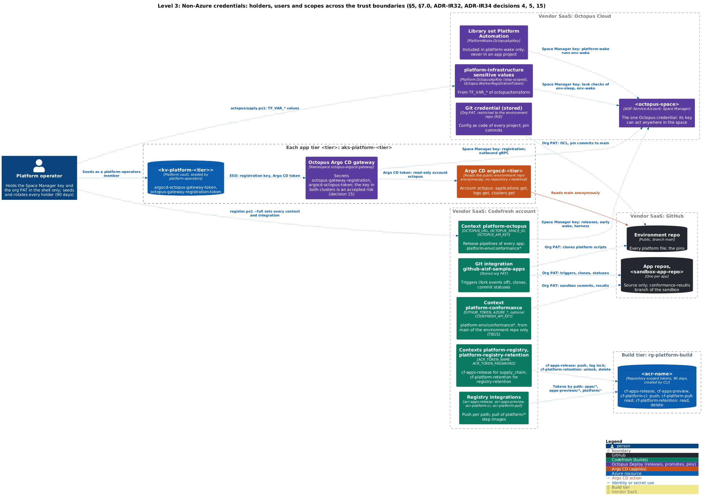

*Level 3, the credentials outside Azure: where each is held and what it reaches. One Space Manager key sits in the Codefresh context `platform-octopus`, in the library set `Platform Automation`, in the step-scoped `Platform.OctopusApiKey`, and in both gateways through the platform vault. One org PAT backs the Octopus Git credential, the Codefresh Git integration, the `platform-conformance` context and the interim Argo CD repository credential (until R11). The Codefresh Git integration moves to a GitHub App (ADR-IR35); the diagram is re-rendered when PlantUML is available. Five repository-scoped ACR tokens live only in Codefresh integrations and contexts.*

| Stored object | Design use | Recommendation |
|---|---|---|
| Octopus account `Azure Runtime Provisioner` | Used by nothing: `Azure.LifecycleAccount` names `azure-platform-lifecycle-<tier>` in both infra environments (ADR-IR34 decision 3) | Restricted to `infra-nonprod` and attached to no project (R4, applied 2026-09-24). Retire it at the phase-2 exit (ADR-C10). |
| Octopus variable set `Azure Runtime Provisioning` | Not included in any project; `octopus/terraform` fails a plan that includes it | Scope its account variable to `infra-nonprod` (open, R4). |
| Codefresh context `azure-runtime-provisioner` | Attached to no pipeline | `register.ps1 --full --prune` deletes it once the first release has gone through `platform-octopus`. |
| Octopus Git credential `GitHub clearmeasure-aisf-sample-apps` | Config as code for the four projects (`workorders`, `sandbox`, `platform-infrastructure`, `platform-wake`); pin commits | Restricted to `https://github.com/clearmeasure-aisf-sample-apps/basic-environment-octopus-codefresh`, with and without `.git` (R3, applied 2026-09-24); a check in `octopus/terraform` reports it otherwise. Still open: back it with a machine user in team `platform-bots`, or a GitHub App, with a 90-day expiry. |
| Octopus variable set `GitHub AISF Sample Apps` | Not included in any project | Keep it for other sample apps, or delete it. |
| Codefresh Git integration `github-aisf-sample-apps` | Triggers, clones, `specTemplate` loads and commit statuses for every pipeline, in the app repos and the environment repo (directive F) | Keep the name; the integration is the Codefresh GitHub App (ADR-IR35), created by the owner and only verified by `register.ps1`. The App installation must cover the environment repo and `20260923-001` (webhooks, statuses: [VERIFY]). |
| Codefresh context `github-aisf-sample-apps-token` | Attached to no pipeline | Delete it after phase 2. |

### 5.4 The role-assignment gap

Contributor cannot create role assignments, locks or policy assignments (E36). Every grant in §5.2 is therefore created in `terraform/foundation`, at resource-group scope where possible, so that resources created later inherit it. Federated credentials on UAMIs are ARM writes that Contributor can make (R1-P R39), so:
- The environment layer creates the workload federated credentials after each cluster exists.
- The foundation creates the Octopus-issuer federated credentials in advance.

A grant that must reach a resource created later (Key Vault, SQL server, AKS) is assigned at the resource-group scope in advance. Assignments go directly to managed identities, not through groups, because group membership for managed identities lags (R1-SRE §3). The one exception is the SQL Entra admin group.

Since R6, the provisioner creates these grants under the constrained Role Based Access Control Administrator role. The locks, the policy assignments and the PIM-eligible assignments still need an Owner or User Access Administrator (E52).

*Implementation (2026-09-25):* the grants come from `terraform/foundation` and, per app, `terraform/apps/grants`, both applied by the provisioner. `terraform/tier` creates the workload federated credentials of the platform identities, and `terraform/apps/tier` those of app workload identities. The one group is `platform-operators`, whose member is the user; Azure SQL, the policy assignments and PIM are gone (ADR-IR34 decision 25), and only the `CanNotDelete` locks still need an Owner (`-ApplyLocks`).

## 6. Repository layouts

### 6.1 Environment repo: full tree and writers

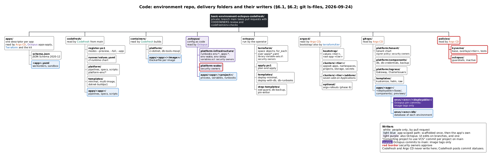

*Code level, environment repo (a): the delivery folders the tools read. People write by pull request; Octopus commits only image tags under `gitops/apps/<app>/envs/<env>/<deployable>/` (purple); in `.octopus/`, UI edits happen on branches with one conversion commit per project (light purple); red borders need security-owner approval; light blue marks app-scoped paths (CAP-KIT-004); each folder names its reader.*

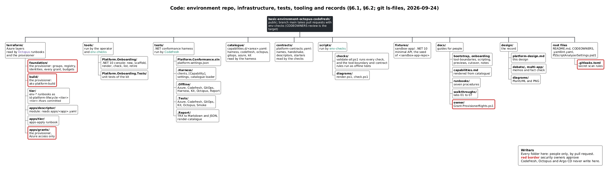

*Code level, environment repo (b): the Terraform layers, the onboarding tool, the .NET conformance harness, the catalogue, contracts and checks, the sandbox fixture, the docs and the design record, all written by pull request; red borders need security-owner approval.*

Writers:
- **H**: people, through a pull request with CODEOWNERS review, merged to `main`.
- **O-pin**: Octopus, using the stored Git credential with a direct commit to `main`. It may change only `images[].newTag`, or the Helm image values named by `argo.octopus.com/image-replace-paths`.
- **O-branch**: Octopus UI edits of config-as-code, committed to non-`main` branches and merged by H. The one exception is the conversion of a project to Git: Octopus then commits its serialization to `main` itself, once per project (the four conversions of 2026-09-24, by `AISF-Service-Account`; [docs/preview-octopus.md](../docs/preview-octopus.md), "C1").

Readers:
- **R-argo**: Argo CD.
- **R-cf**: Codefresh. Every pipeline loads its YAML and scripts from `main`; `env-checks` and the conformance pipelines also read the tree.
- **R-oct**: Octopus.
- **R-tf**: the tier Terraform, which reads the Argo CD bootstrap values.

```text
basic-environment-octopus-codefresh/                       private; default branch main (as implemented, ADR-IR34)
├── README.md, CODEOWNERS, .gitleaks.toml, .yamllint.yaml, PSScriptAnalyzerSettings.psd1   H
├── apps/                                                  H      R-argo (ApplicationSet apps), R-oct (apps-*), octopus/terraform, the kit
│   ├── schema.json                                        JSON Schema 2020-12
│   ├── workorders.yaml                                    app #1
│   └── sandbox.yaml                                       conformance fixture app
├── catalogue/                                             H      capability catalogue (ADR-IR34)
│   └── capabilities.d/{harness,codefresh,octopus,gitops,azure,kit}.yaml   one fragment per role; harness.yaml is the seed
├── contracts/platform-contracts.yaml                      H      platform names and the handshake
├── design/                                                H
│   ├── platform-design.md, architecture-views.md          this document; its pictures, top-down
│   ├── diagrams/{*.puml,*.png,README.md}                  C4-PlantUML sources and rendered pictures
│   ├── debate/round-{1,2}-<role>.md                       debate record
│   └── multi-app/{memo-<role>,verification}.md            multi-app memos and fact check
├── docs/                                                  H
│   ├── capabilities.md                                    rendered from catalogue/, never edited by hand
│   ├── bootstrap.md  onboarding.md  tool-boundaries.md  scripting.md  preview-octopus.md  preview-codefresh.md
│   ├── cutover-and-decommission.md  consistency-notes.md
│   ├── walkthroughs/0{1..7}-*.md                          app-neutral; workorders is the example
│   ├── owner/Grant-ProvisionerRights.ps1                  Owner re-run: role list, locks (ADR-IR34)
│   └── runbooks/{break-glass,rollback-and-forward-fix,database-backup-and-restore,credential-rotation,slo-fast-burn,sleep-and-wake,conformance}.md
├── scripts/                                               H      R-cf
│   ├── checks/validate-all.ps1                            every check by sub-command; env-checks runs it (docs/scripting.md)
│   └── diagrams/{render,check,diagram-hash}.ps1           render and check design/diagrams
├── tools/                                                 H
│   ├── Platform.Onboarding/                               .NET 10 console: new, scaffold, render, check, list, retire
│   ├── Platform.Onboarding.Tests/                         the tool's tests, outside tests/Platform.Conformance.sln
│   └── global.json, Directory.Build.props
├── tests/                                                 H      .NET conformance harness (net10.0, NUnit, Shouldly)
│   ├── Platform.Conformance.sln, platform.settings.json, global.json, Directory.{Build,Packages}.props
│   ├── Platform.Conformance.Harness/                      clients, [Capability], catalogue loader, settings, polling, cleanup
│   ├── Platform.Conformance.Offline/{Codefresh,Octopus,GitOps,Azure,Kit,Harness,Report,Support}/, CatalogueConsistencyTests.cs
│   ├── Platform.Conformance.Tests/{Codefresh,Octopus,GitOps,Azure,Kit,Smoke}/
│   └── Platform.Conformance.Report/                       TRX to Markdown and JSON; render-catalogue
├── fixtures/sandbox-app/                                  H      source seeded into <sandbox-app-repo>
├── codefresh/                                             H      R-cf
│   ├── register.ps1                                       --preview, --full, --app <app>; --dry-run, --prune, --recreate-missing-hooks
│   ├── runner/values.yaml                                 cf-runtime values for aks-platform-build
│   ├── platform/integrations.yaml                         platform contexts and registry integrations, declared without values
│   ├── platform/{pipelines,specs}/{env-checks,ci-image-dotnet,conformance-arm,conformance,conformance-destructive,registry-retention,fixtures}.yml
│   ├── platform/scripts/                                  conformance runs, runbook runs, AKS power state, registry retention
│   ├── templates/{minimal,multi-image,dotnet-buildps1}/   starters: scaffold, then own
│   └── apps/<app>/{pipelines,specs,scripts}/, integrations.yaml, version.env   workorders, sandbox
├── containers/                                            H      R-cf
│   ├── platform/{ci-dotnet,db-tools-mssql}/Dockerfile
│   └── apps/{workorders/{worker,db-migrator},sandbox/{web,migrator,unsigned}}/   Dockerfile; migrators add migrate.sh
├── .octopus/                                              H, O-branch     R-oct
│   ├── platform-infrastructure/{schema_version,deployment_settings,deployment_process,variables}.ocl
│   ├── platform-infrastructure/runbooks/{env-plan,env-apply,env-destroy,apps-plan,apps-apply,rotate-db-passwords,env-wake,env-sleep}.ocl
│   ├── platform-wake/{schema_version,deployment_settings,deployment_process,variables}.ocl
│   └── apps/<app>/<project>/{…}.ocl, runbooks/*.ocl       workorders/workorders, sandbox/sandbox
├── octopus/                                               H
│   ├── apply.ps1                                          plans and applies octopus/terraform (docs/preview-octopus.md)
│   ├── terraform/*.tf, terraform.tfvars.example           space objects; for_each over apps/*.yaml; applied by a Space Manager
│   ├── templates/{deploy-minimal,deploy-with-db,db-runbooks}/     starter OCL
│   └── step-templates/{sod-guard,db-backup,pin-writer}.ps1
├── argocd/                                                H      R-argo, R-tf (bootstrap/)
│   ├── bootstrap/{values,root-app}-{nonprod,prod}.yaml
│   ├── clusters/{nonprod,prod}/{namespaces,projects,platform-secrets,storage,appset-apps,octopus-workers-rbac,conformance-rbac}.yaml
│   ├── clusters/{nonprod,prod}/addons/{argocd,external-secrets,octopus-argocd-gateway,kyverno,cert-manager,ingress,platform-backup}.yaml
│   └── optional/argo-rollouts.yaml                        phase 6
├── gitops/                                                               R-argo
│   ├── platform/tenant/                                   H      Helm chart: everything per app that the platform owns
│   ├── platform/components/db/mssql-2022-express/, db-credentials/{keyvault,generated}/, backup/mssql/   H
│   ├── platform/ingress/{base,overlays/{nonprod,prod}}/   H      GatewayClass, Gateway platform-gateway, ClusterIssuers, hostname policy
│   ├── templates/{kustomize,helm,raw}/                    H      starters
│   └── apps/<app>/                                        H      app-owned desired state: workorders, sandbox
│       └── envs/<env>/<deployable>/kustomization.yaml     O-pin for images[].newTag; H for anything else
├── policies/                                              H (security owners)   R-argo
│   ├── kyverno/base/*.yaml, kyverno/overlays/{nonprod,prod}/kustomization.yaml
│   ├── kyverno/tests/{release-signatures,app-image-paths,mssql-express,workload-baseline}/   kyverno test cases
│   └── octopus/prod-deployment-guardrails.rego            inactive (ADR-C9)
└── terraform/                                             H
    ├── foundation/                                        the provisioner: groups, registry, identities, every grant, budgets
    ├── build/                                             the provisioner: aks-platform-build, no role assignment
    ├── tier/*.tf, {nonprod,prod}.tfvars(.example), scripts/aks-token.sh   R-oct: env-* runbooks as id-platform-lifecycle-<tier>
    ├── apps/tier/*.tf, {nonprod,prod}.tfvars(.example)    R-oct: apps-* runbooks as id-platform-lifecycle-<tier>
    ├── apps/grants/                                       the provisioner, only for apps with Azure access
    ├── apps/descriptor/                                   module without resources: reads apps/<app>.yaml for apps/tier and apps/grants
    └── {foundation,build,tier,apps/tier,apps/grants,apps/descriptor}/tests/*.tftest.hcl   terraform test, mocked providers
```

No identity other than H and O writes to the repo. Argo CD and Codefresh never write to it; Codefresh posts commit statuses only.

No app repository holds a file of this tree (§6.3). The tree above is the layout as implemented (2026-09-25); §11.8 maps the pre-ADR-IR34 paths to it.

### 6.2 Enforcing the write matrix

| Control | Applies when | Detail |
|---|---|---|
| Branch ruleset on `main` | Always | Requires a pull request, CODEOWNERS approval and the `codefresh/env-checks` status. The bypass list holds only team `platform-bots`, which contains the Octopus credential's machine user. |
| Push ruleset "restrict file paths" | Always: the repo is private (R2, E31) | Blocks `.octopus/**` edits on `main` by every actor except merged pull requests. The exact per-actor semantics are [VERIFY]. The four Git conversions of 2026-09-24 still committed to `main` directly (§6.1, O-branch). |
| Bot-path audit | Every branch push except `main` (the clone has the full history of `main`) | The Offline test `PinWriterTests.Should_AuditBotCommits_CheckedOutHistory_OnlyPinsChanged` (CAP-OCT-012), run by `platform-env/env-checks`, fails when a commit whose author or committer matches `PLATFORM_BOT_AUTHORS` (`<platform-bots-author-regex>`) changes anything other than the pin fields of `gitops/apps/*/envs/*/*/`: the `newTag` lines of `kustomization.yaml`, the image values named by `argo.octopus.com/image-replace-paths`, or the `image:` fields of raw manifests. |
| CODEOWNERS | Always | Platform owners own:<br>• `apps/**`, `gitops/platform/**`, `gitops/apps/**`, `argocd/**`, `catalogue/**`, `tests/**` and `tools/**`;<br>• security owners co-own the descriptors under `apps/` (not `apps/schema.json`); their review matters for descriptors that declare Azure access.<br>Security owners alone own:<br>• `policies/**`, `.gitleaks.toml` (ADR-IR4);<br>• `terraform/foundation/**`, `terraform/build/**`, `terraform/apps/grants/**`;<br>• the tenant chart's signer-policy template;<br>• `.octopus/platform-infrastructure/variables.ocl`, `.octopus/platform-wake/**`, `octopus/terraform/library-variable-sets.tf`;<br>• `docs/owner/**` (ADR-IR33, ADR-IR34).<br>Every other path defaults to platform owners. Under the single-operator model (§13) both teams are the user. |
| App-repo branch protection | Always | `master` of `20260923-001` requires a pull request, one review and the status `codefresh/ci` (ADR-IR26). GitHub Actions stays disabled there (R21). |
| Drift detection | Always | Octopus Git drift detection and Argo CD self-heal surface out-of-band changes. |

### 6.3 The application repos

App repositories receive no platform file and no change to an existing file (ADR-D18, ADR-IR34). The platform reads them (Codefresh clones at the triggering commit) and writes only commit statuses: `codefresh/*` from Codefresh, and `platform/tdd` from Octopus once R16 is done.

App #1, `clearmeasure-aisf-sample-apps/20260923-001`. What the user sets on it:
- Branch protection on `master`: pull request, one review, required status `codefresh/ci` (ADR-IR26).
- GitHub Actions stays disabled: the repo is a fork, and its copied workflows would otherwise run the legacy publish and deploy jobs (R21).
- The installation of the statuses-only GitHub App (R16, ADR-IR27).

Contributors open pull requests against `20260923-001`, base `master`. A fork's pull requests default to the upstream repository; the README says how to pick the base, and no pull request goes to `ClearMeasureLabs/bootcamp-palermo-workorders`. The continuous end-to-end pass (CAP-KIT-009) follows the same rule.

The conformance fixture `<sandbox-app-repo>` is private, holds only the sandbox app's source (seeded from `fixtures/sandbox-app/`), and has no branch protection: the harness pushes to it directly. Its branch `conformance-results` keeps the test reports. Further apps follow app #1's rules.

## 7. Interface contracts

Every implementer uses these names exactly. `contracts/platform-contracts.yaml` repeats them in machine-readable form. §7.0 (ADR-IR34) takes precedence.

### 7.0 Multi-app contracts (ADR-IR34)

These names are binding. §7.2–§7.10 describe app #1's internals (steps, variables, configuration keys) as implemented on 2026-09-25, with these names. §7.1 keeps the pre-ADR-IR34 names; this section supersedes them wherever the two differ, with the renames of §11.8.

**Naming**

| Token | Rule or values |
|---|---|
| `<app>` | `^[a-z][a-z0-9]{2,11}$`. Reserved words: those of ADR-IR34 decision 10. App #1 is `workorders`; the conformance fixture is `sandbox`. |
| `<part>`, `<deployable>` | `^[a-z][a-z0-9]{1,11}$`. The database deployable is `db`; app #1's workload deployable is `app`. |
| `<env>` | `tdd`, `uat`, `prod` |
| `<tier>` | `nonprod` (tdd, uat, previews) or `prod` (prod). The map is fixed; descriptors cannot change it. |
| `<e>` | `t`, `u` or `p`, for tdd, uat or prod |
| App namespaces | `<app>-<env>`, `<app>-<part>-<env>`, `<app>-pr-<n>` |
| Platform namespaces | `argocd`, `external-secrets`, `kyverno`, `cert-manager`, `octopus-argocd-gateway`, `platform-ingress`, `platform-backup`, `octopus-worker-<env>` |
| Host names | `<app>-<env>.<apps-domain-<tier>>` and `<app>-<part>-<env>.<apps-domain-<tier>>`. `<apps-domain-<tier>>` defaults to `<ingress-ip-dashed-<tier>>.sslip.io`. |
| Namespace labels | `platform/app: <app>`, `environment: <env>`, `tier: app` or `platform` |
| Azure tags | `platform-tier` and `platform-component` on every platform resource; `platform-app` and `platform-env` on per-app resources |

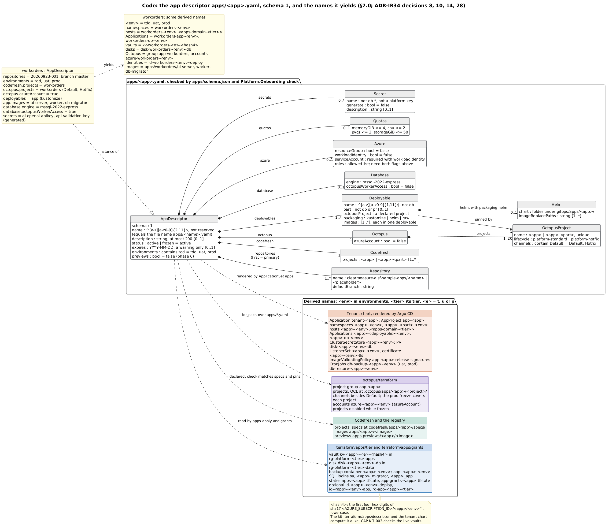

*Code level, the app descriptor. White classes are the keys of `apps/<app>.yaml` (schema 1) with the rules and defaults of `apps/schema.json` and `check`; coloured classes group the names derived for each consumer (tenant chart, `octopus/terraform`, Codefresh and the registry, `terraform/apps/*`); yellow objects show `workorders`. `<hash4>` is the first four hex digits of sha1(`<AZURE_SUBSCRIPTION_ID>/<app>/<env>`).*

**Azure resources** (resource groups: ADR-IR34)

| Object | Name |
|---|---|
| Clusters | `aks-platform-nonprod`, `aks-platform-prod`, `aks-platform-build`. Node groups: `rg-platform-<tier>-aks-nodes`, `rg-platform-build-aks-nodes`. |
| Network | `vnet-platform-<tier>` with subnet `snet-aks-<tier>`; IPs `pip-platform-<tier>-egress` and `pip-platform-<tier>-ingress` |
| Registry | `<acr-name>` in `rg-platform-build`. Repositories: `apps/<app>/<image>`, `apps-previews/<app>/<image>`, `platform/<image>`. |
| Workspaces and vaults | `log-platform-<tier>`; `<kv-platform-<tier>>`; app vaults `kv-<app>-<e>-<hash4>` |
| Storage accounts | `<tfstate-storage-account-global>`, `<tfstate-storage-account-<tier>>` (container `tfstate`), `<backup-storage-account-<tier>>` (container `<app>-<env>`) |
| Database disks | `disk-<app>-<env>-db` in `rg-platform-<tier>-data` |
| Monitoring | `appi-<app>-<env>`, `slo-fast-burn-<app>-<env>` (per app-environment, `rg-platform-<tier>-apps`); action group `ag-platform-oncall` and suppression rule `apr-sleep-<tier>` (per tier, `rg-platform-<tier>-aks`) |
| Audit logs | Diagnostic settings to `log-platform-<tier>`: `aks-audit-to-log-platform` on the cluster (`kube-audit-admin`, `guard`) and `kv-audit-to-log-platform` on the platform vault and on every app vault (`AuditEvent`) |
| Budgets | `budget-platform-build` (with `rg-platform-global`), `budget-platform-nonprod`, `budget-platform-prod`; each filters by resource-group name, so the node groups count. Skipped on an offer that Cost Management does not support, such as the live Microsoft Azure Sponsorship subscription (`budgets_enabled`; CAP-AZ-014 then reports the gap) |

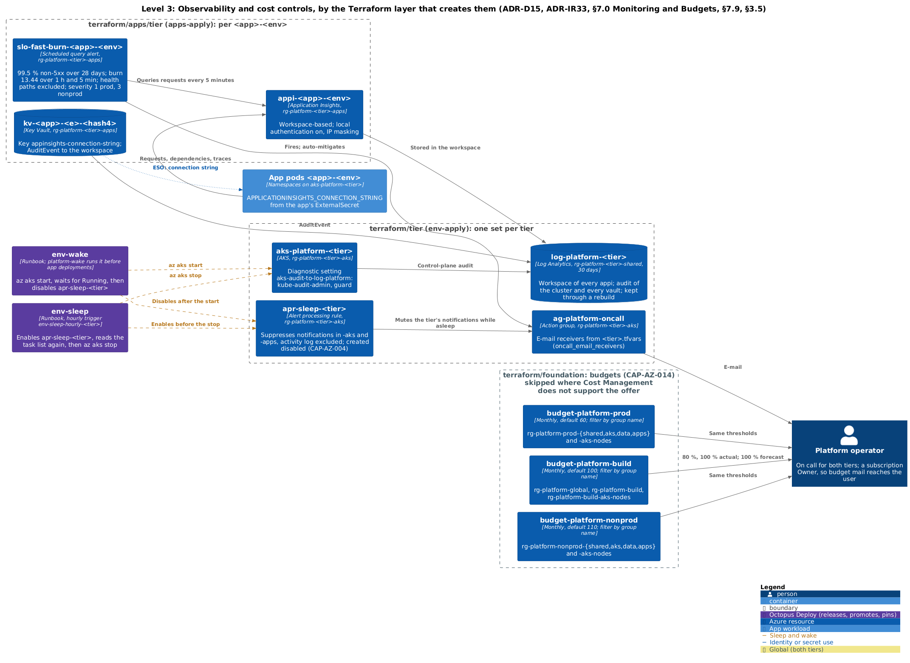

*Level 3, monitoring and cost objects, grouped by the Terraform layer that creates them. `terraform/tier` creates `log-platform-<tier>`, `ag-platform-oncall` and `apr-sleep-<tier>` once per tier; `terraform/apps/tier` creates `appi-<app>-<env>` and `slo-fast-burn-<app>-<env>` per app environment; `terraform/foundation` creates the three budgets, each filtered by resource-group name. env-sleep enables `apr-sleep-<tier>` before it stops the cluster and env-wake disables it after the start, so a sleeping tier pages nobody.*

**Identities** (every grant is created by the provisioner; tier layers create none)

| Identity | Used by | Grants (scope) | Credential or federated subject |
|---|---|---|---|
| Provisioner `sp-automation-mvp-sub` (stored; Octopus account `Azure Runtime Provisioner` used by nothing) | Operator sessions: `terraform/foundation`, `terraform/build`, `terraform/apps/grants` | Contributor (subscription); constrained RBAC Administrator (service-principal and group assignees; ten roles, SQL DB Contributor included, until the P1-03 Owner re-run, then the 12 of ADR-IR34); Graph `Group.Create`, `Application.ReadWrite.OwnedBy`; self-granted Storage Blob Data Contributor (global state) and AKS RBAC Cluster Admin (`rg-platform-build`, and `rg-platform-<tier>-aks` while `provisioner_app_cluster_admin` is true, which P1-13 ends) | Client secret, held by the user |
| `id-platform-lifecycle-<tier>` | Octopus account `azure-platform-lifecycle-<tier>`: `env-*`, `apps-*`, `rotate-db-passwords`, `env-wake`, `env-sleep` | Contributor on the tier's `-shared`, `-aks`, `-data`, `-apps`; AKS RBAC Cluster Admin (`-aks`); Key Vault Secrets Officer (`-aks`, `-apps`); Storage Blob Data Contributor (tier state account) | `space:<space-slug>:project:platform-infrastructure:environment:infra-<tier>` |
| `id-aks-<tier>-controlplane` | AKS control plane and the disk CSI driver | Network Contributor (`-shared`); Managed Identity Operator (kubelet identity); Contributor (`-data`) | — |
| `id-aks-<tier>-kubelet` | Node image pulls | AcrPull (registry) | — |
| `id-kyverno-<tier>` | Kyverno admission controller | AcrPull (registry) | `system:serviceaccount:kyverno:kyverno-admission-controller` |
| `id-eso-platform-<tier>` | ESO controller, every store of the tier | Key Vault Secrets User (`-aks`, `-apps`) | `system:serviceaccount:external-secrets:external-secrets` |
| `id-db-backup-<tier>` | Backup and restore Jobs in `platform-backup` | Storage Blob Data Contributor (tier backup account) | `system:serviceaccount:platform-backup:db-backup` |
| `id-octopus-acr-pull` | Octopus feed `acr-apps` | AcrPull (registry) | `space:<space-slug>:feed:acr-apps` [VERIFY format] |
| `sp-platform-conformance` (app registration owned by the provisioner) | The .NET harness | Reader (every `rg-platform-*`; every `rg-app-<app>-<tier>`, from `terraform/apps/grants`); AcrPull (registry); Key Vault Secrets Officer (the sandbox tdd vault, from `terraform/apps/grants`). After R30, with `conformance_least_privilege = true`: AKS Cluster User Role and AKS RBAC Reader (three clusters); AKS RBAC Writer (namespaces `sandbox-tdd`, `sandbox-uat`, `sandbox-prod`); Reader (the three node groups). Until then (the default `false`): AKS RBAC Cluster Admin on the three cluster groups instead of those grants. | Client secret (90 days) in Codefresh context `platform-conformance` |
| Group `platform-operators` (created by the provisioner with `az` before the first foundation apply, not by Terraform, which takes its object ID as `platform_operators_group_object_id`; member `<object-id-of-platform-operator>`, and the provisioner itself from P1-07 until P1-13) | The user: secret seeding, cluster operation | Key Vault Secrets Officer (`-aks`, `-apps` of both tiers); AKS RBAC Cluster Admin (the three cluster groups) | Entra sign-in with MFA |
| `id-<app>-<env>-deploy` (optional: `octopus.azureAccount: true`) | Octopus account `azure-<app>-<env>` | Key Vault Secrets User (own vault); Contributor on `rg-app-<app>-<tier>` when declared | `space:<space-slug>:project:<project>:environment:<env>`, one per project, at most 20 |
| `id-<app>-<env>-app` (optional: `azure.workloadIdentity: true`) | The app's pods | Descriptor-declared roles from the allowed list, on `rg-app-<app>-<tier>` | `system:serviceaccount:<app>-<env>:<service-account>`, created by `terraform/apps/tier`; a rebuilt cluster has a new issuer, so `apps-apply` runs again after `env-apply` |
| Build cluster identities | AKS | None outside `rg-platform-build-aks-nodes` | System-assigned |

`AISF-Service-Account`, the Argo CD account `octopus`, the Argo CD repo reader and the statuses-only GitHub App keep their §5.2 rows. The repo reader is the stored PAT until R11.

**Registry and supply chain**

| Object | Contract |
|---|---|
| Tokens | Created by CLI from Terraform scope maps; 90-day expiry.<br>• `cf-apps-release` (`apps/*`: content and metadata read and write, no delete)<br>• `cf-apps-preview` (`apps-previews/*`)<br>• `cf-platform-ci` (`platform/*`)<br>• `cf-platform-pull` (`platform/*`, read)<br>• `cf-platform-retention` (`apps/*`, `apps-previews/*`: read, delete, metadata write) |
| Tags | `<VERSION>` (final SemVer) and `sha-<sha7>`, locked after signing; previews `pr-<n>-<sha>`; never `latest` |
| Signer policy | Rendered per app by the tenant chart: `ImageValidatingPolicy` `app-<app>-release-signatures` for images under `apps/<app>/` in the app's namespaces, issuer `https://oidc.codefresh.io`, `subjectRegExp` `^https://g\.codefresh\.io/<cf-account-name>/<app>(-[a-z0-9]+)?/release(-[a-z0-9-]+)?:<CF_ACCOUNT_ID>/[0-9a-f]{24}$`. Deny with `failurePolicy: Fail` in prod; Audit with `failurePolicy: Ignore` in nonprod (`values-<tier>.yaml`). The app-neutral floor is `verify-app-release-signatures` of `policies/kyverno/base` (any release pipeline of the account). No rule covers `apps-previews/*` yet (phase 6). |
| Retention | `platform-env/registry-retention`, nightly at 03:00 UTC; the cron ships disabled until P1-13 has reviewed a dry run.<br>• Repositories: those of the descriptors, the pins and the fixture (a repository token cannot list the catalog). A retired app's repositories are deleted by its retire procedure (docs/onboarding.md, step 6), and CAP-KIT-008 finds any left.<br>• Keeps the 10 newest final SemVer tags per repository, every tag pinned under `gitops/apps/*/envs/**`, `apps/sandbox/unsigned:0.0.0-fixture`, every tag on the digest of a kept tag (`sha-<sha7>`), the cosign referrer tags `sha256-<digest>.{sig,att,sbom}` of kept digests, and anything younger than the age limit.<br>• Unlocks, then deletes, other `apps/*` tags older than 30 days and `apps-previews/*` tags older than 7 days; a digest goes only when every tag on it goes. Referrers without a tag (OCI 1.1 subject referrers) are never touched. |
| Pins | Tags only (V3):<br>• Kustomize `images[].newTag`;<br>• Helm values at `argo.octopus.com/image-replace-paths`;<br>• the `image:` field of raw manifests. |

**Octopus**

| Object | Value |
|---|---|
| Space and environments | `<octopus-space>` (one space, ADR-IR32); `tdd`, `uat`, `prod`, `infra-nonprod`, `infra-prod` |
| Lifecycles | • `platform-standard`: phases TDD, UAT, Prod; tdd deploys automatically while `tdd_auto_deploy` is true (the default), uat and prod manually.<br>• `platform-hotfix`: UAT, Prod.<br>• `platform-infrastructure`: phase Infra Nonprod required, phase Infra Prod optional (Octopus needs one required phase; runbooks ignore progression).<br>• `platform-wake`: one phase, Application environments, with tdd, uat and prod as optional targets in any order.<br>An app may add `app-<app>-<name>`. |
| Project groups | `app-<app>` per app; `Platform` |
| Projects | App projects `<app>` and `<app>-<part>`: config as code at `.octopus/apps/<app>/<project>/`, with shells from `octopus/terraform` (`for_each` over `apps/*.yaml`). Platform projects `platform-infrastructure` (runbooks) and `platform-wake`, at `.octopus/<project>/`. |
| Channels | From `octopus.projects[].channels` of each descriptor. `Default`: created by Octopus with the project (lifecycle `platform-standard`) and not managed by `octopus/terraform`. `Hotfix` (lifecycle `platform-hotfix`) per app project; `sandbox` adds `Strict` (the project lifecycle), to which its `variables.ocl` scopes `Platform.SoDMode = enforce`. Managed channels carry the Git reference rule `refs/heads/main` and no package version rule. |
| Library sets | • `Platform Environment`, included in app projects: `Platform.AppsDomain`, `Platform.WorkerPool`, `Platform.Registry`, `Platform.AutomationUsername`, `Platform.InterventionTestMode`, `Platform.SoDMode`.<br>• `Platform Infrastructure`, included in `platform-infrastructure`: `Environment.Class` and `Terraform.StateResourceGroup`, `Terraform.StateStorageAccount`, `Terraform.StateContainer`, `Terraform.StateKey` per infra environment.<br>• `Platform Automation`: `PlatformWake.OctopusApiKey`, included in `platform-wake` only.<br>• Stored `Azure Runtime Provisioning` and `GitHub AISF Sample Apps`, included nowhere.<br>`platform-infrastructure` gets the same key as the project variable `Platform.OctopusApiKey`, scoped to the steps that call the Octopus REST API (S5), plus the optional sensitive `Octopus.WorkerRegistrationToken` (prompted) and `ArgoCD.RepoReadCredential`. |
| Accounts | `azure-platform-lifecycle-nonprod` (`infra-nonprod`) and `azure-platform-lifecycle-prod` (`infra-prod`); optional `azure-<app>-<env>`; stored `Azure Runtime Provisioner`, used by nothing. Subject keys: `space`, `project`, `environment`. |
| Feeds and pools | `acr-apps` (OIDC `id-octopus-acr-pull`), `docker-hub`, the built-in feed; `hosted-ubuntu`, and `k8s-tdd`, `k8s-uat`, `k8s-prod`, shared by every app. The Kubernetes workers use machine policy `Sleep-tolerant Kubernetes workers`: no scheduled health checks, and an unavailable worker is neither failed nor deleted. |
| Step templates | `platform-sod-guard`, `platform-db-backup`, `platform-pin-writer` (the fallback, ADR-IR34 decision 20), built from `octopus/step-templates/*.sh`. Apps may use them. The processes of this repository inline the same scripts between `# >>> octopus/step-templates/<name>.sh` markers instead; Offline tests keep the copies equal to the scripts (CAP-OCT-004, CAP-OCT-015). |
| `platform-infrastructure` runbooks | In `infra-nonprod` and `infra-prod`:<br>• `env-plan`, `env-apply`;<br>• `env-destroy` (`infra-nonprod` only);<br>• `apps-plan`, `apps-apply` (prompted `App.Name`);<br>• `rotate-db-passwords` (prompted `App.Name`);<br>• `env-wake`;<br>• `env-sleep` (prompted `Sleep.Force`, `Sleep.DryRun`, `Sleep.NowOverride`).<br>Triggers: `env-sleep-hourly-nonprod`, `env-sleep-hourly-prod`, at minute 0 of every hour (`0 0 * * * *`), time zone UTC. |
| Teams and freeze | The seven live teams keep their names. Role scopes name environments only, so a new app needs no team change. `AISF-Service-Account` is a member of `CI Release Publishers`, `UAT Approvers`, `Prod Approvers` and `Platform Engineers`. Freeze: one project freeze `prod-weekend-freeze-<project>` per app project that deploys to prod (multi-project freezes need an Enterprise licence): prod, Saturday 00:00 to Monday 00:00 UTC, weekly from 2026-10-03. |
| Wake and pins | Step 0 of every app process that touches a cluster: Deploy a Release of `platform-wake`, condition Always. App runbooks hold no key: their first step waits up to `Wake.WaitMinutes` for the app to answer. Argo CD instances: `argocd-nonprod` (tdd, uat) and `argocd-prod` (prod). Annotations `argo.octopus.com/project` and `argo.octopus.com/environment` are rendered only by the tenant chart. |

**Codefresh**

| Object | Value |
|---|---|
| Runtime | `<cf-runtime>` = `aks-platform-build/codefresh`, the account default. Every spec sets `runtimeEnvironment`. |
| Projects and pipelines | `<app>` or `<app>-<part>` per app. Pipelines are free per app, but release pipelines are named `release` or `release-<x>` (the signer rule). YAML lives at `codefresh/apps/<app>/pipelines/`, specs at `codefresh/apps/<app>/specs/`. Project `platform-env`: `env-checks`, `ci-image-dotnet`, `conformance-arm`, `conformance`, `conformance-destructive`, `registry-retention`, `fixtures`, at `codefresh/platform/{pipelines,specs}/`. |
| Contexts | Declared without values in `codefresh/platform/integrations.yaml` and `codefresh/apps/<app>/integrations.yaml`; `register.ps1 --full` or `--app` creates each from the operator's environment (`fromEnv`) and reports a missing one as pending.<br>• `platform-octopus`: `OCTOPUS_URL`, `OCTOPUS_SPACE_ID`, `OCTOPUS_API_KEY`; release and conformance pipelines.<br>• `platform-registry`: `ACR_REGISTRY`, `ACR_TOKEN_NAME=cf-apps-release`, `ACR_TOKEN_PASSWORD`; release pipelines.<br>• `platform-registry-retention`: `ACR_REGISTRY`, `ACR_TOKEN_NAME=cf-platform-retention`, `ACR_TOKEN_PASSWORD`.<br>• `platform-conformance`: `AZURE_TENANT_ID`, `AZURE_CLIENT_ID`, `AZURE_CLIENT_SECRET`, `GITHUB_TOKEN`, optional `CODEFRESH_API_KEY`.<br>• Optional app-owned `app-<app>-ci` (app #1: `app-workorders-ci`). |
| Integrations | Registry, declared like the contexts: `acr-apps-release`, `acr-apps-preview` and `acr-platform-ci` (push); `acr-platform-pull` (pull; the primary integration of the registry domain). Git: `github-aisf-sample-apps` (the Codefresh GitHub App, declared under `gitIntegrations` in the same file, verify-only, no value; ADR-IR35). |
| Handshake (mandatory) | • M1: images at `apps/<app>/…`.<br>• M2: a keyless signature and an SBOM from a release pipeline of that app.<br>• M3: the Octopus release through `octopus_release` (`octopus release create`), with an explicit `--package` version per package, no default package version, and `--git-ref refs/heads/main`.<br>• M4: never deploy.<br>Fork events are off in every trigger. |

**Argo CD and Kubernetes**

| Object | Value |
|---|---|
| Roots | `argocd/clusters/nonprod/`, `argocd/clusters/prod/`, synced by Application `platform-root`: namespaces, AppProjects, platform secrets, storage, the Octopus worker RBAC (`octopus-workers-rbac.yaml`: read access to Applications in `argocd` for the fallback pin writer), the conformance RBAC (`conformance-rbac.yaml`: read access to the platform custom resources and admission webhooks for sp-platform-conformance, which AKS RBAC Reader does not cover), the add-ons under `addons/` and ApplicationSet `apps`. `apps`: Git files generator over `apps/*.yaml`, `values: {cluster: <tier>}`, `applicationsSync: create-update`, `preserveResourcesOnDeletion: true`; each `tenant-<app>` syncs with `FailOnSharedResource`. |
| Tenant | Application `tenant-<app>` (project `platform-tenants`) renders:<br>• AppProject `app-<app>` (and `app-<app>-previews` on nonprod) and the namespaces (wave -10);<br>• ResourceQuota and LimitRange `tenant`, NetworkPolicies, ClusterSecretStores `<app>-<env>` (admitting the app-environment's namespaces and `platform-backup`), static PersistentVolumes for `disk-<app>-<env>-db`, the signer policy, and ListenerSet `<namespace>` in `platform-ingress` per app namespace (wave -5);<br>• Applications `<app>-db-<env>` (wave 0) and `<app>-<deployable>-<env>` (wave 5; `argocd.argoproj.io/manifest-generate-paths` limits them to the app's own folders);<br>• in `platform-backup`, for uat and prod (tdd databases are disposable): ExternalSecret `db-sa-<app>-<env>`, CronJob `db-backup-<app>-<env>` and suspended CronJob `db-restore-<app>-<env>`.<br>`status: frozen` scales the workloads and the database to zero (the waves swap) and suspends the backup CronJob; disks and data stay. |
| AppProjects | `platform-addons` (the root and the add-ons; the only project with cluster-scoped kinds); `platform-tenants` (the tenant Applications: exactly the kinds the chart renders); `app-<app>`: the environment repo as its only source, its own namespaces only, no cluster-scoped kind, and no ResourceQuota, LimitRange, NetworkPolicy, SecretStore, ClusterSecretStore, Gateway, ListenerSet, Kyverno or Argo CD kind (`Application`, `ApplicationSet`, `AppProject`); `default` (locked) |
| Database | Application `<app>-db-<env>` (label `platform/role: database`, Octopus scope `argo.octopus.com/project` of the app's first deployable and `argo.octopus.com/environment`, never pinned), folder `gitops/apps/<app>/envs/<env>/db/` with component `gitops/platform/components/db/mssql-2022-express/` and one credentials component:<br>• StatefulSet `db`, Services `db` and `db-hl`, PostSync Job `db-init` (the database and the SQL logins);<br>• `MSSQL_PID=Express`; memory request 2 GiB, limit 2.5 GiB; `MSSQL_MEMORY_LIMIT_MB=2048`;<br>• certificate `db-tls` from `platform-internal-ca`;<br>• Secrets `db-sa`, `db-migrator` and `db-app`: from store `<app>-<env>` (`db-credentials/keyvault`, named environments), or generated in the cluster (`db-credentials/generated`, previews). |
| Migrations | PreSync hook Job `db-migrate` in the app namespace, running the app's migrator image. It retries its login until `MIGRATION_DB_READY_TIMEOUT_SECONDS`. |
| Storage | StorageClass `platform-retain`: `disk.csi.azure.com`, `StandardSSD_LRS`, `resourceGroup: rg-platform-<tier>-data`, `Retain`, `WaitForFirstConsumer`, expansion allowed. Database disks bind statically. |
| Ingress | `gitops/platform/ingress/`, in `platform-ingress`: GatewayClass `envoy-gateway` (Envoy Gateway) and Gateway `platform-gateway` on the tier's static IP `pip-platform-<tier>-ingress`. The Gateway's only listener is HTTP on port 80, which redirects to HTTPS and serves the ACME HTTP-01 solvers; each app namespace gets its HTTPS listener from the tenant chart's ListenerSet, with certificate `<namespace>-tls` from ClusterIssuer `letsencrypt-http01`. ClusterIssuer `platform-internal-ca` signs in-cluster TLS (`db-tls`). Kyverno policy `platform-app-hostnames` admits only host names whose first label is the route's namespace. Diagnostic paths: each app's uat and prod overlays answer them at the Gateway with a 302 redirect to `/` (CAP-GIT-012). |
| Quotas and NetworkPolicy | Default quota per `<app>-<env>`: 4 GiB memory, 2 CPU, 3 PVCs, 50 GiB storage (requests), and no LoadBalancer or NodePort Services; descriptors may only lower it. NetworkPolicy (Cilium, `terraform/tier`) denies ingress by default and allows:<br>• traffic within the app's namespaces of the same environment;<br>• traffic from `platform-ingress` to every pod but the database;<br>• database traffic from `platform-backup`, and from `octopus-worker-<env>` when the descriptor sets `database.octopusWorkerAccess`.<br>Egress stays open. |

**Terraform layers**

| Layer | State | Applied by | Creates |
|---|---|---|---|
| `terraform/foundation` | `foundation.tfstate` (global account) | The provisioner, from an operator session | Resource groups, provider registration, the registry and scope maps, state and backup accounts, platform identities with their Octopus-issuer federated credentials, `sp-platform-conformance`, every platform grant (those of `platform-operators` included; the group itself is created with `az`), budgets |
| `terraform/build` | `build.tfstate` (global) | The provisioner | `aks-platform-build`; no role assignment |
| `terraform/tier` | `tier-<tier>.tfstate` (tier account) | `env-*` runbooks as `id-platform-lifecycle-<tier>` | Network, IPs, workspace, AKS (Azure CNI overlay with Cilium, managed OS disks), platform vault, `ag-platform-oncall`, `apr-sleep-<tier>`, the audit diagnostic settings of the cluster and the platform vault, workload federated credentials, Argo CD bootstrap, Octopus workers; no role assignment |
| `terraform/apps/tier` | `apps-<app>.tfstate` (tier account) | `apps-apply` as the lifecycle identity | Per app and environment: vault with the generated passwords and the descriptor's keys, its audit setting, disk, backup container, App Insights and the SLO alert; the workload federated credential of `id-<app>-<env>-app` once that identity exists |
| `terraform/apps/grants` | `app-grants-<app>.tfstate` (global) | The provisioner, for apps with Azure access and for `sandbox` (the conformance grants) | `rg-app-<app>-<tier>` when declared; `id-<app>-<env>-deploy` and `id-<app>-<env>-app` in `rg-platform-<tier>-apps`, their grants and the deploy identities' Octopus-issuer federated credentials; the conformance grants on the app's groups and on the sandbox tdd vault |
| `octopus/terraform` | `octopus-space.tfstate` (global) | A Space Manager, through `octopus/apply.ps1`, from an operator session also signed in to Azure (it reads identity client IDs and ingress IPs) | Space objects and app project shells |

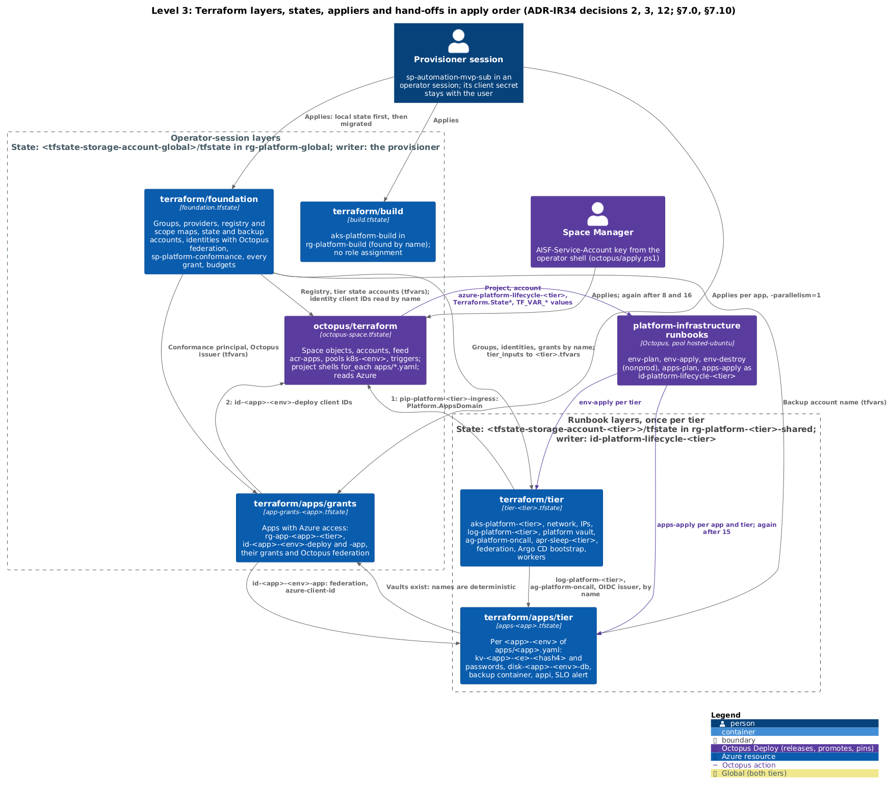

*Level 3, the Terraform layers, grouped by where their state lives. `terraform/foundation`, `terraform/build`, `terraform/apps/grants` and `octopus/terraform` run from operator sessions and keep state in `<tfstate-storage-account-global>`, which only the provisioner writes. `terraform/tier` and `terraform/apps/tier` keep one state per tier in `<tfstate-storage-account-<tier>>`, written by `id-platform-lifecycle-<tier>` through the env-* and apps-* runbooks. The numbers give the apply order and what each layer hands to the next: objects are found by name or passed through tfvars, never through remote state. `octopus/terraform` runs again after env-apply and after the grants, and apps-apply runs again after the grants.*

**Conformance**

| Object | Value |
|---|---|
| Solution and settings | `tests/Platform.Conformance.sln`; `tests/platform.settings.json` |
| Catalogue | `catalogue/capabilities.d/{harness,codefresh,octopus,gitops,azure,kit}.yaml`, rendered to `docs/capabilities.md`; a root `catalogue/capabilities.yaml` is optional and absent. IDs `CAP-<AREA>-<nnn>`, where the area is `HARNESS`, `CF`, `OCT`, `GIT`, `AZ` or `KIT`. 82 capabilities (2026-09-25): 62 proven by live tests (5 of them destructive) and 20 offline; owners `codefresh`, `octopus`, `argocd`, `azure`, `kyverno`, `onboarding` and `platform`. |
| Categories | `Live`, `Offline`, `Destructive`, `Slow`, `NonProd`, `Prod`, `Build` |
| Pipelines | `platform-env/conformance-arm` (weekdays 07:00 UTC), `platform-env/conformance` (queued by the arm), `platform-env/conformance-destructive` (Sundays 08:00 UTC). The crons ship disabled until P1-13. |
| Fixture app | `sandbox`:<br>• repository `<sandbox-app-repo>`;<br>• images `apps/sandbox/web` and `apps/sandbox/migrator`, plus the unsigned `apps/sandbox/unsigned:0.0.0-fixture`;<br>• Octopus project `sandbox` (channels `Default`, `Hotfix`, `Strict`);<br>• namespaces `sandbox-<env>`. |
| Run label and results | `conformance-run=<run-id>`; branch `conformance-results` of `<sandbox-app-repo>` |

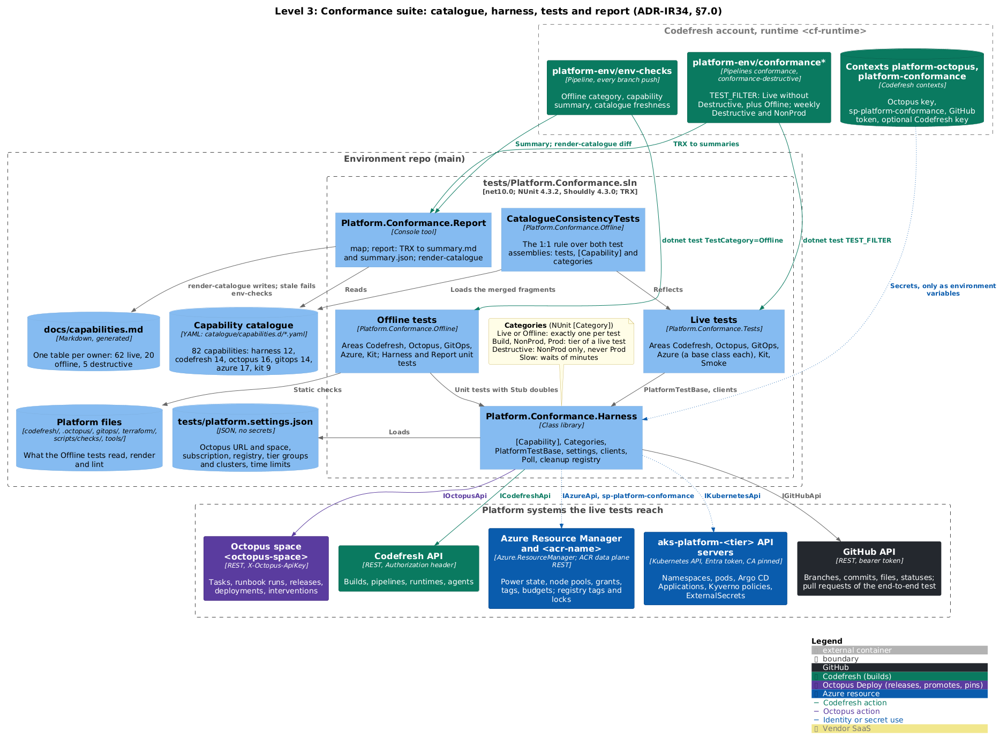

*Level 3, the conformance suite. The capabilities of the six catalogue fragments feed `tests/Platform.Conformance.sln` (NUnit 4, Shouldly, TRX), and `render-catalogue` writes `docs/capabilities.md`. `CatalogueConsistencyTests` enforces the one-to-one mapping between capabilities and tests by reflection over both test assemblies. env-checks runs the Offline category and fails on a stale catalogue page; the conformance pipelines run the Live tests with `TEST_FILTER`. The harness clients reach Octopus, Codefresh, Azure Resource Manager and the registry, the cluster API servers and GitHub, with secrets from Codefresh contexts only.*

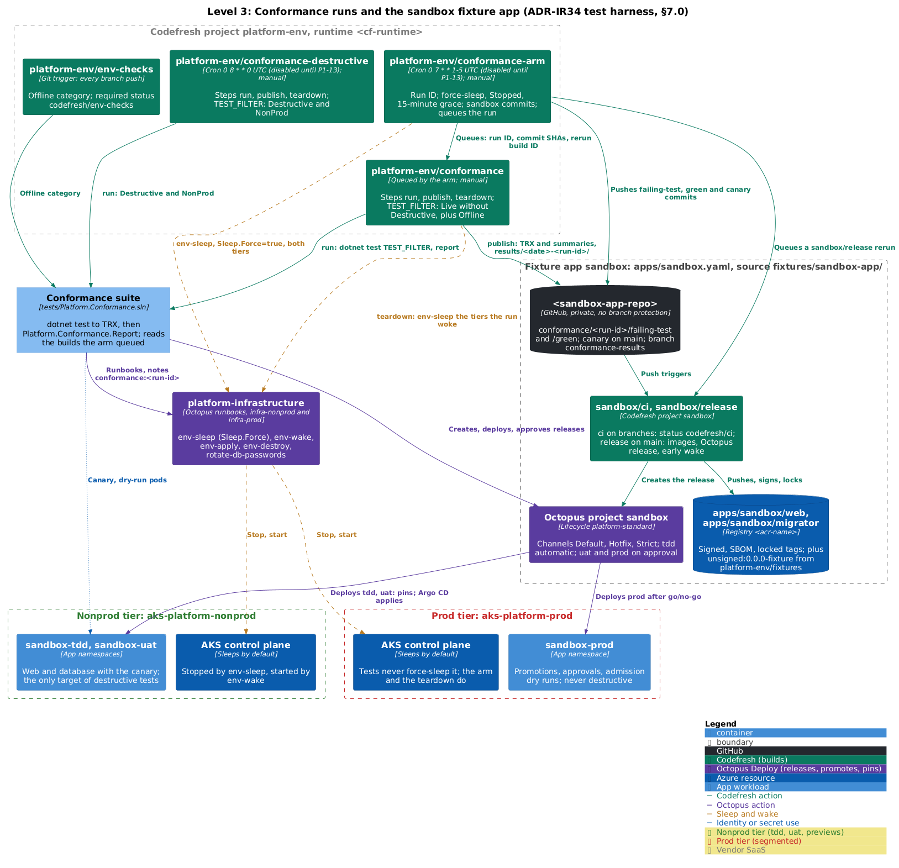

*Level 3, how the suite runs. conformance-arm force-sleeps both tiers through env-sleep, pushes run commits to `<sandbox-app-repo>`, and queues a sandbox/release rerun and platform-env/conformance; conformance-destructive and env-checks run the same solution with other filters. The fixture app (its repository, sandbox/ci and sandbox/release, the `apps/sandbox/*` images and the Octopus project) is one boundary; its namespaces sit in nonprod and prod, and only sandbox-tdd and sandbox-uat take destructive tests. Both crons ship disabled until P1-13.*

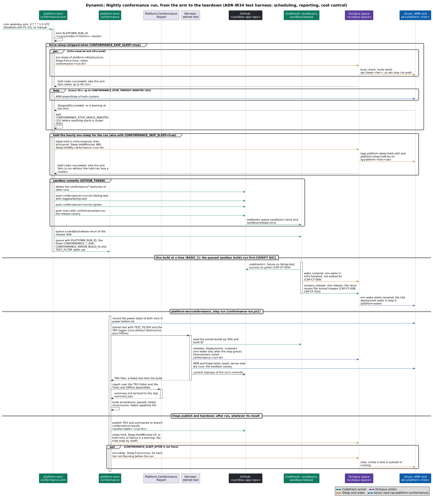

*Dynamic, one weekday night. The arm mints `PLATFORM_RUN_ID`, force-sleeps both tiers (`Sleep.Force=true`), waits for Stopped and the 15-minute stop grace, holds the hourly env-sleep for the run (`sleep-hold`, 480 minutes, held by `conformance:<run-id>`), pushes the failing-test, green and canary commits, and queues the rerun and platform-env/conformance with the run ID and SHAs. The sandbox builds run first (CI statuses, the early env-wake, one Octopus release). The run step records the power state, runs `dotnet test` with `TEST_FILTER` (TRX), the capability report and the annotations; publish pushes the results to `conformance-results`; teardown releases the hold, then force-sleeps the tiers that were not Running before the run.*

**Placeholders**

| Placeholder | Meaning |
|---|---|
| `<cf-runtime>` | `aks-platform-build/codefresh` |
| `<apps-domain-<tier>>`, `<ingress-ip-dashed-<tier>>` | App host suffix per tier, and its sslip.io default (the tier's ingress IP with dashes) |
| `<kv-platform-<tier>>` | Platform vault per tier |
| `<tfstate-storage-account-global>`, `<tfstate-storage-account-<tier>>`, `<backup-storage-account-<tier>>` | Storage accounts |
| `<sandbox-app-repo>` | `clearmeasure-aisf-sample-apps/<name>`, the private fixture repository (R31) |
| `<object-id-of-platform-operator>` | The user's Entra object ID |

Retired:
- `<kv-workorders-*>`, `<sql-*>`, `<sqldb-*>`;
- the per-environment host names and `<previews-hostname-suffix>`;
- `<cf-runtime-ci>`, `<cf-runtime-release>`, `<aks-cluster-context>`;
- `<CF_RELEASE_PIPELINE_ID>` and `<CF_PREVIEW_PIPELINE_ID>`: the signer pattern needs no pipeline ID.

### 7.1 Placeholders and naming

*ADR-IR34:* the naming and placeholder tables of §7.0 supersede the resource-group, cluster, vault, SQL and host names below. The retired placeholders are listed at the end of §7.0.

| Placeholder | Meaning |
|---|---|
| `<AZURE_TENANT_ID>`, `<AZURE_SUBSCRIPTION_ID>`, `<azure-region>` | Azure tenant, subscription and region |
| `<acr-name>` | ACR name. The login server is `<acr-name>.azurecr.io`. |
| `<kv-workorders-tdd>`, `<kv-workorders-uat>`, `<kv-workorders-prod>` | Per-environment Key Vaults (names are globally unique) |
| `<kv-workorders-platform-nonprod>`, `<kv-workorders-platform-prod>` | Per-cluster platform Key Vaults |
| `<sql-workorders-{env}>`, `<sqldb-workorders-{env}>` | Per-environment SQL logical server and database |
| `<tfstate-storage-account>` | Terraform state storage account |
| `<tdd-hostname>`, `<uat-hostname>`, `<prod-hostname>` | Public hostnames |
| `<gateway-name>`, `<gateway-namespace>`, `<gateway-class>` | Gateway API parent reference (Q5) |
| `<OCTOPUS_URL>`, `<octopus-space>`, `<octopus-space-slug>`, `<octopus-space-id>` | Octopus Cloud URL and platform space |
| `<OCTOPUS_HOST>` | Host name of `<OCTOPUS_URL>`, for the gateway's gRPC address |
| `<CF_ACCOUNT_ID>`, `<cf-account-name>`, `<CF_RELEASE_PIPELINE_ID>`, `<CF_PREVIEW_PIPELINE_ID>` | Codefresh account, release pipeline and preview pipeline identifiers (Fulcio subjects) |
| `<cf-runtime-ci>`, `<cf-runtime-release>` | Codefresh runtimes |
| `<aks-cluster-context>` | The existing Codefresh runner cluster |
| `<ENV_REPO_URL>` | `https://github.com/clearmeasure-aisf-sample-apps/basic-environment-octopus-codefresh.git` |
| `<ci-image-version>`, `<ci-image-digest>` | Tag and digest of `platform/ci-dotnet`, pinned together in `StepImage.CiDotnet` and the Codefresh pipelines (ADR-IR11, ADR-IR19) |
| `<*-chart-version>`, `<*-version>`, `<*-digest>`, `<*-sha256>` | Pinned versions and digests: Helm charts (Argo CD app 3.5.3, ESO, Kyverno, the Octopus gateway, the Kubernetes agent, Argo Rollouts app 1.10.0), tool images, base images |
| `<client-id-of-<uami name>>` | Client ID of a user-assigned identity from the foundation outputs, for example `<client-id-of-id-workorders-tdd-app>` (ADR-IR7) |
| `<entra-group-object-id-<group>>` | Object ID of an Entra group, for example `<entra-group-object-id-prod-approvers>` |
| `<argocd-{cluster}-host>` | Host name of the Argo CD instance (`argocd-nonprod`, `argocd-prod`) |
| `<previews-hostname-suffix>` | DNS suffix of preview hosts `pr-<number>.<previews-hostname-suffix>` (phase 6) |
| `<platform-bots-author-regex>` | Author identities of pin commits, for the bot-path audit (`PLATFORM_BOT_AUTHORS`), matched against `Name <email>`: `^(Octopus .octopus@octopus\.com>\|octopus-argocd-pin-bot .[^>]+>)$`, a dot for `<` because Codefresh stores `<` in a variable as `&lt;` (the Argo CD step commits as `Octopus <octopus@octopus.com>`, live 2026-09-24; the pin-writer template as `octopus-argocd-pin-bot`) |
| `<provisioner-secret-expires-on>` | Expiry date of the stored provisioner secret (`Provisioner.SecretExpiresOn`) |
| `<github-status-app-id>`, `<github-status-app-installation-id>` | IDs of the statuses-only GitHub App (ADR-IR27) |

The contracts file also carries `notationTokens` (descriptive `<env>`-style tokens, never substituted), `placeholderPatterns` (the families above) and `promptedVariables` (ADR-IR12).

Resource groups: `rg-workorders-shared`, `rg-workorders-aks-nonprod`, `rg-workorders-aks-prod`, `rg-workorders-tdd`, `rg-workorders-uat`, `rg-workorders-prod`. Clusters: `aks-workorders-nonprod`, `aks-workorders-prod`. Log Analytics: `log-workorders`. App Insights: `appi-workorders-{env}`. Alert processing rules: `apr-sleep-{cluster}`, in `rg-workorders-aks-{cluster}` (ADR-IR33). The working window of `env-sleep` uses the time zone `America/Chicago` (`Sleep.TimeZone`); the hourly triggers run in UTC (§7.2).

### 7.2 Octopus

The space as implemented (2026-09-25), with the names of §7.0. ADR-IR34 changed app #1's process: the PreSync Job migrates, so `migrate-database` and `db-copy-pre-release` are gone and `pre-release-backup` runs before the prod pin; the tenant's backup CronJobs replace `db-backup`; `db-restore` replaces `db-restore-pitr`; `rotate-db-passwords` replaces `rotate-sql-passwords`; `provisioner-credential-check` is gone.

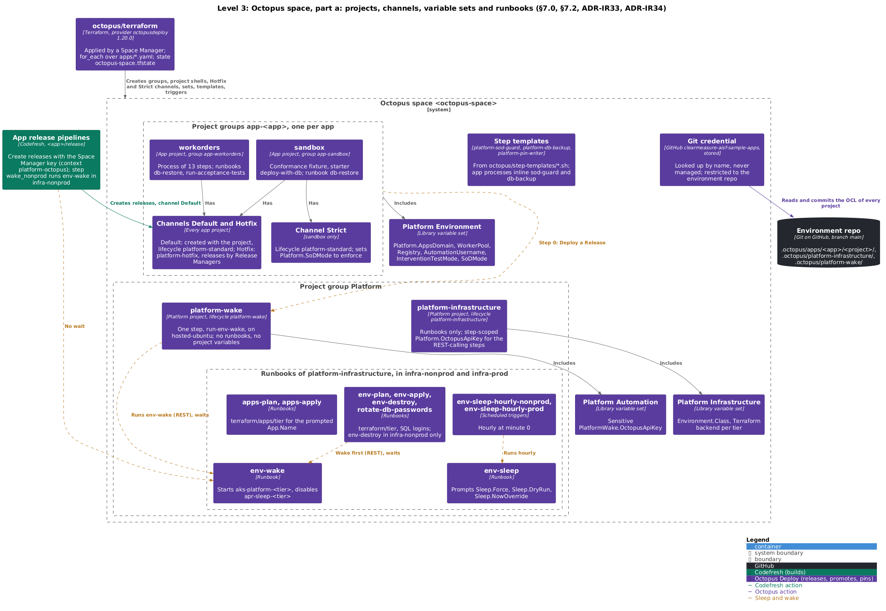

*Level 3, the Octopus space seen from the projects. The app projects `workorders` and `sandbox` (one group `app-<app>` per app) have the channels `Default` and `Hotfix`, and `sandbox` adds `Strict`. Step 0 of every app process deploys `platform-wake`, whose one step runs env-wake of `platform-infrastructure` through the REST API and waits. The hourly triggers run env-sleep, and the Terraform runbooks wake the cluster first. `octopus/terraform` creates the space objects, and the stored Git credential reads and commits the OCL in the environment repo.*

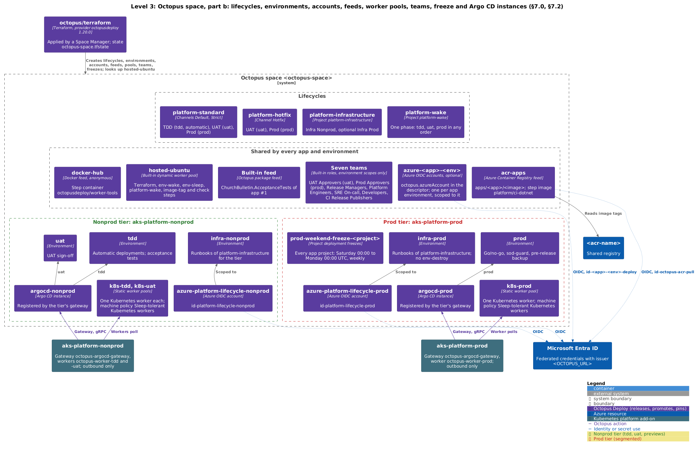

*Level 3, the Octopus space seen from the environments. The four lifecycles sit above the environments, grouped by tier: nonprod holds tdd, uat and infra-nonprod; prod holds prod, infra-prod and the weekend freezes. Each tier has its Kubernetes worker pools, its Argo CD instance registered by the in-cluster gateway, and its lifecycle OIDC account. Shared by all: the optional app accounts, `hosted-ubuntu`, the three feeds and the seven teams.*

**Space and projects**

| Object | Value |
|---|---|
| Space | `<octopus-space>`, slug `<octopus-space-slug>` |
| Project groups | `app-<app>` per app (`app-workorders`, `app-sandbox`); `Platform` for the platform-owned projects (ADR-IR33) |
| App projects | `<app>` and `<app>-<part>` from the descriptors: today `workorders` and `sandbox`. Slug = name; the descriptor's lifecycle (`platform-standard`); untenanted; disabled while the app is `frozen`. Version controlled with the Git credential `GitHub clearmeasure-aisf-sample-apps`, URL `<ENV_REPO_URL>`, base path `.octopus/apps/<app>/<project>`, default branch `main`, and no Octopus-protected branch: GitHub protects `main`, and a check in `octopus/terraform` reports a protected branch added in the UI. Include library variable set `Platform Environment` only and hold no platform secret (ADR-IR33). `allow_deployments_to_no_targets = true`. Release notes start with `app-commit: <sha>` (ADR-IR23). |
| Project `platform-infrastructure` | Runbooks only. Group `Platform`, lifecycle `platform-infrastructure`, base path `.octopus/platform-infrastructure`, same repo and credential. Includes library variable set `Platform Infrastructure`; holds the sensitive project variables `Platform.OctopusApiKey` (step-scoped, S5), `Octopus.WorkerRegistrationToken` and `ArgoCD.RepoReadCredential`. |
| Project `platform-wake` | Group `Platform`, lifecycle `platform-wake`, base path `.octopus/platform-wake`, same repo and credential. One step, `run-env-wake`; no runbooks; no project variables (a parent's passed variables would override them, E53). Includes library variable set `Platform Automation`. Releases `0.0.<n>`, created from `main` by a Platform Engineer after each change under `.octopus/platform-wake/` and before the first app release ([docs/preview-octopus.md](../docs/preview-octopus.md#the-first-platform-wake-release)). |

**Environments, lifecycles and channels**

| Object | Value |
|---|---|
| Environments (in order) | `tdd`, `uat`, `prod`, `infra-nonprod`, `infra-prod` |
| Lifecycle `platform-standard` | Phases `TDD` (`tdd`; automatic while Terraform variable `tdd_auto_deploy` is true, the default), `UAT` (`uat`, manual), `Prod` (`prod`, manual) |
| Lifecycle `platform-hotfix` | Phases `UAT` (`uat`) and `Prod` (`prod`) |
| Lifecycle `platform-infrastructure` | Phases `Infra Nonprod` (`infra-nonprod`, required, because Octopus needs one required phase) and `Infra Prod` (`infra-prod`, optional). Runbooks ignore lifecycle progression. |
| Lifecycle `platform-wake` | One phase, `Application environments`: `tdd`, `uat` and `prod` in any order, so a Deploy a Release step can deploy `platform-wake` from any app deployment, Hotfix included (ADR-IR33) |
| Channel `Default` | Created by Octopus with each app project; lifecycle `platform-standard`. Not managed by `octopus/terraform`, which sets no rule on it (the preview's Default channel of `workorders` left the state without being deleted). Releases come from the app's release pipeline with the `AISF-Service-Account` key (ADR-IR32). |
| Channel `Hotfix` | Every app project. Lifecycle `platform-hotfix`. Git reference rule `refs/heads/main`; no package version rule. Release numbers look like `<package-version>-hotfix.<n>` and are created by `Release Managers`. |
| Channel `Strict` | `sandbox` only. The project lifecycle; Git reference rule `refs/heads/main`. The sandbox's `variables.ocl` scopes `Platform.SoDMode = enforce` to it (CAP-OCT-004). |
| Deployment freeze | `prod-weekend-freeze-<project>`: one project deployment freeze on `prod` per app project that deploys to prod, weekly from Saturday 00:00 to Monday 00:00 UTC, first window 2026-10-03 to 2026-10-05 (`octopus/terraform/freezes.tf`; the window length per occurrence is [VERIFY]). Multi-project freezes need an Enterprise licence. Every override needs a reason. `Release Managers` may override it; since ADR-IR32, `Prod Approvers` (Project Deployer) and Space Managers can too. |

**Deployment process steps** (project `workorders`, in the order of `deployment_process.ocl`; `sandbox` has the same steps without `read-deployment-secrets`, `acceptance-tests` and `report-commit-status`)

| # | Slug | Name | Type | Environments or channel | Pool, container, packages |
|---|---|---|---|---|---|
| 0 | `wake-environment` | Wake environment | Deploy a Release (`Octopus.DeployRelease`) of project `platform-wake` to the same environment, deployment condition Always: no key and no Azure account in this project. `platform-wake` runs `env-wake` in `infra-nonprod` (for `tdd`, `uat`) or `infra-prod` (for `prod`), waits up to 60 minutes, and fails on failure (ADR-IR33). | `tdd`, `uat`, `prod`; every channel | — (the child's step runs on `hosted-ubuntu`) |
| 1 | `hotfix-justification` | Hotfix justification | Manual intervention (`Octopus.Manual`), team `Release Managers`. Variable run condition: channel `Hotfix` and no earlier error. | Channel `Hotfix` (`uat`, `prod` by its lifecycle) | — |
| 2 | `prod-go-no-go` | Prod go/no-go | Manual intervention, team `Prod Approvers` | `prod` | — |
| 3 | `sod-guard` | Separation-of-duties guard | Script (Bash): `platform-sod-guard` inlined, for `Prod go/no-go` with the creator check. `Platform.SoDMode` `single-operator` (the default) lets the deployment creator approve with a reason in Notes; `enforce` refuses. The automation user may answer this intervention or `Hotfix justification` only while `Platform.InterventionTestMode` is true, with the reason `conformance:<run-id>` or `e2e:<run-id>` (ADR-IR34 decision 23). Output variables are keyed by step name (ADR-IR22). | `prod` | `hosted-ubuntu` |
| 4 | `pre-release-backup` | Back up database | Script (Bash): `platform-db-backup` inlined. A Job from CronJob `db-backup-workorders-prod` in `platform-backup`, awaited for up to 1800 s; a failed backup stops the release before the pin (CAP-OCT-015). | `prod` | `#{Platform.WorkerPool}` |
| 5 | `update-argo-cd-image-tags` | Update Argo CD image tags | "Update Argo CD Application Image Tags" (`Octopus.ArgoCDUpdateImageTags`, ADR-IR21). Direct commit, sync off, verification "Argo CD Application is healthy", timeout `#{Argo.VerificationTimeoutSeconds}`, one automatic retry after 15 s. | `tdd`, `uat`, `prod` | `hosted-ubuntu`; packages `apps/workorders/ui-server`, `apps/workorders/worker` and `apps/workorders/db-migrator` from feed `acr-apps` (not acquired) |
| 6 | `read-deployment-secrets` | Read deployment secrets | Start trigger: with the previous step, so it runs in parallel with `update-argo-cd-image-tags` (only `acceptance-tests` reads its outputs). Azure CLI script (PowerShell) with account `#{Azure.DeployAccount}` (`azure-workorders-tdd`). Reads `db-app-password` and `ai-openai-apikey` from `kv-workorders-t-<hash4>` and writes the sensitive outputs `AcceptancePassword` and `OpenAIKey` (empty while the vault holds the stand-in; the AI tests then skip). | `tdd` | `#{Platform.WorkerPool}`; container `#{StepImage.CiDotnet}` from `acr-apps` |
| 7 | `verify-version` | Verify version | Script. The `version` field of `#{App.BaseUrl}#{App.VersionPath}` must equal the release number without `-hotfix.<n>`, or start with it followed by `+` or `-`. | `tdd`, `uat`, `prod` | `hosted-ubuntu` |
| 8 | `smoke-test` | Smoke test | Start trigger: with the previous step, so it runs in parallel with `verify-version`. Script. `#{App.BaseUrl}/_healthcheck` must return `Healthy`; `Degraded` fails when `Smoke.FailOnDegraded` is `True`. Retries for 150 s. | `tdd`, `uat`, `prod` | `hosted-ubuntu` |
| 9 | `acceptance-tests` | Acceptance tests (TDD only) | Script (PowerShell) with the interlocks from ADR-C11: `tdd` only, and `Acceptance.AllowDestructiveReset` must be `True`. `dotnet test` on the package DLL against `#{App.BaseUrl}`, logging in to the tdd database as `#{Db.AppLogin}` with `AcceptancePassword`. TRX files uploaded with `New-OctopusArtifact`. 5 NUnit workers (`-- NUnit.NumberOfTestWorkers=5`, over the 4 of the app's runsettings); the `k8s-tdd` script pods request 400m CPU with no CPU limit (`octopus_worker_script_pod_resources` in `terraform/tier/nonprod.tfvars`). Timeout 30 min. | `tdd` | `#{Platform.WorkerPool}` (`k8s-tdd`); container `#{StepImage.CiDotnet}` from `acr-apps`; package `ChurchBulletin.AcceptanceTests` (built-in feed) |
| 10 | `uat-signoff` | UAT sign-off | Manual intervention, team `UAT Approvers` | `uat` | — |
| 11 | `uat-signoff-guard` | UAT sign-off guard | Script (Bash): `platform-sod-guard` inlined, for `UAT sign-off` without the creator check, so only the automation-user rule applies | `uat` | `hosted-ubuntu` |
| 12 | `report-commit-status` | Report platform/tdd status | Script. Run condition: always. Skipped unless `GitHub.StatusEnabled` is `True`. Reads the app SHA from the `app-commit:` line of the release notes and posts `#{GitHub.StatusContext}` to `#{GitHub.AppRepository}` with a short-lived installation token of the statuses-only GitHub App (ADR-IR27). | `tdd` | `hosted-ubuntu`; container `octopusdeploy/worker-tools:<worker-tools-version>` from `docker-hub` |

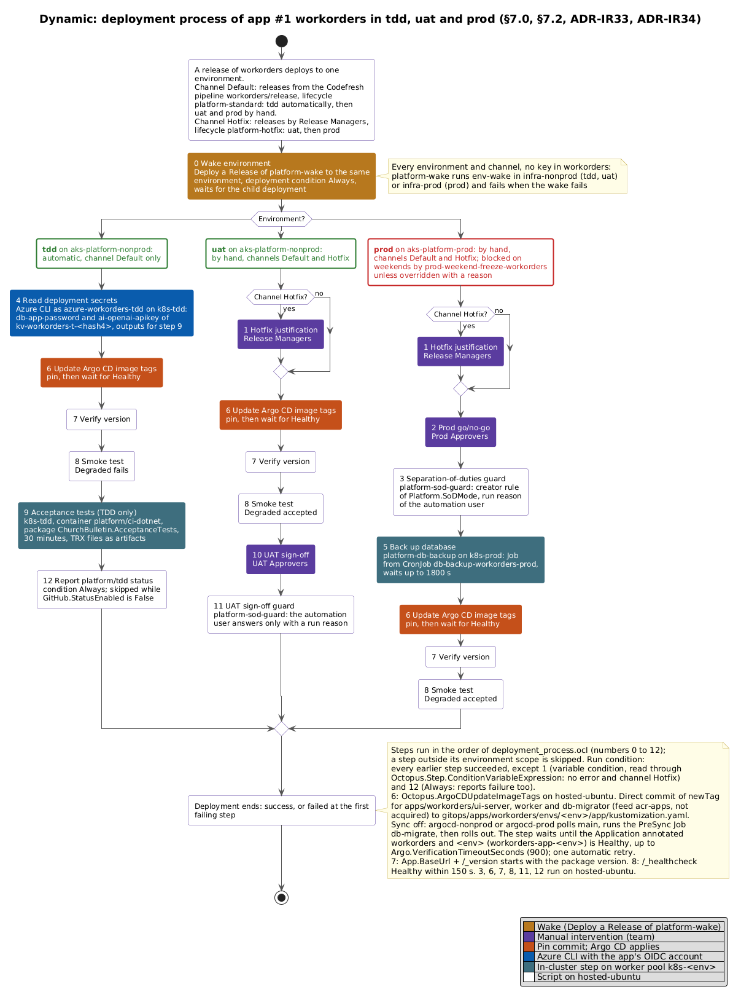

*Dynamic, the deployment process of app #1 in the order of `deployment_process.ocl` (steps 0 to 12), split by target environment. Every deployment first deploys `platform-wake`. In tdd it reads the acceptance secrets, pins, verifies, runs the acceptance tests and reports `platform/tdd`. In uat it pins, verifies and ends with the sign-off and its guard. In prod the go/no-go, the separation-of-duties guard and the pre-release backup come before the pin. The hotfix justification runs in uat and prod on channel `Hotfix` only, through a variable run condition.*

**Runbooks**

| Project | Runbook | Environments | Core steps |
|---|---|---|---|
| `workorders`, `sandbox` | `db-restore` | `uat`, `prod` | Wait for the cluster → manual intervention (`Release Managers` or `Platform Engineers`) → a Job from the suspended CronJob `db-restore-<app>-<env>` in `platform-backup`, restoring the prompted `Restore.BackupName` (empty: the newest backup), on `#{Platform.WorkerPool}`, for up to 60 minutes; prod only from `refs/heads/main` → the app's health path must answer 200 within 150 s (CAP-AZ-010) |
| `workorders` | `run-acceptance-tests` | `tdd` | Wait for the cluster → read deployment secrets → the acceptance tests of step 9 |
| `platform-infrastructure` | `env-plan` | `infra-nonprod`, `infra-prod` | Wake → "Plan to apply a Terraform template" on `terraform/tier` from the project's Git repo: account `#{Azure.LifecycleAccount}`, var file `#{Environment.Class}.tfvars` from Git (ADR-IR14), backend from the `Terraform.State*` variables, variable substitution in `.tf` files off (E29), `TF_VAR_octopus_worker_registration_token` and `TF_VAR_argocd_repo_read_credential` from the sensitive variables when set (ADR-IR1, ADR-IR15) → save the plan as an artifact, and fail when it touches a role assignment, lock or resource group. Terraform steps run on `hosted-ubuntu` in container `octopusdeploy/worker-tools:<worker-tools-version>` from `docker-hub`. |
| `platform-infrastructure` | `env-apply` | `infra-nonprod`, `infra-prod` | Wake → guard (`infra-prod` only from `refs/heads/main`) → plan and check as in `env-plan` → manual intervention (`Platform Engineers`, always) → "Apply a Terraform template" |
| `platform-infrastructure` | `env-destroy` | `infra-nonprod` only | Wake → guard → plan the destroy of the cluster and what depends on it (`-target=azurerm_kubernetes_cluster.this`) → scope check → manual intervention (`Platform Engineers`) → "Destroy Terraform resources". The vault, IPs, workspace, groups and database disks stay. |
| `platform-infrastructure` | `apps-plan` | `infra-nonprod`, `infra-prod` | Guard the prompted `App.Name` (slug, reserved words; `infra-prod` only from `refs/heads/main`) → plan `terraform/apps/tier` with state key `apps-<App.Name>.tfstate` and `TF_VAR_app`, `TF_VAR_tier` → save and check the plan |
| `platform-infrastructure` | `apps-apply` | `infra-nonprod`, `infra-prod` | As `apps-plan` → manual intervention (`Platform Engineers`) → apply |
| `platform-infrastructure` | `rotate-db-passwords` | `infra-nonprod`, `infra-prod` | Wake → guard `App.Name` → for each app environment of the tier: a check that `sa` logs in to pod `db-0` with the password of Secret `db-sa` mounted in the pod (otherwise nothing is rotated); new passwords for `<app>_migrator`, then `<app>_app`, each into the app vault first, then `ALTER LOGIN` in `db-0` as `sa` (the old value goes back into the vault when it fails); a login check of `<app>_app`; a forced refresh of ExternalSecrets `db-migrator` and `db-app`; `kubectl rollout restart` of the app's own Deployments by name (from `status.resources` of its workload Applications), each awaited for up to 10 minutes; then `sa` last, the same way, followed by a forced refresh of `db-sa` and, in uat and prod, `db-sa-<app>-<env>` in `platform-backup`, an annotation on pod `db-0` that remounts `db-sa`, and a wait of up to 3 minutes until `sa` logs in with the mounted password. The restart bypasses Argo CD, whose restart action needs an account and API access the platform does not have; its annotation is not in Git, so Argo CD keeps it (`docs/runbooks/credential-rotation.md` §4). No trigger. |
| `platform-infrastructure` | `env-wake` | `infra-nonprod`, `infra-prod` | Pool `hosted-ubuntu`, account `#{Azure.LifecycleAccount}`. Idempotent. Start cluster: first, when `apr-sleep-<tier>` is enabled while the cluster is Running and not Stopping (a failed stop), disable it and log a warning; then `az aks start --no-wait` when Stopped, wait for Running within `Wake.TimeoutMinutes`; disable `apr-sleep-<tier>`; output `Wake.ClusterStarted`. Wait for workers and gateway: report the health of the `k8s-<env>` workers of the tier and request, without awaiting, a health check for a worker that is not healthy; read the status of Argo CD instance `argocd-<tier>` for up to 2 minutes, best effort; output `Wake.CompletedAt` (ADR-IR33). (gap: it waits for neither healthy workers nor a connected Argo CD instance; tracked) |
| `platform-infrastructure` | `env-sleep` | `infra-nonprod`, `infra-prod` | Hourly (triggers below), same pool and account. Heal alert rule, on every run, dry runs included: when `apr-sleep-<tier>` is enabled while `aks-platform-<tier>` is Running and not Stopping (a stop that Azure accepted and that then failed), disable it and log a warning. Decide sleep, in order: `Sleep.Enabled` false → stay; a queued (to start within 15 minutes), executing or cancelling task in the tier's environments, this run excluded → stay; `Sleep.Force` → sleep; a sleep hold ahead of now (tags `platform-sleep-hold-until` and `platform-sleep-hold-by` on `rg-platform-<tier>-aks`, at most 12 hours ahead, else ignored with a warning) → stay; outside the working window in `Sleep.TimeZone` → sleep; no completed task, or none for `Sleep.IdleMinutes` (env-sleep runs excluded) → sleep. Outputs `Sleep.Decision` and `Sleep.Reason`. Stop cluster, on a sleep decision outside a dry run: enable `apr-sleep-<tier>`, read the task list again, then `az aks stop --no-wait`; an exit before the stop is accepted disables the rule again, and after a stop that fails once Azure has accepted it, the next run's Heal alert rule disables it (ADR-IR33). |
| `platform-infrastructure` | `sleep-hold` | `infra-nonprod`, `infra-prod` | By hand or by `conformance-arm` and its teardown, same pool and account. Prompted `Sleep.HoldMinutes` (0 to 720; 0 releases) and `Sleep.HoldBy`: `az tag update` merges or deletes exactly the two hold tags on `rg-platform-<tier>-aks`; `terraform/foundation` ignores those keys (task #32) |

Wake first (ADR-IR33):
- `db-restore` and `run-acceptance-tests` start with a keyless step, "Wait for the cluster to wake", which waits up to `Wake.WaitMinutes` (prompted, 30) for the app to answer and names both ways to wake it; they cannot wake a cluster themselves.
- `env-plan`, `env-apply`, `env-destroy` and `rotate-db-passwords` start with a `wake-environment` that runs `env-wake` through the Octopus REST API with the step-scoped key and waits up to 60 minutes. The three Terraform runbooks skip it while the cluster does not exist.
- `apps-plan`, `apps-apply`, `env-wake` and `env-sleep` wake nothing.
- `Octopus.Task.ConcurrencyTag` is `<environment-id>/<runbook>` for every runbook, so a runbook never queues behind the caller that waits for it. `env-wake` and `env-sleep` do not share a tag: `env-sleep` stays while any task of the tier runs and re-reads the tasks before it stops, and `env-wake` waits out a stop in progress.

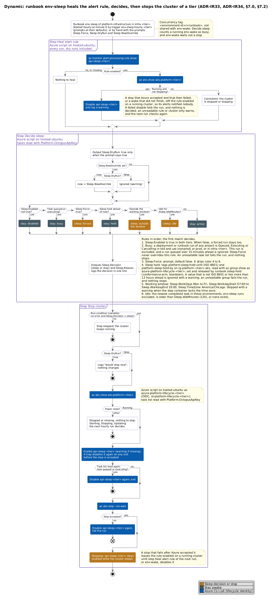

*Dynamic, runbook env-sleep in `infra-<tier>`, started hourly by `env-sleep-hourly-<tier>` or by hand. Step Heal alert rule runs first on every run, dry runs included: when `apr-sleep-<tier>` is enabled while the cluster is Running and not Stopping (a stop that Azure accepted and that then failed), it disables the rule and logs a warning. Step Decide sleep applies the rules in order: `Sleep.Enabled`, a queued or running task, `Sleep.Force`, a sleep hold (tags on `rg-platform-<tier>-aks`, set by runbook `sleep-hold`), the working window, then idle time; it outputs `Sleep.Decision` and `Sleep.Reason`, and a dry run may simulate the clock with `Sleep.NowOverride`. Step Stop cluster runs only on a sleep decision and changes nothing in a dry run; otherwise it enables `apr-sleep-<tier>`, reads the task list again and stops the cluster without waiting; any exit before the stop is accepted disables the rule again.*

**Variables**

| Name | Where | Type | Scope → value |
|---|---|---|---|
| `Platform.WorkerPool` | Library set `Platform Environment` (Terraform) | WorkerPool | `tdd`→`k8s-tdd`, `uat`→`k8s-uat`, `prod`→`k8s-prod` |
| `Platform.AppsDomain` | same | String | Per environment, `<apps-domain-<tier>>` of its tier: the ingress IP read from Azure, dashed, plus `.sslip.io`, unless `apps_domains` overrides it |
| `Platform.Registry`, `Platform.AutomationUsername` | same | String | `<acr-name>.azurecr.io`; `AISF-Service-Account` (ADR-IR32; read by `platform-sod-guard`) |
| `Platform.InterventionTestMode`, `Platform.SoDMode` | same | String | `true` by default (`platform_intervention_test_mode`); `single-operator` (`platform_sod_mode`; the sandbox's channel `Strict` overrides it with `enforce`) |
| `App.BaseUrl` | `.octopus/apps/workorders/workorders/variables.ocl` | String | `https://workorders-#{Octopus.Environment.Name}.#{Platform.AppsDomain}` |
| `App.VersionPath`, `App.HealthPath` | same | String | `/_version`, `/_healthcheck` (sandbox: `/version`, `/healthz`) |
| `Argo.VerificationTimeoutSeconds` | same | String | `900` |
| `Azure.DeployAccount` | same | AzureAccount | `tdd`→`azure-workorders-tdd` |
| `StepImage.CiDotnet` | same | String | `platform/ci-dotnet:<ci-image-version>@sha256:<ci-image-digest>`, without the registry host: the steps' container feed `acr-apps` prefixes it (a full reference became `<host>/<host>/platform/...`, live 2026-09-24) |
| `Smoke.FailOnDegraded` | same | String | `tdd`→`True`; `uat`,`prod`→`False` until #9016 closes |
| `Acceptance.AllowDestructiveReset` | same | String | `tdd`→`True` (no other scope) |
| `Db.Server`, `Db.Name`, `Db.AppLogin` | same | String | `db.workorders-#{Octopus.Environment.Name}.svc.cluster.local`, `workorders`, `workorders_app` |
| `AI.OpenAIUrl`, `AI.OpenAIModel` | same | String | `<azure-openai-endpoint>`, `<model-deployment-name>` |
| `GitHub.StatusEnabled`, `GitHub.StatusContext`, `GitHub.AppRepository` | same | String | `False` until the owner stores the key (R16); `platform/tdd`; `clearmeasure-aisf-sample-apps/20260923-001` |
| `GitHub.StatusAppId`, `GitHub.StatusAppInstallationId` | same | String | `5130161`, `166359160` (App `aisf-octopus-status-reporter`; not secrets) |
| `GitHub.StatusAppPrivateKey` | Octopus database, set by a person | Sensitive | Private key of the statuses-only GitHub App (R16, ADR-IR27) |
| `Wake.WaitMinutes` | same file; prompted in the app runbooks | String | `30` |
| `Restore.BackupName` | same file; prompted in `db-restore` | String | Empty: the newest backup |
| `Environment.Class` | Library set `Platform Infrastructure` (Terraform) | String | `infra-nonprod`→`nonprod`, `infra-prod`→`prod` |
| `Terraform.StateResourceGroup`, `Terraform.StateStorageAccount`, `Terraform.StateContainer`, `Terraform.StateKey` | same | String | `rg-platform-<tier>-shared`, `<tfstate-storage-account-<tier>>`, `tfstate`, `tier-<tier>.tfstate` (the apps runbooks use the key `apps-<App.Name>.tfstate`) |
| `Azure.LifecycleAccount` | `.octopus/platform-infrastructure/variables.ocl` | AzureAccount | `infra-nonprod`→`azure-platform-lifecycle-nonprod`, `infra-prod`→`azure-platform-lifecycle-prod` |
| `Sleep.Enabled`, `Sleep.WorkDays`, `Sleep.WorkdayStart`, `Sleep.WorkdayEnd`, `Sleep.TimeZone`, `Sleep.IdleMinutes` | same | String | Identical in `infra-nonprod` and `infra-prod`: `true`, `Mon,Tue,Wed,Thu,Fri`, `07:00`, `19:00`, `America/Chicago`, `120` (ADR-IR33; a real production sets `Sleep.Enabled` to `false` for `infra-prod`) |
| `Wake.TimeoutMinutes` | same | String | `20` in both |
| `Sleep.Force`, `Sleep.DryRun`, `Sleep.NowOverride` | same; prompted in `env-sleep` | String | `false`, `false`, empty. `Sleep.Force` `true` forces a sleep, never during queued or running tasks and never when `Sleep.Enabled` is `false`; `Sleep.DryRun` `true` decides and logs but stops nothing; `Sleep.NowOverride` sets the clock of a dry run. |
| `App.Name` | same; prompted in `apps-plan`, `apps-apply` and `rotate-db-passwords` | String | An app slug, for example `workorders` |
| `Octopus.Task.ConcurrencyTag` | same; unscoped | String | `#{Octopus.Environment.Id}/#{Octopus.Runbook.Name}` |
| `Octopus.WorkerRegistrationToken` | Octopus database (Terraform), scoped to `env-plan`, `env-apply` and `env-destroy` | Sensitive, prompted, optional | Short-lived; given at the prompt of each `env-apply` that installs or replaces workers; passed as `TF_VAR_octopus_worker_registration_token` |
| `ArgoCD.RepoReadCredential` | Octopus database (`platform-infrastructure`): Terraform when `TF_VAR_argocd_repo_read_credential` is given, otherwise a Platform Engineer | Sensitive | JSON repository credential of Argo CD, the stored PAT until R11; passed as `TF_VAR_argocd_repo_read_credential` (ADR-IR15) |
| `PlatformWake.OctopusApiKey` | Library set `Platform Automation` (Terraform, from `TF_VAR_platform_octopus_api_key`), included in `platform-wake` only | Sensitive | The Space Manager key (ADR-IR32): runs `env-wake` and reads its task. The step reads no other non-system variable (CAP-OCT-014) and sends the key only to an `*.octopus.app` URL. |
| `Platform.OctopusApiKey` | Sensitive project variable of `platform-infrastructure` (Terraform, from `TF_VAR_platform_octopus_api_key`), scoped to processes `env-wake`, `env-sleep`, `env-plan`, `env-apply`, `env-destroy`, `rotate-db-passwords` and steps `wake-environment`, `wait-for-workers-and-gateway`, `decide-sleep`, `stop-cluster` | Sensitive | The same key. Runs runbooks and reads tasks only; never in an app project (ADR-IR33, S5, CAP-OCT-013; scope IDs [VERIFY], §12 Q26; fallback `infrastructure_key_scope = "unscoped"`). |

Output variables are addressed by step name: `Octopus.Action[<step name>].Output.<variable>` (E46, ADR-IR22). `env-wake` writes `Wake.ClusterStarted` and `Wake.CompletedAt`; `env-sleep` writes `Sleep.Decision`, `Sleep.Reason` and `Sleep.DryRun`; `platform-sod-guard` writes `SodGuard.Result`, `SodGuard.Approver` and `SodGuard.Reason`; `db-restore` writes `Restore.JobName`.

**Infrastructure and people**

| Object | Value |
|---|---|
| Worker pools | Static Kubernetes worker pools `k8s-tdd`, `k8s-uat`, `k8s-prod`, one worker `octopus-worker-<env>` each, installed and registered by `terraform/tier` at `env-apply`; shared by every app for the steps that must run in a cluster (acceptance tests, backups, restores). The built-in dynamic pool `Hosted Ubuntu` (slug `hosted-ubuntu`) runs every other step: Terraform, `env-wake`, `env-sleep`, the step of `platform-wake`, the image-tag step and the checks, with container `octopusdeploy/worker-tools:<worker-tools-version>` where a step needs tools (ADR-IR33) |
| Machine policy | `Sleep-tolerant Kubernetes workers`, for the `k8s-<env>` workers: no scheduled health checks (`env-wake` requests one, without awaiting it, for a worker that is not healthy); unavailable workers neither fail health checks nor get deleted; Octopus keeps upgrading the agent after a health check (E30) |
| Accounts | Stored: `Azure Runtime Provisioner` (slug `azure-runtime-provisioner`), used by nothing. Terraform: `azure-platform-lifecycle-nonprod` (`infra-nonprod`), `azure-platform-lifecycle-prod` (`infra-prod`), and `azure-<app>-<env>` for each environment of a descriptor with `octopus.azureAccount: true` (`azure-workorders-tdd`, `-uat`, `-prod`). Each is restricted to its environment. Execution subject keys `space`, `project`, `environment`; audience `api://AzureADTokenExchange`. Health and account-test subjects keep their defaults and have no federated credential, so "Save and test" fails by design. |
| Feeds | Built-in (slug `octopus-server-built-in`): `ChurchBulletin.AcceptanceTests`. `acr-apps`: Azure Container Registry feed at `https://<acr-name>.azurecr.io`, OIDC client `id-octopus-acr-pull`, subject keys `space`, `feed`; it serves the `apps/<app>/<image>` versions of releases and of the image-tag step, and the `platform/ci-dotnet` step images. `docker-hub`: anonymous Docker Hub feed for the worker-tools container (ADR-IR6). |
| Git credential | Stored: `GitHub clearmeasure-aisf-sample-apps`, restricted to the environment repo (R3; a check in `octopus/terraform` reports it otherwise) |
| Library variable sets | Stored: `Azure Runtime Provisioning` and `GitHub AISF Sample Apps`, both included nowhere. Terraform: `Platform Environment` and `Platform Infrastructure` (renamed from `WorkOrders Environment` and `WorkOrders Infrastructure`, IDs kept), from the untracked `terraform.tfvars` and Azure lookups; `Platform Automation` (sensitive `PlatformWake.OctopusApiKey`), included in `platform-wake` only (ADR-IR33). |
| Automation user | None created. The existing user `AISF-Service-Account` (Space Manager) is read by name. Its API key serves Codefresh (`platform-octopus`), the gateway (ADR-IR32) and, as `PlatformWake.OctopusApiKey` and `Platform.OctopusApiKey`, the platform-owned wake and sleep steps (ADR-IR33). It is a member of `CI Release Publishers`, `UAT Approvers`, `Prod Approvers` and `Platform Engineers`; `Platform.AutomationUsername` names it for `platform-sod-guard`. |
| Teams | Space teams with built-in roles only (ADR-IR32); every scope names environments only. `Platform Engineers` (Space Manager; answers the approvals of `env-apply`, `env-destroy`, `apps-apply` and `db-restore`), `Release Managers` (Project Deployer in `tdd`, `uat` and `prod`, and Release Creator; override the prod freeze with a reason), `UAT Approvers` and `Prod Approvers` (Project Deployer, scoped to `uat` and `prod`), `SRE On-call` (Runbook Consumer in `uat`, `prod`, `infra-nonprod` and `infra-prod`, for the app runbooks, force-wake and force-sleep, ADR-IR33; Project Viewer), `Developers` (Project Viewer), `CI Release Publishers` (Release Creator and Package Publisher). Project Deployer includes DeploymentCreate, so the deploying teams can deploy `platform-wake` in their environments without a Deployment Creator grant (§12 Q31). |
| User roles | None custom (ADR-IR32). |
| Terraform state | `octopus/terraform` uses key `octopus-space.tfstate` in `<tfstate-storage-account-global>` (ADR-IR9). `octopus/apply.ps1` plans with `-parallelism=1` and refuses a plan that deletes or replaces anything but scoped user roles and variables. |
| Triggers | Scheduled runbook triggers `env-sleep-hourly-nonprod` and `env-sleep-hourly-prod`: runbook `env-sleep` in `infra-nonprod` and `infra-prod`, cron `0 0 * * * *` (Octopus cron has a seconds field), time zone `UTC` (`env_sleep_trigger_timezone`). An hourly schedule does not depend on the time zone; `env-sleep` evaluates the working window in `Sleep.TimeZone`. A trigger runs the runbook from the latest commit of `main`. The runbook is named by its slug [VERIFY, Q27]; the fallback `env_sleep_triggers_managed = false` creates both triggers through the REST API ([docs/preview-octopus.md](../docs/preview-octopus.md)). (ADR-IR33) |
| Argo CD instances (gateway registration names) | `argocd-nonprod` (environments `tdd`, `uat`) and `argocd-prod` (environment `prod`) |

### 7.3 Argo CD

As implemented (2026-09-25). The tenant chart renders every app-specific object (§7.0 Tenant); `argocd/clusters/*/apps/` and a previews ApplicationSet do not exist.

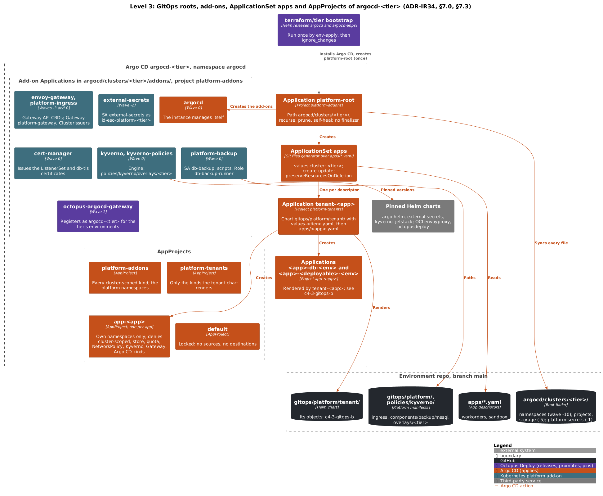

*Level 3, Argo CD. Each app cluster runs one Argo CD instance, `argocd-<tier>`, rooted in `argocd/clusters/<tier>/`. The `terraform/tier` bootstrap installs Argo CD and the Application `platform-root` once; `platform-root` then syncs the namespaces, AppProjects, storage, platform secrets, add-on Applications and the ApplicationSet `apps` from main. The ApplicationSet reads `apps/*.yaml` and creates one Application `tenant-<app>` per descriptor, which renders `gitops/platform/tenant/` with `values-<tier>.yaml` and the descriptor. Four AppProjects fence the result: `platform-addons` (every cluster-scoped kind), `platform-tenants` (only what the tenant chart renders), `app-<app>` per app, and a locked `default`.*

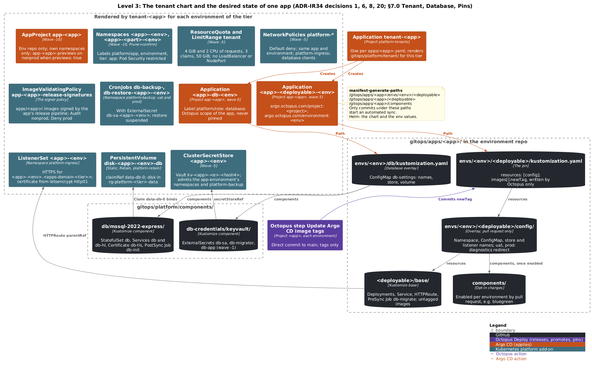

*Level 3, one tenant. For each environment of its tier, `tenant-<app>` renders the app's fences: the AppProject `app-<app>`, namespaces, quota and LimitRange, NetworkPolicies, the ClusterSecretStore `<app>-<env>`, the ListenerSet `<app>-<env>`, a static PersistentVolume, the signer policy and the backup CronJobs; and two Applications: `<app>-db-<env>` at wave 0 and `<app>-<deployable>-<env>` at wave 5 (with the Octopus annotations). The database overlay combines `mssql-2022-express` and `db-credentials/keyvault`; the deployable overlay references its config folder, the shared base and opt-in components. Octopus writes only `images[].newTag` in `envs/<env>/<deployable>/kustomization.yaml`; `manifest-generate-paths` limits automated syncs to commits under the deployable's own paths.*

| Object | Instance | Definition |
|---|---|---|
| Root Application `platform-root` | Each | Created only by the bootstrap `argocd-apps` Helm release (chart 2.0.5), with values from `argocd/bootstrap/root-app-<tier>.yaml`, which also carry a bootstrap copy of AppProject `platform-addons`. Project `platform-addons`. Source `<ENV_REPO_URL>`, `main`, path `argocd/clusters/<tier>`, `directory.recurse: true`. Automated sync with prune and self-heal; retry limit 10, backoff 30 s ×2 up to 5 m. No finalizer. |
| AppProject `platform-addons` | Each | The only project allowed cluster-scoped kinds (all kinds). Sources: the environment repo; the chart repositories `https://argoproj.github.io/argo-helm`, `https://charts.external-secrets.io`, `https://kyverno.github.io/kyverno/` and `https://charts.jetstack.io`; the OCI repositories `docker.io/envoyproxy` and `registry-1.docker.io/octopusdeploy`. Destinations: `argocd`, `external-secrets`, `kyverno`, `cert-manager`, `octopus-argocd-gateway`, `platform-ingress`, `platform-backup`, `argo-rollouts`. |
| AppProject `platform-tenants` | Each | The `tenant-<app>` Applications. Source: the environment repo. Destinations: `argocd`, `platform-ingress`, `platform-backup` and the tier's app namespaces (`*-tdd`, `*-uat` on nonprod; `*-prod` on prod). Exactly the kinds the tenant chart renders: cluster-scoped Namespace, PersistentVolume, ClusterSecretStore and ImageValidatingPolicy; namespaced AppProject, Application, ResourceQuota, LimitRange, NetworkPolicy, ListenerSet, ExternalSecret and CronJob. |
| AppProject `app-<app>` | Each | Rendered by the tenant chart (§7.0 AppProjects). Source: the environment repo only. Destinations: the app's own namespaces of the tier. No cluster-scoped kind; no ResourceQuota, LimitRange, NetworkPolicy, SecretStore, ClusterSecretStore, Kyverno kind, Gateway, ListenerSet, Application, ApplicationSet or AppProject. Orphaned resources warn. No project roles. |
| AppProject `app-<app>-previews` | nonprod, descriptor `previews: true` (phase 6) | Destinations `<app>-pr-*`; the same fence, except that a preview brings its own quota, LimitRange and NetworkPolicies. |
| Project `default` | Each | Locked: no sources, no destinations. |
| ApplicationSet `apps` | Each | §7.0 Roots. One Application `tenant-<app>` per `apps/<app>.yaml`: project `platform-tenants`, chart `gitops/platform/tenant` with `values-<tier>.yaml` and the descriptor as the last values file; automated prune and self-heal; `FailOnSharedResource=true`, `PruneLast=true`; retry limit 10. |
| Applications `<app>-db-<env>` | Each, apps with a database | Project `app-<app>`, path `gitops/apps/<app>/envs/<env>/db`, namespace `<app>-<env>`, label `platform/role: database`, wave 0. Annotations `argo.octopus.com/project` (the first deployable's project) and `argo.octopus.com/environment`, so Octopus maps it to the project; its folder names no image of the app's packages, so Octopus never pins it. |
| Applications `<app>-<deployable>-<env>` | Each | Project `app-<app>`. Source `<ENV_REPO_URL>`, `main`, path `gitops/apps/<app>/envs/<env>/<deployable>` (kustomize, raw), or the vendored chart `gitops/apps/<app>/<helm.chart>` with `envs/<env>/<deployable>/values.yaml` (helm). Destination `https://kubernetes.default.svc`, namespace `<app>-<env>` or `<app>-<part>-<env>`. Annotations `argo.octopus.com/project` (the deployable's Octopus project), `argo.octopus.com/environment: <env>`, `argo.octopus.com/image-replace-paths` (helm only) and `argocd.argoproj.io/manifest-generate-paths` (the overlay, the deployable's base and the app's components). Wave 5. Sync: automated prune and self-heal; `PruneLast=true`; retry limit 5 with refresh, backoff 30 s ×2 up to 5 m. No finalizer. App #1: `workorders-app-<env>`. |
| Add-on Applications | Each | `argocd` (the instance manages itself with the bootstrap values; chart argo-cd 10.9.2), `external-secrets` (2.11.0), `kyverno` (3.9.1) and `kyverno-policies` (path `policies/kyverno/overlays/<tier>`), `cert-manager` (v1.21.2), `envoy-gateway` (gateway-helm v1.9.1) and `platform-ingress` (path `gitops/platform/ingress/overlays/<tier>`), `platform-backup` (path `gitops/platform/components/backup/mssql`), `octopus-argocd-gateway` (chart 2.1.0; registration environments: nonprod `tdd`, `uat`; prod `prod`). None carries Octopus annotations. `argocd/optional/argo-rollouts.yaml` waits for phase 6. |
| Previews | nonprod, phase 6 | No ApplicationSet yet: `gitops/apps/workorders/previews/` holds the preview overlay, and `app-<app>-previews` the fence. |
| Configuration | Each | `timeout.reconciliation: 30s` (jitter 10s). `admin.enabled: false`. SSO through Entra with workload identity (`<argocd-sso-app>`; its federated credential is added after each cluster build [VERIFY]). Local account `octopus` with capability `apiKey`. Policies: `p, octopus, applications, get, app-*/*, allow`; `p, octopus, logs, get, app-*/*, allow`; `p, octopus, clusters, get, *, allow`. An Application reports the health of its child Applications, so a tenant creates a workload Application only once its database Application is Healthy (CAP-GIT-008). `applicationsetcontroller.enable.policy.override: true`, for `applicationsSync: create-update`. Impersonation off until phase 4. |

### 7.4 Kubernetes namespaces

As implemented (2026-09-25). Namespaces follow §7.0; the tenant chart creates the app namespaces. App #1 reads the ClusterSecretStore `workorders-<env>`: no SecretStore and no ESO service account live in its namespaces.

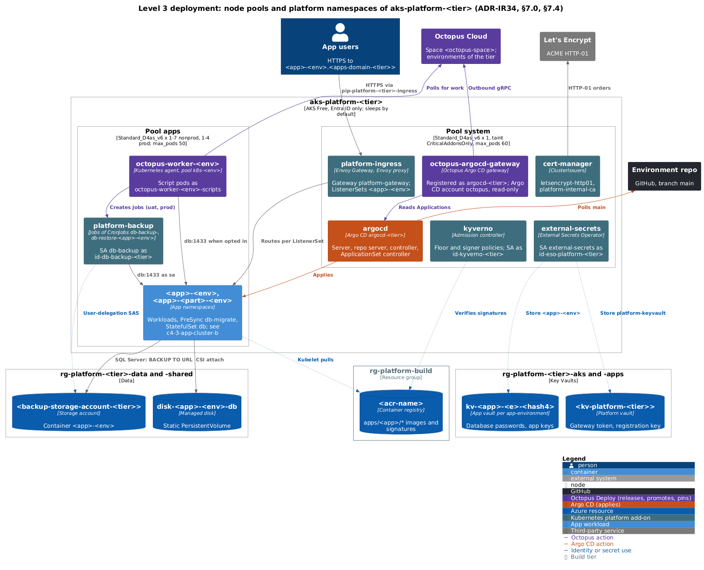

*Level 3 deployment, inside `aks-platform-<tier>`. The add-ons tolerate `CriticalAddonsOnly` and run on the one-node system pool: argocd, external-secrets, kyverno, cert-manager, octopus-argocd-gateway and platform-ingress (Envoy, Gateway `platform-gateway`). The apps pool holds the app namespaces, the Octopus workers `octopus-worker-<env>` and the platform-backup Jobs. Every connection starts inside the cluster: Argo CD polls main, the gateway dials Octopus over gRPC, the workers poll for work, ESO reads the vaults, and SQL Server writes backups to Blob storage with a SAS that the backup Job obtains.*

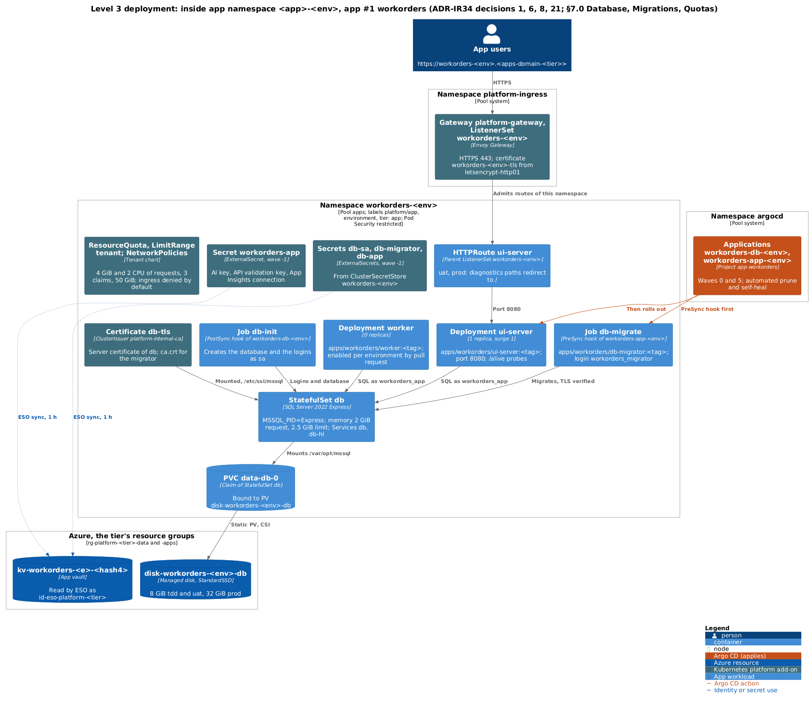

*Level 3 deployment, app #1 in namespace `workorders-<env>`. The HTTPRoute `ui-server` attaches to the ListenerSet `workorders-<env>` in platform-ingress and forwards to the Deployment `ui-server`; the Deployment `worker` stays at zero replicas. On every sync of `workorders-app-<env>`, the PreSync Job `db-migrate` migrates the database before the rollout. The StatefulSet `db` runs SQL Server 2022 Express on the claim `data-db-0`, statically bound to `disk-workorders-<env>-db`, with the certificate `db-tls` from `platform-internal-ca` and a PostSync Job `db-init` for the logins. The Secrets `db-sa`, `db-migrator`, `db-app` and `workorders-app` come from the app vault through ExternalSecrets; the tenant quota and NetworkPolicies fence the namespace. The sandbox has the same shape with the Deployment `web` and no app secret.*

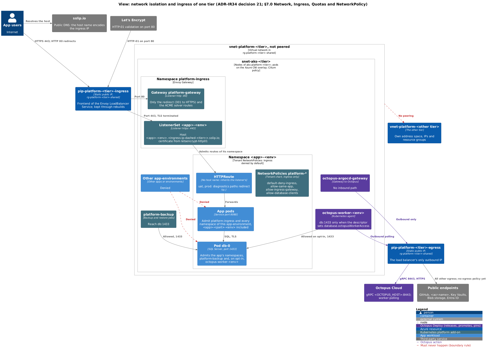

*Network view. Each tier has its own `vnet-platform-<tier>`, not peered, with nodes in `snet-aks-<tier>` and pods on Azure CNI overlay with Cilium policy. Users resolve `<app>-<env>.<ingress-ip-dashed-<tier>>.sslip.io` to `pip-platform-<tier>-ingress`. The Gateway `platform-gateway` answers port 80 with the HTTPS redirect and the ACME HTTP-01 solvers; the ListenerSet `<app>-<env>` terminates TLS with a Let's Encrypt certificate and admits only routes from its own namespace; in uat and prod the app's HTTPRoute redirects diagnostics paths to `/`. Tenant NetworkPolicies deny ingress by default and admit platform-ingress, the app environment's own namespaces, and database traffic from platform-backup and, when the descriptor opts in, from `octopus-worker-<env>`; egress leaves through `pip-platform-<tier>-egress`, and the Octopus gateway and workers connect outbound only.*

| Cluster | Namespace | Created by | Purpose |
|---|---|---|---|
| nonprod, prod | `argocd` | `terraform/tier` bootstrap | Argo CD |
| nonprod, prod | `external-secrets`, `kyverno`, `cert-manager`, `octopus-argocd-gateway`, `platform-ingress`, `platform-backup` | `argocd/clusters/<tier>/namespaces.yaml` (label `tier: platform`; Pod Security enforces `baseline` and warns `restricted`, and `platform-backup` enforces `restricted`) | Add-ons, the Gateway, backup and restore Jobs |
| nonprod | `<app>-tdd`, `<app>-uat`, and `<app>-<part>-<env>` | Tenant chart | App environments (labels `platform/app: <app>`, `environment: <env>`, `tier: app`, Pod Security `restricted`) |
| prod | `<app>-prod`, `<app>-<part>-prod` | Tenant chart | App environments |
| nonprod | `octopus-worker-tdd`, `octopus-worker-uat` | `terraform/tier` | Octopus Kubernetes workers |
| prod | `octopus-worker-prod` | `terraform/tier` | Octopus Kubernetes worker |
| nonprod | `<app>-pr-<number>` | Argo CD (phase 6) | Previews |
| nonprod, prod | `argo-rollouts` | Argo CD (phase 6) | Rollouts controller |
| build | `codefresh` | Codefresh Runner install (`codefresh/runner/values.yaml`, release `cf-runtime`) | Builds only |

Workload objects in `workorders-<env>`:

| Kind | Name |
|---|---|
| Deployments | `ui-server` (one replica); `worker` (zero replicas in every environment until enabled, ADR-D16) |
| StatefulSet | `db` (claim `data-db-0`, bound to `disk-workorders-<env>-db`) |
| Services | `ui-server` (port 8080 → 8080); `db` (1433) and `db-hl` |
| Jobs | PreSync `db-migrate` (Application `workorders-app-<env>`); PostSync `db-init` (Application `workorders-db-<env>`) |
| ServiceAccounts | `ui-server`, `worker` |
| PodDisruptionBudget | `ui-server` |
| HTTPRoute | `ui-server`, attached to ListenerSet `workorders-<env>` |
| ExternalSecrets and target Secrets | `workorders-app`; `db-sa`, `db-migrator`, `db-app` |
| Certificate | `db-tls` (ClusterIssuer `platform-internal-ca`) |
| ConfigMaps | `workorders-config`, `db-settings` (from generators) |
| Tenant objects | ResourceQuota and LimitRange `tenant`; NetworkPolicies `platform-default-deny-ingress`, `platform-allow-same-app`, `platform-allow-ingress-gateway`, `platform-allow-database-clients` |

### 7.5 Images, packages and versions

As implemented (2026-09-25). Images live under `apps/<app>/` and previews under `apps-previews/<app>/` of the shared registry. `ChurchBulletin.Database` is no longer pushed, because the migrator image runs the scripts. The feed is `acr-apps`.

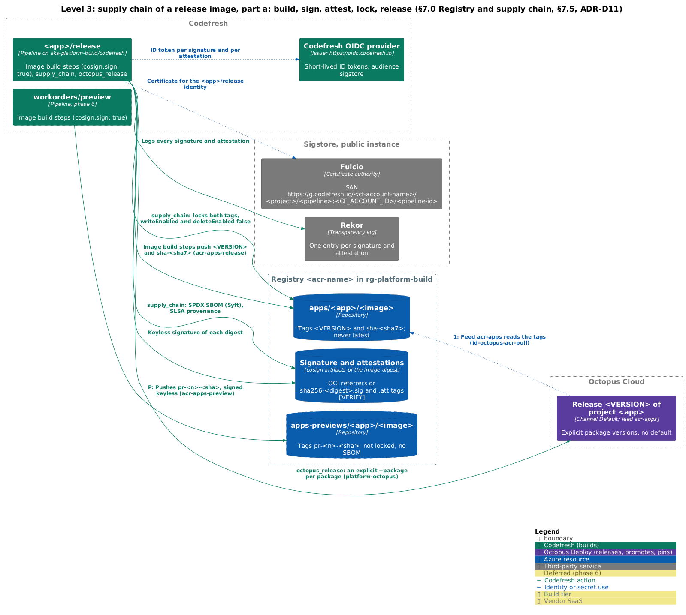

*Dynamic, build half of the supply chain (steps 1 to 9; previews P). The image builds of `<app>/release` push `<VERSION>` and `sha-<sha7>` with `cf-apps-release` and sign each digest keyless (Codefresh ID token, issuer `https://oidc.codefresh.io`, a short-lived Fulcio certificate, the Rekor log); `supply_chain` attaches the SPDX SBOM and step-authored SLSA provenance and locks both tags; `octopus_release` creates the release, whose feed `acr-apps` reads the tags. Previews (phase 6) push signed, unlocked `pr-<n>-<sha>` tags to `apps-previews`.*

| Artifact | Name | Tag or version | Producer |
|---|---|---|---|
| UI image | `<acr-name>.azurecr.io/apps/workorders/ui-server` | `<VERSION>` and `sha-<sha7>`, both locked after signing; never `latest` | `workorders/release` (the app repo's root `Dockerfile`, copied verbatim with OCI labels, over the staged `built/`; `codefresh/apps/workorders/scripts/stage-built.sh`) |
| Worker image | `<acr-name>.azurecr.io/apps/workorders/worker` | Same | `workorders/release` (`containers/apps/workorders/worker/Dockerfile`, base `mcr.microsoft.com/dotnet/aspnet:10.0` pinned by digest, entrypoint `dotnet Worker.dll`) |
| Migrator image | `<acr-name>.azurecr.io/apps/workorders/db-migrator` | Same | `workorders/release` (`containers/apps/workorders/db-migrator/Dockerfile`, base `mcr.microsoft.com/dotnet/runtime:10.0` pinned by digest, entrypoint `migrate.sh`, which runs `dotnet ClearMeasure.Bootcamp.Database.dll` and retries until `MIGRATION_DB_READY_TIMEOUT_SECONDS`) |
| Preview images (phase 6) | `<acr-name>.azurecr.io/apps-previews/workorders/{ui-server,worker,db-migrator}` | `pr-<number>-<40-hex head sha>`, signed, not locked | `workorders/preview` (ADR-IR8) |
| Fixture images | `apps/sandbox/web`, `apps/sandbox/migrator`; `apps/sandbox/unsigned:0.0.0-fixture` | `<VERSION>` and `sha-<sha7>`; the unsigned fixture is never pinned or signed | `sandbox/release`; `platform-env/fixtures` |
| CI toolchain images | `<acr-name>.azurecr.io/platform/ci-dotnet`, `<acr-name>.azurecr.io/platform/db-tools-mssql` | `<ci-image-version>` (date-based), signed; consumers pin `@sha256:<ci-image-digest>` | `platform-env/ci-image-dotnet` from `containers/platform/{ci-dotnet,db-tools-mssql}/Dockerfile`. `ci-dotnet`: .NET SDK 10 with pwsh 7 and PSScriptAnalyzer, docker CLI, cosign, Syft, Helm 4, kustomize, kubeconform, Terraform, yamllint, the Octopus CLI, Azure CLI, sqlcmd and Playwright Chromium. |
| Octopus packages (built-in feed) | `ChurchBulletin.AcceptanceTests` | `<VERSION>` | `workorders/release`. `ChurchBulletin.UI` and `ChurchBulletin.Script` ship as the image and are not pushed. |
| Octopus Docker package IDs (feed `acr-apps`) | `apps/workorders/ui-server`, `apps/workorders/worker`, `apps/workorders/db-migrator` | `<VERSION>` | — |
| Version | `2.5.<first-parent height>` on master; `2.5.<height>-ci.<sha7>` on other branches, never released; Hotfix releases `<package-version>-hotfix.<n>` | — | `codefresh/apps/workorders/scripts/version.sh` with `codefresh/apps/workorders/version.env` |
| OCI labels | `org.opencontainers.image.source=https://github.com/clearmeasure-aisf-sample-apps/20260923-001` (for `platform/*`: the environment repo), `org.opencontainers.image.revision=<sha>`, `org.opencontainers.image.version=<VERSION>` | — | All image builds |

### 7.6 Environment pin contract

As implemented (2026-09-25). A deployment pins `gitops/apps/<app>/envs/<env>/<deployable>/`: `images[].newTag` of `kustomization.yaml` (kustomize), the values at `argo.octopus.com/image-replace-paths` (helm) or the `image:` fields of the manifests (raw) (§7.0 Pins).

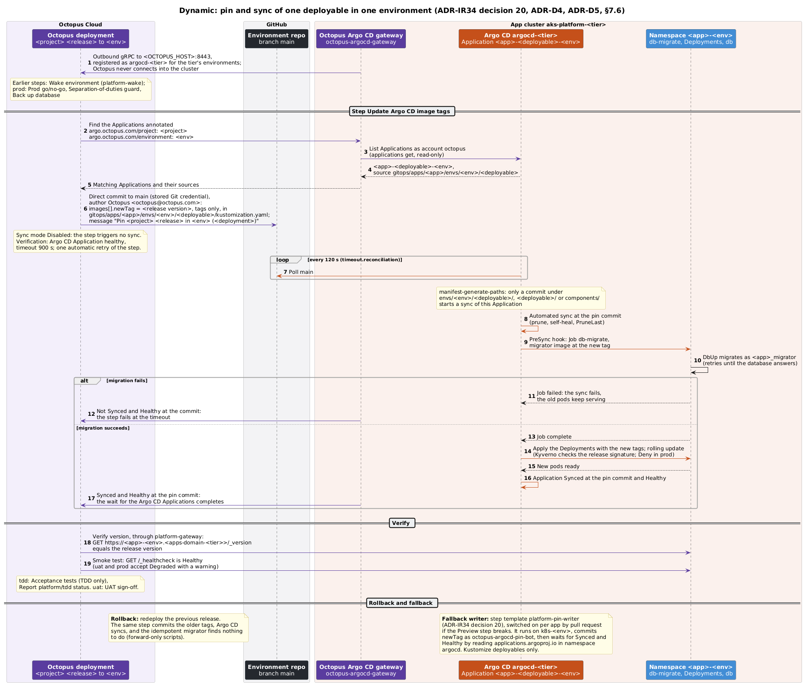

*Dynamic, pin and sync. The step Update Argo CD image tags finds the Applications annotated with the deployment's project and environment through the Octopus Argo CD gateway (outbound gRPC from the cluster), then commits `images[].newTag` to `gitops/apps/<app>/envs/<env>/<deployable>/kustomization.yaml` on main as Octopus, without triggering a sync. Argo CD's next poll (scoped by `manifest-generate-paths`) syncs, runs the PreSync `db-migrate` and rolls out; the gateway reports Synced and Healthy at the pin commit, which ends the step's 900-second wait; Verify version and Smoke test follow. A failed migration fails the sync while the old pods keep serving; a rollback redeploys the previous release; `platform-pin-writer` is the fallback writer.*

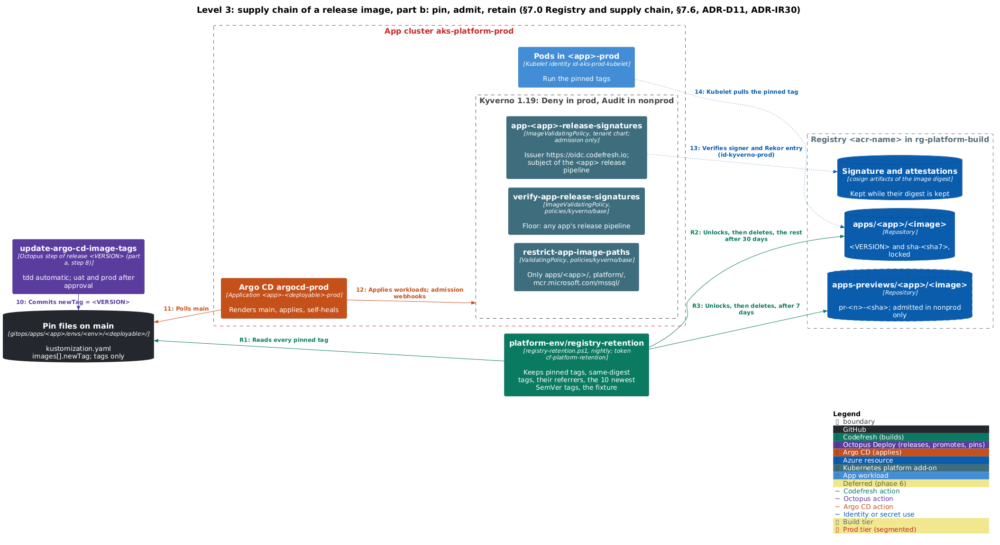

*Dynamic, run half of the supply chain (steps 10 to 14; retention R1 to R3). Octopus pins `newTag=<VERSION>` per environment and `argocd-prod` applies main; Kyverno admits a workload only if its `apps/<app>/` images carry a keyless signature of the app's own release pipeline and come from the app's registry path (deny in prod, audit in nonprod); the kubelet pulls the pinned, locked tag. The nightly registry-retention keeps pinned tags, referrers, same-digest tags, the 10 newest SemVer tags and the fixture, and unlocks and then deletes the rest after 30 days (7 for `apps-previews`).*

| Environment | File Octopus writes | Fields Octopus writes | Value |
|---|---|---|---|
| `tdd` | `gitops/apps/workorders/envs/tdd/app/kustomization.yaml` | `images[name=<acr-name>.azurecr.io/apps/workorders/ui-server].newTag`, and the same for `worker` and `db-migrator` | The package version selected in the release (equal to the release number on channel `Default`) |
| `uat` | `gitops/apps/workorders/envs/uat/app/kustomization.yaml` | Same three fields | Same |
| `prod` | `gitops/apps/workorders/envs/prod/app/kustomization.yaml` | Same three fields | Same |

The database Application `workorders-db-<env>` carries the Octopus scope of `workorders` (project, environment) and is never pinned. Required shape of each pin file. Nothing else may appear except `resources: [config]`.

```yaml
apiVersion: kustomize.config.k8s.io/v1beta1
kind: Kustomization
resources:
  - config
images:
  - name: <acr-name>.azurecr.io/apps/workorders/ui-server
    newTag: "<VERSION>"
  - name: <acr-name>.azurecr.io/apps/workorders/worker
    newTag: "<VERSION>"
  - name: <acr-name>.azurecr.io/apps/workorders/db-migrator
    newTag: "<VERSION>"   # written by Octopus only
```

Base manifests reference the three images without a tag; the bootstrap pin is `0.0.0-bootstrap`. Octopus matches the full image name, registry included: the first pins (`2.5.721` in tdd, uat and prod, commits `2817a38`, `0ee2f04` and `ca48bd5` of 2026-09-24 by `Octopus <octopus@octopus.com>`) changed only the `newTag` lines; Octopus may drop a line's trailing comment when it rewrites it.

### 7.7 Codefresh

As implemented (2026-09-25), with the contexts and integrations of §7.0. App pipelines live in `codefresh/apps/<app>/`, platform pipelines in `codefresh/platform/`; `platform-env/ci-image-dotnet` replaced `workorders/ci-image`; the handoff runs the Octopus CLI of `platform/ci-dotnet` (ADR-IR18) and names the migrator image instead of `ChurchBulletin.Database`.

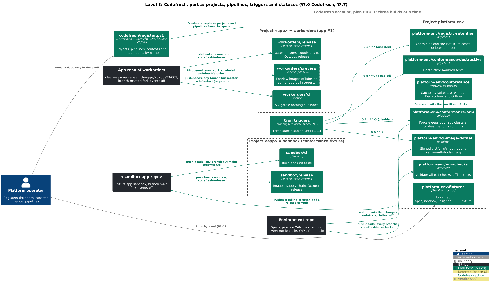

*Level 3, Codefresh projects and pipelines (plan BASIC_1: one build at a time) and what starts each. App repos start `<app>/ci` on every branch but the release branch, `<app>/release` on it and `workorders/preview` on labelled same-repo pull requests; fork events are off. Each pipeline posts its `codefresh/*` status; `codefresh/ci` is the required check of master. The environment repo starts env-checks and ci-image-dotnet; crons start ci-image-dotnet weekly and conformance-arm, conformance-destructive and registry-retention once P1-13 enables them. conformance-arm pushes the sandbox commits and queues conformance; `codefresh/register.ps1` creates or replaces every project, pipeline, context and integration by name.*

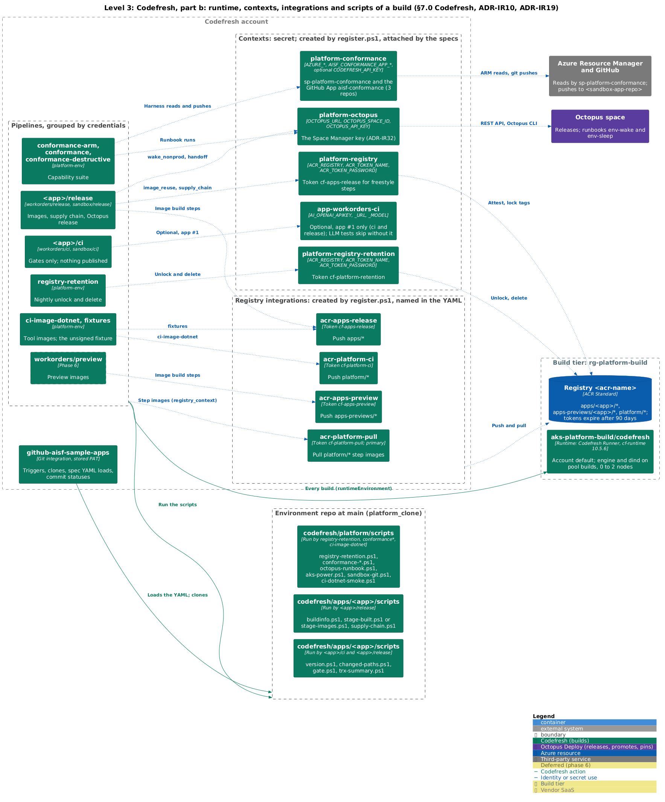

*Level 3, what a build uses: the runtime `aks-platform-build/codefresh`; YAML and scripts from main of the environment repo through the Git integration `github-aisf-sample-apps`; step images pulled with `acr-platform-pull`; secret contexts only in the pipelines whose specs attach them (`platform-registry` and `platform-octopus`: release; `platform-registry-retention`: retention; `platform-octopus` and `platform-conformance`: conformance; `app-workorders-ci`: app #1 only); registry integrations push with repository-scoped tokens (`acr-apps-release` to `apps/*`, `acr-apps-preview` to `apps-previews/*`, `acr-platform-ci` to `platform/*`).*

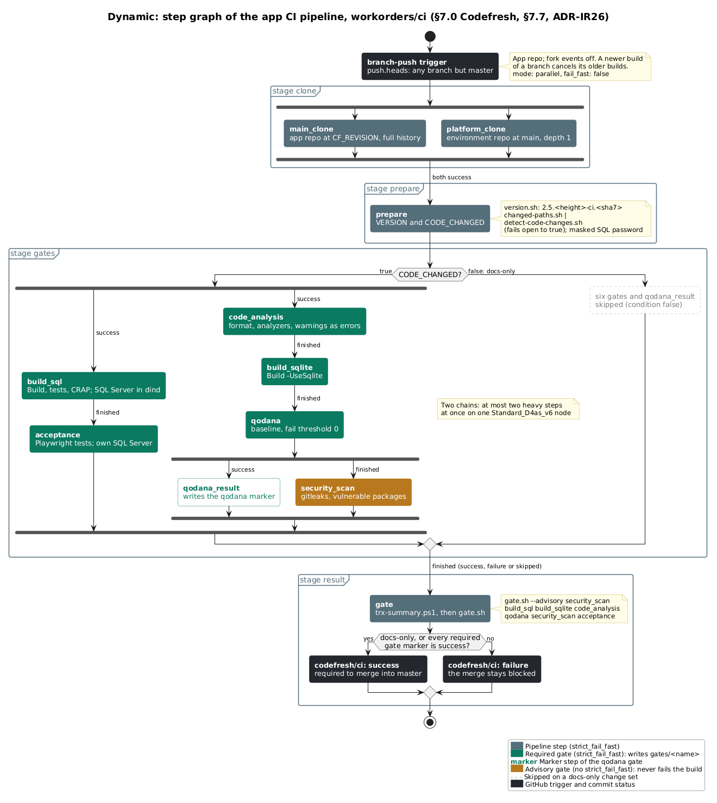

*Dynamic, the step graph of `workorders/ci`. Both clones feed `prepare` (`VERSION`, `CODE_CHANGED`); six gates run in two chains of about equal length (`acceptance` alone; `build_sql`, then `code_analysis`, `build_sqlite`, `qodana`) with the light, advisory `security_scan` beside them, so at most two heavy steps share the build node; `gate` waits for every chain, prints the TRX summary and applies the build-result rules: a docs-only change passes with the gates skipped; otherwise each required gate must write its success marker, and `security_scan` is advisory. The build result is the required status `codefresh/ci`.*

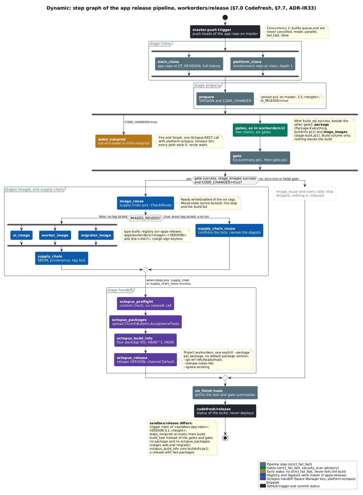

*Dynamic, the step graph of `workorders/release`, the build of record. After `prepare`, `wake_nonprod` asks Octopus to run env-wake in `infra-nonprod` (it never waits or fails) while the gates run; `package` and `stage_images` follow `build_sql`, beside the other gates, and write only to the build volume; a passing gate with code changes leads to `image_reuse`, which picks either build, sign, attest and lock (`supply_chain`) or, on a rerun of the same commit, a check of the lock (`supply_chain_reuse`); both reach the Octopus handoff, which ends with the release `VERSION`. The pipeline never deploys.*

| Object | Name | Contract |
|---|---|---|
| Projects | `workorders`, `sandbox` (apps); `platform-env` (environment repo) | — |
| Pipeline specs | App pipelines: spec `codefresh/apps/<app>/specs/<name>.yml`, YAML `codefresh/apps/<app>/pipelines/<name>.yml`. Platform pipelines: `codefresh/platform/specs/<name>.yml`, `codefresh/platform/pipelines/<name>.yml`. | `specTemplate`: repo `clearmeasure-aisf-sample-apps/basic-environment-octopus-codefresh`, `revision: main`, context `github-aisf-sample-apps` (ADR-D18). Every spec names runtime `aks-platform-build/codefresh`. App pipelines clone twice: `main_clone` = the app repo at the triggering commit; `platform_clone` = the environment repo at `main`, for the scripts. |
| Pipeline `workorders/ci` | See above | **Trigger:** `branch-push` on `push.heads` of the app repo `clearmeasure-aisf-sample-apps/20260923-001`, every branch except `master`; branch regex `/^(?!master$).+/` [VERIFY lookahead]; fork events off. **Contexts:** `app-workorders-ci` (optional). **Status:** `codefresh/ci`, the required status of the app repo (ADR-IR26). A newer build cancels older builds of the same branch. |
| Pipeline `workorders/release` | See above | **Trigger:** `master-push` on `push.heads` of the app repo, `/^master$/`. **Contexts:** `app-workorders-ci`, `platform-registry`, `platform-octopus` (ADR-IR32). **Registry:** `acr-apps-release`. **Concurrency:** 1 (builds queue; never cancelled). **Status:** `codefresh/release`. **Early wake:** `wake_nonprod` (ADR-IR33). |
| Pipeline `workorders/preview` (phase 6) | See above | **Trigger:** `pullrequest.opened`, `pullrequest.synchronize`, `pullrequest.labeled` [VERIFY] on the app repo, target `master`; fork events off. The YAML exits unless the pull request carries the `preview` label and comes from the same repo. Builds `ui-server`, `worker` and `db-migrator` preview images (ADR-IR8). **Contexts:** none. **Registry:** `acr-apps-preview`. **Status:** `codefresh/preview`. A newer push cancels the running build. A commented `wake_nonprod` step records that previews need nonprod awake (ADR-IR33). |
| Pipelines `sandbox/ci`, `sandbox/release` | See above | The fixture app's pipelines, shaped like app #1's, on `<sandbox-app-repo>` (branches other than `main`, and `main`); `sandbox/release` attaches `platform-registry` and `platform-octopus`. |
| Pipeline `platform-env/ci-image-dotnet` | Platform | **Triggers:** a push to `main` of the environment repo that modifies `containers/platform/**`, and cron `0 6 * * 1` (UTC). **Contexts:** none. **Registry:** `acr-platform-ci`. Builds `platform/ci-dotnet` and `platform/db-tools-mssql` and signs them keyless. |
| Pipeline `platform-env/env-checks` | Platform | **Trigger:** `push.heads` on every branch of the environment repo except `main` (Octopus pin commits do not start it), through `github-aisf-sample-apps`. **Contexts:** none; spec variable `PLATFORM_BOT_AUTHORS`. **Status:** `codefresh/env-checks`, required on `main`. One step per `scripts/checks/validate-all.ps1` sub-command on `platform/ci-dotnet` (`mermaid` stays local): among them the Offline tests of `tests/Platform.Conformance.sln` (tool boundaries, consistency, the bot-path audit), the onboarding tool's `check` and the freshness of `docs/capabilities.md`. |
| Pipelines `platform-env/conformance-arm`, `platform-env/conformance`, `platform-env/conformance-destructive` | Platform | §7.0 Conformance. **Contexts:** `platform-octopus`, `platform-conformance`. Crons `0 7 * * 1-5` (arm) and `0 8 * * 0` (destructive), UTC, disabled until P1-13. |
| Pipeline `platform-env/registry-retention` | Platform | §7.0 Retention. **Context:** `platform-registry-retention`. Cron `0 3 * * *`, UTC, disabled until P1-13 has reviewed a run with `RETENTION_DRY_RUN=true`. |
| Pipeline `platform-env/fixtures` | Platform | Manual only. Pushes the unsigned `apps/sandbox/unsigned:0.0.0-fixture` with `acr-apps-release`. |
| Contexts | §7.0 Contexts: `platform-octopus`, `platform-registry`, `platform-registry-retention`, `platform-conformance`; optional `app-workorders-ci` (`AI_OPENAI_APIKEY`, `AI_OPENAI_URL`, `AI_OPENAI_MODEL`, for app #1's LLM tests) | Stored `azure-runtime-provisioner` and `github-aisf-sample-apps-token` and the superseded `workorders-ci`, `workorders-release` and `workorders-octopus` are attached to no pipeline; `register.ps1 --full --prune` deletes the superseded ones. |
| Registry integrations | `acr-apps-release`, `acr-apps-preview` and `acr-platform-ci` (push); `acr-platform-pull` (pull only; the primary integration, and the `registry_context` of every step on `platform/*`; ADR-IR19) | Repository-scoped ACR tokens (§7.0 Tokens). The step image is pinned by digest. |
| Git integrations | `github-aisf-sample-apps` (the Codefresh GitHub App, ADR-IR35), which covers the two repositories it is installed on: app-repo triggers and clones, environment-repo triggers, clones and `specTemplate` loads, commit statuses | Read, trigger and status only |
| Exported variables | `VERSION`, `BUILD_BUILDNUMBER` (= `VERSION`), `IS_RELEASE`, `CODE_CHANGED`, `ARTIFACTS_DIR`, `CI_SQL_SA_PASSWORD` (minted per build in `prepare`, masked); release also `IMAGES_REUSED` | — |
| Gate step names (ci and release) | `main_clone`, `platform_clone`, `prepare`; chain A `acceptance`; chain B `build_sql` (with CRAP) → `code_analysis` → `build_sqlite` → `qodana`; `security_scan` (advisory) beside them; `qodana_result`; `gate` | `gate` (`codefresh/apps/workorders/scripts/gate.sh`) passes a docs-only change (`CODE_CHANGED=false`) with the gates skipped; otherwise it fails when a gate other than `security_scan` wrote no success marker. |
| Release-only steps | `wake_nonprod`, `package`, `stage_images`, `image_reuse`, `ui_image`, `worker_image`, `migrator_image`, `supply_chain`, `supply_chain_reuse`, `octopus_preflight`, `octopus_packages`, `octopus_build_info`, `octopus_release` | The Octopus steps are freestyle steps on `platform/ci-dotnet` with its pinned Octopus CLI (ADR-IR18). `ci`, `ci-image-dotnet` and `env-checks` wake nothing. |
| Handoff arguments | See the list below this table. | — |
| Forbidden step types | `deploy`, `approval`, `helm`, `launch-composition` and Argo CD steps; `kubectl`, `helm install`, `upgrade`, `rollback` or `uninstall`, `argocd`, `az aks`, `az login` or `kubelogin` in commands and scripts | Enforced by the Offline tests `NeverDeployTests` (CAP-CF-011) and `ToolBoundaryTests` ([docs/tool-boundaries.md](../docs/tool-boundaries.md)) |

Handoff arguments, in order:
1. `octopus_preflight`: fails closed, with no network call, when `platform-octopus` is missing, incomplete or holds placeholders, or `OCTOPUS_URL` is not https (ADR-IR32).
2. Every following step runs the Octopus CLI with `--space "${OCTOPUS_SPACE_ID}"` and `--no-prompt`; the CLI reads `OCTOPUS_URL` and `OCTOPUS_API_KEY` from the context.
3. `octopus_packages`: `octopus package upload` of `ChurchBulletin.AcceptanceTests.<VERSION>.nupkg` with `--overwrite-mode ignore`.
4. `octopus_build_info`: `octopus build-information upload` with:
   - `--package-id` `apps/workorders/ui-server`, `apps/workorders/worker`, `apps/workorders/db-migrator` and `ChurchBulletin.AcceptanceTests`, version `<VERSION>`;
   - the file `buildinfo.ps1` writes: commits `HEAD^1..HEAD`, `BuildUrl` = `CF_BUILD_URL`;
   - `--overwrite-mode overwrite`.
5. `octopus_release`: `octopus release create` with:
   - `--project workorders` and `--channel Default`;
   - `--version <VERSION>`;
   - `--package <id>:<VERSION>` for `ChurchBulletin.AcceptanceTests`, `apps/workorders/ui-server`, `apps/workorders/worker` and `apps/workorders/db-migrator`, slashes escaped (`apps\/workorders\/ui-server`). There is no default package version: it would also apply to the `platform-wake` release that step 0 selects [VERIFY], so that release is left out and resolves to the latest (ADR-IR33, E53);
   - `--git-ref refs/heads/main` and no `--git-commit`;
   - `--ignore-existing`;
   - `--release-notes-file` pointing at the notes that `buildinfo.ps1` writes, whose first line is `app-commit: <40-hex sha>` (`CF_REVISION`; E18, ADR-IR23).

`wake_nonprod` runs after `prepare`, in parallel with the gates, on `master` only and only when `CODE_CHANGED` and `IS_RELEASE` are true. With the three variables of `platform-octopus`, it looks up project `platform-infrastructure` and environment `infra-nonprod` and posts one request that runs the config-as-code runbook `env-wake` from `refs/heads/main`. It never waits, times out after 3 minutes and never fails the build (ADR-IR33).

### 7.8 Key Vault, ESO and workload identity

As implemented (2026-09-25). Each app environment has its own vault `kv-<app>-<e>-<hash4>` in `rg-platform-<tier>-apps`, written by `terraform/apps/tier` (`apps-apply`); ESO reads it only through ClusterSecretStore `<app>-<env>` with the tier identity `id-eso-platform-<tier>`. The database uses SQL logins, so the SQL workload identities, `SecretStore key-vault` and the ESO service account of the app namespace are gone.

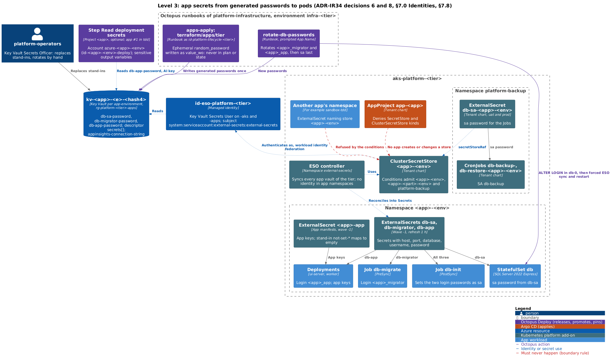

*Level 3, app secrets. apps-apply runs `terraform/apps/tier` as `id-platform-lifecycle-<tier>` and writes the generated SQL passwords and app keys into `kv-<app>-<e>-<hash4>` as write-only values; platform-operators replace the stand-ins; rotate-db-passwords rotates `<app>_migrator`, `<app>_app` and `sa`. ESO reads the vault only through the ClusterSecretStore `<app>-<env>` as `id-eso-platform-<tier>` (workload identity federation) and syncs, hourly, the Secrets used by `db`, `db-init`, `db-migrate` and the workloads; platform-backup gets its own copy of the sa password. The optional tdd step Read deployment secrets reads the same vault as `id-<app>-<env>-deploy`; store conditions refuse other apps' namespaces, and `app-<app>` denies every SecretStore kind.*

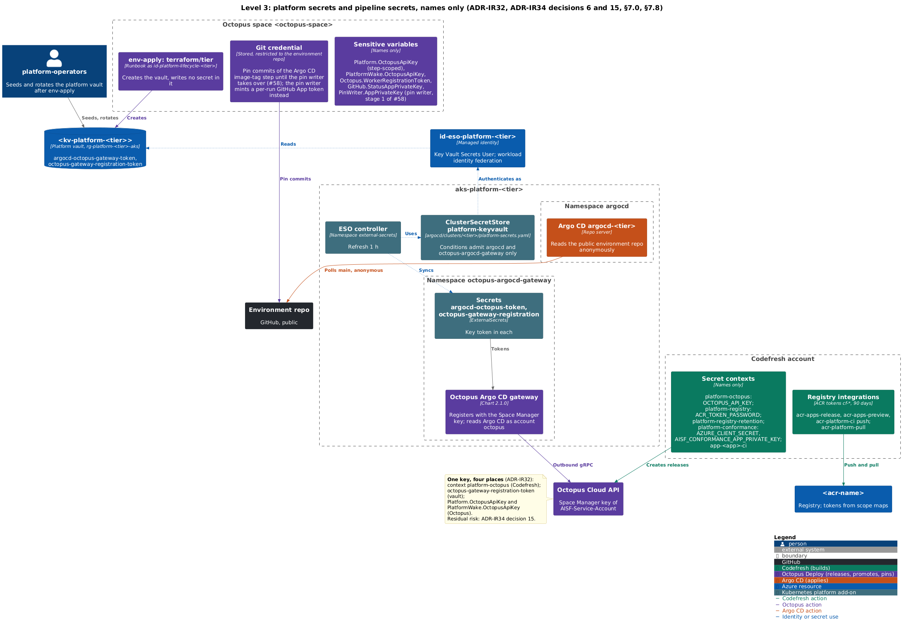

*Level 3, platform and pipeline secrets. The platform vault `<kv-platform-<tier>>`, seeded by platform-operators after env-apply, holds the repository credential and the gateway's two tokens; ESO syncs them through the ClusterSecretStore `platform-keyvault`, which admits only argocd and octopus-argocd-gateway; `terraform/tier` seeds `argocd-repo-creds` once so the first sync can read the repository. Pipeline secrets stay in their tools (names only here): Codefresh secret contexts and registry integrations, Octopus sensitive variables, the stored Git credential for pin commits. One Space Manager key sits in four places (ADR-IR32), an accepted residual risk (decision 15).*

| Vault | Secret name | Writer | Consumer | Mapped to |
|---|---|---|---|---|
| `kv-<app>-<e>-<hash4>` | `db-sa-password` | `apps-apply` (generated once, write-only); `rotate-db-passwords` | ESO → Secret `db-sa` (app namespace) and `db-sa-<app>-<env>` (`platform-backup`, uat and prod) | `sa` of StatefulSet `db`; `db-init`; the backup and restore Jobs |
| same | `db-migrator-password` | `apps-apply`; `rotate-db-passwords` | ESO → Secret `db-migrator` | Login `<app>_migrator` of the PreSync Job `db-migrate` |
| same | `db-app-password` | `apps-apply`; `rotate-db-passwords` | ESO → Secret `db-app`; Octopus `read-deployment-secrets` in tdd | Login `<app>_app`: `ConnectionStrings__SqlConnectionString` (app #1); `AcceptancePassword` (tdd acceptance) |
| same | `appinsights-connection-string` | `apps-apply` | ESO → Secret `workorders-app` (app #1) | `ApplicationInsights__ConnectionString`, `APPLICATIONINSIGHTS_CONNECTION_STRING` |
| same | `azure-client-id` (apps with `azure.workloadIdentity`, once the identity exists) | `apps-apply` | ESO | `AZURE_CLIENT_ID` of `id-<app>-<env>-app` |
| same (app #1) | `ai-openai-apikey` | `apps-apply` writes a stand-in (`not-set-…`); a `platform-operators` member sets the key (ADR-IR29) | ESO → Secret `workorders-app`, which maps a stand-in to an empty key; Octopus `read-deployment-secrets` in tdd | `AI_OpenAI_ApiKey` (ui-server, worker); `OpenAIKey` (tdd acceptance) |
| same (app #1) | `api-validation-key` | `apps-apply` (generated) | ESO → Secret `workorders-app` | `ApiKeyAuthentication__ValidationKey` |
| `<kv-platform-<tier>>` | `argocd-repo-read-credential` | A `platform-operators` member, after `env-apply` (P1-07, P1-08) | ESO → Secret `argocd-repo-creds` (label `argocd.argoproj.io/secret-type: repo-creds`) | Argo CD read access to the environment repo: the stored PAT until R11 |
| same | `argocd-octopus-gateway-token` | same | ESO → Secret `argocd-octopus-token`, namespace `octopus-argocd-gateway` | Gateway → Argo CD (account `octopus`) |
| same | `octopus-gateway-registration-token` | same | ESO → Secret `octopus-gateway-registration`, key `token` | Gateway registration (the Space Manager key) |
| same | `argocd-sso-client-secret` (only if federation is unavailable, Q15) | same | None today: SSO uses workload identity federation, and no ExternalSecret maps this key | Entra SSO |

| ESO object | Namespace | Authentication |
|---|---|---|
| `ClusterSecretStore <app>-<env>` (tenant chart, sync-wave `-5`) | Cluster-scoped; conditions admit the app-environment's namespaces and `platform-backup` | `authType: WorkloadIdentity`, service account `external-secrets/external-secrets` → `id-eso-platform-<tier>`, `vaultUrl: https://kv-<app>-<e>-<hash4>.vault.azure.net` |
| `ExternalSecret workorders-app` (sync-wave `-1`) | `workorders-<env>` | Store `workorders-<env>`; refresh 1 h; target `workorders-app`, `creationPolicy: Owner` |
| `ExternalSecrets db-sa`, `db-migrator`, `db-app` (`db-credentials/keyvault`, sync-wave `-1`) | `<app>-<env>` | Store `<app>-<env>`; refresh 1 h; keys `host`, `port`, `database`, `username`, `password` |
| `ExternalSecret db-sa-<app>-<env>` (tenant chart, uat and prod) | `platform-backup` | Store `<app>-<env>`; refresh 1 h |
| `ClusterSecretStore platform-keyvault` | Cluster-scoped; conditions limit it to namespaces `argocd` and `octopus-argocd-gateway` | Service account `external-secrets/external-secrets` → `id-eso-platform-<tier>` |
| `Password` generators (`db-credentials/generated`, phase 6) | `<app>-pr-<n>` | None (no Azure); `refreshPolicy: CreatedOnce` |

| Federated credential subject | UAMI | Written by |
|---|---|---|
| `system:serviceaccount:external-secrets:external-secrets` | `id-eso-platform-<tier>` | `terraform/tier` |
| `system:serviceaccount:kyverno:kyverno-admission-controller` | `id-kyverno-<tier>` | `terraform/tier` |
| `system:serviceaccount:platform-backup:db-backup` | `id-db-backup-<tier>` | `terraform/tier` |
| `system:serviceaccount:<app>-<env>:<azure.serviceAccount>` | `id-<app>-<env>-app` (apps with `azure.workloadIdentity`) | `terraform/apps/tier` |

The issuer is the cluster's OIDC issuer URL and the audience is `api://AzureADTokenExchange`. Each identity gets exactly one credential from one layer, so writes never race on an identity (concurrent writes return 409, R1-SRE §8). A rebuilt cluster has a new issuer: `env-apply` rewrites the platform credentials, and `apps-apply` runs again for the app ones.

### 7.9 Health endpoints, configuration keys, labels and annotations

As implemented (2026-09-25) for app #1. `ConnectionStrings__SqlConnectionString` comes from Secret `db-app`; no workload identity annotation remains.

| Endpoint | Use | Exposure in uat and prod |
|---|---|---|
| `/alive` (port 8080) | Startup, liveness and readiness probes | Allowed |
| `/_healthcheck` | Octopus `smoke-test` only; never a probe | Allowed |
| `/_version` | Octopus `verify-version` | Allowed |
| `/api/version` | Metadata | Allowed |
| `/_healthcheck/detailed`, `/_demo/*`, `/_diagnostics/*`, `/mcp` | Diagnostics and demos | The uat and prod overlays add an HTTPRoute rule that redirects them to `/` (302) at the Gateway. Reachable in `tdd`. |
| `/ready` | Database-only readiness (WI-01) | Replaces `/alive` for readiness once it exists |
| Worker | No HTTP endpoint and no probes until WI-04 | — |

Writable paths under `readOnlyRootFilesystem: true`: `/tmp` and `/app/.diagnostics` (NServiceBus startup diagnostics, ADR-IR31), both `emptyDir`, on `ui-server` and `worker`.

| Configuration key (ConfigMap `workorders-config` unless noted) | Value |
|---|---|
| `ASPNETCORE_ENVIRONMENT` | `Production` (tdd, uat, prod, previews) [VERIFY parity with legacy] |
| `ASPNETCORE_FORWARDEDHEADERS_ENABLED` | `true` |
| `ConnectionStrings__SqlConnectionString` (Deployment env, from Secret `db-app`) | `Server=tcp:db,1433;Database=workorders;User ID=workorders_app;Password=…;Encrypt=True;TrustServerCertificate=True;` It must start with `Server=` (F4). |
| `AI_OpenAI_Url`, `AI_OpenAI_Model` | `<azure-openai-endpoint>`, `<model-deployment-name>` |
| `RemotableBus__ApiUrl` (worker) | `http://ui-server.workorders-<env>.svc.cluster.local:8080/api/blazor-wasm-single-api` |
| `ApiKeyAuthentication__Enabled` | `false` until WI-10 |
| `AI_OpenAI_ApiKey`, `ApiKeyAuthentication__ValidationKey`, `ApplicationInsights__ConnectionString`, `APPLICATIONINSIGHTS_CONNECTION_STRING` | From Secret `workorders-app` |

| Label or annotation | Where |
|---|---|
| `app.kubernetes.io/name: ui-server` or `worker`; `app.kubernetes.io/part-of: workorders`; `app.kubernetes.io/component: web` or `message-handler` | App #1's workload objects |
| `platform/app: <app>`, `environment: <env>`, `tier: app` or `platform`; `pod-security.kubernetes.io/enforce: restricted` (app namespaces, `platform-backup`) or `baseline` (the other platform namespaces), `pod-security.kubernetes.io/warn: restricted` | Namespaces |
| `argo.octopus.com/project: <project>`, `argo.octopus.com/environment: <env>` | Workload Applications `<app>-<deployable>-<env>` only (tenant chart) |
| `argocd.argoproj.io/manifest-generate-paths` | Workload Applications |
| `platform/role: database` | Applications `<app>-db-<env>` |
| `argocd.argoproj.io/sync-wave` | Tenant: `-10` AppProjects and namespaces, `-5` the other tenant objects, `0` database Applications, `5` workload Applications (swapped while the app is frozen). App: `-1` ExternalSecrets, then the workloads. |
| `argocd.argoproj.io/hook` | `PreSync` on Job `db-migrate`; `PostSync` on Job `db-init` |

### 7.10 Azure resources and the Terraform layer contract

As implemented (2026-09-25): the layers of §7.0 and the resource groups of ADR-IR34. No layer reads another's state: objects are found by name, or passed through tfvars.

| Layer | State key | Applied by | Creates | Hands to the next layer |
|---|---|---|---|---|
| `terraform/foundation` | `foundation.tfstate` in `<tfstate-storage-account-global>` (bootstrap: local, then migrated, P1-02) | The provisioner from an operator session, under the constrained RBAC Administrator grant (R6, R30). The `CanNotDelete` locks come from `docs/owner/Grant-ProvisionerRights.ps1 -ApplyLocks`, run by an Owner. | §7.0 Terraform layers. No Azure SQL, Azure Policy or PIM (ADR-IR34). | Outputs `build_inputs`, `tier_inputs`, `apps_inputs`, `octopus_inputs` and `conformance_settings`, copied into the next layers' tfvars and settings |
| `terraform/build` | `build.tfstate` (global) | The provisioner | `aks-platform-build`, pools `system` and `builds` (0–2 nodes); no role assignment | The cluster, for the Codefresh Runner install (P1-04) |
| `terraform/tier` | `tier-<tier>.tfstate` in `<tfstate-storage-account-<tier>>` | `env-apply` as `id-platform-lifecycle-<tier>`, with `<tier>.tfvars` from Git (ADR-IR14) and two optional `TF_VAR_*` secrets | §7.0 Terraform layers: AKS with pre-created identities, workload identity, OIDC issuer, Azure RBAC and local accounts off; `apr-sleep-<tier>` created disabled with `ignore_changes = [enabled]`, toggled only by `env-sleep` and `env-wake` (ADR-IR33); `helm_release` `argocd` and `argocd-apps` (values from `argocd/bootstrap/*`, changes ignored after bootstrap); `helm_release` Octopus workers `octopus-worker-<env>` with machine policy `Sleep-tolerant Kubernetes workers`. **No `azurerm_role_assignment`.** | The OIDC issuer, workspace, action group and ingress IP, found by name by `terraform/apps/tier` and `octopus/terraform` |
| `terraform/apps/tier` | `apps-<App.Name>.tfstate` (tier account) | `apps-apply` as `id-platform-lifecycle-<tier>` | §7.0 Terraform layers. **No `azurerm_role_assignment`.** | Vaults, disks and backup containers, found by name by the tenant chart |
| `terraform/apps/grants` | `app-grants-<app>.tfstate` (global) | The provisioner | §7.0 Terraform layers | Deploy identities for `octopus/terraform`, app identities for the next `apps-apply` |
| `terraform/apps/descriptor` | None: a module without provider or resource | `terraform/apps/tier` and `terraform/apps/grants` | Nothing: reads `apps/<app>.yaml` and derives the names | — |
| `octopus/terraform` | `octopus-space.tfstate` (global; ADR-IR9) | A Space Manager through `octopus/apply.ps1`, from an operator session also signed in to Azure | The Octopus objects of §7.2 that config as code does not store, including project shells (`for_each` over `apps/*.yaml`), library set `Platform Automation` and the step-scoped key of `platform-infrastructure` (both from `TF_VAR_platform_octopus_api_key`), the `env-sleep-hourly-*` triggers and the worker machine policy (ADR-IR33) | Account, feed and project slugs, which the OCL names |

Re-applies: `octopus/terraform` after each `env-apply` that changes an ingress IP (`Platform.AppsDomain`) and after `terraform/apps/grants` (the deploy identities' client IDs); `apps-apply` after the grants and after every cluster rebuild (a new OIDC issuer).

Provider pins: `azurerm ~> 5.6`, `azuread ~> 3.9`, `helm ~> 3.3`, `kubernetes ~> 3.2`, `random ~> 3.9` and Terraform 1.11 or later for the Azure layers (ADR-IR5); `OctopusDeploy/octopusdeploy` 1.20.0 and Terraform 1.7 or later for `octopus/terraform`.

## 8. App-side prerequisites (proposed work items)

These work items are not implemented in the sketch. Each needs the app team's approval as a board item.

*ADR-IR34* changes three of them:
- **WI-05** shrinks to reading the password from an environment variable, because SQL Server containers have no Entra authentication.
- **WI-07**'s trust switch is the fallback if migrators cannot trust `platform-internal-ca` (Q43).
- **WI-06** still removes the app's DDL rights. Until it lands, the `db-init` Job grants them to `workorders_app`.

| ID | Title | Why | Acceptance criteria | Gate | Owner |
|---|---|---|---|---|---|
| WI-01 | Add a database-only readiness endpoint `/ready` | `/_healthcheck` includes the LLM and `NeedsReboot` checks (F2), so readiness cannot use it | `/ready` runs only checks tagged `ready` (DataAccess); unit and integration tests; mapped in every environment | Before phase 4 exit (prod cutover) | App team |
| WI-02 | Gate `/_demo/*` and `/_diagnostics/*` by environment or feature flag | An anonymous request can flip health or reset pools (F3) | Both routes return 404 unless `Diagnostics:DemoEndpointsEnabled=true`; that flag is enabled only in `tdd` | Phase 4 | App team |
| WI-03 | Authenticate `/mcp` outside Development and Testing | `/mcp` is unauthenticated in every environment (F3) | API-key or Entra authentication; acceptance MCP tests updated | Phase 4 | App team |
| WI-04 | Add a Worker liveness signal | The generic host has no endpoint (F5) | A minimal health listener or heartbeat file; the Deployment gains a probe | Before Worker enablement in prod | App team |
| WI-05 | Entra (workload identity) authentication in the DbUp console; password taken from an environment variable, not a positional argument | Only SQL or integrated authentication exists today, and the password appears in the process arguments (F9) | `--auth workload-identity` mode; `DB_PASSWORD` environment variable fallback; tests | Before phase 4 exit | App team |
| WI-06 | Move NServiceBus installers from runtime into the migration step | `EnableInstallers()` needs DDL rights for the app identity (F5; `ServerApplication.cs`) | Installers run from a deployment-time command; the app runs with DML only | Phase 5 (post-cutover hardening) | App team |
| WI-07 | Add a non-test seed command (roles, sample employees) and an explicit server-certificate trust option | Fresh databases have no roles, and the only seed is test code (F8, F10); the console refuses the preview's self-signed SQL Server (ADR-IR24) | A `ChurchBulletin.Database seed` command that is idempotent and never deletes; a trust switch, off by default | Phase 3 (UAT data) or phase 6 (previews) | App team |
| WI-08 | Make the acceptance suite's destructive reset opt-in | `ZDataLoader` wipes whatever database it targets (F8) | `LoadData()` refuses unless `AcceptanceTests:AllowDestructiveReset=true`; Octopus sets it in `tdd` only; local and CI runs keep working | Before phase 2 exit | App team |
| WI-09 | Add a realtime notification backplane | The in-process hub breaks with more than one replica (ADR-C3) | Notifications reach clients on any replica | Phase 6 (blue-green) | App team |
| WI-10 | Send the API key from the Worker's `RemotableBus` | With `ApiKeyAuthentication:Enabled=true`, Worker calls would fail | The header is configured from a secret; tested | Before API keys are enabled | App team |
| WI-11 | Generic CI detection in `build.ps1` (Codefresh) | Non-GitHub CI forces `/tmp/nuget-packages` (F11) | The NuGet cache path is honoured under Codefresh; `build.ps1` changes need approval | Phase 1 (optional) | App team and platform |
| WI-12 | Remove the `user.name` metric tag | PII and cardinality (F15) | The login counter has no user tag; tests updated | Phase 3 | App team |
| WI-13 | Pin the UI base image by digest in the root `Dockerfile` | `mcr.microsoft.com/dotnet/aspnet:10.0` floats; the platform copies the file verbatim | `FROM` carries `@sha256:`; a renovation process updates it | Phase 4 (low) | App team |

## 9. Phased roadmap with exit criteria

The legacy path stays live and untouched in every phase before phase 5. Each phase can be reversed by stopping the new path.

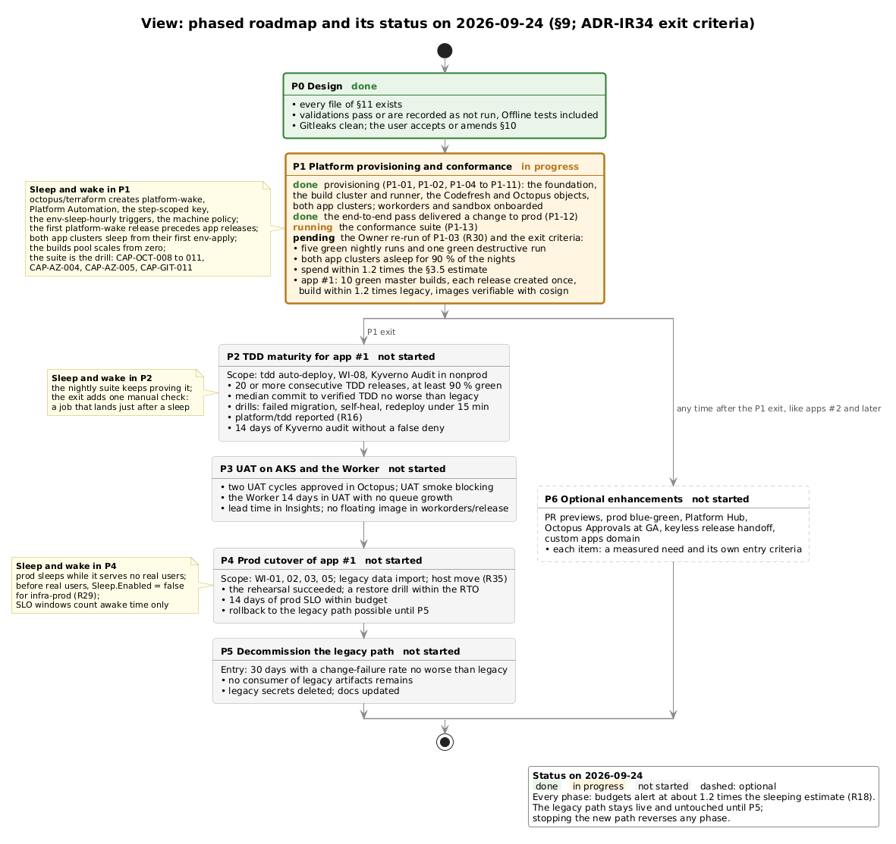

*Roadmap on 2026-09-24. P0 is done; P1 is in progress (done: provisioning and the end-to-end pass to prod; running: conformance; pending: the Owner re-run P1-03 (R30), the nightly and destructive runs and the evidence criteria). P2 to P5 follow in order with their exit criteria; the optional P6 may run any time after the P1 exit. Notes give sleep and wake per phase.*

| Phase | Scope | Exit criteria (all required) |
|---|---|---|
| **P0 Design** (done) | This document, including ADR-IR34; the implementation sketch; the integration review (done 2026-09-24, §2.5); the ADR-IR34 migration packages (§11.7) | Every file in §11 exists. All validations pass, or are recorded as "not run" with a reason; they include `dotnet test --filter TestCategory=Offline`. Gitleaks is clean. The user accepts or amends §10. |
| **P1 Platform provisioning and conformance** (ADR-IR34; in progress on 2026-09-25: provisioning and the end-to-end pass to prod done, conformance running, P1-03 (R30), the nightly and destructive runs and the evidence criteria pending) | Steps P1-01 to P1-13 of ADR-IR34:<br>• the foundation and the Owner re-run (R30);<br>• the build cluster and the Codefresh Runner;<br>• the Codefresh and Octopus objects, including the live-object migration (§11.9);<br>• both app clusters through `env-apply`;<br>• `workorders` and `sandbox` onboarded;<br>• the conformance suites and the end-to-end pass on app #1.<br>`platform-env/env-checks` is active, and `codefresh/ci` is the required status of the app repo. | ADR-IR34's exit criteria:<br>• five green nightly runs and one green destructive run;<br>• a change delivered to prod end to end;<br>• both app clusters asleep for at least 90 % of the nights;<br>• spend within 1.2 times §3.5.<br>For app #1:<br>• 10 consecutive master builds pass every gate;<br>• each release is created exactly once (a rerun is a no-op);<br>• the build of record, excluding the acceptance (Playwright) gate, takes at most 1.2 times the legacy `build-linux` plus publish; the acceptance gate passes and is timed separately (owner decision of 2026-09-25);<br>• images are signed, locked and verifiable with `cosign verify`. |
| **P2 TDD maturity for app #1** | Nonprod exists since P1, and `tdd_auto_deploy` is already true there (the default of `octopus/terraform`). WI-08 merged; Kyverno in Audit mode in nonprod. Every [VERIFY] item not settled in P1. | • At least 20 consecutive TDD releases, at least 90 % green (legacy baseline: 207 of 289, 72 %; R1-P §8).<br>• Median commit → verified TDD is no worse than legacy, cold starts included (ADR-IR33).<br>• Drills pass: a bad migration leaves the old version serving (CAP-GIT-010); drift self-heals (CAP-GIT-001); redeploy-previous completes in under 15 min (CAP-OCT-007).<br>• `platform/tdd` is reported, once the statuses-only GitHub App exists (R16).<br>• 14 days of Kyverno audit without false denies. |
| **P3 UAT on AKS and Worker** | UAT deploys with sign-off. The Worker is enabled in `tdd` and `uat`. SLO alerts go live. WI-07 or a UAT data copy (Q8). WI-12. The Octopus handoff already runs as freestyle steps with the CLI pinned in `platform/ci-dotnet` (ADR-IR18, since P1). | Two UAT cycles approved in Octopus. UAT smoke is blocking. The Worker runs 14 days in UAT with no growth in error or dead-letter queues. Insights shows lead time. No floating image runs in `workorders/release`. |
| **P4 Prod cutover** | Prod exists since P1. WI-01, WI-02, WI-03 and WI-05 merged. Kyverno Enforce in prod, as it is from P1 for the signer and registry rules; already met for the workload baseline too, which prod keeps enforcing ahead of P4 (owner decision of 2026-09-25; it passed the prod deploy of `workorders` 2.5.722). Impersonation and egress hardening decided. Cutover rehearsed in UAT. Then, in a maintenance window:<br>• freeze legacy prod deploys;<br>• disable the legacy prod migration owner (an approved `.github/**` or `.octopus/**` change in the origin, made by the user);<br>• import the legacy prod database into the SQL Server Express of `workorders-prod` (a bacpac of at most 10 GB, Q10);<br>• deploy the same commit;<br>• switch users to `workorders-prod.southcentralus.cloudapp.azure.com`, the Azure DNS label of the prod ingress IP (R35, decided 2026-09-25); the legacy Container Apps host cannot move.<br>The Worker in prod stays at `replicas: 0` until product sign-off. | • The rehearsal succeeded.<br>• A restore drill (the CAP-AZ-010 procedure, with prod-sized data) finished within the agreed RTO.<br>• 14 days of prod SLO within budget.<br>• Rollback to the legacy path remains possible until P5 starts. |
| **P5 Decommission the legacy path** | After 30 days with a change-failure rate no worse than legacy, and with approved changes by the user in the origin: disable `deploy.yml` and the legacy publish jobs; retire the legacy Octopus project and the origin's `.octopus/`; delete the Container Apps and legacy resource groups after data retention; delete the `OCTO_API_KEY` and `AZURE_CREDENTIALS` secrets; decide the AI Software Factory contract (Q9); apply WI-06. | No consumer of legacy artifacts remains. Secrets are deleted. The docs are updated. |
| **P6 Optional enhancements** | • PR previews (ADR-C4, needs WI-07);<br>• prod blue-green (ADR-C3, needs WI-09 and at least two replicas);<br>• Platform Hub (ADR-C9, license);<br>• Octopus Approvals at GA (ADR-D13);<br>• the keyless release handoff (ADR-IR34 decision 4);<br>• a custom apps domain (R35).<br>Apps #2 and later may onboard any time after the P1 exit. | Each item needs a measured need and its own entry criteria. |

**Sleep and wake by phase (ADR-IR33, §3.4)**
- **P1.**
  - `octopus/terraform` creates project `platform-wake`, the library set `Platform Automation`, the step-scoped key, the two `env-sleep-hourly-*` triggers and the worker machine policy. The first `platform-wake` release comes before the first app release.
  - Both app clusters sleep from their first `env-apply`, and the build cluster's builds pool scales from zero.
  - The conformance suite is the drill: CAP-OCT-008 to CAP-OCT-011, CAP-AZ-004, CAP-AZ-005 and CAP-GIT-011.
- **P2.** The nightly suite keeps proving sleep and wake. The exit adds one manual check: a job that lands just after a sleep succeeds.
- **P4.** Prod sleeps like nonprod while it serves no real users. If it ever does, `Sleep.Enabled` becomes `false` for `infra-prod` before cutover (R29). SLO windows count awake time only.
- **Every phase.** Budgets alert at about 1.2 times the sleeping estimate (R18). The live subscription is a sponsorship offer, which Cost Management does not support, so `terraform/foundation` skips the budgets there and CAP-AZ-014 reports the gap (§7.0 Budgets).

## 10. Recommendations to the user

Status on 2026-09-24. **Done by the user**: applied by the user. **Done by Claude**: applied by the orchestrating session with the user's approval. **Needs the user**: an action only the user (or someone the user names) can take. **Decided**: settled in the design; nothing to do yet.

| # | Recommendation | One-line rationale | When | Status |
|---|---|---|---|---|
| R1 | Install the Claude GitHub App on `clearmeasure-aisf-sample-apps` and attach the environment repo. | The platform tree needs its home. | Now | Done by the user |
| R2 | Make the environment repo private. | Push rulesets that restrict file paths require it (E31), and it makes committed tfvars acceptable (ADR-IR14). | Before P1 | Done by the user |
| R3 | Narrow the Octopus Git credential `GitHub clearmeasure-aisf-sample-apps` to this repo; back it with a machine user in team `platform-bots` or a GitHub App, with a 90-day expiry. | The credential wrote to every repo in the org, and ruleset bypass cannot name individual users. | Before P1 | Done by Claude: restricted to the environment repo, with and without `.git`. Needs the user: the machine user or GitHub App, and the expiry |
| R4 | Restrict the Octopus account `Azure Runtime Provisioner` to `infra-nonprod` and attach it to no project. From P1, tier automation uses the OIDC accounts `azure-platform-lifecycle-<tier>` (ADR-IR34). Keep the provisioner secret only for the operator-run foundation, build and grant applies. | A subscription-wide Contributor bearer secret must not reach pipelines or tier automation. | Now; P1 | Done by Claude: account restricted; `infra-nonprod` created by hand, so `octopus/terraform` imports it first (`docs/bootstrap.md` step 3). ADR-IR34: the Codefresh context `azure-runtime-provisioner` is deleted in P1-01, because the Codefresh account starts clean. Needs the user: scope the account variable of `Azure Runtime Provisioning` to `infra-nonprod`, and keep the secret safe |
| R5 | Keep the Codefresh contexts `azure-runtime-provisioner` and `github-aisf-sample-apps-token`, and the Octopus variable set `GitHub AISF Sample Apps`, attached to nothing; delete them after P2 unless other sample apps need them. | Anything attached is reachable from pipeline steps. | Now | Done by Claude: verified that nothing uses them. Decided by the user (2026-09-24, single-operator threat model, ADR-IR33): they stay, attached to nothing |
| R6 | Let the provisioner apply `terraform/foundation`: an Owner runs `docs/owner/Grant-ProvisionerRights.ps1` once. Keep an Owner or User Access Administrator (PIM) for what the grant cannot do, and revoke the grant after the foundation apply. | Contributor cannot create role assignments, locks or policies (E36); the grant adds role assignments only (E52). | P1 | Done by the user: the script ran. (1) It registered 12 resource providers: `Microsoft.ContainerService`, `Microsoft.ContainerRegistry`, `Microsoft.KeyVault`, `Microsoft.Sql`, `Microsoft.OperationalInsights`, `Microsoft.Insights`, `Microsoft.Monitor`, `Microsoft.ManagedIdentity`, `Microsoft.Storage`, `Microsoft.Network`, `Microsoft.Authorization`, `Microsoft.Dashboard`. (2) It granted Role Based Access Control Administrator on the subscription, with an ABAC condition (version 2.0): writes only for ten built-in roles (AcrPull, Reader, Contributor, Key Vault Secrets Officer, Key Vault Secrets User, Storage Blob Data Contributor, Azure Kubernetes Service RBAC Cluster Admin, SQL DB Contributor, Network Contributor, Managed Identity Operator) and only to service principals or groups; deletes only for the same roles. (3) It granted the Microsoft Graph application permissions `Group.Create` and `Application.ReadWrite.OwnedBy`, with admin consent. Needs the user: an Owner or User Access Administrator for the `CanNotDelete` locks, the Azure Policy assignments and the PIM-eligible assignments, as a second pass on the same state (ADR-D10 status; a separate `terraform/foundation-owner` root is recommended); the revocation of the grant after the foundation apply, or at the latest with the secret at the P2 exit, with the command in the script's notes (ADR-C10, bootstrap step 10). ADR-IR34 supersedes the revocation:<br>• the provisioner keeps the constrained grant, because it is the only grant identity;<br>• the Owner re-run changes the role list (R30);<br>• locks move to `-ApplyLocks`;<br>• policy and PIM assignments are dropped, and so is the `terraform/foundation-owner` root. |
| R7 | Confirm the Octopus license tier and the task cap. Enterprise is needed only for Platform Hub, ITSM, SIEM streaming and space-level Insights; list price $24,600/year for Cloud (E25). | The design runs without Enterprise features. ADR-IR34: 4, 21 or 57 projects at 1, 12 or 36 apps, and the task cap binds first (Q29, Q36). | Before P1 | Needs the user |
| R8 | Do not buy the Codefresh ARM Enterprise runtime or Windows incubation for this app. | The platform ships `linux/amd64` images only; ARM and Windows CI stays with the legacy origin (ADR-IR26). | — | Decided |
| R9 | Superseded by ADR-IR34: one runtime, `<cf-runtime>`, on the platform's `aks-platform-build`, created by the main loop in P1-04. | The account's only runtime is dead; branch code is the operator's own (§13). | P1 | Closed (ADR-IR34) |
| R10 | Create the five shared repository-scoped ACR tokens with at most 90-day expiry, from the Terraform scope maps and never in state: `cf-apps-release`, `cf-apps-preview`, `cf-platform-ci`, `cf-platform-pull`, `cf-platform-retention` (ADR-IR34). | Pipelines get no cloud identity (TB2, ADR-IR19). | P1 | ADR-IR34: done by the main loop in P1-05 |
| R11 | Create a read-only GitHub App for Argo CD on the environment repo; store its JSON credential in `ArgoCD.RepoReadCredential` and in the platform vaults. | The repo is private and the stored PAT must not reach clusters (ADR-IR15). | P2 | Needs the user. Until then Argo CD uses the stored PAT (interim; ADR-IR34, risk 4) |
| R12 | Approve work items WI-01 to WI-13 (§8), especially WI-08 before the P2 exit and WI-01, 02, 03, 05 before P4. | Each item gates a phase; none blocks P1. | P1 | Needs the user |
| R13 | Approve, and make, the changes to `.github/**` and `.octopus/**` of the legacy origin for cutover (a single migration owner) and decommission. | The live path changes only by the user's hand; no agent writes to the origin. | P4, P5 | Needs the user |
| R14 | Decide the required-check end state of ADR-C6. | Superseded: `codefresh/ci` is required on the app repo from day one (ADR-IR26). | — | Closed |
| R15 | Provide separate low-budget Azure OpenAI keys for CI and TDD. | The CI context is reachable from branch code in the gates. | P1 | Needs the user |
| R16 | Create a GitHub App with only `Commit statuses: write`, install it on `20260923-001` only, and give its private key to Octopus (`GitHub.StatusAppPrivateKey`). | Octopus then posts `platform/tdd` without a broader credential; the Git credential keeps one repo (ADR-IR27). | P2 | Partly done: App `aisf-octopus-status-reporter` exists and its IDs are wired; the owner stores the key in `GitHub.StatusAppPrivateKey`, then sets `GitHub.StatusEnabled` to `True` |
| R17 | Move the staged tree to the environment repo and remove it from the app repo. | Superseded by the approved layout (ADR-D18): nothing was ever committed to an app repo, and this tree becomes the first commits on `main`. | P1 | Closed |
| R18 | Budget and cost controls. Estimates (§3.4, [UNVERIFIED amounts]): ≈$1,640 a month always on (foundation ≈$25, private endpoints ≈$58, nonprod ≈$515, prod ≈$1,040), against ≈$325 sleeping (nonprod ≈$100, prod ≈$140). Set one budget per resource group at about 1.2 times its sleeping estimate; cap only the nonprod workspace. Watch the database copies, which inherit the source tier. | AKS adds fixed cost that Container Apps did not have (R1-P §3); sleeping removes most of it (ADR-IR33). | Before P2 | Decided: sleep by default (ADR-IR33). ADR-IR34: the multi-app estimates are in §3.5, and `terraform/foundation` creates the three budgets, so nothing is left for the user |
| R19 | Plan a separate prod subscription later. | Limits the Contributor blast radius (R1-SRE §7 R1). | After P4 | Needs the user (later) |
| R20 | Adopt Octopus Approvals (with "block approvals by the deployment creator") when it reaches GA. | It replaces the script-based separation-of-duties guard (E39). | P6 | Decided (later) |
| R21 | Keep GitHub Actions disabled in `20260923-001`. If it is ever enabled, disable `deploy.yml` first. | The copied workflows would run legacy publish and deploy jobs; `deploy.yml` can no longer run today (E44). | Now | Holds; needs the user to keep it so |
| R22 | Delete the old working branch in `ClearMeasureLabs/bootcamp-palermo-workorders`. | The session's proxy refused the deletion (HTTP 403); no agent writes to that repo. | Now | Needs the user |
| R23 | Rotate the `AISF-Service-Account` API key every 90 days, set an expiry on it, and restore dedicated accounts (OIDC service account for Codefresh, separate gateway token, narrow approver role) when a System Manager becomes available. | One Space Manager key now serves Codefresh, the gateway (ADR-IR32) and the sleep and wake steps (ADR-IR33); a rotation also re-applies `octopus/terraform`. | P1, then when possible | Needs the user |
| R24 | Superseded by ADR-IR34: `terraform/foundation` creates group `platform-operators` (the user) with Key Vault Secrets Officer, without PIM. | One operator (§13). | P1 | Closed (ADR-IR34) |
| R25 | Decide where new application commits land during the parallel run: the copy `20260923-001` (recommended) or the origin, with a mirroring rule if both change. | The build that reaches prod comes from the copy; two diverging sources would make cutover guesswork. | Before P2 | Needs the user |
| R26 | Optionally ask GitHub Support to detach `20260923-001` from the fork network [VERIFY the process]. | A fork's pull requests default to the upstream, and a fork of a public repo cannot turn private. | Optional | Needs the user |
| R27 | Set branch protection on `master` of `20260923-001`: pull request, one review, required status `codefresh/ci` after its first report. | The merge gate of ADR-IR26. | P1 | Needs the user |
| R28 | Superseded by ADR-IR34: the platform's runner cluster `aks-platform-build` scales its builds pool to zero by design. | The old runner is dead. | P1 | Closed (ADR-IR34) |
| R29 | Keep prod sleeping while it serves no real users. Before it does, set `Sleep.Enabled` to `false` for `infra-prod` by pull request. | A stopped cluster may fail to start in a capacity-constrained region (E50). | Before real users | Decided (default: prod sleeps) |
| R30 | Once the ADR-IR34 change lands, re-run `docs/owner/Grant-ProvisionerRights.ps1 -SkipEntra` as Owner:<br>• drop SQL DB Contributor;<br>• add Azure Kubernetes Service Cluster User Role, RBAC Reader and RBAC Writer;<br>• replace the condition of the existing assignment.<br>Then run it again with `-ApplyLocks`. | The conformance principal gets least privilege, and prod data and state get locks. | P1 (P1-03) | Needs the user |
| R31 | Create the private repository `<sandbox-app-repo>` in `clearmeasure-aisf-sample-apps`, without branch protection. The main loop tries first. | The conformance fixture app needs its own repository and triggers. | P1 (P1-11) | Needs the user only if the main loop cannot create it (Q50) |
| R32 | Decide the Codefresh plan: BASIC_1 runs one build at a time on the runner. | Enough for one app and the nightly suite; builds queue at class scale. | Before classes | Needs the user |
| R33 | Create a fork of `<sandbox-app-repo>` in an account outside the org, and give the harness a token that can push to it. | The live fork-PR test (CAP-CF-005) needs a real fork. | Optional | Needs the user |
| R34 | Request an EDSv5 family quota of 48 and a regional quota of about 80 vCPUs in `<azure-region>`. | D-series nodes fit about 13 database apps in nonprod, and 36 apps need memory-optimized nodes (ADR-IR34). | Before about 12 apps | Needs the user |
| R35 | Optionally provide a DNS domain to replace the sslip.io host names, with child zones per tier and wildcard DNS-01. | It removes a third-party DNS dependency and the certificate rate limit, and prod cutover needs it (P4). | Before P4 | Decided 2026-09-25 by the owner: no registration; an Azure DNS label on `pip-platform-prod-ingress` (`<label>.southcentralus.cloudapp.azure.com`) for `workorders-prod`, certificates from `letsencrypt-http01`. Label decided the same day: `workorders-prod`, host `workorders-prod.southcentralus.cloudapp.azure.com` (region per `terraform/tier/prod.tfvars`). A custom domain stays P6 optional. Details: `docs/cutover-and-decommission.md`, R35 |

## 11. Work packages

§11.1–§11.6 describe the delivered single-app baseline. §11.7–§11.10 are the ADR-IR34 packages that migrate it to the multi-app platform.

### 11.0 Rules for every package

- **Scope.** Write only the files listed in the package. Every path is relative to the environment-repo root; the application repo receives no file (ADR-D18). No git operations and no calls to the Octopus, Codefresh, GitHub or Azure APIs. The packages were built in a local copy of the environment repo and reviewed together (§2.5); the paths below are final.
- **Content.** No secrets and no realistic-looking keys. Use the §7 placeholders exactly. Mark unverified product behaviour `[UNVERIFIED]` or `[VERIFY]` in comments. Writing style follows the repo: no "I", "we", "you"; terse.
- **Contracts.** §7 is binding. If a contract cannot be met, record the conflict in the package's final report. Do not invent a new name.
- **Tooling.** Install into the scratchpad; nothing is preinstalled.
  - `GOBIN=<scratchpad>/bin go install sigs.k8s.io/kustomize/kustomize/v5@latest` and `…github.com/yannh/kubeconform/cmd/kubeconform@latest` (the Go module proxy is reachable).
  - Terraform zip from `https://releases.hashicorp.com/terraform/`.
  - Helm from `https://get.helm.sh/` (only if needed).
  - `pip install yamllint shellcheck-py`.
  - Gitleaks is at `<scratchpad>/gitleaks` (v8.28.0: `gitleaks dir <path>`).
  - Mermaid: `node <scratchpad>/mmd/validate.mjs <file.md>`.
  - `terraform init -backend=false && terraform validate` may fail offline. `terraform fmt -check` is the minimum.
- **Report.** Each implementer's final report lists every file written, each validation command with its result, and any contract conflicts.

### 11.1 Package `codefresh-engineer` (23 files)

| # | Path | Must contain |
|---|---|---|
| 1 | `codefresh/workorders/README.md` | The pipelines, triggers, contexts, runtimes and registry integrations (§7.7); how to register the specs (`codefresh create pipeline -f`); the parity map from the GitHub jobs to the Codefresh steps; the boundary rules |
| 2 | `codefresh/workorders/version.env` | `MAJOR=2`, `MINOR=5` |
| 3 | `codefresh/workorders/pipelines/ci.yml` | `version: "1.0"`, `mode: parallel`, `fail_fast: false`. Steps as in §7.7: a full-depth clone; `prepare` runs `version.sh` and `changed-paths.sh` piped into `.github/scripts/detect-code-changes.sh --from-list -` (fail-open), plus a worktree per gate. `build_sql` runs `Build` with an `mssql` service container, `SQL_EXTERNAL=true`, `SQL_SERVER_HOST=mssql,1433`, then CRAP. Also `build_sqlite` (`Build -UseSqlite`), `code_analysis`, `qodana` (image pinned to the baseline tag, threshold 0), `security_scan` (advisory: NuGet vulnerable/deprecated, Gitleaks), `acceptance` (`Invoke-AcceptanceTests` with an `mssql` service), and `gate` (`gate.sh`). Symlink the NuGet cache (F11). No publish, no Octopus, no deploy. |
| 4 | `codefresh/workorders/pipelines/release.yml` | The same gates, followed by: `package` (`Package-Everything`); `stage_images` (`stage-built.sh`); `image_reuse` (`supply-chain.sh --check-reuse`: a re-run of the same commit whose tags are already locked skips the image builds and `supply_chain`, and `supply_chain_reuse` confirms the lock instead); `ui_image` (root `Dockerfile`, context staged `built/`, `cosign.sign: true`); `worker_image` and `migrator_image`; `supply_chain` (`supply-chain.sh`: SBOM and provenance attestations, tag lock); and the Octopus handoff exactly as in §7.7. Tags are `<VERSION>` and `sha-<sha7>`. A final hook never changes the build result. |
| 5 | `codefresh/workorders/pipelines/preview.yml` | Phase 6. Label and same-repo guard; builds `workorders-previews/{ui-server,worker,db-migrator}:pr-<n>-<CF_REVISION>` (ADR-IR8); signs; no Octopus. |
| 6 | `codefresh/workorders/pipelines/ci-image.yml` | Builds and signs `platform/ci-dotnet:<date-tag>` from file 17 |
| 7–10 | `codefresh/workorders/specs/workorders-{ci,release,preview,ci-image}.yml` | `kind: pipeline` specs: `metadata.name` `workorders/<name>`, `project: workorders`; triggers on the app repo `clearmeasure-aisf-sample-apps/20260923-001` (ci-image: this repo); runtime, contexts, `specTemplate` (this repo, path, `revision: main`, context `github-aisf-sample-apps`), concurrency, termination policy, all per §7.7. |
| 11 | `codefresh/workorders/scripts/version.sh` | Unshallows or fails. Prints `MAJOR.MINOR.<first-parent count>` on master and `-ci.<sha7>` elsewhere; runnable locally; guards patch ≤ 65534 |
| 12 | `codefresh/workorders/scripts/changed-paths.sh` | Master: `HEAD^1..HEAD`. Branches: `merge-base origin/master`. On error, emits a non-docs path so the build fails open. No `grep -q` under a pipe. |
| 13 | `codefresh/workorders/scripts/stage-built.sh` | Extracts `build/ChurchBulletin.UI.<V>.nupkg` into `built/`, mirroring the `build.yml` Publish Release Candidate step (F6). Publishes the Worker and Database console into separate staging directories for files 18 and 19. |
| 14 | `codefresh/workorders/scripts/buildinfo.sh` | Writes Octopus build-information JSON (`BuildEnvironment`, `BuildNumber`, `BuildUrl`, `VcsType`, `VcsRoot`, `VcsCommitNumber`, `Commits` for `HEAD^1..HEAD`) and the release-notes file (ADR-IR23) |
| 15 | `codefresh/workorders/scripts/gate.sh` | Aggregates step results with `build-result` semantics (docs-only → pass). `security_scan` is advisory. |
| 16 | `codefresh/workorders/scripts/supply-chain.sh` | Syft SBOM; `cosign attest` for the SBOM and a provenance predicate labelled step-authored; ACR tag lock via the token's data plane [VERIFY]. Takes digests as input. |
| 17 | `codefresh/images/ci-dotnet/Dockerfile` | Base `mcr.microsoft.com/dotnet/sdk:10.0` (pinned by digest placeholder); pwsh; Playwright 1.54 browsers and dependencies; go-sqlcmd; az CLI; non-root user |
| 18 | `containers/workorders/worker/Dockerfile` | `mcr.microsoft.com/dotnet/aspnet:10.0`; copies the pre-published Worker output; `USER $APP_UID`; `ENTRYPOINT ["dotnet","Worker.dll"]`; OCI labels |
| 19 | `containers/workorders/db-migrator/Dockerfile` | `mcr.microsoft.com/dotnet/runtime:10.0`; Database console plus `scripts/`; `ENTRYPOINT ["dotnet","ClearMeasure.Bootcamp.Database.dll"]` |
| 20 | `codefresh/pipelines/env-checks.yml` | Clones the environment repo through `github-aisf-sample-apps`. Steps with pinned public images call `scripts/checks/validate-all.sh <sub-command>` with each of `yaml`, `kustomize`, `kubeconform`, `terraform`, `boundaries`, `consistency`, `secrets`. No contexts. |
| 21 | `codefresh/specs/platform-env-checks.yml` | Spec for `platform-env/env-checks` (§7.7) |
| 22 | `codefresh/preview/register-preview.sh` | Phase 0 preview: creates the projects and pipelines from the committed specs with no triggers, contexts or variables, marked not runnable until phase 1 (ADR-IR32) |
| 23 | `docs/preview-codefresh.md` | How to run and undo the phase 0 preview of Codefresh objects |

- **Contracts:** §7.5, §7.7, §7.6 (image names), ADR-C6, C7, D8, D11, D17.
- **Validation:**
  - Every YAML file parses (`python3 -c 'import yaml,sys;list(yaml.safe_load_all(open(p)))'`).
  - `yamllint -c .yamllint.yaml` once the pragmatist's file exists; otherwise the default config.
  - `bash -n` and `shellcheck` on the scripts.
  - `version.sh` run against a full clone fixture, or a documented dry run, because the session's checkouts are shallow (F17).
  - Grep: no `type: deploy|approval|helm|launch-composition`, no `latest` tag, no `azure-runtime-provisioner` context attached.
  - Every spec's contexts and statuses match §7.7.
  - Gitleaks is clean.

### 11.2 Package `gitops-architect` (38 files)

| # | Path | Must contain |
|---|---|---|
| 1–2 | `argocd/bootstrap/values-{nonprod,prod}.yaml` | `argo/argo-cd` chart values (app 3.5.3): server not exposed publicly; Entra SSO placeholders; `timeout.reconciliation: 30s` (jitter 10s); `accounts.octopus: apiKey`; RBAC policies from §7.3; `admin.enabled: false`; resource tracking by annotation; a note on self-management |
| 3–4 | `argocd/bootstrap/root-app-{nonprod,prod}.yaml` | `argocd-apps` chart values defining `platform-root` (§7.3) |
| 5, 13 | `argocd/clusters/{nonprod,prod}/namespaces.yaml` | Namespaces from §7.4 with labels (not the worker namespaces) |
| 6, 14 | `argocd/clusters/{nonprod,prod}/projects.yaml` | AppProjects from §7.3, including the locked `default` |
| 7, 15 | `argocd/clusters/{nonprod,prod}/platform-secrets.yaml` | `ClusterSecretStore platform-keyvault` and ExternalSecrets for the repo credential, the gateway token and the registration token (§7.8), with `SkipDryRunOnMissingResource=true` |
| 8–11 | `argocd/clusters/nonprod/addons/{argocd,external-secrets,octopus-argocd-gateway,kyverno}.yaml` | Add-on Applications with pinned chart versions. `kyverno.yaml` holds two Applications (engine; policies from `policies/kyverno/overlays/nonprod`). The gateway registers `tdd`, `uat` as `argocd-nonprod`, with existing-secret references. |
| 12 | `argocd/clusters/nonprod/apps/workorders-tdd.yaml` | Application per §7.3 |
| 16–19 | `argocd/clusters/prod/addons/{argocd,external-secrets,octopus-argocd-gateway,kyverno}.yaml` | As 8–11 for prod (`argocd-prod`, environment `prod`, policies `overlays/prod`) |
| 20 | `argocd/clusters/nonprod/apps/workorders-uat.yaml` | Application per §7.3 |
| 21 | `argocd/clusters/prod/apps/workorders-prod.yaml` | Application per §7.3 |
| 22 | `argocd/optional/argo-rollouts.yaml` | Phase-6 add-on (app 1.10.0) |
| 23 | `argocd/optional/workorders-previews-appset.yaml` | Phase-6 ApplicationSet per §7.3 and ADR-C4 |
| 24 | `gitops/workorders/base/kustomization.yaml` | Resources only. **No `images:`.** Common labels per §7.9. |
| 25 | `gitops/workorders/base/ui-server.yaml` | ServiceAccount, Deployment (1 replica, RollingUpdate `maxUnavailable: 0`, probes `/alive` on 8080, `envFrom` ConfigMap `workorders-config` and Secret `workorders-app`, workload identity label, non-root, resources), Service `ui-server:8080`, PodDisruptionBudget |
| 26 | `gitops/workorders/base/worker.yaml` | ServiceAccount; Deployment (`replicas: 0` default, `RemotableBus__ApiUrl`, workload identity, no probes until WI-04) |
| 27 | `gitops/workorders/base/secrets.yaml` | ServiceAccount `workorders-eso`, `SecretStore key-vault`, `ExternalSecret workorders-app` (§7.8, sync waves) |
| 28 | `gitops/workorders/base/network.yaml` | HTTPRoute `ui-server` (parentRef placeholders; hostname patched per environment); default-deny ingress NetworkPolicy plus the allows in ADR-D12 |
| 29–31 | `gitops/workorders/envs/{tdd,uat,prod}/kustomization.yaml` | Exactly the §7.6 shape |
| 32–34 | `gitops/workorders/envs/{tdd,uat,prod}/config/kustomization.yaml` | `resources: [../../../base]`; `namespace: workorders-{env}`; `configMapGenerator workorders-config` (§7.9); patches for service-account client IDs, the HTTPRoute hostname, Worker replicas (0 until enabled) and, for uat and prod, redirect rules for the denied paths |
| 35–36 | `gitops/workorders/components/bluegreen/{kustomization,rollout}.yaml` | `kind: Component`; Rollout with `workloadRef` to Deployment `ui-server`, preview Service, Job-provider `AnalysisTemplate smoke`, `autoPromotionEnabled: true`; referenced by no overlay |
| 37–38 | `gitops/workorders/previews/{kustomization,database}.yaml` | Preview overlay: SQL Server Deployment and Service, ESO `Password` generator, Sync-hook Job (wave `-1`) running `workorders/db-migrator` `rebuild` then `seed` (WI-07), resource quota, Worker enabled |

- **Contracts:** §7.3, §7.4, §7.6, §7.8, §7.9. Kyverno policy paths belong to sre-security. Bootstrap files are consumed by `terraform/environment/bootstrap.tf`.
- **Validation:**
  - Every YAML file parses.
  - `kustomize build` succeeds for `gitops/workorders/envs/{tdd,uat,prod}` and `gitops/workorders/previews`. Test the component in a temporary scratchpad overlay, not a committed file.
  - `kubeconform -strict -summary` on the rendered output, with the CRD catalog schema location and `-ignore-missing-schemas` for kinds without schemas.
  - Every Application `path` exists in the tree.
  - Octopus annotations appear only on the three named Applications.
  - No `syncWindows`, no Image Updater, no `latest`.
  - Gitleaks is clean.

### 11.3 Package `octopus-architect` (40 files)

| # | Path | Must contain |
|---|---|---|
| 1 | `.octopus/workorders/schema_version.ocl` | The schema version from a current Octopus export [VERIFY] |
| 2 | `.octopus/workorders/deployment_settings.ocl` | `connectivity_policy { allow_deployments_to_no_targets = true }`; release notes template that includes build information |
| 3 | `.octopus/workorders/deployment_process.ocl` | Step 0 `wake-environment`, a keyless Deploy a Release of `platform-wake` (ADR-IR33), then the twelve steps of §7.2 in order, with slugs, environment and channel scoping, pools, containers, packages, timeouts, retries and interlocks. The Argo step's action type is `Octopus.ArgoCDUpdateImageTags` (ADR-IR21). |
| 4 | `.octopus/workorders/variables.ocl` | The project variables from §7.2 (non-sensitive only) |
| 5–7 | `.octopus/workorders/runbooks/{db-backup,db-restore-pitr,run-acceptance-tests}.ocl` | Runbooks per §7.2, each starting with the keyless wait guard `wake-environment` (ADR-IR33) [VERIFY config-as-code runbook file layout] |
| 8–11 | `.octopus/workorders-infrastructure/{schema_version,deployment_settings,deployment_process,variables}.ocl` | Runbook-only project. The process has no steps. Variables include `Azure.LifecycleAccount`, `Provisioner.SecretExpiresOn`, `Sleep.*`, `Wake.TimeoutMinutes`, prompted `Sleep.Force` and the process-scoped `Octopus.Task.ConcurrencyTag` (ADR-IR33). |
| 12–18 | `.octopus/workorders-infrastructure/runbooks/{env-plan,env-apply,env-destroy,rotate-sql-passwords,provisioner-credential-check,env-wake,env-sleep}.ocl` | Terraform plan, apply and destroy steps with source "project Git repository", directory `terraform/environment`, backend settings from `WorkOrders Infrastructure`, substitution off, manual interventions, `configure-db-principals-<env>` on `k8s-<env>`; the keyed `wake-environment` first where a cluster is needed; `env-wake` and `env-sleep` (ADR-IR33) |
| 19–22 | `.octopus/platform-wake/{schema_version,deployment_settings,deployment_process,variables}.ocl` | Project `platform-wake`: one step `run-env-wake` on `hosted-ubuntu`; literal Octopus URL and space; no project variables (ADR-IR33) |
| 23–37 | `octopus/terraform/{versions,providers,variables,environments,lifecycles,projects,channels,feeds,accounts,worker-pools,library-variable-sets,teams,freezes,outputs}.tf`, `octopus/terraform/terraform.tfvars.example` | Provider `OctopusDeploy/octopusdeploy` pinned to `1.20.0`. Objects from §7.2: environments; lifecycles (`tdd_auto_deploy` variable); project groups and projects, `platform-wake` included (version control via `git_library_persistence_settings` with the stored credential's ID from a data source or variable); channels; feeds `acr-workorders` (OIDC) and `docker-hub`; OIDC accounts; worker pools and the sleep-tolerant machine policy; the library variable sets and the step-scoped key; teams with built-in roles; the prod freeze; the sleep triggers. The stored account and variable sets are looked up by name, never created. |
| 38–39 | `octopus/preview/{apply-preview.sh,preview.tfvars}` | Phase 0 preview: a targeted apply of the Octopus objects that need no Azure output (ADR-IR32) |
| 40 | `docs/preview-octopus.md` | How to run the phase 0 preview and adopt its state in phase 1 |

- **Contracts:** §7.2, §7.5, §7.6 (package IDs, feed), ADR-C2, C10, C11, D4, D7, D13.
- **Validation:**
  - Brace, quote and heredoc balance for every `.ocl` file, with a small scratchpad script.
  - Every step slug and variable name matches §7.2.
  - `terraform fmt -check -recursive`; `terraform init -backend=false && terraform validate` if the provider downloads.
  - Grep: no `kubectl`, `helm`, `Octopus.KubernetesDeploy*` steps against app namespaces; `Azure Runtime Provisioning` included in no project.
  - Gitleaks is clean.

### 11.4 Package `sre-security` (40 files)

| # | Path | Must contain |
|---|---|---|
| 1–15 | `terraform/foundation/{versions,providers,variables,resource-groups,network,registry,identities,role-assignments,federation,governance,observability,state,entra,outputs}.tf`, `terraform/foundation/foundation.tfvars.example` | Everything in the foundation row of §7.10. **Identities and grants:** every UAMI and grant in §5.2; the Octopus-issuer federated credentials (issuer `<OCTOPUS_URL>` without trailing slash, the exact subjects from §5.2). **Registry:** ACR scope maps, not token passwords. **Locks:** on prod and on legacy resources (IDs as variables). **Policies:** Key Vault RBAC model, SQL Entra-only audit. **Entra:** SQL admin groups and the Argo CD SSO app placeholder. **Terraform state:** shared key disabled. Providers `azurerm ~> 5.6`, `azuread ~> 3.9` (current majors, ADR-IR5). |
| 16–26 | `terraform/environment/{versions,providers,variables,aks,data-services,monitoring,workload-federation,bootstrap,outputs}.tf`, `terraform/environment/{nonprod,prod}.tfvars.example` | Everything in the environment row of §7.10. **AKS:** consumes the foundation outputs through variables. **Helm and Kubernetes providers:** authenticate with `kubelogin`, local accounts off. **`bootstrap.tf`:** reads `../../argocd/bootstrap/{values,root-app}-${var.cluster}.yaml`, installs the Octopus workers per environment, and `ignore_changes` covers the chart versions Octopus upgrades. **Monitoring:** the SLO alert (ADR-D15). **Must not contain `azurerm_role_assignment`.** |
| 27–29 | `policies/kyverno/base/{kustomization,verify-release-signatures,workload-baseline}.yaml` | `ImageValidatingPolicy` for `workorders/*` (Deployments, Jobs, Rollouts), with the keyless attestor issuer `https://oidc.codefresh.io` and subject `https://g.codefresh.io/<cf-account-name>/workorders/release:<CF_ACCOUNT_ID>/<CF_RELEASE_PIPELINE_ID>` (E33); no `mutateDigest`. Baseline: disallow `latest`, require probes and resources, disallow privileged pods in `workorders-*`. |
| 30–31 | `policies/kyverno/overlays/{nonprod,prod}/kustomization.yaml` | Nonprod runs in Audit and adds the preview-pipeline attestor. Prod runs in Enforce. |
| 32 | `policies/octopus/prod-deployment-guardrails.rego` | Inactive Platform Hub policy (ADR-C9): deployments to prod need an unskipped `prod-go-no-go`; `Release.GitRef` is `refs/heads/main`; scoped to deployments |
| 33–38 | `docs/runbooks/{break-glass,rollback-and-forward-fix,database-restore-pitr,credential-rotation,slo-fast-burn,sleep-and-wake}.md` | Human procedures: roles, preconditions, steps, verification, audit evidence. `credential-rotation` covers the provisioner secret, the PAT, the ACR tokens, the SQL passwords and the Argo CD token. |
| 39 | `.gitleaks.toml` | Extends the default rules; the allow-list covers only `<…>` and `${…}` placeholders |
| 40 | `docs/owner/Grant-ProvisionerRights.ps1` | The one-time Owner script of R6: resource providers, the constrained Role Based Access Control Administrator grant, the Graph permissions; idempotent; the revoke command in its notes |

- **Contracts:** §5, §7.1, §7.8, §7.10, ADR-C10, D9, D10, D11, D12, D15.
- **Validation:**
  - `terraform fmt -check -recursive` on both layers; `validate` with `-backend=false` if the providers download.
  - `grep -rn azurerm_role_assignment terraform/environment` returns nothing.
  - `kustomize build policies/kyverno/overlays/{nonprod,prod}` succeeds; the output parses.
  - Every Markdown file has correct headings and fences.
  - `gitleaks dir . --config .gitleaks.toml` is clean.

### 11.5 Package `pragmatist` (17 files)

| # | Path | Must contain |
|---|---|---|
| 1 | `README.md` | Purpose; one verb per tool; the layout map (§6.1); the phase status table; links to the design, the bootstrap guide and the walkthroughs; contributor guidance for both repos |
| 2 | `CODEOWNERS` | The ownership in §6.2, using team placeholders (`@<org>/platform-owners`, `@<org>/security-owners`) |
| 3 | `.yamllint.yaml` | Config compatible with Kubernetes, Argo CD and Codefresh YAML (line length relaxed, document start optional) |
| 4 | `contracts/platform-contracts.yaml` | Machine-readable §7: environments, namespaces, Applications, AppProjects, images, package IDs, Octopus objects, pools, accounts, variable names, Key Vault secret names, statuses, pipelines |
| 5 | `scripts/checks/tool-boundaries.sh` | The deny rules from R1-P §8, extended: Codefresh step types; Image Updater and `syncWindows`; `latest` in desired state; `kubectl apply/set image/patch` in `.octopus`; `azurerm_role_assignment` in `terraform/environment`; Octopus annotations outside the named Applications; the `--audit-bot-commits` mode (§6.2); `codefresh/` and `containers/` are scanned like every other tree |
| 6 | `scripts/checks/consistency.sh` | Checks every file against `contracts/platform-contracts.yaml`: annotation slugs match Octopus environments; image names match Octopus package IDs and Kustomize `images[].name`; pin files have the exact shape; probe paths; `Server=` prefix; Key Vault names match the ExternalSecrets; no prod destroy runbook |
| 7 | `scripts/checks/validate-all.sh` | Sub-commands `all`, `yaml`, `kustomize`, `kubeconform`, `terraform`, `mermaid`, `boundaries`, `consistency`, `secrets`. Skips a missing tool with a warning locally; fails in CI (`CI=true`). |
| 8 | `docs/bootstrap.md` | Ordered bootstrap with the owner of each step. User actions R1–R6. Foundation, then Octopus Terraform, then Codefresh objects, then `env-apply`, then the Argo CD token into Key Vault, then the gateway, then the config pull requests, then enabling TDD auto-deploy. Prod through OIDC only. |
| 9 | `docs/tool-boundaries.md` | One verb per tool; consoles by role (R1-P §2); forbidden features and why |
| 10 | `docs/cutover-and-decommission.md` | Checklists with the exit criteria from §9 for P2–P5, rollback of each phase, and the single-migration-owner procedure |
| 11 | `docs/consistency-notes.md` | Cross-slice consistency notes, produced by running files 5–7 over the whole tree; every mismatch with its owner and state |
| 12–17 | `docs/walkthroughs/{01-follow-a-commit,02-schema-change,03-promotion-and-hotfix,04-drift-and-rollback,05-environment-lifecycle,06-sleep-and-wake}.md` | Teachable walkthroughs (labs 18–22 in R1-P §8). Each has an offline variant that reads the environment repo and predicts every handoff. `02` covers schema and configuration expand/contract (ADR-D6). |

- **Contracts:** all of §7; ADR-D2, D6; §9.
- **Validation:**
  - `bash -n` and `shellcheck` on the scripts.
  - Run `validate-all.sh all` over the tree once the other packages exist; record the results in file 11.
  - Mermaid blocks, if any, pass the validator.
  - `yamllint` parses its own config.
  - Gitleaks is clean.

### 11.6 Coverage and overlap check

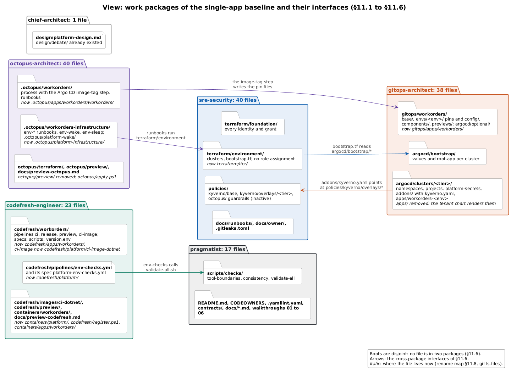

*Work packages of the single-app baseline: the five role packages of §11.1 to §11.5 and the chief architect's document, with their outputs and disjoint roots. Arrows are the five interfaces of §11.6, coloured by the acting package; italic lines give where the outputs live now, after the renames of §11.8.*

| Package | Files | Exclusive roots |
|---|---|---|
| codefresh-engineer | 23 | `codefresh/**`, `containers/**`, `docs/preview-codefresh.md` |
| gitops-architect | 38 | `argocd/**`, `gitops/**` |
| octopus-architect | 40 | `.octopus/**`, `octopus/**`, `docs/preview-octopus.md` |
| sre-security | 40 | `terraform/**`, `policies/**`, `docs/runbooks/**`, `docs/owner/**`, `.gitleaks.toml` |
| pragmatist | 17 | `README.md`, `CODEOWNERS`, `.yamllint.yaml`, `contracts/**`, `scripts/**`, the other `docs/*.md`, `docs/walkthroughs/**` |
| chief-architect | 1 | `design/platform-design.md` (existing: `design/debate/**`) |

The roots are disjoint, so no file can appear in two packages. Together they cover every path in §6.1: 158 implementation files plus this document (counted 2026-09-24, after the sleep/wake integration pass). The integration review edited files across packages (§2.5); ownership is unchanged, except that `policies/**` is approved by security owners alone (ADR-IR4).

**Cross-package interfaces:**
- `terraform/environment/bootstrap.tf` (sre-security) reads `argocd/bootstrap/*` (gitops-architect).
- `argocd/clusters/*/addons/kyverno.yaml` (gitops-architect) points at `policies/kyverno/overlays/*` (sre-security).
- `codefresh/pipelines/env-checks.yml` (codefresh-engineer) calls `scripts/checks/validate-all.sh` (pragmatist).
- The Octopus runbooks (octopus-architect) run `terraform/environment` (sre-security).
- The pin files (gitops-architect) are written by the Octopus step defined by octopus-architect.

### 11.7 Multi-app packages (ADR-IR34)

§11.0 applies. .NET code follows the organization conventions:
- NUnit 4.3.2 and Shouldly 4.3.0, with packages from the harness's central package management;
- test doubles prefixed `Stub`;
- AAA without section comments;
- names `Should_<Method>_<Scenario>_<Expected>` or `When_…`;
- file-scoped namespaces and nullable reference types.

Each role owns one test area and one capability prefix, and adds the capability entries of ADR-IR34 to its own catalogue fragment.

**11.7.1 `codefresh-engineer`**: roots `codefresh/**`, `containers/**`, `fixtures/**` and `docs/preview-codefresh.md`; area `Codefresh`; prefix `CAP-CF`.

| # | Work |
|---|---|
| 1 | Move `codefresh/workorders/**` to `codefresh/apps/workorders/**`: pipelines and specs `ci`, `release` and `preview`, the scripts, `version.env` and the README.<br>• Image paths become `apps/workorders/*`.<br>• Contexts become `platform-octopus`, `platform-registry` and `app-workorders-ci`; the runtime becomes `<cf-runtime>`.<br>• `PACKAGES` holds `ChurchBulletin.AcceptanceTests` and `apps/workorders/{ui-server,worker,db-migrator}` at `${{VERSION}}`. `ChurchBulletin.Database` is no longer pushed. |
| 2 | Move `ci-image` to `codefresh/platform/{pipelines,specs}/ci-image-dotnet.yml`, and `codefresh/images/ci-dotnet/Dockerfile` to `containers/platform/ci-dotnet/Dockerfile`. |
| 3 | Move `env-checks` to `codefresh/platform/{pipelines,specs}/env-checks.yml`. It adds `dotnet test tests/Platform.Conformance.sln --filter TestCategory=Offline` and the onboarding `check`. |
| 4 | New platform pipelines and specs: `conformance-arm`, `conformance`, `conformance-destructive`, `registry-retention`, `fixtures` (ADR-IR34 test harness). |
| 5 | New `codefresh/runner/values.yaml` for `cf-runtime` 10.5.6. The Codefresh token is referenced from a secret, never committed. |
| 6 | Move `codefresh/preview/register-preview.sh` to `codefresh/register.sh`:<br>• modes `--preview`, `--full` and `--app <app>`;<br>• creates or replaces pipelines by name and sets `runtimeEnvironment`;<br>• handles no secret.<br>*Implementation (2026-09-25):* `--full` and `--app` also create or replace the contexts and registry integrations of `codefresh/{platform,apps/<app>}/integrations.yaml`, with values taken from the operator's environment (`fromEnv`), never from a file; options `--dry-run`, `--prune` and `--recreate-missing-hooks`. |
| 7 | New starters `codefresh/templates/{minimal,multi-image,dotnet-buildps1}/`, and the sandbox pipelines `codefresh/apps/sandbox/{pipelines,specs}/` (`ci`, `release`). |
| 8 | Move `containers/workorders/**` to `containers/apps/workorders/**`. The migrator image carries the scripts and trusts `SSL_CERT_FILE`. New `containers/apps/sandbox/{web,migrator}/Dockerfile`, and `containers/platform/db-tools-mssql/Dockerfile` (sqlcmd and the Azure CLI, for the backup Jobs). |
| 9 | New `fixtures/sandbox-app/`: a .NET 10 minimal API with `/healthz`, `/version` and `/data/canary`, SQL scripts, and the failing-test and failing-migration toggles. |
| 10 | Tests CAP-CF-001 to CAP-CF-012; fragment `catalogue/capabilities.d/codefresh.yaml`. `docs/preview-codefresh.md` covers the runner install and the clean start. |

**11.7.2 `octopus-architect`**: roots `.octopus/**`, `octopus/**` and `docs/preview-octopus.md`; area `Octopus`; prefix `CAP-OCT`.

| # | Work |
|---|---|
| 1 | Move `.octopus/workorders/**` to `.octopus/apps/workorders/workorders/**`.<br>• Step 0 stays.<br>• `migrate-database` and `db-copy-pre-release` go; `platform-db-backup` runs before the prod pin; `sod-guard` becomes `platform-sod-guard`.<br>• The image-tag step references `apps/workorders/{ui-server,worker,db-migrator}` from `acr-apps`.<br>• `read-deployment-secrets` reads only the tdd acceptance secrets, through `azure-workorders-tdd`.<br>• Runbooks: `db-restore` (from `db-restore-pitr`) and `run-acceptance-tests`; `db-backup` goes. |
| 2 | Move `.octopus/workorders-infrastructure/**` to `.octopus/platform-infrastructure/**`.<br>• Terraform directory `terraform/tier`.<br>• New `apps-plan` and `apps-apply` (`terraform/apps/tier`, prompted `App.Name`).<br>• `rotate-sql-passwords` becomes `rotate-db-passwords`; `provisioner-credential-check` goes.<br>• `env-sleep` gains `Sleep.DryRun` and `Sleep.NowOverride`.<br>• `Azure.LifecycleAccount` is `azure-platform-lifecycle-<tier>` in both environments. |
| 3 | `.octopus/platform-wake/**` reads `PlatformWake.OctopusApiKey`. |
| 4 | New `.octopus/apps/sandbox/sandbox/**` from the `deploy-with-db` starter, with channels `Default`, `Hotfix` and `Strict`. |
| 5 | New starters `octopus/templates/{deploy-minimal,deploy-with-db,db-runbooks}/` and step-template scripts `octopus/step-templates/{sod-guard,db-backup,pin-writer}.sh`. The starter wait guard takes `Wake.WaitMinutes`. |
| 6 | `octopus/terraform/*.tf`:<br>• `moved` blocks for renamed addresses;<br>• `for_each` over `apps/*.yaml`: groups, project shells, channels, the freeze scope and optional accounts;<br>• the sets `Platform Environment` (`Platform.InterventionTestMode`, `Platform.SoDMode`), `Platform Infrastructure` and `Platform Automation`;<br>• step templates, and accounts `azure-platform-lifecycle-*`;<br>• teams scoped by environment only, with the automation user in `UAT Approvers` and `Prod Approvers`;<br>• the `azurerm` provider, read-only, for identity lookups. |
| 7 | Tests CAP-OCT-001 to CAP-OCT-015; fragment `octopus.yaml`. `docs/preview-octopus.md` covers the live-object migration (§11.9). |

**11.7.3 `gitops-architect`**: roots `argocd/**` and `gitops/**`; area `GitOps`; prefix `CAP-GIT`.

| # | Work |
|---|---|
| 1 | `argocd/clusters/{nonprod,prod}/`:<br>• new `appset-apps.yaml`, `storage.yaml` and add-on `cert-manager.yaml`;<br>• namespaces `platform-ingress`, `platform-backup` and `cert-manager`; project `platform-tenants`;<br>• Kyverno values that exclude AKS-managed resources (ADR-IR34 decision 22); bootstrap RBAC on `app-*/*`;<br>• `apps/workorders-*.yaml` and `argocd/optional/workorders-previews-appset.yaml` go.<br>*Implementation (2026-09-25):* also the add-ons `ingress.yaml` (Applications `envoy-gateway` and `platform-ingress`) and `platform-backup.yaml`, and `octopus-workers-rbac.yaml` (read access to Applications for the workers' script pods, which the fallback pin writer needs). |
| 2 | New chart `gitops/platform/tenant/`, rendering every tenant object of §7.0. Security owners review its image-policy template. |
| 3 | New `gitops/platform/components/db/mssql-2022-express/`, `db-credentials/{keyvault,generated}/`, `backup/mssql/` and `gitops/platform/ingress/`. |
| 4 | New starters `gitops/templates/{kustomize,helm,raw}/`. |
| 5 | Move `gitops/workorders/**` to `gitops/apps/workorders/**`.<br>• `base/` becomes `app/base/`, without workload identity, the SecretStore, `workorders-eso` or the NetworkPolicies.<br>• `envs/<env>/kustomization.yaml` becomes `envs/<env>/app/kustomization.yaml`, with three images; `config/` becomes `app/config/`.<br>• New `envs/<env>/db/` and PreSync Job `db-migrate`.<br>• `components/` and `previews/` move with the app. |
| 6 | New `gitops/apps/sandbox/**`. |
| 7 | Tests CAP-GIT-001 to CAP-GIT-013; fragment `gitops.yaml`. |

**11.7.4 `sre-security`**: roots `terraform/**`, `policies/**`, `docs/runbooks/**`, `docs/owner/**` and `.gitleaks.toml`; area `Azure`; prefix `CAP-AZ`.

| # | Work |
|---|---|
| 1 | Rewrite `terraform/foundation/**` (§7.0):<br>• out: SQL, locks, policy and PIM;<br>• in: provider registration, `platform-operators`, `sp-platform-conformance`, budgets, and the toggle `conformance_least_privilege`. |
| 2 | New `terraform/build/**`. |
| 3 | Move `terraform/environment/**` to `terraform/tier/**`, with `{nonprod,prod}.tfvars` and their examples.<br>• Tainted system pools; `apps` pool maxima of 7 and 4; ephemeral OS disks; automatic upgrades off.<br>• Workload federated credentials; no role assignment.<br>• `data-services.tf` keeps only the platform vault.<br>*Implementation (2026-09-25):* managed OS disks, because the allowed sizes have no temporary disk (Q39); new `scripts/aks-token.sh`, the exec credential plugin of the Kubernetes providers. |
| 4 | New `terraform/apps/tier/**` and `terraform/apps/grants/**`, with mocked `terraform test`. |
| 5 | `policies/kyverno/**`: the registry-path policy, `require-mssql-express` and the workload baseline. Security owners review the per-app signer template in the tenant chart. |
| 6 | `docs/owner/Grant-ProvisionerRights.ps1`: the ADR-IR34 change. |
| 7 | Runbooks:<br>• `database-restore-pitr.md` becomes `database-backup-and-restore.md`;<br>• `credential-rotation.md` adds the conformance secret, the runner token and the shared ACR tokens;<br>• `sleep-and-wake.md` adds the build pool and the hooks;<br>• new `conformance.md`. |
| 8 | Tests CAP-AZ-001 to CAP-AZ-017; fragment `azure.yaml`. |

**11.7.5 `pragmatist`**: roots `README.md`, `CODEOWNERS`, `.yamllint.yaml`, `contracts/**`, `scripts/**`, `tools/**`, `apps/**`, `docs/capabilities.md`, the other `docs/*.md` and `docs/walkthroughs/**`; area `Kit`; prefix `CAP-KIT`.

| # | Work |
|---|---|
| 1 | `apps/schema.json` (JSON Schema 2020-12, `additionalProperties: false`), `apps/workorders.yaml` and `apps/sandbox.yaml` |
| 2 | `tools/Platform.Onboarding/`: a .NET 10 console with `new`, `scaffold`, `render`, `check [--live]`, `list` and `retire`. It scaffolds from the three roles' starters. |
| 3 | `contracts/platform-contracts.yaml`: platform names and the handshake. App #1's specifics move to `apps/workorders.yaml` and to its files. |
| 4 | `scripts/checks/*.sh`:<br>• the new paths;<br>• C13, C14, C16 and C17 retired (pragmatist memo §3);<br>• a name lint and a TB2 rule for the build cluster;<br>• `validate-all.sh` sub-commands `dotnet-offline` and `onboarding`.<br>*Implementation (2026-09-25):* the three Bash check scripts are retired; `scripts/checks/validate-all.ps1` keeps the sub-commands, and the consistency checks and tool-boundary rules are the Offline tests `Kit/Consistency` and `Kit/Boundaries` (docs/scripting.md, phase B). |
| 5 | `CODEOWNERS` per §6.2 |
| 6 | Docs:<br>• `README.md`, `docs/bootstrap.md` (the P1 plan), new `docs/onboarding.md`;<br>• `tool-boundaries.md`, `cutover-and-decommission.md`, `consistency-notes.md`;<br>• `docs/capabilities.md`, rendered;<br>• walkthroughs 01–06, app-neutral with `workorders` as the example, and a new `07-own-the-pipeline.md`. |
| 7 | Tests CAP-KIT-001 to CAP-KIT-009; fragment `kit.yaml` |

**11.7.6 Harness engineer (dispatched before this ADR).**
- Roots: `tests/**` outside the five role areas, and `catalogue/capabilities.yaml`.
- Capabilities `CAP-HARNESS-001` to `004`.
- It merges `catalogue/capabilities.d/*.yaml` and adds `tools/Platform.Onboarding` to the solution for the Kit offline tests.
- *Implementation (2026-09-25):* the harness seed is the fragment `catalogue/capabilities.d/harness.yaml` (`CAP-HARNESS-001` to `012`); the loader still merges an optional `catalogue/capabilities.yaml` first, and none exists. `tools/Platform.Onboarding` is not in the solution: the Kit offline tests build the tool and run its command line, and `validate-all.ps1 dotnet-offline` runs `tools/Platform.Onboarding.Tests` separately.

### 11.8 Rename map (files)

| Today | Becomes | Package |
|---|---|---|
| `.octopus/workorders/**` | `.octopus/apps/workorders/workorders/**` | octopus-architect |
| `.octopus/workorders-infrastructure/**` | `.octopus/platform-infrastructure/**` | octopus-architect |
| Runbooks `rotate-sql-passwords`, `db-restore-pitr` | `rotate-db-passwords`, `db-restore` | octopus-architect |
| Runbooks `provisioner-credential-check`, `db-backup` | Removed (platform backup CronJobs) | octopus-architect |
| `codefresh/workorders/**` | `codefresh/apps/workorders/**` | codefresh-engineer |
| `codefresh/workorders/{pipelines,specs}/*ci-image.yml` | `codefresh/platform/{pipelines,specs}/ci-image-dotnet.yml` | codefresh-engineer |
| `codefresh/pipelines/env-checks.yml`, `codefresh/specs/platform-env-checks.yml` | `codefresh/platform/{pipelines,specs}/env-checks.yml` | codefresh-engineer |
| `codefresh/images/ci-dotnet/Dockerfile` | `containers/platform/ci-dotnet/Dockerfile` | codefresh-engineer |
| `codefresh/preview/register-preview.sh` | `codefresh/register.sh` | codefresh-engineer |
| `octopus/preview/{apply-preview.sh,preview.tfvars}` | Removed: `octopus/apply.sh` applies `octopus/terraform` (P1-06 and later) | octopus-architect |
| `containers/workorders/**` | `containers/apps/workorders/**` | codefresh-engineer |
| `gitops/workorders/base/*` | `gitops/apps/workorders/app/base/*` | gitops-architect |
| `gitops/workorders/envs/<env>/kustomization.yaml` and `config/` | `gitops/apps/workorders/envs/<env>/app/kustomization.yaml` and `app/config/` | gitops-architect |
| `gitops/workorders/{components,previews}/` | `gitops/apps/workorders/{components,previews}/` | gitops-architect |
| `argocd/clusters/*/apps/workorders-*.yaml`, `argocd/optional/workorders-previews-appset.yaml` | Removed: the tenant chart renders them | gitops-architect |
| `terraform/environment/**` | `terraform/tier/**` | sre-security |
| `terraform/foundation/**` | Rewritten in place | sre-security |
| `docs/runbooks/database-restore-pitr.md` | `docs/runbooks/database-backup-and-restore.md` | sre-security |
| `policies/kyverno/base/verify-release-signatures.yaml` | Generic rules stay; per-app signer policies come from the tenant chart | sre-security (review), gitops-architect (chart) |
| App sections of `contracts/platform-contracts.yaml` | `apps/workorders.yaml` and app #1's files | pragmatist |
| `scripts/checks/{tool-boundaries,consistency,validate-all}.sh` | `scripts/checks/validate-all.ps1`; the checks and rules became the Offline tests `Kit/Consistency` and `Kit/Boundaries` (docs/scripting.md, phase B, 2026-09-25) | pragmatist |
| `docs/walkthroughs/*` | App-neutral, with `workorders` as the example | pragmatist |

### 11.9 Live-object migration

**Octopus.** The preview objects were applied by `octopus/preview/apply-preview.sh` with local state. Step P1-06 migrates them with `moved` blocks or in-place renames, which keep IDs and history; `octopus/apply.sh` runs that apply on a copy of the preview state, and the phase 0 script is retired ([docs/preview-octopus.md](../docs/preview-octopus.md)).

| Object | Action |
|---|---|
| Environments `tdd`, `uat`, `prod`, `infra-nonprod`, `infra-prod` | Keep |
| Lifecycles `workorders-standard`, `workorders-hotfix`, `workorders-infrastructure` | Rename to `platform-standard`, `platform-hotfix`, `platform-infrastructure` |
| Project group `Work Orders` | Rename to `app-workorders` |
| Project `workorders` | Keep, as app #1, with base path `.octopus/apps/workorders/workorders`. The files move in the same pull request, and the apply follows the merge. |
| Project `workorders-infrastructure` | Rename name and slug to `platform-infrastructure`; group `Platform`; base path `.octopus/platform-infrastructure` |
| Sets `WorkOrders Environment`, `WorkOrders Infrastructure` | Rename to `Platform Environment`, `Platform Infrastructure`, and replace their values |
| Feed `docker-hub`; freeze `prod-weekend-freeze` | Keep; the freeze gains every app project. *Implementation:* project freezes are per project, so the live freeze becomes `prod-weekend-freeze-workorders`, and every other app project that deploys to prod gets its own `prod-weekend-freeze-<project>` |
| Seven teams, ten role assignments | Keep the names; scope by environment only; add the automation user to `UAT Approvers` and `Prod Approvers`. *Implementation:* also to `Platform Engineers`, so the main loop answers the approvals of the platform runbooks; it stays in `CI Release Publishers` |
| Not yet applied: `platform-wake`, group `Platform`, the machine policy, the `env-sleep` triggers | Create as designed |
| Not yet applied: `WorkOrders Platform Automation`, `acr-workorders`, `azure-oidc-deploy-<env>`, `azure-oidc-env-lifecycle-<class>` | Create as `Platform Automation`, `acr-apps`, optional `azure-<app>-<env>` and `azure-platform-lifecycle-<tier>` |
| New | Project `sandbox`, group `app-sandbox`, the step templates |

**Codefresh.** The account starts clean (user correction). Steps P1-01 and P1-05:

| Object | Action |
|---|---|
| Runtime `trf-CodeFresh-dev/codefresh` and its agent; projects `codefresh-k8s-pipeline`, `codefresh-onion8-aks`, `default`; old contexts and integrations | Export, then delete |
| Stored context `azure-runtime-provisioner` | Delete; it was never attached |
| Stored context `github-aisf-sample-apps-token`; Git integration `github-aisf-sample-apps` | Keep the context (its token also goes into `platform-conformance`); the integration is kept, then replaced by the Codefresh GitHub App under the same name (ADR-IR35) |
| Project `workorders`; pipelines `workorders/ci`, `workorders/release`, `workorders/preview` | Keep; replace the specs in place from `codefresh/apps/workorders/specs/`, with runtime `<cf-runtime>` |
| Pipeline `workorders/ci-image` | Recreate as `platform-env/ci-image-dotnet`, then delete |
| Project `platform-env`; pipeline `env-checks` | Keep; spec from `codefresh/platform/specs/` |
| Context `workorders-octopus` | Recreate as `platform-octopus`; delete after the first release through it |
| New | Runtime `<cf-runtime>` (account default), project `sandbox`, the platform pipelines, and the contexts and registry integrations of §7.0 |

**Azure.** Nothing of the platform exists yet, and the foreign groups `NetworkWatcherRG` and `ai-model` stay untouched, so there is nothing to adopt.

### 11.10 Coverage and overlap (ADR-IR34)

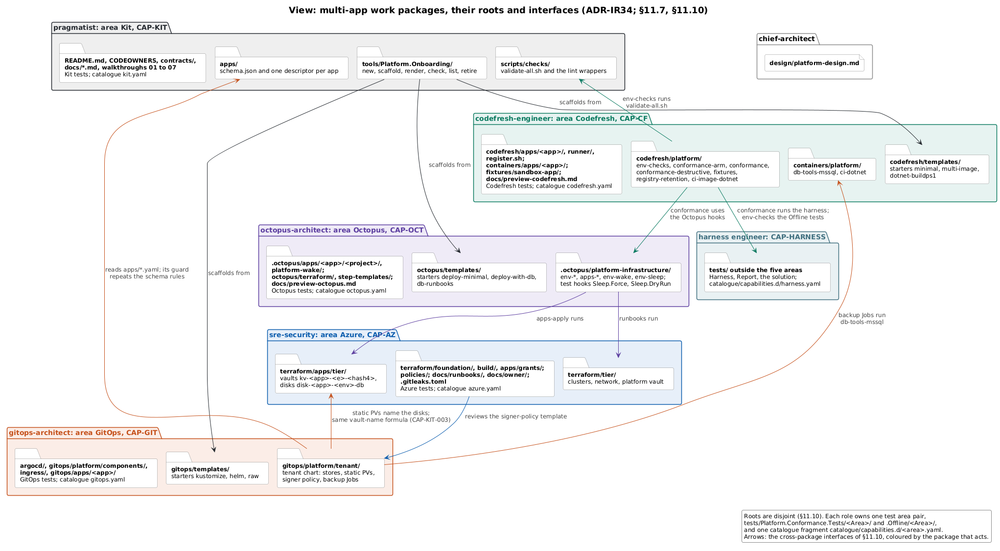

*Multi-app work packages (ADR-IR34): each role owns disjoint roots, one test-area pair and one catalogue fragment. Arrows are the §11.10 interfaces: the kit scaffolds from the starters; the tenant chart reads descriptors, names Terraform disks and runs db-tools backups; runbooks run the tier layers; pipelines run the checks, the harness and the Octopus hooks.*

| Package | Exclusive roots |
|---|---|
| codefresh-engineer | `codefresh/**`, `containers/**`, `fixtures/**`, `docs/preview-codefresh.md`, the `Codefresh` test areas, `catalogue/capabilities.d/codefresh.yaml` |
| octopus-architect | `.octopus/**`, `octopus/**`, `docs/preview-octopus.md`, the `Octopus` test areas, `…/octopus.yaml` |
| gitops-architect | `argocd/**`, `gitops/**`, the `GitOps` test areas, `…/gitops.yaml` |
| sre-security | `terraform/**`, `policies/**`, `docs/runbooks/**`, `docs/owner/**`, `.gitleaks.toml`, the `Azure` test areas, `…/azure.yaml` |
| pragmatist | `README.md`, `CODEOWNERS`, `.yamllint.yaml`, `contracts/**`, `scripts/**`, `tools/**`, `apps/**`, `docs/capabilities.md`, the other `docs/*.md`, `docs/walkthroughs/**`, the `Kit` test areas, `…/kit.yaml` |
| Harness engineer (dispatched) | `tests/**` outside the five areas; `catalogue/capabilities.d/harness.yaml` (the seed; §11.7.6) |
| chief-architect | `design/platform-design.md` |

The roots are disjoint. A test area is the pair `tests/Platform.Conformance.Tests/<Area>/` and `tests/Platform.Conformance.Offline/<Area>/`.

**Cross-package interfaces:**
- The tenant chart (gitops) reads `apps/*.yaml` against the pragmatist's schema. It renders the per-app signer policy, reviewed by sre-security, and the backup Jobs, which run the `db-tools-mssql` image (codefresh). *Implementation (2026-09-25):* the chart carries no `values.schema.json`; `tenant.validate` in `_helpers.tpl` checks the name, the reserved words, the tier and `status` at render time, and the onboarding tool's `check` validates the descriptor against `apps/schema.json` on every push.
- `terraform/apps/tier` (sre) creates the disks `disk-<app>-<env>-db` that the tenant chart's static PersistentVolumes name (gitops). Terraform and the chart both implement the vault-name formula, and CAP-KIT-003 checks that they agree.
- The Octopus runbooks (octopus) run `terraform/tier` and `terraform/apps/tier` (sre).
- The conformance pipelines (codefresh) run the harness (harness engineer) and use the Octopus hooks (octopus).
- `env-checks` (codefresh) runs `validate-all.ps1` and the Offline tests (pragmatist, harness engineer).
- The onboarding tool (pragmatist) scaffolds from the codefresh, octopus and gitops starters.

## 12. Open questions

| # | Question | Default until answered |
|---|---|---|
| Q1 | Is Argo CD in Octopus generally available on the instance's 2026.4 build, and do the action type and property keys match an OCL export? | Treat it as Preview (E9). Action type `Octopus.ArgoCDUpdateImageTags` from the OCL catalog (ADR-IR21); compare with an export in the spike. The fallback writer is step template `platform-pin-writer` (ADR-IR34 decision 20): it commits `newTag` as the bot, then waits for Argo CD through the in-cluster worker. |
| Q2 | Can the Kubernetes worker chart label script pods for workload identity, and add service-account annotations for workers? | Use password steps until WI-05. Fallback: a Job in the worker namespace (ADR-C2). |
| Q3 | Does lifecycle auto-deploy to TDD need `DeploymentCreate` for the release creator? | Moot while the release creator is the Space Manager `AISF-Service-Account` (ADR-IR32); revisit on the path back. |
| Q4 | What happens when two deployments commit pins to `main` at the same time? | Automatic step retry; serialize deployments of the project if conflicts persist. |
| Q5 | Which Gateway API implementation, and where do TLS certificates come from? Public or private endpoints for tdd and uat? | ADR-IR34: cert-manager issues a Let's Encrypt HTTP-01 certificate per host on sslip.io host names, with a custom domain later (R35). Gateway `platform-gateway` runs on an in-cluster controller, chosen in P1-07 [VERIFY]. Endpoints are public, with TLS. |
| Q6 | ACR SKU: are private endpoints required (Premium)? Do repository-scoped tokens allow the tag-lock operation? | Standard, without private endpoints (ADR-IR34). The shared release token holds `metadata/write`; verify the lock in P1-05 (V04). |
| Q7 | Are Octopus Cloud dynamic-worker egress IPs stable enough for AKS authorized IP ranges? | AKS API public with Entra RBAC and local accounts off; authorized ranges `<octopus-cloud-static-ips>` [VERIFY]. ADR-IR34: P1 starts without authorized ranges, relying on Entra ID with local accounts off. Ranges come once the Octopus, build-cluster and operator egress addresses are known. |
| Q8 | Where does UAT data come from: the WI-07 seed or a sanitized copy of legacy UAT? | Seed. |
| Q9 | Does the AI Software Factory keep consuming `rc-<version>` prereleases and GHCR images after cutover, and which pipeline publishes them? | Legacy publishes them until P5; decide at P5. |
| Q10 | Are legacy prod SQL and the new prod SQL in the same subscription (database copy or bacpac)? What maintenance window is acceptable? | Rehearse a bacpac export and import in UAT. |
| Q11 | Is the registered Codefresh runner cluster fit for the runtimes? | Answered 2026-09-24: its only runtime is dead and last reported in 2025. ADR-IR34 builds `aks-platform-build`. |
| Q12 | Which `ASPNETCORE_ENVIRONMENT` does the legacy Container App use? | `Production`. |
| Q13 | Can the Octopus access token for gateway registration be short-lived, or does the gateway use it continuously? | Store it in Key Vault and rotate it every 90 days. |
| Q14 | What is the environment repo's default branch? | Answered: `main`; the repo is attached, private and empty, and this tree becomes its first commits. |
| Q15 | Which Argo CD SSO variant is permitted: workload-identity federation on the app registration, or a client secret? | Federation. |
| Q16 | Will a separate prod subscription be provided, and when? | One subscription with locks until then. |
| Q17 | Can an identity with Contributor on the cluster resource group only create AKS, given that the resource provider creates the node resource group? Does AKS with a custom VNet attempt role assignments? | Pre-created identities and a foundation-granted Network Contributor role on the subnet. If the spike fails, the foundation grants the lifecycle identity Contributor on the node resource group name, `MC_<rg>_<cluster>_<region>`. ADR-IR34: the lifecycle identity creates each cluster with identities and grants the foundation made first, and names the node group explicitly; verify in P1-07. |
| Q18 | Does `features.policyExceptions` also govern the CEL `PolicyException` kind of Kyverno 1.19? | Assume yes (ADR-IR2); prove it in the phase-2 spike, fallback: a reviewed temporary Audit patch. |
| Q19 | After a maintainer pushes a fork pull request's commits to a branch of `20260923-001`, does the fork's pull request show `codefresh/ci` for the same SHA? | Assume yes (ADR-IR26); prove it with the first external contribution. |
| Q20 | Does `CreateNamespace=true` work for Applications in a project without cluster-scoped kinds? | Prove it in the phase-6 spike; fallback: allow kind `Namespace` in `workorders-previews` only (ADR-IR25). |
| Q21 | Does the Octopus `JsonEscape` filter produce a valid `EnvVariables` JSON value for the Argo CD credential, including a multi-line private key? | Assume yes (ADR-IR1); prove it in the first `env-plan`. Fallback: store the credential base64-encoded and decode it in the layer. |
| Q22 | While an AKS cluster is stopped, is the Standard-tier fee billed, and are managed OS disks kept and billed? Do `Standard_D4as_v6` nodes get ephemeral OS disks by default? | Moot for the fee: every cluster is on the Free tier (ADR-IR34). For OS disks, see Q39. |
| Q23 | Do runbook runs share the default project-and-environment concurrency tag, and can `Octopus.Task.ConcurrencyTag` be scoped to two runbooks of a config-as-code project? | Assume yes to both (E51); prove it in the phase-2 drill. Fallback: move `env-wake` and `env-sleep` to a project of their own. |
| Q24 | Does the tasks API report a deployment paused at a manual intervention as Executing? | Assume yes: the cluster stays awake until the approvers answer (ADR-IR33, risk 5). |
| Q25 | Which REST endpoints trigger a worker health check and report the health of workers and Argo CD instances? | The endpoints chosen in `env-wake.ocl` [VERIFY]; prove them in the phase-2 drill. |
| Q26 | Can library-set variables be scoped to steps or runbooks, and which ID form do the process and step scopes of a sensitive project variable take for runbooks stored in Git? | Library sets cannot; done: `workorders-infrastructure` gets a project variable scoped by runbook and step slugs (ADR-IR33, S5) [VERIFY]. Fallback: include `WorkOrders Platform Automation` in that project. |
| Q27 | Does provider 1.20.0 manage scheduled triggers for runbooks stored in Git, and which machine-policy settings keep sleeping Kubernetes workers registered without alerts? | As in the contracts [VERIFY]. Fallback: triggers created by hand and recorded in `docs/bootstrap.md`. |
| Q28 | Does `Group.Create` make the provisioner the owner of each group it creates, so that it can manage the members? | Assume yes [VERIFY]; otherwise an Entra administrator adds the members. |
| Q29 | What is the task cap of the Octopus Cloud instance? A deployment that waits for a wake holds three task slots: the deployment, its `platform-wake` deployment and `env-wake`. | Assume at least 5 [UNVERIFIED]. ADR-IR34: the conformance suite runs deployments one at a time. |
| Q30 | Should database copies (`db-copy-pre-release`, `db-backup`) use a lower service objective to cut cost? | No change: copies inherit the source tier (§3.4). |
| Q31 | Which identity creates the child deployment of a Deploy a Release step, and does it need Deployment Creator on `platform-wake`? | Assume the creator of the parent deployment: the deploying teams hold Deployment Creator on `platform-wake` in their environments; TDD auto-deploys run as the release creator, the Space Manager `AISF-Service-Account`. |
| Q32 | Can runbooks use the Deploy a Release step? | Assume no: the `workorders` runbooks wait for the cluster instead (ADR-IR33). If they can, the wait guard becomes a Deploy a Release of `platform-wake`. |
| Q33 | Does the Octopus CLI's default package version (`--package-version`) apply to the child release of a Deploy a Release step? | Assume yes: `workorders/release` passes explicit `PACKAGES` and no `PACKAGE_VERSION` (§7.7). |
| Q34 | Do Octopus task descriptions name the runbook, so that `env-sleep` can leave its own runs and `provisioner-credential-check` out of the idle clock (S6)? | Assume yes; prove it in the P2 drill. Otherwise filter by runbook ID from the task arguments. |
| Q35 | Do runbook runs populate `Octopus.Deployment.CreatedBy.*`, so that a forced sleep's log names the user (S7)? | Assume not always: the task history names the user in any case. |
| Q36 | Does Octopus count disabled projects? Which tier and task cap does the instance have? | Assume every project counts and the cap is 5 (R7, Q29); read the license page in P1-06. |
| Q37 | Does `az aks stop` succeed with Kyverno installed? | Assume yes, with the webhook exclusions (ADR-IR34 decision 22). Verify in P1-07 (V08, CAP-AZ-005). Fallback: `env-sleep` removes Kyverno's webhook configurations just before the stop. |
| Q38 | Do static PersistentVolumes bind the Terraform-created disks, and re-attach them after a rebuild? | Assume yes. Verify in P1-09 (V11) and weekly (CAP-AZ-008). |
| Q39 | Do ephemeral OS disks work through AKS stop and start? | Moot (2026-09-24): the allowed sizes have no temporary disk, so every pool uses managed OS disks, billed while stopped. |
| Q40 | Does app #1's release build fit a `Standard_D4as_v6` build node? | Assume yes, with the gates in at most two parallel groups. Measure in P1-04 (V03). Fallback: `Standard_D8as_v6`, +8 vCPU at the maximum. |
| Q41 | Does a build queued with `codefresh run` start after the builds already queued, and which time zone do cron triggers use? | Assume first in, first out, and UTC. Verify in P1-13. Otherwise `conformance` polls the armed builds' statuses before it tests. |
| Q42 | Does SQL Server 2022 on Linux run `BACKUP … TO URL` with a user-delegation SAS? | Assume yes. Verify in P1-10 (V12). Fallback: a backup Job in the app namespace that mounts the database volume on the same node (ReadWriteOnce allows it), then `azcopy`. |
| Q43 | Does .NET on Linux honour `SSL_CERT_FILE` when SqlClient validates the server certificate? | Assume yes. Verify in P1-10 (V13). Fallback: WI-07's trust switch. |
| Q44 | Does the workload identity webhook inject the federated token when the service account has no client-ID annotation but the pod sets `AZURE_CLIENT_ID`? | Assume yes. Verify with the first app that asks for a workload identity. Fallback: a one-line pull request with the annotation. |
| Q45 | Can `AISF-Service-Account` take and answer manual interventions through the API as a member of the responsible team? | Assume yes. Verify in P1-06 (V07). |
| Q46 | Does a server-side dry run go through ResourceQuota admission and Kyverno? | Assume yes: admission runs on dry runs. Verify in P1-13 (CAP-GIT-006, CAP-AZ-001). |
| Q47 | Can an Azure RBAC role be assigned at a namespace scope of an existing cluster before the namespace exists? | Assume yes. Verify in P1-03. Fallback: assign after the tenant creates `sandbox-<env>`. |
| Q48 | How does Let's Encrypt count certificates for sslip.io host names? | Assume per `<ip-dashed>.sslip.io`, 50 a week. Verify in P1-10. Fallback: R35. Note of 2026-09-25: `sslip.io` is not on the Public Suffix List (version 2026-09-24), so the count may be per `sslip.io` unless Let's Encrypt applies an override [VERIFY]. |
| Q49 | Can a build use its own Codefresh API access (`CF_API_KEY`)? | Assume yes. Verify in P1-13. Fallback: `CODEFRESH_API_KEY` in `platform-conformance`. |
| Q50 | Can the main loop create `<sandbox-app-repo>` with its GitHub access? | Try in P1-11. Fallback: R31. |
| Q51 | Does the Codefresh Runner scale a zero-node pool? Do pending engine and dind pods trigger the autoscaler, and does `storage.backend: local` work on fresh nodes? | Assume yes. Verify in P1-04 (CAP-CF-003). |

### 12.1 [VERIFY] ledger for P2 (2026-09-25)

The P2 checklist item "every [VERIFY] item not settled in P1 is proven or has a recorded fallback" ([cutover-and-decommission.md](../docs/cutover-and-decommission.md#p2-tdd-maturity-for-app-1)) is closed against this table. Status on 2026-09-25, after the end-to-end pass (release 2.5.722 through prod, Octopus pin commits `f99818b`, `784de48`, `7fed226`) and the partial conformance runs on branch `conformance-results` of `clearmeasure-aisf-sample-apps/platform-sandbox`. **Settled** names its P1 evidence; **Nightly** is settled once the five green nightly runs of P1 exit criterion 1 include the named capability; **P2** is proven in the P2 drills (proof, then the fallback if it fails); **Later** belongs to a later phase and keeps its fallback; **Moot** needs no proof.

| Item | Status | Proof (or evidence) | Fallback if the proof fails |
|---|---|---|---|
| Q1, ADR-IR21 Argo CD step behaviour | Settled | The step `Octopus.ArgoCDUpdateImageTags` committed the three `newTag` pins of 2.5.722 as the Octopus bot in tdd, uat and prod | — |
| Q1, ADR-IR21 action type and property keys against an OCL export | P2 | Export `workorders` from the Octopus UI (Git-backed process) and diff the step's `action_type` and `properties` against `deployment_process.ocl` | Step template `platform-pin-writer` (ADR-IR34 decision 20) |
| Q4 two deployments committing pins at once | P2 | Deploy `sandbox` to tdd and `workorders` to tdd in the same minute; both pin commits land (step retry in the task log) | Serialize the project's deployments (concurrency tag) |
| Q5 Gateway controller | Settled | Envoy Gateway serves the sslip.io hosts with Let's Encrypt certificates (CAP-GIT-012) | — |
| Q6, V04 tag lock with `cf-apps-release` | Settled | Release 2.5.722 passed `supply_chain`, which locks every tag with the token; CAP-CF-007 re-reads the locks | — |
| Q7 authorized IP ranges | Later (P4, egress hardening) | Record the Octopus Cloud, build-cluster and operator egress addresses over 14 days of P2 task logs | Entra RBAC with local accounts off (current) |
| Q13 gateway token lifetime | Moot | Stored in Key Vault, rotated every 90 days ([credential-rotation.md](../docs/runbooks/credential-rotation.md)) | — |
| Q18, ADR-IR2 `features.policyExceptions` and the CEL `PolicyException` | P2 | Server-side dry run in `sandbox-prod` (Enforce) of a bare pod with a `:latest` image: refused without an exception; admitted with a `policies.kyverno.io` `PolicyException` in the allowed exceptions namespace; still refused with the same exception in any other namespace | A reviewed, temporary Audit patch in `policies/kyverno/overlays/prod` ([break-glass.md](../docs/runbooks/break-glass.md)) |
| Q19 fork pull request status | Later (first external contribution) | CAP-CF-005 manual check | Maintainer re-runs `codefresh/ci` on the pushed branch |
| Q20 `CreateNamespace` without cluster-scoped kinds | Later (phase 6) | Phase-6 preview spike | Allow kind `Namespace` in `workorders-previews` only (ADR-IR25) |
| Q21, V10 `JsonEscape` credential | Settled | `env-apply` in both tiers seeded the Argo CD repository credential and Argo CD syncs `main` | — |
| Q22, Q39, V09 AKS fee and OS disks while stopped | Moot | Free tier; managed OS disks on every pool | — |
| Q23, E51 concurrency tag of `env-wake` and `env-sleep` | P2 | Queue `env-wake` and `env-sleep` for `infra-nonprod` within seconds of each other; the second task waits for the first (task log "waiting for task") | Move `env-wake` and `env-sleep` to a project of their own |
| Q24, §3.4 risk 5 a paused deployment counts as Executing | P2 | During a `uat-signoff` wait of a `workorders` deployment, the hourly `env-sleep` logs `Sleep.Decision` busy and does not stop the cluster | `env-sleep` also reads interruptions (`/api/<space>/interruptions?pendingOnly=true`) |
| Q25, §2.5 step 4 worker health and Argo CD connection endpoints | P2 | `env-wake` log after a cold start shows each `k8s-<env>` worker healthy and the Argo CD instance connected; a deployment right after it runs its in-cluster steps without a retry | Wait loop on the worker list (`/api/<space>/workers`) until `HealthStatus` is Healthy |
| Q26, V05 step-scope IDs of `Platform.OctopusApiKey` | Nightly (CAP-OCT-013) | CAP-OCT-013 green; `env-wake` and `env-sleep` run with the key | Include the library set in `platform-infrastructure` only |
| Q27, V06 triggers for runbooks in Git | Settled | Sleep resumed on 2026-09-25 (`a031767`) through `env-sleep-hourly-{nonprod,prod}`; P1 exit criterion 4 reads the stops | Triggers by hand, recorded in [bootstrap.md](../docs/bootstrap.md) |
| Q28 group owner after `Group.Create` | Settled (fallback taken) | The provisioner creates `platform-operators` with `az` and Terraform takes only its object ID ([bootstrap.md](../docs/bootstrap.md) P1-02) | — |
| Q29, Q36 task cap and licence | P2 | Read the instance's licence page (Configuration, License) and record tier and task cap here | Conformance keeps running deployments one at a time |
| Q31 identity of the `platform-wake` child deployment | P2 | A member of `Release Managers` who is not the automation user deploys `workorders` to uat; its `platform-wake` child starts | Grant `Deployment Creator` on `platform-wake` to the deploying teams in their environments |
| Q32, Q35 runbooks and Deploy a Release; `CreatedBy` in runbook runs | Moot | The designs assume no; wait guards and the task history cover both | — |
| Q33, §3.4 risk 12 child release version; `platform-wake` release selection | Settled | Release 2.5.722, created with an explicit `--package` per package, deployed its `platform-wake` child in every environment | — |
| Q34 task descriptions name the runbook (idle clock) | Nightly (CAP-OCT-009) | `env-sleep` logs leave its own runs and `provisioner-credential-check` out of the idle clock | Filter by runbook ID from the task arguments |
| Q37, V08 stop with Kyverno installed | Nightly (CAP-AZ-005) | CAP-AZ-005 green; `managedClusters/stop` succeeded in the activity log of both app clusters since sleep resumed | `env-sleep` removes Kyverno's webhook configurations before the stop |
| Q38, V11 static PersistentVolumes | Nightly (CAP-KIT-003), destructive (CAP-AZ-008) | CAP-AZ-008 in the destructive run (P1 exit criterion 2) | Static-PV runbook after a rebuild |
| Q40, V03 release build on `Standard_D4as_v6` | Settled | `workorders/release` 2.5.722 built, signed and handed off on the builds pool | — |
| Q41 queue order and cron time zone | Nightly | Start times of the nightly runs in Codefresh match the UTC crons | `conformance` polls the armed builds before it tests |
| Q42, V12 `BACKUP … TO URL` | Settled | `PreReleaseBackupTests` (CAP-OCT-015) passed in run `r20260925t1214-53a73a1a`: the prod deployment wrote the backup before the pin; CAP-AZ-009 re-reads the nightly blobs | A backup Job that mounts the database volume, then `azcopy` |
| Q43, V13 migrators trust `platform-internal-ca` | Settled | The PreSync `db-migrate` Job of 2.5.722 succeeded in tdd, uat and prod | WI-07's trust switch |
| Q44 workload identity without the client-ID annotation | Later (first app with a workload identity) | The first such app's pod gets `AZURE_FEDERATED_TOKEN_FILE` | A one-line pull request with the annotation |
| Q45, V07 automation answers interventions | Settled | The end-to-end pass answered `uat-signoff` and the prod go/no-go through the API; CAP-OCT-005 | — |
| Q46 dry runs go through quota and Kyverno | Nightly (CAP-GIT-006, CAP-AZ-001 to CAP-AZ-003) | Those capabilities green | Admission tests with real creates in `sandbox-tdd`, deleted at teardown |
| Q47 namespace-scope role before the namespace | P1 (P1-03, R30) | The least-privilege re-apply after the Owner re-run | Assign after the tenant creates `sandbox-<env>` |
| Q48 Let's Encrypt limits on sslip.io | P2 | Count the certificates issued per `<ip-dashed>.sslip.io` in the certificate-transparency log after a week of P2 | A custom domain (R35) |
| Q49 `CF_API_KEY` in a build | Nightly (CAP-HARNESS-003) | The conformance pipelines reach Codefresh | `CODEFRESH_API_KEY` in `platform-conformance` |
| Q50 sandbox repository | Settled | `clearmeasure-aisf-sample-apps/platform-sandbox` exists and holds `conformance-results` | — |
| Q51 zero-node builds pool | Nightly (CAP-CF-003) | CAP-CF-003 green | A minimum of one builds node while classes run |
| E7 read-only gateway account | P2 | The gateway reports health with `applications get`, `logs get` and `clusters get` only (§7.3 policies); a deployment's Argo CD step shows the Application health | Add `applications sync` (TB10 still forbids Trigger sync in the step) |
| ADR-IR20 agent upgrades under namespaced roles | P2 | The next Octopus-initiated upgrade of a `k8s-<env>` worker completes | `upgrade_locked`, upgrades through `env-apply` |
| ADR-IR31 NServiceBus diagnostics write | P3 (the Worker in tdd) | The Worker's first start in `workorders-tdd` logs no diagnostics-write error and stays Running; `ui-server` already runs with the same mount | Set the endpoint's diagnostics path to `/tmp` in the app (work item) |
| ADR-D18 template revision of a build | P2 | A push to `main` during a release build: the provenance of that build names one commit for the YAML and the scripts | Pin the spec's `specTemplate` revision to the build's start commit |
| ADR-IR19 integration-level access control in Codefresh | Later (P5, R32) | Codefresh account settings | Accepted residual risk (ADR-IR19) |
| §6.2 push ruleset per-actor semantics | P2 | A direct push of an `.octopus/**` change to `main` by an account outside the bypass list is refused; rule insights of the repository list the refusal | Branch protection with CODEOWNERS only; the bot-path audit catches bot changes |
| §7.3 Argo CD SSO federated credential after a rebuild | Destructive (CAP-AZ-007) | Sign-in through Entra after the nonprod rebuild of the destructive run | Port-forward with `platform-operators` ([break-glass.md](../docs/runbooks/break-glass.md)) |
| [sleep-and-wake.md](../docs/runbooks/sleep-and-wake.md) ESO refresh, OIDC issuer and disk attach after a start | Nightly (CAP-GIT-007, CAP-GIT-011, CAP-OCT-008) | Those capabilities green after a wake | The runbook's recovery steps |
| `codefresh/apps/workorders/README.md` OIDC variables, branch filter, step results, step services, restart, cron zone | Settled except restart | Release 2.5.722 signed with the OIDC variables, ran the gates with step services and reported step results; restart from a failed step is untested | Re-run the whole build (release creation is idempotent, P1 exit criterion 7) |
| §7.9 configuration parity with the legacy environment | Later (P4) | Diff the Container App's settings against `envs/prod/app/config` in the P4 rehearsal | Expand-and-contract configuration pull requests |
| K10 the end-to-end pass merges its own pull request | Settled | Pull request #1 of `20260923-001` merged in the end-to-end pass | — |
