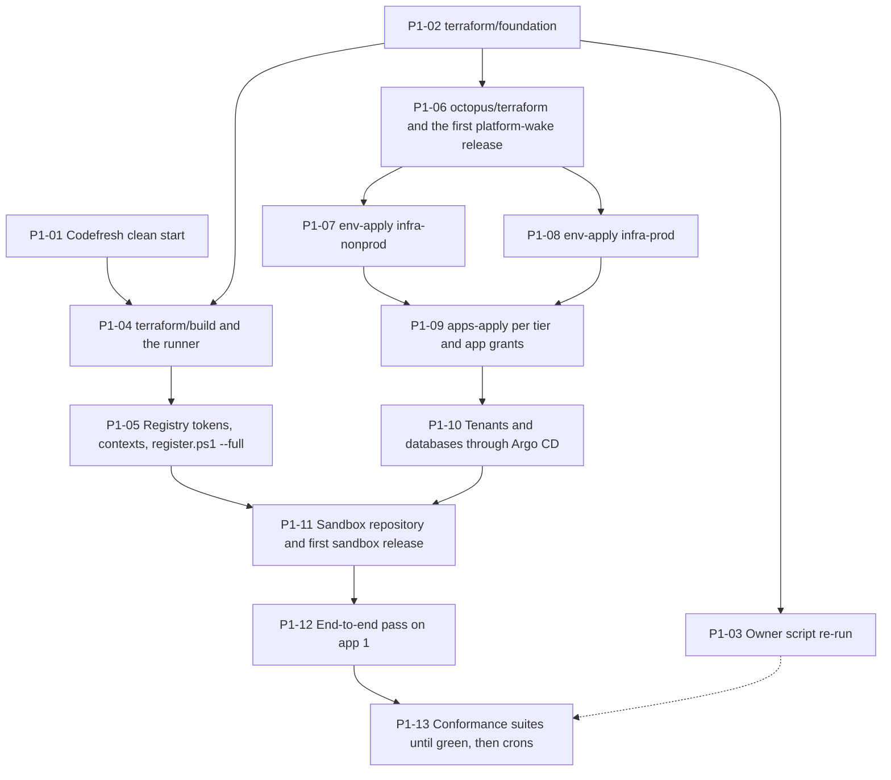

# Bootstrap: phase 1 provisioning runbook

Operator runbook for phase P1 of design ADR-IR34 ("Phase-1 provisioning plan"): from an empty subscription and a clean Codefresh account to both app clusters running `workorders` and `sandbox`, a green conformance suite and one change delivered to prod. Run the steps in the order P1-01 to P1-13. Each step names its owner, the commands, how to verify it, and the capabilities it proves.

The design is binding: [design/platform-design.md](../design/platform-design.md) (ADR-IR34, §7.0 contracts, §11.9 live-object migration, §12 open questions). Layer-specific details live next to each layer; this runbook links them instead of repeating them.

## Rules at every step

- **No secret in a file.** Keys, client secrets, tokens and generated passwords go from the operator's shell into Key Vault, an Octopus sensitive variable or a Codefresh context. Keep the tfvars of the operator-run layers (`foundation`, `build`, `apps/grants`, `octopus/terraform`) outside the working tree and pass them with `-var-file`; the committed `*.tfvars.example` files show their shape. The `<tier>.tfvars` of `terraform/tier` and `terraform/apps/tier` are committed, identifiers only (ADR-IR14): the runbooks read them from Git (P1-07).
- **Sleep by default.** From P1-06 on, `env-sleep-hourly-<tier>` stops an idle cluster outside 07:00–19:00 America/Chicago (ADR-IR33). Runbooks and app deployments wake their cluster first; any other step that needs a cluster (checks, seeding through kubectl, the harness) runs `env-wake` first.
- **The provisioner is operator-only.** `sp-automation-mvp-sub` applies `terraform/foundation`, `terraform/build` and `terraform/apps/grants` from an operator session. No pipeline, project or cluster holds its secret (ADR-IR34 decision 3).
- **Never touch the foreign groups** `NetworkWatcherRG` and `ai-model`, nor the origin `ClearMeasureLabs/bootcamp-palermo-workorders`.
- **Sessions behind the TLS-re-terminating proxy** reach cluster APIs with Entra ID tokens only (`PLATFORM_TLS_SYSTEM_TRUST=true` for the harness); `az aks command invoke` is the fallback. Client certificates never work there.
- **One build at a time.** The Codefresh plan (BASIC_1) queues builds; start the next build step only when the queue is empty (R32).

## Owners

| Owner | Who | Rights used |
|---|---|---|
| Main loop | The automation acting for the user (design §14), with the user's stored credentials | Codefresh and Octopus APIs, the provisioner session, GitHub on `clearmeasure-aisf-sample-apps` |
| Provisioner | `sp-automation-mvp-sub` | Contributor on the subscription; RBAC Administrator constrained to 12 roles and to service-principal and group assignees; Graph `Group.Create`, `Application.ReadWrite.OwnedBy` |
| User (Owner) | The account holder | Re-runs the Owner script (P1-03); the §10 decisions (R30–R35); reads spend in the Azure Sponsorships portal (P1 exit, monthly) |
| Space Manager | `AISF-Service-Account` key (ADR-IR32) | `octopus/terraform`, runbook starts, release creation |
| Lifecycle identities | `id-platform-lifecycle-<tier>` through Octopus accounts `azure-platform-lifecycle-<tier>` | `env-*`, `apps-*`, `env-wake`, `env-sleep` in `infra-<tier>` |
| Argo CD | `argocd-nonprod`, `argocd-prod` | Applies what `main` holds |

## Order


*Dynamic, phase-1 provisioning from an empty subscription to a green conformance suite, steps P1-01 to P1-13, as docs/bootstrap.md runs them. The foundation comes first; then three branches run in parallel: the Owner re-run (nothing waits for it); the build cluster and the Codefresh objects; and the Octopus, tier and app layers. The last two join before the first sandbox release. Colour shows the acting tool, and each step names its owner.*



| Step | Owner | What | Proves or verifies |
|---|---|---|---|
| P1-01 | Main loop | Codefresh clean start: export, then delete the old objects; keep Git integration `github-aisf-sample-apps` | — |
| P1-02 | Provisioner | `terraform/foundation` on local state, then migrated | V01 |
| P1-03 | User, then main loop | Owner script `-SkipEntra`, then `-ApplyLocks`; later `conformance_least_privilege = true` | V02 |
| P1-04 | Provisioner | `terraform/build`; Helm `cf-runtime` 10.5.6; the account default runtime | CAP-CF-001 to 003; V03 |
| P1-05 | Main loop | ACR tokens and the conformance secret by CLI; `codefresh/register.ps1 --full` | V04 |
| P1-06 | Space Manager | `octopus/terraform` with `moved` blocks; first `platform-wake` release | V05, V06, V07 |
| P1-07 | Octopus (lifecycle identity) | `env-apply` in `infra-nonprod`; platform vault seeding | V08, V09, V10; CAP-AZ-005 |
| P1-08 | Octopus (lifecycle identity) | `env-apply` in `infra-prod` | CAP-AZ-006, CAP-AZ-015 |
| P1-09 | Octopus; provisioner | `apps-apply` per tier and app; `terraform/apps/grants` | V11; CAP-KIT-003 |
| P1-10 | Argo CD | Tenants, databases, image policies, backup CronJobs | CAP-GIT-002, CAP-GIT-008; V12, V13 |
| P1-11 | Main loop | `<sandbox-app-repo>`, fixtures, first sandbox release through prod | CAP-CF-004 to 009, CAP-OCT-001 to 008 |
| P1-12 | Main loop | End-to-end pass on app #1 (`20260923-001`, `master`) | CAP-KIT-009 |
| P1-13 | Codefresh `platform-env/conformance*` | Full suite until green; crons on | Every capability |

## Operator environment

Export these in the operator's shell only (never in a file of this repo). The harness reads the same names ([tests/README.md](../tests/README.md)).

| Variable | For | Source |
|---|---|---|
| `ARM_TENANT_ID`, `ARM_SUBSCRIPTION_ID`, `ARM_CLIENT_ID`, `ARM_CLIENT_SECRET` | Terraform as the provisioner (P1-02, P1-04, P1-09) | The user's store of the provisioner secret |
| `AZURE_SUBSCRIPTION_ID` | `Platform.Onboarding render` vault names; the harness | `<AZURE_SUBSCRIPTION_ID>` |
| `OCTOPUS_URL`, `OCTOPUS_SPACE_ID`, `OCTOPUS_API_KEY` | `octopus/terraform`, runbook runs, `register.ps1 --full` (context `platform-octopus`), the harness | Space Manager key (ADR-IR32) |
| `CF_API_KEY` | `codefresh/register.ps1` | Codefresh API key of the operator |
| `ACR_REGISTRY`, `CF_APPS_RELEASE_PASSWORD`, `CF_PLATFORM_RETENTION_PASSWORD`, `CF_PLATFORM_PULL_PASSWORD`, `CONFORMANCE_AZURE_CLIENT_SECRET`, … | `register.ps1 --full` (contexts and registry integrations) | P1-05; the full list is in [docs/preview-codefresh.md](preview-codefresh.md) |
| `GITHUB_TOKEN` | P1-06 (`TF_VAR_argocd_repo_read_credential`), P1-11, P1-12, the harness | The stored org PAT |

## P1-01 Codefresh clean start

Owner: main loop (Codefresh API). The user allowed every old object to be changed or discarded.

1. Export each object to the operator's private folder, then delete it: projects `codefresh-k8s-pipeline`, `codefresh-onion8-aks`, `default`; stored context `azure-runtime-provisioner`; the old contexts and integrations. Keep the default Git context `github` (undeletable), the Git integration `github-aisf-sample-apps` and context `github-aisf-sample-apps-token` (its token also goes into `platform-conformance`).
2. Keep the preview projects `workorders` and `platform-env`; P1-05 replaces their specs in place (§11.9).
3. The dead runtime `trf-CodeFresh-dev/codefresh` stays the account default until P1-04 installs the new one; delete it then.

Verify: `codefresh get projects` lists `workorders` and `platform-env` only [VERIFY CLI]; nothing references `trf-CodeFresh-dev/codefresh` after P1-04.

## P1-02 Foundation

Owner: provisioner, from an operator session. Procedure and backend flags: the header of [terraform/foundation/versions.tf](../terraform/foundation/versions.tf).

1. Fill a private tfvars from `terraform/foundation/foundation.tfvars.example`: tenant, subscription, region, `<object-id-of-platform-operator>`, name suffixes. Leave `conformance_least_privilege = false` (the default).
2. First apply on local state (it creates the global state account), then migrate to `<tfstate-storage-account-global>`, key `foundation.tfstate`, with `use_azuread_auth=true`.
3. Record the outputs the next steps read (`terraform output -json`): `subscription`; `tfstate.<tier>.storage_account_name`; `registry.name` and `registry.login_server` (`<acr-name>.azurecr.io`); `backup_storage.<tier>.name`; from `identities`, the client IDs of `id-platform-lifecycle-<tier>`, `id-octopus-acr-pull`, `id-eso-platform-<tier>`, `id-kyverno-<tier>` and `id-db-backup-<tier>`; `conformance.client_id` and `conformance.service_principal_object_id`; `platform_operators.object_id`. P1-05 to P1-10 fill placeholders with them.

What it creates: the platform resource groups (never `NetworkWatcherRG` or `ai-model`), provider registration including `Microsoft.AlertsManagement`, the registry with its scope maps, the state and backup accounts, the platform identities with their Octopus-issuer federated credentials, `sp-platform-conformance`, every platform grant (group `platform-operators` included), and the three budgets filtered by resource-group name. The budgets are skipped on an offer that Cost Management does not support: the live subscription is a sponsorship, so output `budgets.status` says skipped and CAP-AZ-014 reports the gap (variable `budgets_enabled` overrides the detection).

CAP-AZ-014 is a documented gap on this subscription (owner decision). The quotaId is `Sponsored_2016-01-01`, so `terraform/foundation/budgets.tf` skips the budgets. `sp-platform-conformance` holds no read at subscription scope, so `BudgetTests` reports Inconclusive (403). No grant: with Cost Management Reader the test would fail hard, because on this offer the Consumption budgets list returns 200 with an empty list. Revisit on a pay-as-you-go or EA subscription; there the grant (add the role to `$assignableRoles` in `docs/owner/Grant-ProvisionerRights.ps1` and grant it at subscription scope in `terraform/foundation/role-assignments.tf`) ships together with a quotaId guard in `BudgetTests`.

Verify:
- Before the first apply, the provisioner creates group `platform-operators` and adds the user with `az ad group create` and `az ad group member add` (commands in `terraform/foundation/entra.tf`), and passes its object ID as `platform_operators_group_object_id`. Terraform cannot manage the group: the azuread provider reads group owners, which Group.Create does not allow (first live apply, 2026-09-24). V01 passed: the owner may add members (Q28).
- `terraform plan -detailed-exitcode` returns 0 after the migration.
- Until P1-03 completes, `sp-platform-conformance` holds AKS RBAC Cluster Admin on the cluster groups (interim).

## P1-03 Owner script re-run

Owner: the user as Owner, when available; nothing else waits for it.

```powershell
# -SubscriptionId and -ProvisionerAppId (the app ID of sp-automation-mvp-sub) are mandatory; outside Windows add -AzPath <path of az>.
pwsh docs/owner/Grant-ProvisionerRights.ps1 -SubscriptionId <AZURE_SUBSCRIPTION_ID> -ProvisionerAppId <provisioner-app-id> -SkipEntra               # 12 roles; replaces the ABAC condition
pwsh docs/owner/Grant-ProvisionerRights.ps1 -SubscriptionId <AZURE_SUBSCRIPTION_ID> -ProvisionerAppId <provisioner-app-id> -SkipEntra -ApplyLocks   # CanNotDelete on rg-platform-global, rg-platform-build, rg-platform-prod-data
```

Keep `-SkipEntra` on the lock run: without it the script repeats the Graph grants, which need an Entra administrator role.

Once both app clusters exist (after P1-08), the main loop re-applies the foundation with `conformance_least_privilege = true`: cluster-scope reads, the namespace-scoped Writer on `sandbox-<env>`, and Reader on the AKS node groups. That apply deletes the interim AKS RBAC Cluster Admin assignment in `rg-platform-build`, which the `CanNotDelete` lock refuses (ScopeLocked; neither the provisioner nor the main loop can lift a lock). So the lock run comes after this re-apply; if it came first, the Owner lifts the lock for the re-apply (`az lock delete --name platform-cannot-delete --resource-group rg-platform-build`) and runs `-ApplyLocks` again.

Verify V02: the constrained assignment's condition lists the three AKS roles, and the least-privilege apply succeeds (Q47: namespace-scope assignment before the namespace exists).

## P1-04 Build cluster and Codefresh Runner

Owner: provisioner. Procedure: the header of [terraform/build/versions.tf](../terraform/build/versions.tf) and [docs/preview-codefresh.md](preview-codefresh.md).

1. Apply `terraform/build` (state `build.tfstate` in the global account): `aks-platform-build` with an always-on `system` pool (`Standard_B2pls_v2`) and a `builds` pool (`Standard_D4as_v6`, 0–2, taint `codefresh.io/builds`), system-assigned identities, no role assignment outside `rg-platform-build-aks-nodes`.
2. Install Helm chart `oci://quay.io/codefresh/cf-runtime` 10.5.6 into namespace `codefresh` with `codefresh/runner/values.yaml`. The Codefresh token goes into a Kubernetes secret created from the operator's shell and referenced by `global.codefreshTokenSecretKeyRef`; it is never committed.
3. Make `aks-platform-build/codefresh` the account default runtime; delete `trf-CodeFresh-dev/codefresh`.

Verify:
- CAP-CF-001 to CAP-CF-003: a build succeeds on the runtime; the agent is healthy; `builds` scales from zero on the first job and back after 10 idle minutes (Q51).
- V03: peak memory of app #1's release build fits a `Standard_D4as_v6` node (Q40); fallback `Standard_D8as_v6` (+8 vCPU at the maximum).

## P1-05 Registry tokens, contexts and pipelines

Owner: main loop. Nothing here enters Terraform state.

1. Create the five repository-scoped tokens from the foundation's scope maps, 90-day expiry: `cf-apps-release` (`apps/*`), `cf-apps-preview` (`apps-previews/*`), `cf-platform-ci` (`platform/*`), `cf-platform-pull` (`platform/*`, read), `cf-platform-retention` (`apps/*`, `apps-previews/*`: read, delete, metadata write). Export their passwords into the operator's shell.
2. Reset the client secret of `sp-platform-conformance` (90 days) into the shell (`CONFORMANCE_AZURE_CLIENT_SECRET`).
3. `pwsh codefresh/register.ps1 --dry-run --full` (review the plan), then `CF_API_KEY=… pwsh codefresh/register.ps1 --full`: contexts `platform-octopus`, `platform-registry`, `platform-registry-retention`, `platform-conformance`, the optional `app-workorders-ci`; registry integrations `acr-apps-release`, `acr-apps-preview`, `acr-platform-ci`, `acr-platform-pull`; every pipeline of `platform-env` and of each app, with `runtimeEnvironment` set to `<cf-runtime>`.
4. After the first release has gone through `platform-octopus` (P1-11): `pwsh codefresh/register.ps1 --full --prune` deletes `workorders/ci-image`, `workorders-octopus` and `azure-runtime-provisioner`.

Verify V04: a tag pushed with `cf-apps-release` can be write-locked with the same token (`metadata/write`, Q6).

## P1-06 Octopus space objects

Owner: Space Manager. Procedure: [docs/preview-octopus.md](preview-octopus.md) (live-object migration, §11.9).

1. Apply `octopus/terraform` (state `octopus-space.tfstate`, global account). The `moved` blocks and renames keep IDs and history: lifecycles become `platform-standard`, `platform-hotfix`, `platform-infrastructure`; group `Work Orders` becomes `app-workorders`; project `workorders-infrastructure` becomes `platform-infrastructure` (group `Platform`); sets become `Platform Environment` and `Platform Infrastructure`. New: `platform-wake`, `Platform Automation`, `acr-apps`, `azure-platform-lifecycle-{nonprod,prod}`, the optional `azure-<app>-<env>` accounts, the step templates, `sandbox` with group `app-sandbox`, the approver-team membership of `AISF-Service-Account`, and `prod-weekend-freeze` over every app project. The key arrives as `TF_VAR_platform_octopus_api_key`, never in a file. The Argo CD bootstrap credential arrives the same way, as `TF_VAR_argocd_repo_read_credential` (the stored org PAT as `{"username": "x-access-token", "password": "…"}`; docs/preview-octopus.md, "The apply"), and becomes the sensitive `ArgoCD.RepoReadCredential` of `platform-infrastructure`. It must exist before the first `env-apply`: `terraform/tier` writes Secret `argocd/argocd-repo-creds` from it once (write-only, revision 1), and without it Argo CD cannot read this private repository, so the add-ons, ESO among them, never install and the vault copy of the credential is never read.
2. Create the first `platform-wake` release (`0.0.1`, from `main`) before any app release.
   A release freezes the process: after every change to `.octopus/platform-wake/`, create the next release from `main` (`0.0.2` on 2026-09-25 carried the PowerShell step). Only app releases created after it use it; step 0 of an older app release keeps deploying the platform-wake release it was created with.

Verify:
- V05: the step-scope IDs of the key in `platform-infrastructure` (Q26).
- V06: the `env-sleep-hourly-{nonprod,prod}` triggers exist for runbooks stored in Git (Q27); otherwise create them by hand and record it here.
- V07: `AISF-Service-Account` takes and answers a manual intervention through the API (Q45).
- The renamed project answers `GET /api/Spaces-335/projects/<platform-infrastructure-id>` with `"Slug": "platform-infrastructure"`: the federated subjects of `id-platform-lifecycle-<tier>` name that slug (`space:ai-software-factory-prototype:project:platform-infrastructure:environment:infra-<tier>`), so a slug still reading `workorders-infrastructure` fails every Azure login of the runbooks.

## P1-07 Nonprod tier

Owner: Octopus runbook `env-apply` in `infra-nonprod`, as `azure-platform-lifecycle-nonprod`.

1. Before the first `env-plan`, replace the provisioning placeholders in one pull request to `main`, for both tiers. The runbooks and Argo CD read these files from Git as they are. Two of them are read once: `terraform/tier` installs `argocd/bootstrap/root-app-<tier>.yaml` and never updates it (`ignore_changes`), and the static PersistentVolumes that name the database disks by `platform.subscriptionId` cannot change after the first sync.

   | Placeholder | Files | Value |
   |---|---|---|
   | `<AZURE_TENANT_ID>`, `<AZURE_SUBSCRIPTION_ID>` (lowercase), `<azure-region>` | `terraform/tier/<tier>.tfvars`, `terraform/apps/tier/<tier>.tfvars`, `argocd/bootstrap/values-<tier>.yaml`, `argocd/clusters/<tier>/addons/external-secrets.yaml`, `gitops/platform/tenant/values.yaml` | Foundation output `subscription` (`southcentralus`) |
   | `<ENV_REPO_URL>` | `terraform/tier/<tier>.tfvars`, `argocd/bootstrap/root-app-<tier>.yaml`, `argocd/clusters/<tier>/**`, `gitops/platform/tenant/values.yaml` | One string everywhere: `env_repo_url` of `octopus/terraform` (`https://github.com/clearmeasure-aisf-sample-apps/basic-environment-octopus-codefresh.git`). Argo CD matches the repository credential by URL prefix. |
   | `<kv-platform-<tier>>` | `terraform/tier/<tier>.tfvars`, `argocd/clusters/<tier>/platform-secrets.yaml` | A free vault name of 3 to 24 characters, for example `kv-platform-np-<name_suffix>` and `kv-platform-pr-<name_suffix>` |
   | `<OCTOPUS_URL>`, `<OCTOPUS_HOST>`, `<octopus-space>`, `<octopus-space-id>` | `terraform/tier/<tier>.tfvars`, `argocd/clusters/<tier>/addons/octopus-argocd-gateway.yaml` | `https://clearmeasure.octopus.app`, `clearmeasure.octopus.app`, `AI Software Factory - Prototype`, `Spaces-335` |
   | `<argo-cd-chart-version>`, `<argocd-apps-chart-version>`, `<kubernetes-agent-chart-version>` | `terraform/tier/<tier>.tfvars` | `10.9.2` (the pin of `argocd/clusters/<tier>/addons/argocd.yaml`; another value makes self-management change the version), `2.0.5`, `3.15.1` |
   | `<client-id-of-id-eso-platform-<tier>>`, `<client-id-of-id-kyverno-<tier>>`, `<client-id-of-id-db-backup-<tier>>` | `argocd/clusters/<tier>/addons/external-secrets.yaml`, `kyverno.yaml`, `platform-backup.yaml` | Foundation output `identities` |
   | `<entra-group-object-id-platform-operators>` | `argocd/bootstrap/values-<tier>.yaml` | Foundation output `platform_operators.object_id` |
   | `<acr-name>`, `<cf-account-name>`, `<CF_ACCOUNT_ID>` | `gitops/platform/tenant/values.yaml`, `policies/kyverno/**`, `gitops/apps/**` | Foundation output `registry.name`; `clearmeasure`; `66327682d5f6e0bfd0ef936a` |
   | `<backup-storage-account-<tier>>` | `gitops/platform/tenant/values-<tier>.yaml`, `terraform/apps/tier/<tier>.tfvars` | Foundation output `backup_storage.<tier>.name` |
   | `<db-tools-mssql-version>` | `gitops/platform/tenant/values.yaml` | The tag of `platform/db-tools-mssql` from the first `platform-env/ci-image-dotnet` build (P1-05); the first backup needs it, the sync does not |

   `<argocd-<tier>-host>` (`argocd/bootstrap/values-<tier>.yaml`, the gateway's `webUiUrl`) becomes `localhost:8080`, the `kubectl port-forward` address, because the Argo CD server is not exposed; a value with angle brackets is no valid URL for the gateway registration [VERIFY]. `<argocd-sso-app>` may stay: no layer creates the SSO app registration in P1, so operators use kubectl and `argocd --core`. `<ingress-ip-dashed-<tier>>` follows the apply (step 3).
2. Run `env-plan`, review, then `env-apply` (manual intervention between plan and apply). `terraform/tier` with `nonprod.tfvars`: network, IPs, workspace, `aks-platform-nonprod`, the platform vault `<kv-platform-nonprod>`, `apr-sleep-nonprod`, workload federated credentials, the Argo CD bootstrap and the Octopus workers of `tdd` and `uat`. Start `env-apply` with a fresh `Octopus.WorkerRegistrationToken` at the prompt: each worker's Helm install registers with it, and an empty value fails the install [VERIFY how the main loop obtains the token without the portal's Add worker dialog].
3. After the apply, replace `<ingress-ip-dashed-nonprod>` in `gitops/platform/tenant/values-nonprod.yaml` with the address of `pip-platform-nonprod-ingress`, dots as dashes, and re-run `octopus/apply.ps1`, which sets `Platform.AppsDomain` for `tdd` and `uat` (docs/preview-octopus.md, "Re-applies").
4. As a member of `platform-operators`, seed `<kv-platform-nonprod>` from the shell: the interim Argo CD repository credential (the stored PAT, R11), the gateway token and the registration key (names in `argocd/clusters/nonprod/platform-secrets.yaml`). Without SSO and local admin, create the gateway token through the kubeconfig: `argocd account generate-token --core --account octopus` [VERIFY core mode]. The main loop signs in as the provisioner, which is no member of the group and holds no Key Vault data-plane role: before seeding, it adds the provisioner (foundation output `provisioner.object_id`) to the group with `az ad group member add`, since the group's owner may add members (Q28, verified); the user removes it after P1-13.

Verify:
- V08 and CAP-AZ-005: `env-sleep` with `Sleep.Force=true` stops the cluster with Kyverno installed (Q37).
- V09: moot; every pool uses managed OS disks (Q39).
- V10: `JsonEscape` yields a valid credential value (Q21).

## P1-08 Prod tier

Owner: `env-apply` in `infra-prod`, as `azure-platform-lifecycle-prod`. Same as P1-07 with `prod.tfvars` (placeholders filled in P1-07 step 1; a fresh `Octopus.WorkerRegistrationToken` for `k8s-prod`); no `env-destroy` exists for prod. Then `<ingress-ip-dashed-prod>` in `gitops/platform/tenant/values-prod.yaml`, the `octopus/apply.ps1` re-run, and the seeding of `<kv-platform-prod>`.

Verify: CAP-AZ-006 (a second `env-plan` shows no change) and CAP-AZ-015 (local accounts off on all three clusters).

Then, as the provisioner, re-apply `terraform/foundation` with `conformance_node_group_reader = true`: Reader on the three
AKS node groups for `sp-platform-conformance` (the node-pool reads of CAP-CF-003), which the first apply could not grant
before the clusters existed. The plan adds exactly three role assignments.

## P1-09 App Azure objects

Owners: Octopus `apps-apply` per tier; the provisioner for the grants.

1. For each app (`workorders`, then `sandbox`) and each tier: `apps-plan`, then `apps-apply` with the prompted `App.Name`. `terraform/apps/tier` (state `apps-<app>.tfstate` in the tier account) creates the vaults `kv-<app>-<e>-<hash4>` with generated SQL-login passwords, the disks `disk-<app>-<env>-db`, the backup containers, App Insights and alerts. `dotnet run --project tools/Platform.Onboarding -- render <app> --subscription-id <AZURE_SUBSCRIPTION_ID>` prints the names to expect.
2. As the provisioner, apply `terraform/apps/grants` per app (state `app-grants-<app>.tfstate`): `workorders` gets `id-workorders-<env>-deploy` (it sets `octopus.azureAccount`); the conformance principal gets Key Vault Secrets Officer on the sandbox tdd vault. Then re-run `octopus/apply.ps1`: the accounts `azure-workorders-<env>` carry a placeholder client ID until this re-apply reads the new identities (docs/preview-octopus.md, "Re-applies").
3. As `platform-operators`, replace the stand-in value of each operator-seeded app secret (for `workorders`: `ai-openai-apikey`).

Verify V11 (static PersistentVolumes bind the Terraform disks, Q38) after P1-10, and CAP-KIT-003 (every descriptor's live objects exist).

## P1-10 Tenants and databases

Owner: Argo CD, from `main`. Nothing to run: the ApplicationSet `apps` on each cluster renders `tenant-<app>` for every descriptor, with the tenant values filled in P1-07 (step 1 and step 3); the databases start once P1-09 has created their vaults and disks.

Verify:
- `tenant-workorders` and `tenant-sandbox` are Synced and Healthy on both clusters; `<app>-db-<env>` is Healthy before any app pin (CAP-GIT-002, CAP-GIT-008).
- V12: the backup CronJob writes `BACKUP … TO URL` to the tier's backup account (Q42).
- V13: migrators trust `platform-internal-ca` through `SSL_CERT_FILE` (Q43).

## P1-11 Sandbox fixture

Owner: main loop; the user only if the main loop cannot create the repository (R31, Q50).

1. Create the private repository `<sandbox-app-repo>` in `clearmeasure-aisf-sample-apps` without branch protection, and seed it from `fixtures/sandbox-app/`.
2. In one pull request here, replace the placeholder `<sandbox-app-repo>` in `apps/sandbox.yaml`, the sandbox specs and `tests/platform.settings.json`; then `pwsh codefresh/register.ps1 --app sandbox`.
3. Run `platform-env/fixtures` once: it pushes the unsigned `apps/sandbox/unsigned:0.0.0-fixture`.
4. Push a commit to the sandbox's `main` and follow the release through tdd, uat and prod.

Verify: CAP-CF-004 to CAP-CF-009 and CAP-OCT-001 to CAP-OCT-008.

## P1-12 End-to-end pass on app #1

Owner: main loop. Target: `clearmeasure-aisf-sample-apps/20260923-001`, base `master`; never the upstream bootcamp repository (the test refuses any other owner).

```bash
export PLATFORM_E2E_APP=workorders            # default
dotnet test tests/Platform.Conformance.sln -c Release \
  --filter "FullyQualifiedName=Platform.Conformance.Tests.Kit.EndToEndTests.Should_ChangeToAppOne_ReachesProdThroughEveryStage"
```

The explicit test opens a pull request with a harmless change, waits for `codefresh/ci`, merges, waits for `codefresh/release`, then follows the Octopus release through tdd (acceptance tests), uat and prod, answering the interventions as `e2e:<run-id>` (`Platform.InterventionTestMode`). Fix any platform bug it finds, then repeat until one change flows cleanly (CAP-KIT-009). The merge needs the branch protection of `master` to let the operator's token merge its own pull request [VERIFY]; otherwise approve it from a second account.

## P1-13 Conformance suites

Owner: Codefresh `platform-env/conformance-arm`, `conformance` and `conformance-destructive`. Procedure: [docs/runbooks/conformance.md](runbooks/conformance.md).

1. Run `conformance-arm` by hand: it force-sleeps both app clusters, waits `CONFORMANCE_STOP_GRACE_MINUTES`, pushes the sandbox run commits and queues `conformance` (Q41).
2. Fix until every non-explicit test is green, then run `conformance-destructive` once.
3. Enable the crons: weekdays 07:00 UTC for `conformance-arm`, Sundays 08:00 UTC for `conformance-destructive`.

## Exit criteria (ADR-IR34)

- Every non-explicit test is green on five consecutive nightly runs (CAP-CF-005's live test may be Inconclusive until R33).
- The destructive suite has passed once.
- The end-to-end pass has delivered a change to prod.
- Both app clusters were Stopped for at least 90 % of the 19:00–07:00 hours.
- Month-to-date spend is within 1.2 times the §3.5 sleeping estimate (1 app: ≈$220, so $264 a month, prorated to date). Evidence: the owner's reading of the Azure Sponsorships portal usage, committed to `results/cost/<yyyy-mm>/` on branch `conformance-results` ([procedure](cutover-and-decommission.md#spend-evidence-criterion-5)); no budgets exist on this offer (CAP-AZ-014).
- For app #1: 10 consecutive master builds pass every gate; each release is created exactly once; the build of record takes at most 1.2 times the legacy `build-linux` plus publish; images are signed, locked and verifiable with `cosign verify` (design §9, P1).

## User decisions still open

| # | Decision | Needed by |
|---|---|---|
| R30 | Re-run the Owner script (P1-03) | Least-privilege conformance grants |
| R31 | Create `<sandbox-app-repo>` if the main loop cannot | P1-11 |
| R32 | Codefresh plan with more concurrency | Class-scale builds |
| R33 | A fork of `<sandbox-app-repo>` outside the org, for the live fork test | CAP-CF-005 (optional) |
| R34 | EDSv5 quota of 48 and a regional quota of about 80 vCPUs | Beyond about 12 apps |
| R35 | Confirm the Azure DNS label of the prod ingress IP (proposed `workorders-prod`); the approach is decided (below) | P4 cutover of app #1 |

## Owner decisions recorded

| Date | Topic | Decision | Details |
|---|---|---|---|
| 2026-09-25 | P1 exit criterion 5, spend | Evidence is the Azure Sponsorships portal usage (<https://www.microsoftazuresponsorships.com/Usage>), read by the owner at P1 exit and monthly, because the sponsorship offer has no budgets and the conformance principal no cost read (CAP-AZ-014, P1-02) | [cutover-and-decommission.md, Spend evidence](cutover-and-decommission.md#spend-evidence-criterion-5) |
| 2026-09-25 | R35, prod host name | No domain registration. An Azure DNS label on `pip-platform-prod-ingress` (`<label>.southcentralus.cloudapp.azure.com`), certificates from the existing `letsencrypt-http01`. Azure DNS zones alone would still need a registered domain. Label name pending owner confirmation; a custom domain stays P6 optional | [cutover-and-decommission.md, R35](cutover-and-decommission.md#r35-prod-host-name) |
