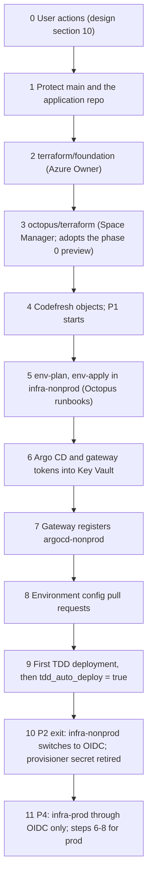

# Bootstrap guide

Ordered steps that take the platform from nothing to automatic TDD deployments, then to prod. Each step names its owner, its inputs, what it creates and how to tell it is done. The design is binding: [design/platform-design.md](../design/platform-design.md) (§5 identities, §7 names, §9 phases, §10 recommendations).

Two repositories take part. This repo, `clearmeasure-aisf-sample-apps/basic-environment-octopus-codefresh` (private), holds every platform file. The application repo, `clearmeasure-aisf-sample-apps/20260923-001` (public, a fork), receives no file and only repository settings (steps 0, 1 and 4).

Rules that hold at every step:
- **Prod goes through OIDC only.** The stored `Azure Runtime Provisioner` secret is used by `workorders-infrastructure` runbooks in `infra-nonprod` during phases 1–2 and nowhere else: never in `infra-prod`, the `workorders` project, Codefresh, Argo CD or a cluster (ADR-C10).
- **Git carries no secret.** Tokens and keys go straight into Key Vault, an Octopus sensitive variable or a Codefresh secret context. They never pass through pull requests, chat or tickets.
- **Everything else changes by pull request.** The foundation and Octopus Terraform inputs (`foundation.tfvars`, `octopus/terraform/terraform.tfvars`) stay untracked; the committed `*.tfvars.example` files show their shape. The environment layer's `terraform/environment/{nonprod,prod}.tfvars` are committed, because the runbooks read them from Git: identifiers and sizing only, acceptable because this repo is private (ADR-IR14).
- **Nothing here touches the legacy path.** The GitHub Actions → Octopus (legacy space) → Container Apps delivery of `ClearMeasureLabs/bootcamp-palermo-workorders` stays live and unchanged until phase 5.

## Owners

| Owner | Who | Rights used |
|---|---|---|
| User | The account holder who decides the §10 recommendations | GitHub org, Octopus and Codefresh account settings |
| Automation user | `AISF-Service-Account`, an existing Space Manager of the prototype space; its API key is the only Octopus credential (ADR-IR32) | Codefresh `workorders/release` (context `workorders-octopus`), gateway registration, the phase 0 preview apply |
| Azure Owner | Human Owner or User Access Administrator, just-in-time through PIM | Role assignments, locks, policy assignments |
| Entra administrator | Human | Groups, app registrations, admin consent |
| Security owner | Member of `@<org>/security-owners` and of the Entra group `secret-writers` | Reviews `terraform/foundation/**`, `policies/**`, `.gitleaks.toml`; writes Key Vault secrets through PIM (ADR-IR29) |
| Platform engineer | Member of `@<org>/platform-owners`, Octopus team `Platform Engineers` (Space Manager) and the Entra group `secret-writers` | Later `octopus/terraform` applies, Codefresh administration, runbook starts, pull requests |
| Octopus | Runbooks `env-plan`, `env-apply`, `env-destroy` | `Azure.LifecycleAccount` for the target infrastructure environment |
| Argo CD | `argocd-nonprod`, `argocd-prod` | Reconciles what `main` holds |
| Release manager | Octopus team `Release Managers` | Deploys releases, overrides the prod freeze with a reason |

## Order at a glance



## 0. User actions (before phase 1)

Owner: **User**. Status on 2026-09-24; the full list with rationale is design §10.

| # | Action | Status |
|---|---|---|
| R1 | Claude GitHub App on `clearmeasure-aisf-sample-apps`; environment repo attached | Done |
| R2 | Environment repo private | Done |
| R3 | Octopus Git credential `GitHub clearmeasure-aisf-sample-apps` restricted to `https://github.com/clearmeasure-aisf-sample-apps/basic-environment-octopus-codefresh` (with and without `.git`) | Restriction done. Still open: back it with a machine user in team `platform-bots` (or a GitHub App) with a 90-day expiry |
| R4 | Octopus account `Azure Runtime Provisioner` restricted to `infra-nonprod` | Done; `infra-nonprod` was created by hand, so step 3 imports it. Still open: scope the account variable of variable set `Azure Runtime Provisioning` to `infra-nonprod` too |
| R5 | Stored Codefresh contexts and the variable set `GitHub AISF Sample Apps` attached to nothing | Verified |
| R6 | An Azure Owner (PIM) and an Entra administrator for steps 2, 10 and 11 | Open |
| R21 | GitHub Actions stays disabled in `20260923-001` (a fork: workflows stay off until someone enables them). If it is ever enabled, disable `deploy.yml` first | Holds today (no registered workflows) |
| R23 | Rotate the `AISF-Service-Account` key every 90 days with an expiry; restore dedicated accounts when possible (ADR-IR32) | Open |
| R24 | Entra group `secret-writers` (security owner, platform engineers) | Open |

Decide at the same time, because later steps depend on them: R7 (Octopus license tier), R9 (two Codefresh runtimes), R10 (four ACR tokens), R11 (read-only GitHub App for Argo CD), R15 (separate OpenAI keys for CI and TDD), R16 (statuses-only GitHub App for `platform/tdd`), R25 (where new app commits land during the parallel run).

## 1. Protect `main` and the application repo

Owner: **Platform engineer**, with the **User** for organization settings. Phase 1.

1. Create teams `platform-owners`, `security-owners` and `platform-bots`; replace `<org>` in `CODEOWNERS`. Put the identity behind the Octopus Git credential into `platform-bots` (R3).
2. Add the branch ruleset on `main` of this repo: pull request required, code-owner approval required, bypass list = team `platform-bots` only. The required status `codefresh/env-checks` is added in step 4, after the pipeline has reported once.
3. Add the push ruleset that restricts `.octopus/**` on `main` to merged pull requests (the repo is private, so push rulesets apply, E31) [VERIFY per-actor semantics, §6.2].
4. Application repo `clearmeasure-aisf-sample-apps/20260923-001`, branch `master`: require a pull request with one review; the required status `codefresh/ci` is added in step 4. Leave GitHub Actions disabled (R21). No file is added to the repo.
5. Tell contributors to open pull requests against `clearmeasure-aisf-sample-apps/20260923-001`, never against the upstream `ClearMeasureLabs/bootcamp-palermo-workorders` (a fork's pull requests default there; see the README).

Done when: a test pull request here that touches `gitops/workorders/base/` requests review from platform owners, one that touches `terraform/foundation/` or `policies/` requests security owners, and a direct push to `master` of the application repo is refused.

## 2. Foundation layer

Owner: **Azure Owner** (PIM), with the **Entra administrator**; reviewed by **security owners**. Phase 1.

1. Entra administrator: create the SQL admin groups `<sql-admins-{class}>`, the group `secret-writers` (R24) and the Argo CD SSO app registration `<argocd-sso-app>` (workload-identity federation preferred, Q15).
2. Azure Owner: fill `terraform/foundation/foundation.tfvars` from `foundation.tfvars.example` (untracked), including `secret_writers_group_object_id` and `deploy_identity_sql_db_contributor_envs = ["uat", "prod"]` (ADR-IR13), and apply `terraform/foundation` with local state; then migrate the state to key `foundation.tfstate` in container `tfstate` of `<tfstate-storage-account>` (shared-key access disabled).
3. The apply creates, in `<AZURE_SUBSCRIPTION_ID>`: resource groups `rg-workorders-shared`, `rg-workorders-aks-{nonprod,prod}`, `rg-workorders-{tdd,uat,prod}`; VNets, subnets and private DNS zones; ACR `<acr-name>` with the four scope maps and tokens (three push, one pull-only, ADR-IR19); Log Analytics `log-workorders`; every UAMI in §5.2; **every role assignment**, including the PIM-eligible Key Vault Secrets Officer for `secret-writers`; the Octopus-issuer federated credentials (issuer `<OCTOPUS_URL>`, no trailing slash); `CanNotDelete` locks on `rg-workorders-prod`, `rg-workorders-aks-prod` and the legacy resource groups; the Azure Policy assignments.
4. Record the outputs (UAMI IDs and client IDs, subnet IDs, private DNS zone IDs, ACR ID, workspace ID, SQL admin group object IDs). Create `terraform/environment/nonprod.tfvars` (and later `prod.tfvars`) from the `.example` files by pull request: identifiers and sizing only, never a secret (ADR-IR14). The client IDs also fill the `<client-id-of-<uami name>>` placeholders in step 8.
5. Apply the foundation at least 24 hours before the first `env-apply` (step 5): group membership of managed identities, such as the lifecycle identity in `<sql-admins-{class}>`, can take that long to reach Azure SQL.

Done when: a second `terraform plan` shows no changes, and the locks and role assignments are visible on the resource groups.

## 3. Octopus objects

Owner: **platform engineer** (Space Manager). No System Manager step (ADR-IR32). Phase 1. If the phase 0 preview ran, adopt its state first ([preview-octopus.md](preview-octopus.md)).

1. Fill `octopus/terraform/terraform.tfvars` from `terraform.tfvars.example` (untracked) with `tdd_auto_deploy = false`. Initialise the backend with key `octopus-space.tfstate` (ADR-IR9; `octopus/terraform/versions.tf`).
2. Import the environment `infra-nonprod`, which the user created by hand (R4), before the first apply. Use an untracked `imports.tf` next to the other files and delete it after the apply, so the instance ID never reaches Git:

   ```hcl
   import {
     to = octopusdeploy_environment.this["infra-nonprod"]
     id = "<infra-nonprod-environment-id>"   # Environments-<n>, from the Octopus portal URL
   }
   ```

   The plan must show an in-place update of that environment at most, never a replacement.
3. The platform engineer applies `octopus/terraform` (provider `OctopusDeploy/octopusdeploy` 1.20.0). The apply creates, in `<octopus-space>`: environments `tdd`, `uat`, `prod`, `infra-prod` (and adopts `infra-nonprod`); lifecycles `workorders-standard`, `workorders-hotfix`, `workorders-infrastructure`; project group `Work Orders`; projects `workorders` and `workorders-infrastructure`, version-controlled against `<ENV_REPO_URL>` at `.octopus/workorders` and `.octopus/workorders-infrastructure`; channels `Default` and `Hotfix`; feeds `acr-workorders` (OIDC through `id-octopus-acr-pull`) and `docker-hub` (ADR-IR6); accounts `azure-oidc-deploy-{tdd,uat,prod}` and `azure-oidc-env-lifecycle-{nonprod,prod}`; worker pools `k8s-tdd`, `k8s-uat`, `k8s-prod`; library variable sets `WorkOrders Environment` and `WorkOrders Infrastructure`; teams with built-in roles only (the approvers hold Project Deployer scoped to their environment; `CI Release Publishers` holds the existing user `AISF-Service-Account`, read by name); freeze `prod-weekend-freeze`. No user, custom role or OIDC identity is created (ADR-IR32).
4. The stored objects are looked up by name, never created: account `Azure Runtime Provisioner`, Git credential `GitHub clearmeasure-aisf-sample-apps`, variable sets `Azure Runtime Provisioning` and `GitHub AISF Sample Apps`.
5. Set `Provisioner.SecretExpiresOn` (ISO date) by pull request to `.octopus/workorders-infrastructure/variables.ocl`.
6. Sensitive variables, in the Octopus portal only: `ArgoCD.RepoReadCredential` in `workorders-infrastructure` (the Argo CD read-only credential as a JSON object, R11, ADR-IR15). `Octopus.WorkerRegistrationToken` is set just before step 5. `GitHub.StatusAppPrivateKey` in `workorders` waits for R16.

Done when: both projects load their process, variables and runbooks from `main` without validation errors; the process shows twelve steps; neither stored variable set is included in a project; the approver teams hold Project Deployer scoped to `uat` and `prod` only; `sod-guard` lists `Platform.AutomationUsername = AISF-Service-Account`.

## 4. Codefresh objects

Owner: **Platform engineer**. Phase 1 starts when this step completes.

1. Runtimes `<cf-runtime-ci>` and `<cf-runtime-release>` on separate node pools of the runner cluster `<aks-cluster-context>`; the release pool is tainted; neither runs on an app cluster (R9, ADR-D17).
2. Registry integrations, each with a repository-scoped ACR token that expires in 90 days or less (R10): `acr-workorders-release` (`cf-workorders-release`), `acr-workorders-preview` (`cf-workorders-preview`), `acr-platform-ci` (`cf-platform-ci`, push, for `workorders/ci-image` only) and `acr-platform-pull` (`cf-platform-pull`, pull-only, for the step images, ADR-IR19). The existing default registry integration's credential is not reused.
3. Contexts: `workorders-ci` (secret: `CI_SQL_SA_PASSWORD`, a throwaway for the service container; `AI_OPENAI_APIKEY`, `AI_OPENAI_URL`, `AI_OPENAI_MODEL`, a CI-only low-budget key per R15) `workorders-release` (secret: `ACR_REGISTRY=<acr-name>.azurecr.io`, `ACR_TOKEN_NAME=cf-workorders-release`, `ACR_TOKEN_PASSWORD` = the password of that token, ADR-IR10) and `workorders-octopus` (secret: `OCTOPUS_URL`, `OCTOPUS_SPACE_ID`, `OCTOPUS_API_KEY` = the `AISF-Service-Account` key; attached to `workorders/release` only, ADR-IR32).
4. Projects `workorders` and `platform-env`; pipelines from their specs with `codefresh create pipeline -f <spec>`, run from the root of this repo: `codefresh/workorders/specs/workorders-{ci-image,ci,release}.yml` and `codefresh/specs/platform-env-checks.yml` (`workorders-preview.yml` waits for phase 6). Before registering `platform-env-checks.yml`, replace `<platform-bots-author-regex>` with the author identity of the Octopus Git credential (R3).
5. Confirm that `azure-runtime-provisioner` and `github-aisf-sample-apps-token` are attached to no pipeline (R5).
6. Run `workorders/ci-image` once; set `StepImage.CiDotnet` in both Octopus projects and the step image in `codefresh/workorders/pipelines/{ci,release,preview}.yml` to `<acr-name>.azurecr.io/platform/ci-dotnet:<ci-image-version>@sha256:<ci-image-digest>` in one pull request (ADR-IR11, ADR-IR19).
7. Run a first `workorders/release` build: `octopus_preflight` passes, and the release appears in Octopus created by `AISF-Service-Account`.
8. After `platform-env/env-checks` has reported once, add `codefresh/env-checks` as a required status in the `main` ruleset. After `workorders/ci` has reported once on the application repo, add `codefresh/ci` as its required status (ADR-IR26).

Done when: a master merge produces exactly one Octopus release `2.5.<n>` with build information and the `app-commit:` line in its notes; re-running the build creates nothing new; no Octopus API key exists in any pipeline; a pull request in the application repo cannot merge without `codefresh/ci`.

## 5. Environment layer in `infra-nonprod`

Owner: **Platform engineer** starts and approves; **Octopus** runs. Phase 2 starts here.

Inputs:
- `Azure.LifecycleAccount` for `infra-nonprod` = `azure-runtime-provisioner` (phases 1–2 only).
- `terraform/environment/nonprod.tfvars` on `main` (step 2).
- A fresh, short-lived `Octopus.WorkerRegistrationToken`, entered as a sensitive variable just before the run; the runbooks pass it as `TF_VAR_octopus_worker_registration_token`.
- `ArgoCD.RepoReadCredential` (step 3); the runbooks pass it as `TF_VAR_argocd_repo_read_credential` to seed Secret `argocd-repo-creds` (ADR-IR15).

Steps:
1. Run `env-plan` in `infra-nonprod`; review the saved plan artifact.
2. Run `env-apply` in `infra-nonprod`: plan → manual intervention (always) → apply → `configure-db-principals-tdd` and `configure-db-principals-uat` on `k8s-tdd` and `k8s-uat`.
3. The apply creates `aks-workorders-nonprod` (Free tier, workload identity, OIDC issuer, Azure RBAC, local accounts off), the tdd and uat SQL servers and databases, the Key Vaults, App Insights, the workload federated credentials, the Argo CD bootstrap (`argo-cd` and `argocd-apps`, which creates `platform-root`), and the Octopus workers in `octopus-worker-tdd` and `octopus-worker-uat`. It writes `workorders-appinsights-connection-string`, `workorders-sql-migrator-password`, `workorders-api-validation-key` (generated) and, in tdd, `workorders-sql-acceptance-password`. It writes `workorders-ai-openai-apikey` with an obvious stand-in value that Terraform never overwrites.
4. A member of `secret-writers`, through PIM: replace the stand-in `workorders-ai-openai-apikey` in `<kv-workorders-tdd>` and `<kv-workorders-uat>` with the TDD key from R15, and write `argocd-repo-read-credential` (the same JSON as `ArgoCD.RepoReadCredential`) into `<kv-workorders-platform-nonprod>`, so ESO holds the repo secret after bootstrap.
5. Entra administrator, with the Azure Owner: add the new cluster's OIDC issuer (environment output `oidc_issuer_url`) to `aks_oidc_issuer_urls` in `foundation.tfvars` and re-apply `terraform/foundation`. Without it the Argo CD SSO federation fails, and with `admin.enabled: false` nobody can sign in for step 6.

Done when: `platform-root` is Synced on `argocd-nonprod`; the add-ons are Healthy except the gateway, which waits for step 6; workers appear in pools `k8s-tdd` and `k8s-uat`; SSO sign-in to `argocd-nonprod` works. `workorders-tdd` and `workorders-uat` stay Degraded until step 9, because `0.0.0-bootstrap` images do not exist.

## 6. Argo CD and gateway tokens into Key Vault

Owner: **Platform engineer** (member of `secret-writers`).

1. Sign in to `argocd-nonprod` through SSO and generate an API token for the local account `octopus` (`argocd account generate-token --account octopus`). The account can only `get` applications and logs in `workorders-*/*` and `get` clusters.
2. Activate Key Vault Secrets Officer through PIM and store the token as `argocd-octopus-gateway-token` in `<kv-workorders-platform-nonprod>`.
3. Store the `AISF-Service-Account` API key as `octopus-gateway-registration-token` in the same vault (ADR-IR32). It is the same key as in `workorders-octopus`, so it rotates with it ([credential-rotation.md](runbooks/credential-rotation.md)).

Done when: ESO shows Secrets `argocd-octopus-token` and `octopus-gateway-registration` synced in namespace `octopus-argocd-gateway`.

## 7. Gateway registration

Owner: **Argo CD** (automatic); the **platform engineer** verifies.

1. The add-on Application `octopus-argocd-gateway` turns Healthy once its secrets exist and registers instance `argocd-nonprod` for environments `tdd` and `uat`.
2. In Octopus, the instance shows as connected, and Applications `workorders-tdd` and `workorders-uat` map to project `workorders` through their `argo.octopus.com/*` annotations.

Done when: Octopus lists both Applications with their live status. A read-only `octopus` account being enough while Trigger sync is off is [VERIFY] (E7).

## 8. Environment configuration by pull request

Owner: **Platform engineer** authors; **platform owners** review.

1. Copy the outputs into `gitops/workorders/envs/{tdd,uat}/config/` and the add-ons: the client IDs replace `<client-id-of-id-workorders-{env}-app>`, `<client-id-of-id-workorders-{env}-eso>`, `<client-id-of-id-eso-platform-{cluster}>` and `<client-id-of-id-kyverno-{cluster}>` (ADR-IR7); vault URLs; SQL server and database names in `ConnectionStrings__SqlConnectionString` (starts with `Server=`); hostnames `<tdd-hostname>`, `<uat-hostname>`; the Gateway parent reference.
2. Put the same values into library variable set `WorkOrders Environment` through `octopus/terraform/terraform.tfvars` and re-apply.
3. Keep Worker `replicas: 0` in every overlay until its phase (ADR-D16).

Done when: `platform-env/env-checks` passes on the pull requests; after merge, ExternalSecret `workorders-app` is synced in `workorders-tdd` and `workorders-uat`.

## 9. First TDD deployment, then automatic TDD

Owner: **Release manager** (first deployment); **platform engineer** (auto-deploy switch).

1. Deploy the latest release to `tdd` from Octopus. Watch: `read-deployment-secrets` → `migrate-database` → `update-argo-cd-image-tags` (commit to `gitops/workorders/envs/tdd/kustomization.yaml`, wait for Synced and Healthy) → `verify-version` → `smoke-test` → `acceptance-tests` → `report-commit-status`.
2. Confirm WI-08 (opt-in destructive reset) is merged before the phase-2 exit; until then the acceptance suite's interlocks are the Octopus ones only (ADR-C11).
3. Set `tdd_auto_deploy = true` in `octopus/terraform` by pull request and re-apply.
4. Keep Kyverno in Audit mode in nonprod.
5. Once R16 is done: set `GitHub.StatusAppId` and `GitHub.StatusAppInstallationId` by pull request, `GitHub.StatusAppPrivateKey` in the portal, then `GitHub.StatusEnabled = True` by pull request (ADR-IR27).

Done when: the next master merge reaches verified TDD with no human action.

## 10. Phase-2 exit: retire the provisioner secret

Owner: **Security owner** and **platform engineer**.

1. Change `Azure.LifecycleAccount` for `infra-nonprod` to `azure-oidc-env-lifecycle-nonprod` by pull request.
2. Run `env-plan` in `infra-nonprod`; it must show no changes.
3. Delete the provisioner's client secret from Entra, from the Octopus account `Azure Runtime Provisioner` and from the Codefresh context `azure-runtime-provisioner` (R4); delete the unattached stores after phase 2 unless other sample apps need them (R5).

Done when: `provisioner-credential-check` has nothing left to check and every runbook authenticates over OIDC.

## 11. Prod (phase 4): OIDC only

Owner: **Azure Owner** confirms locks; **platform engineer** runs; **security owner** reviews.

1. Preconditions: WI-01, WI-02, WI-03, WI-05 and WI-08 merged; the prod Kyverno overlay in Enforce; the Octopus handoff on pinned freestyle steps (ADR-IR18); impersonation and egress hardening decided.
2. `Azure.LifecycleAccount` for `infra-prod` is `azure-oidc-env-lifecycle-prod` from the first run; the stored provisioner is never scoped to `infra-prod` (`tool-boundaries.sh` and `consistency.sh` check it).
3. Commit `terraform/environment/prod.tfvars` by pull request, then run `env-plan` and `env-apply` in `infra-prod`. No destroy runbook exists for prod.
4. Repeat step 5 item 5 (OIDC issuer into the foundation) and steps 6–8 for `argocd-prod`, `<kv-workorders-platform-prod>` and `gitops/workorders/envs/prod/config`, with Worker `replicas: 0` until product sign-off.
5. Expect `workorders-prod` to stay OutOfSync with admission denials until the first prod deployment: Kyverno enforces signatures in prod, and the bootstrap tag `0.0.0-bootstrap` is neither signed nor pushed. The first Octopus deployment to prod replaces it with a signed release.
6. Continue with the cutover checklist in [cutover-and-decommission.md](cutover-and-decommission.md).
