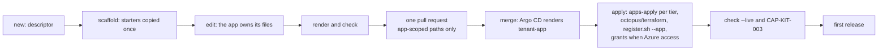

# Onboarding an app

Every app joins the platform through one descriptor, `apps/<app>.yaml`, and one pull request (ADR-IR34). The kit copies the starters into the app's own folders once; from then on the pipelines, the OCL and the desired state belong to the app ("scaffold, then own"). The platform keeps its guarantees through lint, the registry and admission, not through the templates ([walkthrough 07](walkthroughs/07-own-the-pipeline.md)).

App #1, `workorders` ([apps/workorders.yaml](../apps/workorders.yaml)), is the worked example. `sandbox` ([apps/sandbox.yaml](../apps/sandbox.yaml)) is the conformance fixture; the kit refuses to create, scaffold or retire it.

Contracts: design §7.0, [apps/schema.json](../apps/schema.json) and the `descriptors` and `starters` sections of [contracts/platform-contracts.yaml](../contracts/platform-contracts.yaml).

## Flow


*Level 3, the onboarding kit. The operator runs `tools/Platform.Onboarding`: `new` writes `apps/<app>.yaml`; every command validates it against `apps/schema.json` and the cross-app rules; `scaffold` copies the Codefresh, Octopus and GitOps starters once into the app-scoped folders, which the app owns from then on. `check` verifies the scaffold, the pins, other apps' names and the blast radius; env-checks runs it on every push of the onboarding pull request; `check --live` reads the Octopus and Codefresh objects after the apply.*



## Before starting

- **Repository.** The app's source lives in its own repository in `clearmeasure-aisf-sample-apps`. The platform never writes a file there (design §6.3): it clones at the triggering commit and posts commit statuses. The user protects the default branch with a pull request, one review and the required status `codefresh/ci`.
- **Slug** (ADR-IR34 decision 10): `^[a-z][a-z0-9]{2,11}$`, 3 to 12 characters, no dash. Reserved: `apps`, `argo`, `argocd`, `cert`, `default`, `external`, `infra`, `kube`, `kyverno`, `octopus`, `platform`, `system`, and `sandbox` for the fixture. The slug fits a vault name (24 characters) and splits `<app>-<env>` one way.
- **Tool.** .NET SDK 10.0.100. Every command below is `dotnet run --project tools/Platform.Onboarding -- <command>`, shortened here to `onboarding <command>`. The tool finds the repository through `--root`, then `PLATFORM_REPO_ROOT`, then the nearest parent holding `apps/schema.json`.
- **Capacity.** Each app counts against shared limits:
  - nonprod holds about 13 apps with a database besides the sandbox, and prod about 15 (R34 raises this);
  - Let's Encrypt allows about 25 onboardings a week per tier on sslip.io host names [VERIFY, Q48];
  - Octopus counts every active project (licence, R7); the Codefresh plan runs one build at a time (R32).

## 1. Descriptor


*Code level, the app descriptor. White classes are the keys of `apps/<app>.yaml` (schema 1) with the rules and defaults of `apps/schema.json` and `check`; coloured classes group the names derived for each consumer (tenant chart, `octopus/terraform`, Codefresh and the registry, `terraform/apps/*`); yellow objects show `workorders`. `<hash4>` is the first four hex digits of sha1(`<AZURE_SUBSCRIPTION_ID>/<app>/<env>`).*

```bash
onboarding new ledger --repo clearmeasure-aisf-sample-apps/<repository> --branch main \
  --description "Double-entry ledger, one API and a worker" --images api,worker,migrator \
  --packaging kustomize --database mssql-2022-express
```

`new` writes a minimal `apps/ledger.yaml` that passes the schema, then stops. It refuses a reserved or malformed slug, a repository outside `clearmeasure-aisf-sample-apps`, and an existing descriptor. Edit the file afterwards; the schema rejects every key it does not list.

| Key | Rule | Effect |
|---|---|---|
| `schema` | `1` | Descriptor format version |
| `name` | The slug; equals the file name | Every derived name below |
| `description` | At most 200 characters | Octopus project group, inventory |
| `status` | `active` (default) or `frozen` | Frozen: Octopus projects disabled, Codefresh triggers off, replicas and database at zero; disks, vaults and backups kept (decision 28) |
| `expires` | `YYYY-MM-DD`, optional | `check` warns 14 days ahead and after the date; nothing is deleted automatically |
| `repositories[]` | `name` in `clearmeasure-aisf-sample-apps/…` (or a `<placeholder>` until it exists), `defaultBranch` | Codefresh triggers; the first entry is the primary repository |
| `environments` | Subset of `tdd`, `uat`, `prod`; must contain `tdd` | Namespaces, vaults and disks per environment |
| `codefresh.projects[]` | `<app>` or `<app>-<part>` | Codefresh projects; pipelines under `codefresh/apps/<app>/` |
| `octopus.projects[]` | 1 to 20; `name` `<app>` or `<app>-<part>`; `lifecycle` `platform-standard` or `platform-hotfix`; `channels` (contain `Default`) | Project shells in group `app-<app>`; OCL under `.octopus/apps/<app>/<project>/` |
| `octopus.azureAccount` | Boolean | `id-<app>-<env>-deploy` and Octopus account `azure-<app>-<env>`: security review |
| `deployables[]` | `name` (not `db`), `part` (not `db` or `pr`), `octopusProject`, `packaging` (`kustomize`, `helm`, `raw`), `images[]`, `helm` (Helm only: `chart`, `imageReplacePaths`) | Applications `<app>-<deployable>-<env>`; pins under `gitops/apps/<app>/envs/<env>/<deployable>/`; registry repositories `apps/<app>/<image>` |
| `database` | `engine: mssql-2022-express`; `octopusWorkerAccess` | Application `<app>-db-<env>`, disk `disk-<app>-<env>-db`, logins `sa`, `<app>_migrator`, `<app>_app`, backups in uat and prod |
| `azure` | `resourceGroup`, `workloadIdentity`, `serviceAccount`, `roles` | `rg-app-<app>-<tier>` and `id-<app>-<env>-app`: security review |
| `quotas` | At most 4 GiB memory, 2 CPU, 3 PVCs, 50 GiB storage | May only lower the tenant defaults |
| `previews` | Boolean | AppProject `app-<app>-previews` and `apps-previews/<app>/*` (phase 6) |
| `secrets[]` | `name` (`^[a-z][a-z0-9-]{1,62}$`, not `db-*` or a platform key), `generate`, `description` | Vault keys; generated once, or a stand-in the operator replaces |

`check` adds rules the schema cannot express: the name equals the file name; project names start with the app; every deployable names a declared Octopus project; an image belongs to one deployable; a Helm chart lives inside `gitops/apps/<app>/`; no project name, repository or secret appears twice; and no two descriptors claim the same project (a shared repository only warns).

## 2. Names

`onboarding render ledger --subscription-id <AZURE_SUBSCRIPTION_ID>` prints every object the descriptor yields; `onboarding list` prints the inventory of all apps. Neither output is committed. Without a subscription ID the vault suffix prints as `<hash4>`.

| Object | Name |
|---|---|
| Namespaces and hosts | `<app>-<env>` (and `<app>-<part>-<env>`); `<app>-<env>.<apps-domain-<tier>>` |
| Argo CD | Application `tenant-<app>`; AppProject `app-<app>`; Applications `<app>-<deployable>-<env>` and `<app>-db-<env>` |
| Secret store and vault | ClusterSecretStore `<app>-<env>`; vault `kv-<app>-<e>-<hash4>` in `rg-platform-<tier>-apps`, where `hash4` is the first four hex digits of `sha1("<AZURE_SUBSCRIPTION_ID>/<app>/<env>")`, lowercase (decision 8; Terraform and the tenant chart compute the same) |
| Vault keys | `db-sa-password`, `db-migrator-password`, `db-app-password` (with a database), `appinsights-connection-string` (always), `azure-client-id` (with a workload identity), then the descriptor's `secrets[]` |
| Database | Disk `disk-<app>-<env>-db` in `rg-platform-<tier>-data`; backup container `<app>-<env>`; CronJobs `db-backup-<app>-<env>` (uat, prod) and `db-restore-<app>-<env>` |
| Monitoring | `appi-<app>-<env>`, `slo-fast-burn-<app>-<env>` |
| Octopus | Group `app-<app>`; projects from the descriptor; optional account `azure-<app>-<env>` |
| Registry | `apps/<app>/<image>`; previews `apps-previews/<app>/<image>` |
| Terraform state | `apps-<app>.tfstate` (each tier); `app-grants-<app>.tfstate` (global, Azure access only) |

## 3. Scaffold

```bash
onboarding scaffold ledger --codefresh minimal --octopus deploy-with-db,db-runbooks --gitops kustomize --dry-run
onboarding scaffold ledger --codefresh minimal --octopus deploy-with-db,db-runbooks --gitops kustomize
```

| Role | Starters | Copied to |
|---|---|---|
| Codefresh | `codefresh/templates/{minimal,multi-image,dotnet-buildps1}/` | `codefresh/apps/<app>/` |
| Octopus | `octopus/templates/{deploy-minimal,deploy-with-db,db-runbooks}/`; layered in the order given, a file two layers share is appended | `.octopus/apps/<app>/<project>/`, for every Octopus project |
| GitOps | `gitops/templates/{kustomize,helm,raw}/` | `gitops/apps/<app>/`; `<env>` and `<deployable>` path segments expand per environment and deployable |

- Tokens are replaced in paths and contents: `<app>` or `__APP__`, `<app-repo>` or `__APP_REPO__`, `<app-branch>` or `__APP_BRANCH__`, `<project>` or `__PROJECT__`, `<namespace>` or `__NAMESPACE__`, and the path segments `<env>` or `__ENV__` and `<deployable>` or `__DEPLOYABLE__`. A starter's `README.md` is not copied.
- With a database and no `db` folder in the starter, the kit writes `gitops/apps/<app>/envs/<env>/db/kustomization.yaml`: the engine component, the Key Vault credentials component, and `db-settings` with the database name, the logins and the disk name.
- A scaffold runs once. It writes nothing when any target exists; `--force` overwrites, which throws away the app's own edits.

## 4. Own the files

Edit the copies freely: pipeline steps, scripts, OCL steps, manifests. What stays fixed is enforced elsewhere:

| Guarantee | Enforced by |
|---|---|
| M1 images at `apps/<app>/…`; M3 `octopus_release` with explicit `PACKAGES` and no `PACKAGE_VERSION`; fork events off | `consistency.sh` C25 on every push; the shared push token reaches only `apps/*` |
| M2 keyless signature and SBOM from a release pipeline of the app | Tag locks; the prod signer policy, whose `subjectRegExp` names the app and `release` or `release-<x>` (CAP-AZ-001) |
| M4 never deploy; never push to Git; one runtime, no cloud identity | `tool-boundaries.sh` TB01, TB02, TB16, TB21 |
| Release pipelines named `release` or `release-<x>` | `check` and the signer policy |
| Pins only in `gitops/apps/<app>/envs/<env>/<deployable>/` (`newTag`, Helm image values, raw `image:` fields); image references `<acr-name>.azurecr.io/apps/<app>/<image>` without digest | `check` and the bot-path audit |
| No cluster-scoped kinds, stores, quotas, NetworkPolicies or Kyverno kinds in app folders; namespaces `<app>-*` only | `consistency.sh` C09, the AppProject `app-<app>`, admission |
| No name of another app in the app's files | `check` |
| Step 0 of every process that touches a cluster: Deploy a Release of `platform-wake`, condition Always; in-cluster runbooks wait with `Wake.WaitMinutes`; no `PlatformWake.*` variable in app processes | `consistency.sh` C23; `tool-boundaries.sh` TB20 |

Walkthrough 07 breaks each guarantee on purpose and shows which check refuses it.

## 5. Check

```bash
onboarding check ledger                        # descriptors, the app's files
onboarding check --base origin/main            # also the blast radius of the branch
pwsh scripts/checks/validate-all.ps1 all       # the full env-checks suite
```

`check` prints `ERROR` and `WARN` lines (`rule app: path:line: message`) and exits 1 on any error. `--scope descriptors` checks the descriptors alone; `--changes FILE` reads a `git diff --name-status` listing instead of running git.

**Blast radius** (CAP-KIT-004). A change that adds or deletes a descriptor is an onboarding or retirement change. It may touch only that app's paths:

- `apps/<app>.yaml`;
- `codefresh/apps/<app>/`, `.octopus/apps/<app>/`, `gitops/apps/<app>/`, `containers/apps/<app>/`.

Anything else, including another app's folder, `apps/schema.json`, `CODEOWNERS` and the platform pipelines, fails it: platform changes go in their own pull request. Changes to an existing app that also touch the platform or another app only warn, and the reviewer treats them as platform changes.

## 6. Pull request and review

One pull request holds the descriptor and the scaffolded folders. `codefresh/env-checks` runs `validate-all.ps1`, including `onboarding check` against `main`. CODEOWNERS routes it to the platform owners.

**Security review.** A descriptor that sets `octopus.azureAccount` or any `azure.*` key creates identities and role assignments through `terraform/apps/grants`, so a security owner approves it too. The reviewer checks:

- `azure.roles` holds only `Reader`, `Contributor`, `Key Vault Secrets User`, `Key Vault Secrets Officer` or `Storage Blob Data Contributor`, scoped to `rg-app-<app>-<tier>` (the schema refuses roles without `resourceGroup` and `workloadIdentity`);
- `azure.serviceAccount` is the account the app's pods run as, in `<app>-<env>` (federated subject `system:serviceaccount:<app>-<env>:<service-account>`);
- the deploy identity carries one federated credential per Octopus project, 20 at most (decision 14);
- `database.octopusWorkerAccess` is needed: it opens database traffic from `octopus-worker-<env>`.

## 7. Apply

After the merge, in this order (ADR-IR34 consequences). No second pull request follows (decision 11).


*Level 3, the onboarding apply. After the merge, the ApplicationSet `apps` renders `tenant-<app>`, whose Applications sync the app's folders. The operator runs apps-apply per tier, `octopus/terraform` and `codefresh/register.sh --app`; for apps with Azure access, `terraform/apps/grants` follows, then apps-apply and `octopus/terraform` again. The numbers follow the steps of docs/onboarding.md; no second pull request is needed.*

1. **Argo CD** renders `tenant-<app>` on both clusters by itself: AppProject, namespaces, quota, NetworkPolicies, stores, static PersistentVolumes, the Applications, the signer policy and the backup CronJobs. The database becomes Healthy once step 2 has created the vaults and disks; the app, once its first release pins an image.
2. **`apps-apply`** in `infra-nonprod`, then `infra-prod` (Octopus project `platform-infrastructure`; run `apps-plan` first; prompted `App.Name=<app>`): vaults with generated passwords, disks, backup containers, App Insights and alerts.
3. **`octopus/terraform`** (Space Manager): group `app-<app>`, project shells with their channels, the freeze scope and the optional accounts. The shells load the OCL from `.octopus/apps/<app>/<project>/`.
4. **`bash codefresh/register.sh --app <app>`**: the Codefresh projects and pipelines, on `<cf-runtime>`, triggers with fork events off. Run it after the app repository exists: Codefresh installs a repository's webhook only when it creates a pipeline, so a pipeline registered earlier never starts on a push. The script warns about a trigger repository without a webhook; `--recreate-missing-hooks` deletes and creates such pipelines.
5. **`terraform/apps/grants`**, only with Azure access: the provisioner, from an operator session, state `app-grants-<app>.tfstate`. Then `apps-apply` once more, so the workload identity's federated credential and `azure-client-id` land in the vaults, and `octopus/terraform` once more, so the accounts `azure-<app>-<env>` carry the new client IDs instead of `00000000-0000-0000-0000-000000000000` (Azure login in the step fails with AADSTS700038 until then).
6. **Operator secrets.** As `platform-operators`, replace the stand-in value of each `secrets[]` entry with `generate: false` in each vault. A key with settings of its own needs them too (for `workorders`, `ai-openai-apikey` with `AI_OpenAI_Url` and `AI_OpenAI_Model` in the config overlays and `AI.OpenAIUrl`, `AI.OpenAIModel` in Octopus). Pods read a secret at their next start: force the ExternalSecret (`kubectl annotate externalsecret <name> force-sync=$(date +%s) --overwrite`) before the change that restarts them.

Verify with `onboarding check <app> --live` (needs `OCTOPUS_URL`, `OCTOPUS_SPACE_ID`, `OCTOPUS_API_KEY`; `CODEFRESH_API_KEY` optional) and the live inventory test:

```bash
dotnet test tests/Platform.Conformance.sln --filter "FullyQualifiedName~Platform.Conformance.Tests.Kit.LiveInventoryTests"
```

Then push to the default branch of the app repository: `release` builds, signs and hands off; Octopus deploys tdd automatically and waits for approval in uat and prod ([walkthrough 01](walkthroughs/01-follow-a-commit.md)).

**First release of each environment.** Until its first pin, an environment's Application may be running a sync that cannot finish: the PreSync migration cannot pull `0.0.0-bootstrap`, and in prod the signature policy refuses it. Each attempt lasts up to the Job's deadline, with up to five retries, and Octopus's "Wait for Argo CD Applications" waits behind it. Before the first deployment of an environment, or when it waits there, terminate that operation (as `argocd app terminate-op` does):

```bash
kubectl -n argocd patch application <app>-<deployable>-<env> --type merge \
  -p '{"status":{"operationState":{"phase":"Terminating"}}}'
```

The Applications' `argocd.argoproj.io/manifest-generate-paths` keeps commits elsewhere in the repository from starting such syncs again; a change to the app's base or components still does, in every environment of the app.

## Freeze

```bash
onboarding retire ledger --freeze
```

Sets `status: frozen` in one pull request. After the merge: apply `octopus/terraform` (the projects become disabled), run `register.sh --app <app>` (triggers off), and Argo CD scales the workloads and the database to zero. Disks, vaults and backups stay; setting `status: active` again reverses it.

## Retire

A frozen app only. Back up first: the deletion is permanent once the vault's soft-delete window ends.

```bash
onboarding retire ledger --delete --dry-run
onboarding retire ledger --delete
```

The command deletes the descriptor and the app-scoped folders in the working tree, then prints the teardown order:

1. Before the merge: back up the uat and prod databases (step template `platform-db-backup`) and tag the app repository.
2. Merge the pull request. The ApplicationSet drops `tenant-<app>` and keeps its resources (`preserveResourcesOnDeletion`).
3. Delete the namespaces `<app>-*` on both clusters, then the retained PersistentVolumes.
4. Run `apps-apply` with `App.Name=<app>` in `infra-nonprod` and `infra-prod`: the vaults (soft delete), disks, backup containers and App Insights go. The lock on `rg-platform-prod-data` needs the Owner.
5. Apply `octopus/terraform` (project shells, group, accounts) and delete the Codefresh projects.
6. Lift the tag locks and delete the registry repositories `apps/<app>/*` and `apps-previews/<app>/*`.
7. As the provisioner, destroy `terraform/apps/grants` for the app when it had Azure access.
8. Run the orphan test (CAP-KIT-008): nothing of the app may remain.

```bash
dotnet test tests/Platform.Conformance.sln --filter "FullyQualifiedName~Platform.Conformance.Tests.Kit.OrphanTests"
```

## Exit codes and messages

| Exit code | Meaning |
|---|---|
| 0 | Success; warnings may be printed |
| 1 | Findings, or the action failed |
| 2 | Usage error |

| Message | Fix |
|---|---|
| `unknown key 'x' (apps/schema.json allows no other keys here)` | Remove or rename the key |
| `value is not allowed here (a reserved word or a reserved name)` | Pick another slug, deployable, part or secret name |
| `already exists; the scaffold runs once` | The app already owns the file; edit it instead |
| `an onboarding or retirement change touches the platform path …` | Move the platform change to its own pull request |
| `references app '<other>'` | Remove the other app's registry path, namespace, store, vault or resource group from this app's files |
| `'<image>' needs a newTag` | Pin a version, or `0.0.0-bootstrap` before the first release; never `latest` |
