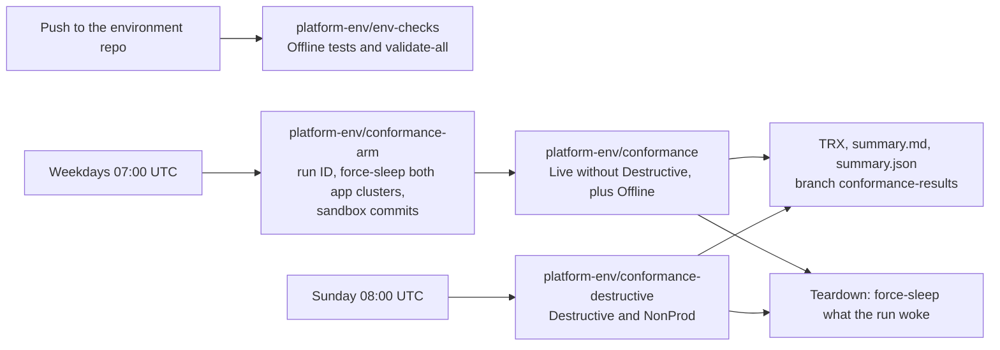

# Conformance

How the platform proves its capabilities: every behaviour the platform claims is a catalogue entry with at least one
automated test, and the tests run every night against the live platform. This page is the operator's side: what runs
when, how to run it by hand, how to read the results, how to triage a failure, and how the runs stay safe and cheap.

Contracts: directive §14, ADR-IR34 ("Capability catalogue", "Test harness", "Testability hooks", P1-13, exit
criteria), §7.0 ("Conformance"), `tests/README.md` (the harness), `docs/capabilities.md` (the rendered catalogue).

## The pieces


*Level 3, the conformance suite. The capabilities of the six catalogue fragments feed `tests/Platform.Conformance.sln` (NUnit 4, Shouldly, TRX), and `render-catalogue` writes `docs/capabilities.md`. `CatalogueConsistencyTests` enforces the one-to-one mapping between capabilities and tests by reflection over both test assemblies. env-checks runs the Offline category and fails on a stale catalogue page; the conformance pipelines run the Live tests with `TEST_FILTER`. The harness clients reach Octopus, Codefresh, Azure Resource Manager and the registry, the cluster API servers and GitHub, with secrets from Codefresh contexts only.*

| Piece | Where | What it is |
|---|---|---|
| Catalogue | `catalogue/capabilities.d/{harness,codefresh,octopus,gitops,azure,kit}.yaml` (an optional root `catalogue/capabilities.yaml` is merged first; none exists) | One entry per capability: `id`, `statement`, `owner`, `adr`, `observed_by`, `tests`, `live`, `destructive`, `tier`, `why_offline`. Rendered to `docs/capabilities.md` |
| Harness | `tests/Platform.Conformance.sln` (.NET 10, NUnit 4, Shouldly) | Projects `Harness` (clients, settings, polling, cleanup), `Offline`, `Tests` (live) and `Report` (TRX to Markdown and JSON) |
| Areas | `tests/Platform.Conformance.{Tests,Offline}/<Area>/` | `Codefresh` (CAP-CF), `Octopus` (CAP-OCT), `GitOps` (CAP-GIT), `Azure` (CAP-AZ), `Kit` (CAP-KIT); `CAP-HARNESS` for the harness itself |
| 1:1 rule | `CatalogueConsistencyTests` (Offline) | Every capability names its tests, every test carries `[Capability]`, and the categories agree with `live`, `destructive` and `tier` |
| Fixture app | `sandbox` (descriptor `apps/sandbox.yaml`, repository `<sandbox-app-repo>`, namespaces `sandbox-<env>`) | The only target of destructive tests, in nonprod only |
| Settings | `tests/platform.settings.json` | Non-secret settings: Octopus URL and space, subscription and tenant, registry, the tiers' groups and clusters (§7.0 names), time limits |
| Secrets | Codefresh contexts `platform-conformance` and `platform-octopus` | `AZURE_TENANT_ID`, `AZURE_CLIENT_ID`, `AZURE_CLIENT_SECRET` of `sp-platform-conformance`; the GitHub App `aisf-conformance` (`AISF_CONFORMANCE_APP_ID`, `AISF_CONFORMANCE_APP_INSTALLATION_ID`, `AISF_CONFORMANCE_APP_PRIVATE_KEY`; the scripts mint the `GITHUB_TOKEN` of the harness from it, see [GitHub access](#github-access-the-app-aisf-conformance)); `OCTOPUS_API_KEY`; optional `CODEFRESH_API_KEY` |

Categories: `Live` or `Offline` on every test; `Destructive`, `Slow`, and the tier categories `NonProd`, `Prod`,
`Build`. A destructive test is always `NonProd` and never `Prod`.

## What runs when


*Level 3, how the suite runs. conformance-arm force-sleeps both tiers through env-sleep, pushes run commits to `<sandbox-app-repo>`, and queues a sandbox/release rerun and platform-env/conformance; conformance-destructive and env-checks run the same solution with other filters. The fixture app (its repository, sandbox/ci and sandbox/release, the `apps/sandbox/*` images and the Octopus project) is one boundary; its namespaces sit in nonprod and prod, and only sandbox-tdd and sandbox-uat take destructive tests. Both crons ship disabled until P1-13.*


*Dynamic, one weekday night. The arm mints `PLATFORM_RUN_ID`, force-sleeps both tiers (`Sleep.Force=true`), waits for Stopped and the 15-minute stop grace, holds the hourly env-sleep for the run (`sleep-hold`, 480 minutes, held by `conformance:<run-id>`), pushes the failing-test, green and canary commits, and queues the rerun and platform-env/conformance with the run ID and SHAs. The sandbox builds run first (CI statuses, the early env-wake, one Octopus release). The run step records the power state, runs `dotnet test` with `TEST_FILTER` (TRX), the capability report and the annotations; publish pushes the results to `conformance-results`; teardown releases the hold, then force-sleeps the tiers that were not Running before the run.*



| Pipeline | Trigger | Runs |
|---|---|---|
| `platform-env/env-checks` | Every branch push to the environment repository except `main` | `validate-all.ps1` and `dotnet test … --filter TestCategory=Offline` |
| `platform-env/conformance-arm` | Weekdays at 07:00 UTC (01:00 or 02:00 America/Chicago; the cron ships disabled until P1-13), and manual | Records the run ID; force-sleeps both app clusters through `env-sleep` (`Sleep.Force=true`); waits until both are Stopped and the stop has settled (both Stopped/Succeeded twice in a row, no data disk of `rg-platform-<tier>-data` Attached; at most `CONFORMANCE_STOP_GRACE_MINUTES`, 15); holds the hourly `env-sleep` in both tiers through runbook `sleep-hold` (`Sleep.HoldMinutes` `CONFORMANCE_HOLD_MINUTES`, default 480, at most 720; `Sleep.HoldBy` `conformance:<run-id>`), and fails when a hold is not set, because without it `env-sleep` stops a cluster between two tasks of the run; pushes the sandbox commits (a failing branch, a green branch, a release commit with the canary) and deletes the branches of older runs; queues a second `sandbox/release` build of the release commit (the rerun of CAP-CF-008), then `conformance` with `CONFORMANCE_ARM_STOPPED` (the tiers it left stopped; the teardown sleeps them even when the sandbox builds' early env-wake woke nonprod before `power-before.txt`), which runs after the sandbox builds (one build at a time, BASIC_1) [VERIFY, Q41]. `CONFORMANCE_SKIP_SLEEP=true` skips the force-sleep (debugging), never the hold |
| `platform-env/conformance` | Queued by the arm, and manual | `TestCategory=Live&TestCategory!=Destructive`, plus Offline. The cold start of the day is part of the proof (CAP-OCT-008) |
| `platform-env/conformance-destructive` | Sunday at 08:00 UTC (on since 2026-09-27), and manual | `TestCategory=Destructive&TestCategory=NonProd`: rebuild of nonprod, data survival, restore, password rotation, failed migration. It has no arm: its first step, `hold`, holds the hourly env-sleep of `infra-nonprod` for 300 minutes (runbook `sleep-hold`, holder `conformance-destructive:<build id>`), and the tests run only once the hold is set; the teardown releases it |

Every pipeline takes `TEST_FILTER` to narrow a manual run, for example
`FullyQualifiedName~Platform.Conformance.Tests.Azure` or `Capability=CAP-AZ-004` (NUnit property filter).

## Run by hand

Offline, anywhere (no secret, no network):

```bash
dotnet build tests/Platform.Conformance.sln -c Release -warnaserror
dotnet test tests/Platform.Conformance.sln -c Release --filter "TestCategory=Offline" \
  --logger "trx;LogFilePrefix=offline" --results-directory tests/TestResults
```

Live, from an operator session with the conformance principal (never the provisioner):

```bash
export AZURE_TENANT_ID=<AZURE_TENANT_ID> AZURE_SUBSCRIPTION_ID=<AZURE_SUBSCRIPTION_ID>
export AZURE_CLIENT_ID=<client-id-of-sp-platform-conformance> AZURE_CLIENT_SECRET=... OCTOPUS_API_KEY=...
export GITHUB_TOKEN=...   # an installation token of aisf-conformance, or GITHUB_TOKEN_FILE=<file that holds it>; a suite longer than an hour needs the file
export PLATFORM_TLS_SYSTEM_TRUST=true   # only behind a TLS-re-terminating proxy
dotnet test tests/Platform.Conformance.Tests -c Release \
  --filter "TestCategory=Live&TestCategory!=Destructive&FullyQualifiedName~Azure" \
  --logger "trx;LogFileName=live.trx" --results-directory tests/TestResults
```

Destructive tests run only in nonprod and only against the sandbox; run them by hand only when no lesson or demo uses
nonprod: `--filter "TestCategory=Destructive&TestCategory=NonProd"`.

A live test whose secret or setting is missing is Inconclusive, never failed; its message names what is missing.

### Short fix cycles

A full destructive run takes about an hour, most of it the shared nonprod rebuild. To confirm a fix:

- **Rerun only what failed.** Pass `TEST_FILTER` in the run request, for example
  `{"branch":"main","variables":{"TEST_FILTER":"FullyQualifiedName~FailedMigrationTests|FullyQualifiedName~RestoreTests"}}`
  to `POST /api/pipelines/run/platform-env%2Fconformance-destructive`. Only `RebuildDataSurvivalTests` and
  `TierRebuildTests` need the rebuild; the others take minutes.
- **Read the preflight first.** The destructive fixtures share one preflight (`DestructivePreflight`): nonprod awake, the
  conformance principal reads pods and Kyverno policies, the sandbox answers in tdd and uat. When it fails, the other
  fixtures fail in seconds with the same cause. CAP-GIT-010 also checks that the Octopus Argo CD instance
  `argocd-nonprod` is registered and reachable before it ships the failing migration.
- **Re-apply foundation right after a rebuild,** before the next run: a rebuild drops the Writer on `sandbox-tdd` and
  `sandbox-uat` and the Reader on `rg-platform-nonprod-aks-nodes` (step 6 of "Triage a failure"). These scopes are the
  cluster and its node group, so no scope outside them survives a rebuild, and the tier layer may not grant (TB08).
- **Keep nonprod awake while debugging.** Run `sleep-hold` in `infra-nonprod` (`Sleep.HoldMinutes`, `Sleep.HoldBy`
  `debug:<name>`) so the hourly env-sleep does not stop the cluster between reruns; release it with 0 minutes.
- **Agent sessions.** Start a Claude Code cloud session with this repository as its working directory, so
  `.claude/hooks/session-start.sh` installs .NET, pwsh and Terraform. For unattended runs, give the session standing
  permission rules for the nonprod operations of this runbook before it starts: auto mode refuses a session that
  writes its own permission settings.

CAP-CF-005 (fork pull requests never start a pipeline) has a manual, run-once live check. The offline half runs on
every build; fork pull request triggers stay disabled (`pullRequestAllowForkEvents: false`). The owner, from a
personal GitHub account outside the org, forks `<sandbox-app-repo>` and opens a pull request from the fork (R33), then
runs `ForkPullRequestTests` once on `platform-env/conformance` with `CONFORMANCE_FORK_PULL_REQUEST` set to the pull
request number. Without the variable the test is Inconclusive; the nightly runs leave it unset.
Decision (owner, 2026-09-27): forking is not allowed on the org's repositories, so no fork pull request can be opened.
CAP-CF-005's live test now checks that the fixture and every app repository refuse forks (`allow_forking: false`) and
needs the fork pull request only for a repository that allows forking.
CAP-KIT-009 (the end-to-end pass of app #1 to prod) is `[Explicit]`. Run it with runbook `e2e-pass` or from an
operator's machine, which hold no Codefresh build slot ([End-to-end pass without a Codefresh
slot](#end-to-end-pass-without-a-codefresh-slot)); `platform-env/conformance` with
`TEST_FILTER=FullyQualifiedName~EndToEndTests` still works.

**Nightly suite with demo prod, 2026-09-27.** Runs `6ab8ac53a10bd81bac34cd7a` (67 pass, 8 fail), `6ab8da862f4311c6db591814`
(20 fail: `8ccb212` put a Role into `sandbox-tdd`, which platform-root's project may not deploy to, so the root sync
failed; fixed in `b0fdf3c`), `6ab90d2627e03f1bf6175a30` (62 pass, 13 fail). The weekly destructive cron, enabled at
03:30, ran at 08:01 (`6ab8cd5d0baee663416240f7`, error) and rebuilt nonprod: foundation re-applied (3 added).
Let's Encrypt refuses new certificates for the four nonprod hosts until 2026-09-28 02:35 UTC ("5 certificates for this
exact set of identifiers in 168h"): today's rebuilds reissued them seven times. A weekly rebuild uses one of the five,
so the steady state is within the limit; avoid more than four nonprod rebuilds a week. Until the certificates reissue,
every nonprod host times out and the tests that call the apps (CAP-OCT-001/002/003/007/008/012, CAP-GIT-011/012) fail.

## GitHub access (the App aisf-conformance)

The harness, the sandbox pushes of `conformance-arm`, the results branch of `conformance-publish` and the end-to-end pass
reach GitHub as the GitHub App `aisf-conformance` (issue #44); no personal access token is used. The App is installed on
**three repositories** only: the environment repository, the sandbox repository (`<sandbox-app-repo>`) and
`clearmeasure-aisf-sample-apps/20260923-001` (the end-to-end pass defaults to it for branch, pull request, merge and
statuses, unless `PLATFORM_E2E_REPO` names the sandbox). Its permissions are *Contents: read and write*, *Pull requests:
read and write*, *Commit statuses: read* and *Metadata: read*, nothing else. It is trust boundary TB15 of the design
(`design/platform-design.md`).

`codefresh/platform/scripts/conformance-github.ps1` exchanges the App's private key for a one-hour installation token
per run (`scripts/github/GitHubAppAuth.ps1`, `Resolve-GitHubAppToken`), narrowed to the repositories and permissions of
`codefresh/platform/github-app.json`, and puts it in the process as `GITHUB_TOKEN` and in the mode-0600 file
`GITHUB_TOKEN_FILE`. An installation token lives one hour and a suite up to six, so `conformance-run.ps1` re-mints it
every 45 minutes at its heartbeat and rewrites the file; the .NET harness reads the file on every request
(`GitHubTokenSource`), so no request carries an expired token. Nothing prints the key, a JWT or the token.

**Before the owner has created the App the live conformance is pending, and the build stays green:**

| Script | With the App not configured |
|---|---|
| `conformance-publish.ps1` | Warns `nothing published` and exits 0 |
| `conformance-arm.ps1` | Exits 1 before any sandbox write, naming the missing inputs (as for a missing token before) |
| `conformance-run.ps1` | Goes on without a token: the GitHub-dependent tests are Inconclusive; `summary.md` carries a note |
| `conformance-e2e.ps1` | Exits 2 before any build, naming the missing inputs |

Each prints `conformance-github: GitHub App aisf-conformance is not configured ... PENDING owner setup, #44`; a refused
exchange prints `conformance-github: mint refused (HTTP <status>)` with the same exit codes. No script falls back to another
credential. Creating the App, installing it, storing its keys and seeding the context and the Octopus variables are
owner-only steps (docs/runbooks/credential-rotation.md, section 12).

## End-to-end pass without a Codefresh slot

CAP-KIT-009 mostly waits: for `codefresh/ci` (about 20 minutes), `codefresh/release` (about 25) and the Octopus
deployments to tdd, uat and prod. On `platform-env/conformance` it holds one of the account's three hybrid build
slots for 45 to 60 minutes, while the ci and release builds it starts need slots too (and `env-checks` starts on every
pin commit). Two ways run it without a Codefresh slot; both go through the driver
`codefresh/platform/scripts/conformance-e2e.ps1`, which checks its prerequisites by name (exit 2 before any build),
mints `PLATFORM_RUN_ID` when it is absent and runs `conformance-run.ps1` with
`TEST_FILTER=FullyQualifiedName~EndToEndTests`: build, test, heartbeat and progress lines, TRX, `summary.md` and
`summary.json`. Nothing tears down afterwards; the hourly `env-sleep` puts the clusters back to sleep by its own rules.

| Where | Holds while it waits | Secrets | Start |
|---|---|---|---|
| Runbook `e2e-pass` of `platform-infrastructure` | One Octopus task slot and one `hosted-ubuntu` dynamic worker, about an hour | `Platform.OctopusApiKey` (step-scoped), `E2E.GitHubAppId`, `E2E.GitHubAppInstallationId` and the sensitive `E2E.GitHubAppPrivateKey` (scoped to `e2e-pass`) | Octopus, or `octopus-runbook.ps1` from a shell |
| An operator's machine | Nothing shared | `OCTOPUS_API_KEY`, `AISF_CONFORMANCE_APP_ID`, `AISF_CONFORMANCE_APP_INSTALLATION_ID` and `AISF_CONFORMANCE_APP_PRIVATE_KEY_PATH` (or `..._PRIVATE_KEY`) in the shell | `pwsh codefresh/platform/scripts/conformance-e2e.ps1` |
| `platform-env/conformance` (kept) | One Codefresh build slot | Contexts `platform-octopus`, `platform-conformance` | `TEST_FILTER=FullyQualifiedName~EndToEndTests`, `CONFORMANCE_SLEEP_AFTER=false` |

### Runbook e2e-pass

One step, `run-end-to-end-pass` (`Octopus.Script` on `hosted-ubuntu`, container `octopusdeploy/worker-tools`), in
`infra-nonprod` only and only from `refs/heads/main`: it deploys app #1 to prod with the platform key. In order:

1. Refuses another environment, another branch, a missing `Platform.OctopusApiKey`, a missing `E2E.GitHubAppId`,
   `E2E.GitHubAppInstallationId` or `E2E.GitHubAppPrivateKey` (the App not configured yet is PENDING owner setup, #44),
   and a malformed setting, before any download.
2. Downloads the .NET SDK `E2E.DotnetSdkVersion` (the version of `platform/ci-dotnet`; an offline test keeps them
   equal) from `builds.dotnet.microsoft.com` and extracts it only when its SHA-512 is `E2E.DotnetSdkSha512` (from the
   .NET 10 `releases.json`). worker-tools carries no .NET 10 SDK.
3. Fetches `E2E.EnvRepository` at the run's commit (`Octopus.RunbookRun.Git.Commit`, else the head of `main` with a
   warning) anonymously: the repository is public (#47), so no credential is in the git environment or arguments.
4. Runs the driver under `timeout` (`E2E.TimeoutMinutes`, 270: the test's own `[CancelAfter]` is 4 hours) with
   `OCTOPUS_API_KEY`, the three `AISF_CONFORMANCE_APP_*` inputs (in the driver's process tree only, removed afterwards; the
   driver mints and re-mints the installation token, no JWT code is in the runbook), `PLATFORM_RUN_ID`
   `r<yyyyMMdd>t<HHmm>-<task number>` and, when the prompt `App.Name` is set, `PLATFORM_E2E_APP`. Empty `App.Name` is app #1.
5. Attaches `summary.md`, `summary.json`, the TRX files and the Octopus task log of each stage as artifacts
   `e2e-<run id>-<file>`, and fails the step when the pass failed, timed out or could not start.

Start it in Octopus (Projects, `platform-infrastructure`, Operations, Runbooks, `e2e-pass`, Run, branch `main`,
environment `infra-nonprod`, `App.Name` empty), or from a shell with the Space Manager key (not from a Codefresh build,
which would take a slot again):

```bash
export OCTOPUS_URL=https://clearmeasure.octopus.app OCTOPUS_SPACE_ID=Spaces-335 OCTOPUS_API_KEY=...
pwsh -NoProfile -File codefresh/platform/scripts/octopus-runbook.ps1 -Project platform-infrastructure \
  -Runbook e2e-pass -Environment infra-nonprod -Notes "e2e by <name>" -WaitMinutes 300
```

The task log shows the heartbeat and `progress: stage n/5` lines; the artifacts hold the results. The pull request,
its branch `e2e/<run id>` and the answered interventions (`e2e:<run id>`) are named after the run. The verdict is the
outcome of `EndToEndTests.Should_ChangeToAppOne_ReachesProdThroughEveryStage` and the step's result; `summary.md`
shows CAP-KIT-009 as inconclusive even after a pass, because its offline tests run in env-checks, not in this filter.

**Task cap.** The instance runs 5 tasks at once for all its spaces (licence page, read 2026-09-28: "Your subscription
allows 5 tasks"). During a pass the runbook holds one; the deployment it follows holds one more, and two more
(`platform-wake`, `env-wake`) when that deployment wakes a tier: up to four, with the hourly `env-sleep` runs taking the
fifth for seconds. Run one pass at a time, never beside a destructive run or a demo: the project's concurrency tag
(`#{Octopus.Environment.Id}/#{Octopus.Runbook.Name}`) queues a second `e2e-pass` behind the first. While the run
executes in `infra-nonprod`, `env-sleep` keeps nonprod up (a busy task of the tier); prod may sleep between uat and
prod, and the prod deployment wakes it (about 5 minutes).

**Dynamic worker.** Octopus Cloud leases a `hosted-ubuntu` worker for the task and discards it afterwards; the SDK and
the NuGet packages are downloaded on each run (about 3 minutes). [VERIFY the lease and task-duration limits of dynamic
workers on this instance before a nightly schedule; the time limit above ends a pass that hangs.]

**Before the first run** (once):

1. Re-apply `octopus/terraform` (`octopus/apply.ps1`, docs/preview-octopus.md): `e2e-pass` and `run-end-to-end-pass`
   join the scope of `Platform.OctopusApiKey` (`infrastructure_key_processes`, `infrastructure_key_actions`).
2. Seed the GitHub App `aisf-conformance` (created and installed by the owner, docs/runbooks/credential-rotation.md,
   section 12): `E2E.GitHubAppId`, `E2E.GitHubAppInstallationId` and the sensitive `E2E.GitHubAppPrivateKey`, either
   through `TF_VAR_e2e_github_app_id`, `TF_VAR_e2e_github_app_installation_id` and `TF_VAR_e2e_github_app_private_key` on
   that apply (and on every later one, which `apply.ps1` enforces), or a Platform Engineer adds them in Variables of
   `platform-infrastructure`, scoped to runbook `e2e-pass` (the key of type Sensitive). Until then the runbook stops at its
   first step with the PENDING message.
3. Merge the runbook to `main`; Octopus reads it from there.

### From an operator's machine

Any machine with pwsh 7.4, the .NET 10 SDK and a clone of this repository:

```bash
export OCTOPUS_API_KEY=...                            # Space Manager key
export AISF_CONFORMANCE_APP_ID=... AISF_CONFORMANCE_APP_INSTALLATION_ID=...
export AISF_CONFORMANCE_APP_PRIVATE_KEY_PATH=...       # a PEM file outside every repository (or AISF_CONFORMANCE_APP_PRIVATE_KEY)
# optional: PLATFORM_RUN_ID, PLATFORM_E2E_APP, PLATFORM_E2E_REPO, PLATFORM_E2E_FILE (tests/README.md)
pwsh -NoProfile -File codefresh/platform/scripts/conformance-e2e.ps1
```

Results land in `tests/TestResults/e2e/<run id>/` (`-ResultsDirectory` elsewhere). Close the laptop only after the
run: an interrupted pass leaves its pull request and branch, which the next run does not reuse; close them by hand.

## Read the results

- The pipeline log and the Codefresh build annotations show the counts per verdict and the failed capability IDs.
- `summary.md` and `summary.json` (from `Platform.Conformance.Report`) and the TRX files are pushed to branch
  `conformance-results` of `<sandbox-app-repo>`, folder `results/<date>-<run-id>/`, so history needs no write to the
  environment repository.
- A capability passes only when all its tests passed; it fails when any failed; it is inconclusive when a test could
  not run for a missing prerequisite.
- Octopus task logs of the runbooks a test ran are attached to the test result as artifacts.

## Reading progress

A live run takes hours, and one test can wait 30 minutes or more for a cluster to stop or start. The harness writes
progress lines as it goes (CAP-HARNESS-013), so the log always shows that the run is alive and how far it got. Search
the build log for `progress:`.

| Line | When | Example |
|---|---|---|
| `plan` | First test of an assembly | `progress: plan 41 tests selected` |
| `start` | Each test starts | `progress: start 3/41 SleepDataSurvivalTests.Should_Sleep_CanaryRowWrittenBeforeForceSleep_IsReadAfterWake [CAP-GIT-011] elapsed 12:34` |
| `waiting` | At least once a minute during any wait (`Poll.UntilAsync`, `Poll.DelayAsync`, the Azure `ObserveAsync`, the settled-stop wait, the quiesce before a sleep) | `progress: waiting cluster aks-platform-nonprod to be Stopped state=(Running, Succeeded) elapsed 3:00/25:00` |
| `stage` | Each stage of the end-to-end pass (CAP-KIT-009): ci, release, tdd, uat, prod | `progress: stage 2/5 release start elapsed 08:12` |
| `done` | Each test ends | `progress: done 3/41 Passed 35:02 \| passed 2 failed 0 skipped 1 \| 7% \| eta 7:50:10` |

- **n/N.** In `start`, n is the test's position among the tests started. In `done`, it is the number of tests
  finished. N is the number of tests the run's `TEST_FILTER` selected in that assembly, read from NUnit's own filter
  at the first test. Explicit tests count only when the filter names them. `?` means the filter could not be read.
- **Outcome and counts.** The outcome is NUnit's status (`Passed`, `Failed`, `Inconclusive`, `Skipped`). A failure
  shows its label (`Error`, `Cancelled`). "skipped" counts inconclusive, ignored and skipped tests.
- **Percent and ETA.** The percent is finished tests over N, rounded down. The ETA is the wall-clock time per finished
  test so far, times the tests left. The catalogue has no expected duration per test, so one slow test pushes the ETA
  up until quicker tests follow. `n/a` means no test has finished yet.
- **Waits.** `state=` is the last value the wait observed (a power state, a commit status, an Octopus task), or
  `error <type>: <message>` for a retried error, shortened to 120 characters. The two times are the time spent
  waiting and the wait's timeout. A wait whose elapsed time grows while its state stays the same is stuck on that
  state.
- **Offline suite.** Its lines are labelled `[offline]`. It prints no `start` lines, and a `done` line only at each
  10 % step and for each failure.
- **Heartbeat.** Every 5 minutes `conformance-run.ps1` prints `conformance-run: dotnet test still running at <time>Z`,
  then the latest line and the running test of each progress file:
  `conformance-run:   Platform.Conformance.Tests: running SleepDataSurvivalTests.Should_Sleep_… [CAP-GIT-011]`.
- **Progress file.** The harness keeps `$CF_VOLUME_PATH/conformance/<build id>/progress/<assembly>.json`
  (`CONFORMANCE_PROGRESS_DIR`), with `done`, `total`, `started`, `passed`, `failed`, `skipped`, `pct`, `eta`,
  `etaSeconds`, `elapsed`, `current`, `line` and `updated`. A local run writes it only when `CONFORMANCE_PROGRESS_DIR`
  is set.
- **Build annotations.** Each heartbeat, and the end of the run, record `conformance-progress` (`7% (3/41) eta
  7:50:10`, both assemblies together) and `conformance-current` (the running test, else the latest line) on the
  Codefresh build. This is best effort, like the summary annotations: a failed POST only logs a warning.

## Shared sleep and wake cycles

Each app tier stops and starts once per run, not once per test. `TierSleepCycle` (tests/Platform.Conformance.Tests)
runs these phases once, in the background, on the first test's demand, and the tests of CAP-AZ-004, CAP-AZ-005,
CAP-OCT-008, CAP-OCT-010 (except the prod history read), CAP-OCT-011 and CAP-GIT-011 assert on what they observed.
Each test keeps its own result, capability and failure message.

| Phase | Nonprod | Prod |
|---|---|---|
| `hold tier` | Takes the tier's `TierLock`, so env-plan (CAP-AZ-006) never wakes it during the cycle | The same |
| `awake-before` | Wakes the tier if needed; writes the canary row (CAP-GIT-011); reads Kyverno's ready policies and webhooks (CAP-AZ-005) | Records whether the arm left prod stopped |
| `quiesce` | Waits until Octopus runs or queues no task in tdd, uat and infra-nonprod (env-sleep's busy rule), at most `TimeLimits.RunbookMinutes`, with `waiting` lines | The same for prod and infra-prod |
| `sleep` | env-sleep with `Sleep.Force` (a busy decision is retried twice, a minute apart), the wait for Stopped, then the wait for a settled stop | env-sleep by its own rules only; a stay decision makes this phase Inconclusive with env-sleep's reason. Nothing runs when the arm left prod stopped |
| `asleep` | Power state and `apr-sleep-nonprod` (CAP-AZ-004); db-restore in uat with `Wake.WaitMinutes=1` (CAP-OCT-011) | Power state and `apr-sleep-prod` |
| `wake` | Deploys the release running in tdd to tdd; its platform-wake step runs env-wake (CAP-OCT-008, CAP-OCT-010). env-wake directly when nothing can be deployed or the tier did not sleep | Promotes the newest Default release deployed to uat to prod; env-wake directly when there is none or prod did not sleep |
| `awake-after` | Power state, `apr-sleep-nonprod` disabled (CAP-AZ-004), the canary row read back (CAP-GIT-011), Kyverno's webhooks (CAP-AZ-005) | Power state, `apr-sleep-prod` disabled |

- **Filters.** Selecting any test of a cycle runs that tier's whole cycle; selecting none of them runs none.
- **A phase that does not pass** is never retried. The phases that need it are skipped, and each test that needs any
  of them fails with `phase '<name>' of the <tier> sleep and wake cycle failed: …` (Inconclusive for an Inconclusive
  phase). The wake runs whatever happened before it, so the tier is left awake.
- **Parallel.** The fixtures of both cycles and `TierIdempotenceTests` are `[Parallelizable(ParallelScope.All)]`, so the
  two tiers cycle at the same time and the two env-plans run at the same time (each after its tier's cycle, through
  `TierLock`). Every other fixture stays non-parallel. NUnit never runs its parallel and non-parallel fixtures at the
  same time, and each fixture's teardown waits until every started cycle has ended, so the tests that deploy sandbox
  releases (and so wake nonprod through platform-wake) never overlap a cycle.
- **Settled stop.** A cycle starts nothing until the stop has settled: the cluster and every node pool read Stopped
  with provisioning Succeeded on two consecutive readings 10 to 15 seconds apart, and no disk of
  `rg-platform-<tier>-data` reads `Attached`. This is what Microsoft's advice of 15 to 30 minutes between a stop and a
  start (E50) protects: a start that meets an unfinished stop (a node pool still deallocating, a database disk still
  attached to a running node). `CONFORMANCE_STOP_GRACE_MINUTES` (15) is only the upper bound.
- **Sandbox tdd rollout.** CAP-OCT-001, CAP-OCT-012 and CAP-OCT-007 share `SandboxTddRollout`: one new release and its
  automatic tdd deployment, one deployment of the previous release to tdd (its pin commits, pins and `/version`), then
  the images tdd ran before are deployed again. Three deployments instead of five.
- **Lines.** Each cycle writes `progress: <tier> sleep and wake cycle: phase <name>: <status> (<duration>)` at the end of
  each phase, and `waiting` lines during its waits.

## Triage a failure

1. Take the capability ID from the summary and read its entry in `docs/capabilities.md`: statement, owner, ADR and
   what the test observes.
2. Read the test's message: every assertion names the object and the expected value, and Poll failures name what was
   awaited and the last value seen.
3. Decide: a platform defect (fix the platform file, then re-run with `TEST_FILTER`), an environment state (for
   example a cluster left awake by a paused sleep, `sleep-and-wake.md`), or a test defect (fix the test; the
   capability stays).
4. For a destructive-suite failure, check that the sandbox is back to its baseline before the next run: the run label
   `conformance-run=<run-id>` marks every object the run created, and the next run removes leftovers older than one
   hour.
5. Record recurring failures as work items against the owner in the catalogue.
6. After a nonprod rebuild (CAP-AZ-007), re-apply `terraform/foundation` as the provisioner. The rebuild deletes every
   grant scoped to the cluster or its node group: the conformance principal's AKS Cluster User and RBAC Reader on
   `aks-platform-nonprod`, its Writer on `sandbox-tdd` and `sandbox-uat`, and its Reader on
   `rg-platform-nonprod-aks-nodes`. Until then every nonprod Kubernetes read answers 403.

### First destructive runs (2026-09-26)

| Run | Result | Finding | Fix |
|---|---|---|---|
| `6ab753f560503c6433e60c39` (full suite) | 1 passed, 3 failed, 1 skipped | `env-destroy` (ServerTasks-11914069) timed out deleting namespace `argocd`: Argo CD was uninstalled first, and Application `kyverno` kept the PreDelete finalizers Argo CD adds for the chart's `pre-delete` hooks. Nothing Azure-side was deleted; the Octopus workers and Argo CD were. The failed-migration test got 403 reading Applications: AKS RBAC Reader covers no CRD. | `7eec559`: `webhooksCleanup.enabled: false` on nonprod Kyverno; `conformance-rbac.yaml` gives the principal read access to every custom kind the live tests read (it also confirmed AKS names a service principal by its object id). The stuck finalizer was cleared by hand. |
| `6ab763531943ad49a4d5553f` (`RebuildTests` only) | failed | `env-destroy`, `env-apply` and `apps-apply` (sandbox) all completed: the destroy ordering fix holds and nonprod was rebuilt. The test then got 403 on `listClusterUserCredential`: the cluster-scoped grants went with the old cluster (step 6 above). | Open: re-apply `terraform/foundation`, and move the app clusters' Cluster User and RBAC Reader to the cluster group so a rebuild keeps them. That change and the apply are the provisioner's; this session's auto mode refused both as permission grants. |

A rebuild keeps the conformance reads (cluster-group scope); re-apply foundation for the Writer and node-group Reader. Also
after a rebuild: `apps-apply` for `workorders` in `infra-nonprod`, which re-federates its identities to the new
OIDC issuer (the test runs it for `sandbox` only).

**Unattended session, 2026-09-26: stopped at the foundation apply.**

- Done: `55628bc` moves the nonprod and prod AKS Cluster User and RBAC Reader of the conformance principal to the
  cluster group (`rg-platform-<tier>-aks`); build keeps cluster scope. `terraform fmt -check` and
  `validate-all.ps1 terraform boundaries consistency` passed.
- Plan (`terraform/foundation`, as the provisioner): 7 to add, 0 to change, 2 to destroy. Create
  `conformance-aks-cluster-user-nonprod` and `conformance-aks-rbac-reader-nonprod` on `rg-platform-nonprod-aks`;
  replace `conformance-aks-cluster-user-prod` and `conformance-aks-rbac-reader-prod`, moving them to
  `rg-platform-prod-aks`; create `conformance-aks-rbac-writer-sandbox-tdd`, `conformance-aks-rbac-writer-sandbox-uat`
  and `conformance-reader-rg-platform-nonprod-aks-nodes`. Nothing else. That matches the pre-approved change.
- Stopped: auto mode refused `terraform apply` of that plan. Stop condition "action blocked by auto mode".
- Resumed after the owner allowed the apply: foundation applied in three passes (two Azure PUTs were reset by the
  network and retried; each re-plan held only the missing pre-approved creates). All 9 changes are in place.
- `apps-apply` for `workorders` in `infra-nonprod`: RunbookRuns-8876 / ServerTasks-11917192, Success (intervention
  Interruptions-5734 approved as aisf-service-account).
- Full destructive run `6ab7f4cef55efc6bf85a5bb6` (run `r20260926t1642-f85a5bb6`): 3 passed, 2 failed. CAP-AZ-007
  (rebuild), CAP-AZ-008 (data survives the rebuild) and CAP-AZ-011 (password rotation) pass. Offline suite 16/16.
  - CAP-AZ-010 failed: right after the wake the ingress answered 404 for `sandbox-uat` (GET read as "no canary", then
    the seed PUT failed); the app was healthy minutes later. Test fix: wait for `/healthz` 200 before reading.
  - CAP-GIT-010 failed: `db-migrate` never ran. The deployment of release 0.1.14 (ServerTasks-11917474) could not
    write the image pin: "These applications couldn't be updated because their details are out of date:
    sandbox-app-tdd". The cleanup release 0.1.15 (ServerTasks-11917506) and the morning's 0.1.12/0.1.13 show the
    same, so every tdd deployment since the first rebuild has failed. Octopus holds one nonprod gateway,
    `ArgoCDGateways-1` (`argocd-nonprod`), last health check 00:24 UTC, before the rebuilds: the rebuilt cluster's
    gateway never took over that registration (the chart note "[VERIFY] registering again under the same name must
    be idempotent" does not hold). Open: read the gateway pod logs on `aks-platform-nonprod` (this session's auto
    mode refused fetching the cluster credential) and re-register the gateway after a rebuild.
  - Confirmed (owner approved kube read access): no gateway pod runs in `octopus-argocd-gateway`; every registration
    pod fails with "An ArgoCDGateway with this name already exists". `629617e` fixes the CAP-AZ-010 test; `c261cad`
    makes the `wake-environment` step of `env-apply` delete the nonprod registration `argocd-nonprod` when the cluster
    does not exist yet (lookup `GET /api/spaces/<space>/argocdinstances/summaries?name=`, then
    `DELETE /api/spaces/<space>/argocdgateways/<id>`), with offline tests; 709/709 offline tests pass.

**Stopped (auto mode), 2026-09-26 ~18:10 UTC.** Auto mode refused deleting `ArgoCDGateways-1` now (owner-approved) and
then further actions. Passed: foundation apply, `workorders` apps-apply (ServerTasks-11917192), CAP-AZ-007, CAP-AZ-008,
CAP-AZ-011, offline suite. Run IDs: Codefresh `6ab7f4cef55efc6bf85a5bb6` (run `r20260926t1642-f85a5bb6`), Octopus
RunbookRuns-8876, ServerTasks-11917474 / 11917506 (sandbox tdd deploys blocked by the gateway). Left:
1. Delete `ArgoCDGateways-1` (Octopus: Infrastructure, Argo CD Instances, `argocd-nonprod`), then resync Application
   `octopus-argocd-gateway` in `argocd-nonprod` so its registration hook runs; until then no tdd/uat deployment pins.
2. Rerun `platform-env/conformance-destructive` (CAP-AZ-010, CAP-GIT-010); the next rebuild exercises `c261cad`.
3. CAP-AZ-005 on `platform-env/conformance-arm`, then the weekday cron (`codefresh/platform/specs/conformance-arm.yml`
   and the live `cronTriggers`). The weekly destructive cron stays disabled.

**Resumed (owner approval), 2026-09-26 18:15-19:45 UTC.**

- `ArgoCDGateways-1` deleted. Rerun `6ab80ce290625e84e8623a64`: CAP-AZ-007, CAP-AZ-008 and CAP-AZ-011 pass again;
  CAP-AZ-010 Inconclusive (the rebuilt cluster's backup CronJob has no run yet; next at 23:30 UTC); CAP-GIT-010 failed
  again (releases 0.1.16/0.1.17, ServerTasks-11917970 / 11918021: "No annotated Argo CD applications could be found").
- The new gateway registered (`ArgoCDGateways-57`) but stays Unavailable: Argo CD rejects its API token, "invalid
  session: token signature is invalid". The token was minted by the Argo CD of the destroyed cluster; the rebuilt one
  signs with a new `server.secretkey`. Fix: ExternalSecret `argocd-secret-persisted` keeps the signing key and the
  token list of `octopus` in the vault (credential-rotation.md, section 5, step 4). Needs one mint and seed by a
  platform owner (SSO), then survives rebuilds.
- After the rebuild: foundation re-applied (3 added: nonprod Writer and node-group Reader); `apps-apply` for
  `workorders` RunbookRuns-8915 / ServerTasks-11918048, Success.
- Stall watchdog: none. Cycle-time changes: `9abe4e6`, `0b4fc1f` (preflight, health waits, parallel offline tests).
- CAP-AZ-005 passed on `platform-env/conformance` (`TEST_FILTER=FullyQualifiedName~StopWithAdmissionTests`, build
  `6ab82030a2ebd54d66a53a14`, 16 min 42 s; the owner chose this pipeline over `conformance-arm`, which also sleeps prod).
- Weekday cron on: `641160c` and the live `cronTriggers` of `platform-env/conformance-arm` (`weekday-arm`,
  `0 7 * * 1-5`, enabled). `weekly-destructive` stays disabled.

**Summary, 2026-09-26 20:10 UTC.** Pass: CAP-AZ-005, CAP-AZ-007, CAP-AZ-008, CAP-AZ-011, the offline suite (709).
Run IDs: destructive `6ab7f4cef55efc6bf85a5bb6`, `6ab80ce290625e84e8623a64`; CAP-AZ-005 `6ab82030a2ebd54d66a53a14`;
Octopus workorders apps-apply ServerTasks-11917192, ServerTasks-11918048. Left: CAP-GIT-010, after a platform owner
mints and seeds the `octopus` token (credential-rotation.md, section 5, steps 1-4), rerun alone with
`TEST_FILTER=FullyQualifiedName~FailedMigrationTests`; CAP-AZ-010, rerun alone after the 23:30 UTC backup of
`sandbox-uat` (`TEST_FILTER=FullyQualifiedName~RestoreTests`); then enable `weekly-destructive` once a full run passes.

**CAP-GIT-010 passes, 2026-09-26 22:29 UTC** (build `6ab8409c8708d341fa83aee9`, alone with `TEST_FILTER`).
- Token `octopus-20260926` minted from the live signing key (owner-approved, auto mode off) and seeded with
  `argocd-server-secretkey` and `argocd-octopus-tokens` in `kv-platform-np-i3aldz`; gateway restarted. Octopus health
  showed `Unavailable` until an `ArgoCDGatewayHealthCheck` task ran (ServerTasks-11918421), then Healthy.
- Two test defects fixed on the way: `b7b99ed` (the Argo CD step's `ArgoCDApplicationSync` pause is not a prompt;
  runs `6ab82fa3a3daa2895b2e6d1e`, `6ab834dea2ebd54d66b3774a` failed before it), `e70a794` (watch `db-migrate`
  during the deployment: BeforeHookCreation replaces the failed Job on each sync retry).

**CAP-AZ-010 passes, 2026-09-27 00:22 UTC** (build `6ab85e309e22472bae6bee84`). `e34fffb`: the test takes a backup
from the CronJob's template when none holds the canary (conformance principal: create Jobs in `platform-backup`).
`e5d6e94`: `db-restore` failed every restore of the newest backup ("no objects passed to create": `kubectl set env`
prints nothing for a no-op change); fixed in all three copies. Failed before it: `6ab853150dfa8ee39a96e327`.

**Full destructive run, 2026-09-27 01:36 UTC** (`6ab863fea2ebd54d66d65dc3`): 4 of 5; CAP-GIT-010 failed after the
rebuild: the self-managed Argo CD re-applied its chart's `argocd-secret` and dropped the persisted key
("server.secretkey is missing"). `7cdc7f1`: `ignoreDifferences` on its `/data` with `RespectIgnoreDifferences=true`.

**Final full destructive run, 2026-09-27 03:18 UTC** (`6ab8775edbee348e23cad170`): PASSED, 21 results, CAP-AZ-007,
CAP-AZ-008, CAP-AZ-010, CAP-AZ-011 and CAP-GIT-010. After its rebuild the gateway registered again
(`ArgoCDGateways-59`) and read Healthy with no hand step. Foundation re-applied (3 added); `workorders` apps-apply
ServerTasks-11920365, Success. Weekly destructive cron on (spec and live `cronTriggers`).

**Final summary.** P1 conformance on nonprod is complete. Passed: CAP-AZ-005 (`6ab82030a2ebd54d66a53a14`), CAP-AZ-007,
CAP-AZ-008, CAP-AZ-010, CAP-AZ-011, CAP-GIT-010 (`6ab8775edbee348e23cad170`), the offline suite (714). Crons: weekday
`conformance-arm` and weekly `conformance-destructive` on. Follow-ups done: `3a05bee` (env-wake requests a gateway
health check; prod gateway recovery in credential-rotation.md), cycle-time changes `9abe4e6`, `0b4fc1f`. The owner's items (Codefresh key rotation, `register.ps1 --full`
from a workstation, session setup) are done (2026-09-27). Nothing is left for P1 on nonprod.

**Demo prod, 2026-09-27** (the owner confirmed prod is a demo environment and in scope). `db-restore` drill for
`workorders` in prod: env-wake in `infra-prod` ServerTasks-11920439, then RunbookRuns-9014 / ServerTasks-11920475,
Success (restores the newest backup; verifies `e5d6e94` on prod). Full nightly suite on `conformance-arm`: builds
`6ab890cfb025aafcdc815ce2`, `6ab8915f19374d391cb54df0`, `6ab89405a12d1abe952d6742` terminated before any step, because the
Git context hit GitHub's API rate limit while loading the pipeline; rerun after the limit resets.
- Not run: `apps-apply` for `workorders`, the full destructive run, the CAP-AZ-005 rerun, and the weekday cron on
  `conformance-arm`. No Codefresh or Octopus run IDs from this session.
- Left: run the foundation plan and apply as the provisioner (it should show the same 7 to add and 2 to destroy), then
  steps 3 to 6 of the session brief: `apps-apply` for `workorders` in `infra-nonprod`, `platform-env/conformance-destructive`,
  CAP-AZ-005 on `platform-env/conformance-arm`, and on a pass the weekday cron. The weekly destructive cron stays disabled.

## Safety and cost

- **Idempotent.** Every object a test creates carries `conformance-run=<run-id>` and is removed by the harness's
  cleanup registry, even when the test fails. Kubernetes fixtures also carry a one-hour time-to-live label.
- **Destructive scope.** Destructive tests touch only the `sandbox` app and only nonprod: `env-destroy` and
  `env-apply` in `infra-nonprod`, a restore into `sandbox-uat`, a password rotation of `sandbox`, a failed migration of
  a sandbox fixture release. Prod has no destroy runbook at all (CAP-AZ-007).
- **Approvals.** Runbooks that stop at a manual intervention (`env-apply`, `env-destroy`, prod approvals) are answered
  by `AISF-Service-Account` only with a reason `conformance:<run-id>` (`Platform.InterventionTestMode`, CAP-OCT-005).
- **Sleep afterwards.** Teardown first releases the arm's sleep hold in both tiers (`sleep-hold` with 0 minutes; a failure
  is a warning, and the hold ends by itself), then force-sleeps every cluster the run woke, never while a task runs.
  `CONFORMANCE_SLEEP_AFTER=false` keeps them up for debugging (the hold is still released, so the hourly rules apply);
  sleep them by hand afterwards.
- **Budgets.** Each live test has a `[CancelAfter]` budget. The nightly and weekly runs keep the app clusters awake
  about 40 hours (nonprod) and 11 hours (prod) a month: about $28 a month at one app, about $100 at 12 apps (§3.5).
- **Three builds at a time** (PRO_1): the suite can run alongside app pipelines; runs that deploy to the same environments (end-to-end runs, destructive runs) still run one after another. The end-to-end pass takes no build slot when it runs as runbook `e2e-pass` or from an operator's machine; it then holds one of the 5 Octopus task slots instead.

## The Azure area (CAP-AZ)

Shared steps live in `AzureConformanceTest`: runbook runs at `refs/heads/main` with interventions answered as
`conformance:<run-id>`, wake and sleep through `env-wake` and `env-sleep`, raw ARM reads, the sandbox canary and
server-side dry-run pods. The cluster names are the §7.0 names; a settings file that names other clusters makes the
Kubernetes tests Inconclusive rather than testing the wrong cluster. The destructive fixtures run in this order and
share one nonprod rebuild: `RestoreTests`, `PasswordRotationTests`, `RebuildDataSurvivalTests`, `TierRebuildTests`.

| ID | Test class | What the test does | Needs |
|---|---|---|---|
| CAP-AZ-001 | `SignedAdmissionTests` | Server-side dry runs of a bare pod in `sandbox-prod`: the sandbox image running there is admitted; `apps/sandbox/unsigned:0.0.0-fixture` is rejected by a release-signature policy | Prod awake (the test wakes it); the unsigned fixture pushed by `platform-env/fixtures`; AKS RBAC Writer on `sandbox-prod` |
| CAP-AZ-002 | `RegistryPathAdmissionTests` | Dry run in `sandbox-prod` of a signed `workorders` image that runs in prod: rejected by `restrict-app-image-paths` | Prod awake; `workorders` released to prod |
| CAP-AZ-003 | `SqlEditionTests` | Dry runs in `sandbox-prod` of the database image: `MSSQL_PID` Express admitted (the control); Developer, Enterprise and unset rejected by `require-mssql-express` | Prod awake |
| CAP-AZ-004 | `SleepAlertTests` | Per tier: asleep, `apr-sleep-<tier>` is enabled; after `env-wake`, it is disabled. A running tier is put to sleep with `env-sleep` first: forced in nonprod, by its own rules in prod, so a daytime run never stops prod and stays Inconclusive instead | `OCTOPUS_API_KEY` |
| CAP-AZ-005 | `StopWithAdmissionTests` | Wakes nonprod, checks that Kyverno serves ready policies (and, where readable, its webhook configurations), force-sleeps it and expects `env-sleep` to succeed and the cluster to stop | `OCTOPUS_API_KEY` |
| CAP-AZ-006 | `TierIdempotenceTests` | Runs `env-plan` per tier and expects no changes in the plan summary of the task log | `OCTOPUS_API_KEY` |
| CAP-AZ-007 | `TierRebuildTests` | Destructive: `env-destroy`, then `env-apply` with a fresh worker registration token, then `apps-apply` for the sandbox, in `infra-nonprod`; the cluster is gone in between, comes back with a new OIDC issuer and the same ingress IP, and the sandbox Applications are Synced and Healthy. Nothing is destroyed unless `env-apply` prompts `Octopus.WorkerRegistrationToken` and Octopus issues a token. Offline: every destroying runbook action is scoped to `infra-nonprod` only. The conformance principal's AKS Cluster User and RBAC Reader for the app clusters sit on the cluster group (`rg-platform-<tier>-aks`), not the cluster, so a rebuild keeps them; the nonprod Writer and node-group Reader still go with the cluster (step 6) | `OCTOPUS_API_KEY`; AISF-Service-Account may answer the approvals of `env-destroy`, `env-apply` and `apps-apply` |
| CAP-AZ-008 | `RebuildDataSurvivalTests` | Destructive: a canary row written to `sandbox-tdd` before the rebuild is read after it | The sandbox canary endpoint `/data/canary` |
| CAP-AZ-009 | `BackupTests` | Wakes nonprod, waits for any catch-up run, and expects a successful Job of `db-backup-sandbox-uat` within 26 hours that wrote to container `sandbox-uat` | AKS RBAC Reader (conformance principal) |
| CAP-AZ-010 | `RestoreTests` | Destructive: changes the canary of `sandbox-uat` (which the newest backup holds), runs the sandbox runbook `db-restore` in `uat` for the latest backup, and reads the old value back | The sandbox canary endpoint; AISF-Service-Account may answer "Approve database restore" |
| CAP-AZ-011 | `PasswordRotationTests` | Destructive: runs `rotate-db-passwords` for `sandbox` in `infra-nonprod`, then expects `sandbox-tdd` healthy with its canary and `sandbox-uat` able to read its database | `OCTOPUS_API_KEY` |
| CAP-AZ-012 | `TierSegmentationTests` | Role assignments of every identity in `rg-platform-<tier>-{shared,aks,apps}` stay within its tier (AcrPull on the registry is the one exception; the conformance reads are not tier identities); no network in a platform group is peered | Reader on the platform and app groups |
| CAP-AZ-013 | `CostTagTests` | Every resource in `rg-platform-*` and `rg-app-*` carries `platform-tier`; platform resources also `platform-component`; per-app resources (in `rg-app-*`, or named for an app) also `platform-app` and `platform-env` | Reader on the platform and app groups |
| CAP-AZ-014 | `BudgetTests` | The three budgets exist and their resource-group filters cover every platform group, node groups included. Inconclusive where Cost Management does not support the subscription's offer | Budget read at subscription scope. Not granted on this subscription (sponsorship offer `Sponsored_2016-01-01`): Inconclusive (401 on this subscription; 403 is treated the same) by owner decision; see [bootstrap P1-02](../bootstrap.md#p1-02-foundation) |
| CAP-AZ-015 | `ClusterAuthTests` | The three clusters have local accounts disabled and Entra ID with Azure RBAC | Reader on the cluster groups |
| CAP-AZ-016 | `RegistryHardeningTests` | The registry has no admin user and no anonymous pull | Reader on `rg-platform-build` |
| CAP-AZ-017 | `AppIdentityScopeTests` | Every `id-<app>-<env>-deploy` and `id-<app>-<env>-app` holds roles only on its own vault and its own `rg-app-<app>-<tier>`; Inconclusive while no app identity exists | Reader on the platform and app groups |

## Exit criteria (ADR-IR34)

- Every non-explicit test is green on five consecutive nightly runs (CAP-CF-005's live test may stay Inconclusive
  until R33).
- The destructive suite has passed once.
- The end-to-end pass has delivered a change to prod (CAP-KIT-009, explicit).
- Both app clusters were Stopped for at least 90 % of the 19:00 to 07:00 hours.
- Month-to-date spend is within 1.2 times the §3.5 sleeping estimate.
