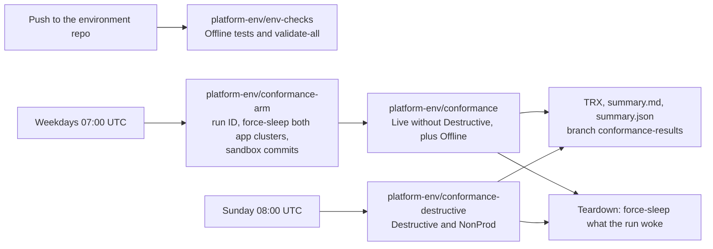

# Conformance

How the platform proves its capabilities: every behaviour the platform claims is a catalogue entry with at least one
automated test, and the tests run every night against the live platform. This page is the operator's side: what runs
when, how to run it by hand, how to read the results, how to triage a failure, and how the runs stay safe and cheap.

Contracts: directive §14, ADR-IR34 ("Capability catalogue", "Test harness", "Testability hooks", P1-13, exit
criteria), §7.0 ("Conformance"), `tests/README.md` (the harness), `docs/capabilities.md` (the rendered catalogue).

## The pieces


*Level 3, the conformance suite. The capabilities of the six catalogue fragments feed `tests/Platform.Conformance.sln` (NUnit 4, Shouldly, TRX), and `render-catalogue` writes `docs/capabilities.md`. `CatalogueConsistencyTests` enforces the one-to-one mapping between capabilities and tests by reflection over both test assemblies. env-checks runs the Offline category and fails on a stale catalogue page; the conformance pipelines run the Live tests with `TEST_FILTER`. The harness clients reach Octopus, Codefresh, Azure Resource Manager and the registry, the cluster API servers and GitHub, with secrets from Codefresh contexts only.*

| Piece | Where | What it is |
|---|---|---|
| Catalogue | `catalogue/capabilities.d/{harness,codefresh,octopus,gitops,azure,kit}.yaml` (an optional root `catalogue/capabilities.yaml` is merged first; none exists) | One entry per capability: `id`, `statement`, `owner`, `adr`, `observed_by`, `tests`, `live`, `destructive`, `tier`, `why_offline`. Rendered to `docs/capabilities.md` |
| Harness | `tests/Platform.Conformance.sln` (.NET 10, NUnit 4, Shouldly) | Projects `Harness` (clients, settings, polling, cleanup), `Offline`, `Tests` (live) and `Report` (TRX to Markdown and JSON) |
| Areas | `tests/Platform.Conformance.{Tests,Offline}/<Area>/` | `Codefresh` (CAP-CF), `Octopus` (CAP-OCT), `GitOps` (CAP-GIT), `Azure` (CAP-AZ), `Kit` (CAP-KIT); `CAP-HARNESS` for the harness itself |
| 1:1 rule | `CatalogueConsistencyTests` (Offline) | Every capability names its tests, every test carries `[Capability]`, and the categories agree with `live`, `destructive` and `tier` |
| Fixture app | `sandbox` (descriptor `apps/sandbox.yaml`, repository `<sandbox-app-repo>`, namespaces `sandbox-<env>`) | The only target of destructive tests, in nonprod only |
| Settings | `tests/platform.settings.json` | Non-secret settings: Octopus URL and space, subscription and tenant, registry, the tiers' groups and clusters (§7.0 names), time limits |
| Secrets | Codefresh contexts `platform-conformance` and `platform-octopus` | `AZURE_TENANT_ID`, `AZURE_CLIENT_ID`, `AZURE_CLIENT_SECRET` of `sp-platform-conformance`; `GITHUB_TOKEN`; `OCTOPUS_API_KEY`; optional `CODEFRESH_API_KEY` |

Categories: `Live` or `Offline` on every test; `Destructive`, `Slow`, and the tier categories `NonProd`, `Prod`,
`Build`. A destructive test is always `NonProd` and never `Prod`.

## What runs when


*Level 3, how the suite runs. conformance-arm force-sleeps both tiers through env-sleep, pushes run commits to `<sandbox-app-repo>`, and queues a sandbox/release rerun and platform-env/conformance; conformance-destructive and env-checks run the same solution with other filters. The fixture app (its repository, sandbox/ci and sandbox/release, the `apps/sandbox/*` images and the Octopus project) is one boundary; its namespaces sit in nonprod and prod, and only sandbox-tdd and sandbox-uat take destructive tests. Both crons ship disabled until P1-13.*


*Dynamic, one weekday night. The arm mints `PLATFORM_RUN_ID`, force-sleeps both tiers (`Sleep.Force=true`), waits for Stopped and the 15-minute stop grace, holds the hourly env-sleep for the run (`sleep-hold`, 480 minutes, held by `conformance:<run-id>`), pushes the failing-test, green and canary commits, and queues the rerun and platform-env/conformance with the run ID and SHAs. The sandbox builds run first (CI statuses, the early env-wake, one Octopus release). The run step records the power state, runs `dotnet test` with `TEST_FILTER` (TRX), the capability report and the annotations; publish pushes the results to `conformance-results`; teardown releases the hold, then force-sleeps the tiers that were not Running before the run.*



| Pipeline | Trigger | Runs |
|---|---|---|
| `platform-env/env-checks` | Every push to the environment repository | `validate-all.ps1` and `dotnet test … --filter TestCategory=Offline` |
| `platform-env/conformance-arm` | Weekdays at 07:00 UTC (01:00 or 02:00 America/Chicago; the cron ships disabled until P1-13), and manual | Records the run ID; force-sleeps both app clusters through `env-sleep` (`Sleep.Force=true`); waits until both are Stopped and the stop has settled (both Stopped/Succeeded twice in a row, no data disk of `rg-platform-<tier>-data` Attached; at most `CONFORMANCE_STOP_GRACE_MINUTES`, 15); holds the hourly `env-sleep` in both tiers through runbook `sleep-hold` (`Sleep.HoldMinutes` `CONFORMANCE_HOLD_MINUTES`, default 480, at most 720; `Sleep.HoldBy` `conformance:<run-id>`), and fails when a hold is not set, because without it `env-sleep` stops a cluster between two tasks of the run; pushes the sandbox commits (a failing branch, a green branch, a release commit with the canary) and deletes the branches of older runs; queues a second `sandbox/release` build of the release commit (the rerun of CAP-CF-008), then `conformance`, which runs after the sandbox builds (one build at a time, BASIC_1) [VERIFY, Q41]. `CONFORMANCE_SKIP_SLEEP=true` skips the force-sleep (debugging), never the hold |
| `platform-env/conformance` | Queued by the arm, and manual | `TestCategory=Live&TestCategory!=Destructive`, plus Offline. The cold start of the day is part of the proof (CAP-OCT-008) |
| `platform-env/conformance-destructive` | Sunday at 08:00 UTC (the cron ships disabled until P1-13), and manual | `TestCategory=Destructive&TestCategory=NonProd`: rebuild of nonprod, data survival, restore, password rotation, failed migration. It has no arm: its first step, `hold`, holds the hourly env-sleep of `infra-nonprod` for 300 minutes (runbook `sleep-hold`, holder `conformance-destructive:<build id>`), and the tests run only once the hold is set; the teardown releases it |

Every pipeline takes `TEST_FILTER` to narrow a manual run, for example
`FullyQualifiedName~Platform.Conformance.Tests.Azure` or `Capability=CAP-AZ-004` (NUnit property filter).

## Run by hand

Offline, anywhere (no secret, no network):

```bash
dotnet build tests/Platform.Conformance.sln -c Release -warnaserror
dotnet test tests/Platform.Conformance.sln -c Release --filter "TestCategory=Offline" \
  --logger "trx;LogFilePrefix=offline" --results-directory tests/TestResults
```

Live, from an operator session with the conformance principal (never the provisioner):

```bash
export AZURE_TENANT_ID=<AZURE_TENANT_ID> AZURE_SUBSCRIPTION_ID=<AZURE_SUBSCRIPTION_ID>
export AZURE_CLIENT_ID=<client-id-of-sp-platform-conformance> AZURE_CLIENT_SECRET=... OCTOPUS_API_KEY=... GITHUB_TOKEN=...
export PLATFORM_TLS_SYSTEM_TRUST=true   # only behind a TLS-re-terminating proxy
dotnet test tests/Platform.Conformance.Tests -c Release \
  --filter "TestCategory=Live&TestCategory!=Destructive&FullyQualifiedName~Azure" \
  --logger "trx;LogFileName=live.trx" --results-directory tests/TestResults
```

Destructive tests run only in nonprod and only against the sandbox; run them by hand only when no lesson or demo uses
nonprod: `--filter "TestCategory=Destructive&TestCategory=NonProd"`.

A live test whose secret or setting is missing is Inconclusive, never failed; its message names what is missing.

CAP-CF-005 (fork pull requests never start a pipeline) has a manual, run-once live check. The offline half runs on
every build; fork pull request triggers stay disabled (`pullRequestAllowForkEvents: false`). The owner, from a
personal GitHub account outside the org, forks `<sandbox-app-repo>` and opens a pull request from the fork (R33), then
runs `ForkPullRequestTests` once on `platform-env/conformance` with `CONFORMANCE_FORK_PULL_REQUEST` set to the pull
request number. Without the variable the test is Inconclusive; the nightly runs leave it unset.

## Read the results

- The pipeline log and the Codefresh build annotations show the counts per verdict and the failed capability IDs.
- `summary.md` and `summary.json` (from `Platform.Conformance.Report`) and the TRX files are pushed to branch
  `conformance-results` of `<sandbox-app-repo>`, folder `results/<date>-<run-id>/`, so history needs no write to the
  environment repository.
- A capability passes only when all its tests passed; it fails when any failed; it is inconclusive when a test could
  not run for a missing prerequisite.
- Octopus task logs of the runbooks a test ran are attached to the test result as artifacts.

## Reading progress

A live run takes hours, and one test can wait 30 minutes or more for a cluster to stop or start. The harness writes
progress lines as it goes (CAP-HARNESS-013), so the log always shows that the run is alive and how far it got. Search
the build log for `progress:`.

| Line | When | Example |
|---|---|---|
| `plan` | First test of an assembly | `progress: plan 41 tests selected` |
| `start` | Each test starts | `progress: start 3/41 SleepDataSurvivalTests.Should_Sleep_CanaryRowWrittenBeforeForceSleep_IsReadAfterWake [CAP-GIT-011] elapsed 12:34` |
| `waiting` | At least once a minute during any wait (`Poll.UntilAsync`, `Poll.DelayAsync`, the Azure `ObserveAsync`, the settled-stop wait, the quiesce before a sleep) | `progress: waiting cluster aks-platform-nonprod to be Stopped state=(Running, Succeeded) elapsed 3:00/25:00` |
| `stage` | Each stage of the end-to-end pass (CAP-KIT-009): ci, release, tdd, uat, prod | `progress: stage 2/5 release start elapsed 08:12` |
| `done` | Each test ends | `progress: done 3/41 Passed 35:02 \| passed 2 failed 0 skipped 1 \| 7% \| eta 7:50:10` |

- **n/N.** In `start`, n is the test's position among the tests started. In `done`, it is the number of tests
  finished. N is the number of tests the run's `TEST_FILTER` selected in that assembly, read from NUnit's own filter
  at the first test. Explicit tests count only when the filter names them. `?` means the filter could not be read.
- **Outcome and counts.** The outcome is NUnit's status (`Passed`, `Failed`, `Inconclusive`, `Skipped`). A failure
  shows its label (`Error`, `Cancelled`). "skipped" counts inconclusive, ignored and skipped tests.
- **Percent and ETA.** The percent is finished tests over N, rounded down. The ETA is the wall-clock time per finished
  test so far, times the tests left. The catalogue has no expected duration per test, so one slow test pushes the ETA
  up until quicker tests follow. `n/a` means no test has finished yet.
- **Waits.** `state=` is the last value the wait observed (a power state, a commit status, an Octopus task), or
  `error <type>: <message>` for a retried error, shortened to 120 characters. The two times are the time spent
  waiting and the wait's timeout. A wait whose elapsed time grows while its state stays the same is stuck on that
  state.
- **Offline suite.** Its lines are labelled `[offline]`. It prints no `start` lines, and a `done` line only at each
  10 % step and for each failure.
- **Heartbeat.** Every 5 minutes `conformance-run.ps1` prints `conformance-run: dotnet test still running at <time>Z`,
  then the latest line and the running test of each progress file:
  `conformance-run:   Platform.Conformance.Tests: running SleepDataSurvivalTests.Should_Sleep_… [CAP-GIT-011]`.
- **Progress file.** The harness keeps `$CF_VOLUME_PATH/conformance/<build id>/progress/<assembly>.json`
  (`CONFORMANCE_PROGRESS_DIR`), with `done`, `total`, `started`, `passed`, `failed`, `skipped`, `pct`, `eta`,
  `etaSeconds`, `elapsed`, `current`, `line` and `updated`. A local run writes it only when `CONFORMANCE_PROGRESS_DIR`
  is set.
- **Build annotations.** Each heartbeat, and the end of the run, record `conformance-progress` (`7% (3/41) eta
  7:50:10`, both assemblies together) and `conformance-current` (the running test, else the latest line) on the
  Codefresh build. This is best effort, like the summary annotations: a failed POST only logs a warning.

## Shared sleep and wake cycles

Each app tier stops and starts once per run, not once per test. `TierSleepCycle` (tests/Platform.Conformance.Tests)
runs these phases once, in the background, on the first test's demand, and the tests of CAP-AZ-004, CAP-AZ-005,
CAP-OCT-008, CAP-OCT-010 (except the prod history read), CAP-OCT-011 and CAP-GIT-011 assert on what they observed.
Each test keeps its own result, capability and failure message.

| Phase | Nonprod | Prod |
|---|---|---|
| `hold tier` | Takes the tier's `TierLock`, so env-plan (CAP-AZ-006) never wakes it during the cycle | The same |
| `awake-before` | Wakes the tier if needed; writes the canary row (CAP-GIT-011); reads Kyverno's ready policies and webhooks (CAP-AZ-005) | Records whether the arm left prod stopped |
| `quiesce` | Waits until Octopus runs or queues no task in tdd, uat and infra-nonprod (env-sleep's busy rule), at most `TimeLimits.RunbookMinutes`, with `waiting` lines | The same for prod and infra-prod |
| `sleep` | env-sleep with `Sleep.Force` (a busy decision is retried twice, a minute apart), the wait for Stopped, then the wait for a settled stop | env-sleep by its own rules only; a stay decision makes this phase Inconclusive with env-sleep's reason. Nothing runs when the arm left prod stopped |
| `asleep` | Power state and `apr-sleep-nonprod` (CAP-AZ-004); db-restore in uat with `Wake.WaitMinutes=1` (CAP-OCT-011) | Power state and `apr-sleep-prod` |
| `wake` | Deploys the release running in tdd to tdd; its platform-wake step runs env-wake (CAP-OCT-008, CAP-OCT-010). env-wake directly when nothing can be deployed or the tier did not sleep | Promotes the newest Default release deployed to uat to prod; env-wake directly when there is none or prod did not sleep |
| `awake-after` | Power state, `apr-sleep-nonprod` disabled (CAP-AZ-004), the canary row read back (CAP-GIT-011), Kyverno's webhooks (CAP-AZ-005) | Power state, `apr-sleep-prod` disabled |

- **Filters.** Selecting any test of a cycle runs that tier's whole cycle; selecting none of them runs none.
- **A phase that does not pass** is never retried. The phases that need it are skipped, and each test that needs any
  of them fails with `phase '<name>' of the <tier> sleep and wake cycle failed: …` (Inconclusive for an Inconclusive
  phase). The wake runs whatever happened before it, so the tier is left awake.
- **Parallel.** The fixtures of both cycles and `TierIdempotenceTests` are `[Parallelizable(ParallelScope.All)]`, so the
  two tiers cycle at the same time and the two env-plans run at the same time (each after its tier's cycle, through
  `TierLock`). Every other fixture stays non-parallel. NUnit never runs its parallel and non-parallel fixtures at the
  same time, and each fixture's teardown waits until every started cycle has ended, so the tests that deploy sandbox
  releases (and so wake nonprod through platform-wake) never overlap a cycle.
- **Settled stop.** A cycle starts nothing until the stop has settled: the cluster and every node pool read Stopped
  with provisioning Succeeded on two consecutive readings 10 to 15 seconds apart, and no disk of
  `rg-platform-<tier>-data` reads `Attached`. This is what Microsoft's advice of 15 to 30 minutes between a stop and a
  start (E50) protects: a start that meets an unfinished stop (a node pool still deallocating, a database disk still
  attached to a running node). `CONFORMANCE_STOP_GRACE_MINUTES` (15) is only the upper bound.
- **Sandbox tdd rollout.** CAP-OCT-001, CAP-OCT-012 and CAP-OCT-007 share `SandboxTddRollout`: one new release and its
  automatic tdd deployment, one deployment of the previous release to tdd (its pin commits, pins and `/version`), then
  the images tdd ran before are deployed again. Three deployments instead of five.
- **Lines.** Each cycle writes `progress: <tier> sleep and wake cycle: phase <name>: <status> (<duration>)` at the end of
  each phase, and `waiting` lines during its waits.

## Triage a failure

1. Take the capability ID from the summary and read its entry in `docs/capabilities.md`: statement, owner, ADR and
   what the test observes.
2. Read the test's message: every assertion names the object and the expected value, and Poll failures name what was
   awaited and the last value seen.
3. Decide: a platform defect (fix the platform file, then re-run with `TEST_FILTER`), an environment state (for
   example a cluster left awake by a paused sleep, `sleep-and-wake.md`), or a test defect (fix the test; the
   capability stays).
4. For a destructive-suite failure, check that the sandbox is back to its baseline before the next run: the run label
   `conformance-run=<run-id>` marks every object the run created, and the next run removes leftovers older than one
   hour.
5. Record recurring failures as work items against the owner in the catalogue.

## Safety and cost

- **Idempotent.** Every object a test creates carries `conformance-run=<run-id>` and is removed by the harness's
  cleanup registry, even when the test fails. Kubernetes fixtures also carry a one-hour time-to-live label.
- **Destructive scope.** Destructive tests touch only the `sandbox` app and only nonprod: `env-destroy` and
  `env-apply` in `infra-nonprod`, a restore into `sandbox-uat`, a password rotation of `sandbox`, a failed migration of
  a sandbox fixture release. Prod has no destroy runbook at all (CAP-AZ-007).
- **Approvals.** Runbooks that stop at a manual intervention (`env-apply`, `env-destroy`, prod approvals) are answered
  by `AISF-Service-Account` only with a reason `conformance:<run-id>` (`Platform.InterventionTestMode`, CAP-OCT-005).
- **Sleep afterwards.** Teardown first releases the arm's sleep hold in both tiers (`sleep-hold` with 0 minutes; a failure
  is a warning, and the hold ends by itself), then force-sleeps every cluster the run woke, never while a task runs.
  `CONFORMANCE_SLEEP_AFTER=false` keeps them up for debugging (the hold is still released, so the hourly rules apply);
  sleep them by hand afterwards.
- **Budgets.** Each live test has a `[CancelAfter]` budget. The nightly and weekly runs keep the app clusters awake
  about 40 hours (nonprod) and 11 hours (prod) a month: about $28 a month at one app, about $100 at 12 apps (§3.5).
- **One build at a time** (BASIC_1): the suite runs at night so it does not queue behind lessons.

## The Azure area (CAP-AZ)

Shared steps live in `AzureConformanceTest`: runbook runs at `refs/heads/main` with interventions answered as
`conformance:<run-id>`, wake and sleep through `env-wake` and `env-sleep`, raw ARM reads, the sandbox canary and
server-side dry-run pods. The cluster names are the §7.0 names; a settings file that names other clusters makes the
Kubernetes tests Inconclusive rather than testing the wrong cluster. The destructive fixtures run in this order and
share one nonprod rebuild: `RestoreTests`, `PasswordRotationTests`, `RebuildDataSurvivalTests`, `TierRebuildTests`.

| ID | Test class | What the test does | Needs |
|---|---|---|---|
| CAP-AZ-001 | `SignedAdmissionTests` | Server-side dry runs of a bare pod in `sandbox-prod`: the sandbox image running there is admitted; `apps/sandbox/unsigned:0.0.0-fixture` is rejected by a release-signature policy | Prod awake (the test wakes it); the unsigned fixture pushed by `platform-env/fixtures`; AKS RBAC Writer on `sandbox-prod` |
| CAP-AZ-002 | `RegistryPathAdmissionTests` | Dry run in `sandbox-prod` of a signed `workorders` image that runs in prod: rejected by `restrict-app-image-paths` | Prod awake; `workorders` released to prod |
| CAP-AZ-003 | `SqlEditionTests` | Dry runs in `sandbox-prod` of the database image: `MSSQL_PID` Express admitted (the control); Developer, Enterprise and unset rejected by `require-mssql-express` | Prod awake |
| CAP-AZ-004 | `SleepAlertTests` | Per tier: asleep, `apr-sleep-<tier>` is enabled; after `env-wake`, it is disabled. A running tier is put to sleep with `env-sleep` first: forced in nonprod, by its own rules in prod, so a daytime run never stops prod and stays Inconclusive instead | `OCTOPUS_API_KEY` |
| CAP-AZ-005 | `StopWithAdmissionTests` | Wakes nonprod, checks that Kyverno serves ready policies (and, where readable, its webhook configurations), force-sleeps it and expects `env-sleep` to succeed and the cluster to stop | `OCTOPUS_API_KEY` |
| CAP-AZ-006 | `TierIdempotenceTests` | Runs `env-plan` per tier and expects no changes in the plan summary of the task log | `OCTOPUS_API_KEY` |
| CAP-AZ-007 | `TierRebuildTests` | Destructive: `env-destroy`, then `env-apply` with a fresh worker registration token, then `apps-apply` for the sandbox, in `infra-nonprod`; the cluster is gone in between, comes back with a new OIDC issuer and the same ingress IP, and the sandbox Applications are Synced and Healthy. Nothing is destroyed unless `env-apply` prompts `Octopus.WorkerRegistrationToken` and Octopus issues a token. Offline: every destroying runbook action is scoped to `infra-nonprod` only | `OCTOPUS_API_KEY`; AISF-Service-Account may answer the approvals of `env-destroy`, `env-apply` and `apps-apply` |
| CAP-AZ-008 | `RebuildDataSurvivalTests` | Destructive: a canary row written to `sandbox-tdd` before the rebuild is read after it | The sandbox canary endpoint `/data/canary` |
| CAP-AZ-009 | `BackupTests` | Wakes nonprod, waits for any catch-up run, and expects a successful Job of `db-backup-sandbox-uat` within 26 hours that wrote to container `sandbox-uat` | AKS RBAC Reader (conformance principal) |
| CAP-AZ-010 | `RestoreTests` | Destructive: changes the canary of `sandbox-uat` (which the newest backup holds), runs the sandbox runbook `db-restore` in `uat` for the latest backup, and reads the old value back | The sandbox canary endpoint; AISF-Service-Account may answer "Approve database restore" |
| CAP-AZ-011 | `PasswordRotationTests` | Destructive: runs `rotate-db-passwords` for `sandbox` in `infra-nonprod`, then expects `sandbox-tdd` healthy with its canary and `sandbox-uat` able to read its database | `OCTOPUS_API_KEY` |
| CAP-AZ-012 | `TierSegmentationTests` | Role assignments of every identity in `rg-platform-<tier>-{shared,aks,apps}` stay within its tier (AcrPull on the registry is the one exception; the conformance reads are not tier identities); no network in a platform group is peered | Reader on the platform and app groups |
| CAP-AZ-013 | `CostTagTests` | Every resource in `rg-platform-*` and `rg-app-*` carries `platform-tier`; platform resources also `platform-component`; per-app resources (in `rg-app-*`, or named for an app) also `platform-app` and `platform-env` | Reader on the platform and app groups |
| CAP-AZ-014 | `BudgetTests` | The three budgets exist and their resource-group filters cover every platform group, node groups included. Inconclusive where Cost Management does not support the subscription's offer | Budget read at subscription scope. Not granted on this subscription (sponsorship offer `Sponsored_2016-01-01`): Inconclusive (401 on this subscription; 403 is treated the same) by owner decision; see [bootstrap P1-02](../bootstrap.md#p1-02-foundation) |
| CAP-AZ-015 | `ClusterAuthTests` | The three clusters have local accounts disabled and Entra ID with Azure RBAC | Reader on the cluster groups |
| CAP-AZ-016 | `RegistryHardeningTests` | The registry has no admin user and no anonymous pull | Reader on `rg-platform-build` |
| CAP-AZ-017 | `AppIdentityScopeTests` | Every `id-<app>-<env>-deploy` and `id-<app>-<env>-app` holds roles only on its own vault and its own `rg-app-<app>-<tier>`; Inconclusive while no app identity exists | Reader on the platform and app groups |

## Exit criteria (ADR-IR34)

- Every non-explicit test is green on five consecutive nightly runs (CAP-CF-005's live test may stay Inconclusive
  until R33).
- The destructive suite has passed once.
- The end-to-end pass has delivered a change to prod (CAP-KIT-009, explicit).
- Both app clusters were Stopped for at least 90 % of the 19:00 to 07:00 hours.
- Month-to-date spend is within 1.2 times the §3.5 sleeping estimate.
