# Lab 18: Follow One Commit to Production

**Curriculum Section:** Sections 06-07 (Operate/Execute & Reporting)
**Estimated Time:** 40 minutes
**Type:** Analyze
**Builds on:** Lab 07 (pull requests), Lab 09 (CI cycle time)

---

## Objective

Trace one merged commit of an app through every handoff of the delivery platform: GitHub → Codefresh → the registry and Octopus → the environment repo → Argo CD → the running pod, then back to the commit. At each handoff, name the tool, the identity it acts as, the artifact it produces and the file that defines the behaviour.

The handoffs are the same for every app (ADR-IR34); each app's own pipelines and process fill them in. App #1, `workorders`, is the worked example: for another app, substitute its name for `workorders` and its descriptor `apps/<app>.yaml` for `apps/workorders.yaml`.

Students hold read-only roles: GitHub, the Codefresh build log, Octopus team `Developers`. No deploy, Argo CD or Azure access is needed. The **offline variant** needs only a checkout of the environment repo, which holds every platform file and every app's pipelines, OCL and desired state, plus the app repository for source paths (`clearmeasure-aisf-sample-apps/20260923-001` for app #1).

## Background

One verb per tool ([../tool-boundaries.md](../tool-boundaries.md)): Codefresh builds, Octopus releases and deploys by committing tags, Argo CD applies. The version string ties every artifact together: the same `<VERSION>` is the image tag, the Octopus package version, the release number and the value the app reports. Each app owns its version scheme; app #1 uses `2.5.<first-parent height>`.

`dotnet run --project tools/Platform.Onboarding -- render workorders` prints every name the app yields: namespaces, Applications, vaults, registry repositories, Octopus objects.

```mermaid
sequenceDiagram
    autonumber
    actor Dev as Developer
    participant GH as App repo
    participant CF as Codefresh release pipeline
    participant ACR as Registry
    participant OCT as Octopus app project
    participant ENV as Environment repo
    participant ARGO as Argo CD argocd-nonprod
    Dev->>GH: merge pull request to the default branch
    GH-->>CF: push trigger, fork events off
    CF->>CF: VERSION, the app's gates
    CF->>ACR: push apps/app/image tagged VERSION and sha-sha7, sign, SBOM, lock
    CF->>OCT: packages, build information, release VERSION
    OCT->>OCT: tdd phase: step 0 wakes the cluster through platform-wake
    OCT->>ENV: commit newTag VERSION in envs/tdd/deployable/kustomization.yaml
    ARGO->>ENV: poll main
    ARGO->>ARGO: PreSync db-migrate, then rolling update
    ARGO-->>OCT: Synced and Healthy at that commit
    OCT->>OCT: verify-version, smoke-test, acceptance-tests
```



The same path from the pull request to prod, with the reuse of locked images on a rerun and the uat and prod approvals ([design §3.2](../../design/platform-design.md#32-end-to-end-sequence-commit-to-production)):


## The handoffs

| # | Handoff | Contract for every app | App #1 | Defined in (app #1) |
|---|---|---|---|---|
| H1 | Pull request checks | `<app>/ci` posts `codefresh/ci`, the required status; GitHub Actions stays off | `workorders/ci` | `codefresh/apps/workorders/pipelines/ci.yml`, `specs/ci.yml` |
| H2 | Version minted | A release pipeline of the app, named `release` or `release-<x>` | `2.5.<height>` | `codefresh/apps/workorders/scripts/version.sh`, `version.env` |
| H3 | Images published | M1: `<acr-name>.azurecr.io/apps/<app>/<image>` through the shared token `cf-apps-release`; M2: keyless signature and SBOM; tags `<VERSION>` and `sha-<sha7>`, locked | `apps/workorders/{ui-server,worker,db-migrator}` | `release.yml` (`image_reuse`, `ui_image`, `worker_image`, `migrator_image`, `supply_chain`, `supply_chain_reuse`) |
| H4 | Release created | M3: `octopus_release` with explicit packages and no default package version; key from context `platform-octopus` | Packages `ChurchBulletin.AcceptanceTests` and the three images; notes start `app-commit: <sha>` | `release.yml` (`octopus_preflight` … `octopus_release`) |
| H5 | tdd deployment starts | Lifecycle `platform-standard`: tdd automatic | Project `workorders` in group `app-workorders`, channel `Default` | `apps/workorders.yaml`; `octopus/terraform` |
| H5a | Wake first | Step 0: Deploy a Release of `platform-wake`, condition Always; its one step runs `env-wake` | `aks-platform-nonprod` Running (already warm when `wake_nonprod` asked early) | `.octopus/apps/workorders/workorders/deployment_process.ocl` (`wake-environment`); [06-sleep-and-wake.md](06-sleep-and-wake.md) |
| H6 | Deployment secrets | Only with `octopus.azureAccount`: account `azure-<app>-<env>` | `read-deployment-secrets` reads the tdd acceptance-test secrets | Same file |
| H7 | Pin commit | The image-tag step as the machine user in `platform-bots`: pin fields of `gitops/apps/<app>/envs/<env>/<deployable>/` only | Three `newTag` lines | `update-argo-cd-image-tags`; `gitops/apps/workorders/envs/tdd/app/kustomization.yaml` |
| H8 | Migrate, then roll out | Application `<app>-<deployable>-<env>` rendered by `tenant-<app>`; PreSync Job `db-migrate` runs the pinned migrator first | `workorders-app-tdd` in namespace `workorders-tdd` | `gitops/platform/tenant/templates/applications.yaml`; `gitops/apps/workorders/app/base/migrate.yaml` |
| H9 | Health report | Gateway, Argo CD account `octopus` (read-only) | "Argo CD Application is healthy" at the pin commit | `argocd/clusters/nonprod/addons/octopus-argocd-gateway.yaml` |
| H10 | Verification | The app's own steps | `verify-version`, `smoke-test`, `acceptance-tests` (TRX), `report-commit-status` | `deployment_process.ocl` |

## Steps (online)

### Step 1: Pick a merged commit

Open the default-branch history of the app repository and pick a recent merge. Record its SHA and the first seven characters.

### Step 2: Compute the version before looking it up

For app #1:

```bash
git fetch --unshallow 2>/dev/null || true   # the checkout may be shallow (F17)
git rev-list --count --first-parent <sha>
```

`codefresh/apps/workorders/version.env` in the environment repo holds the prefix. Predict `VERSION` = `2.5.<count>`.

### Step 3: Find the build of record

In Codefresh, open pipeline `workorders/release` and the build for the SHA. Confirm the exported `VERSION`, the image tags and the `octopus_release` output.

### Step 4: Open the release in Octopus

Project group `app-workorders`, project `workorders` → Releases → `<VERSION>`. Check the channel (`Default`), the package versions (all equal to the release number), the build information and the first line of the release notes (`app-commit:`).

### Step 5: Read the tdd deployment

Open the deployment of the release to `tdd`. Note the steps that ran and those that were skipped (prod-only and uat-only steps). Open the `update-argo-cd-image-tags` log and find the commit it created.

### Step 6: Read the pin commit

In the environment repo, open that commit. Confirm it changes only `newTag` lines in `gitops/apps/workorders/envs/tdd/app/kustomization.yaml`:

```diff
-    newTag: "2.5.730"   # written by Octopus only
+    newTag: "2.5.731"   # written by Octopus only
```

(Version numbers are illustrative.) The committer is the machine user in `platform-bots`, the only identity allowed to push to `main` without a pull request.

### Step 7: Close the loop in the app

Open `https://workorders-tdd.<apps-domain-nonprod>/_version`. It shows the version; match it against Steps 1–4.

## Offline variant: predict every handoff

Work only from the files. Fill in the **Prediction** column first, then check it against the named file and the answer key.

| # | Question | Prediction | Check in |
|---|---|---|---|
| P1 | For a master commit of app #1 with first-parent count 731, what is `VERSION`? For a branch commit with count 731 and SHA `a1b2c3d`? | | `codefresh/apps/workorders/scripts/version.sh` |
| P2 | Which status must pass before a pull request can merge in an app repository, and why does a pull request from a fork never get it? | | `contracts/platform-contracts.yaml` (`statuses`, `codefresh.handshake`) |
| P3 | Name app #1's image repositories and both tags each image gets. Which token pushes them, and where can it not push? | | `apps/workorders.yaml`; `contracts/platform-contracts.yaml` (`registry`) |
| P4 | Which Octopus project, channel and Git reference does the release use, and why is no Git commit passed? | | `release.yml` (`octopus_release`) |
| P5 | List the tdd steps in order. Which one wakes the cluster, and why does the app project hold no API key? | | `.octopus/apps/workorders/workorders/deployment_process.ocl`; ADR-IR34 decision 17 |
| P6 | Which file and which fields does Octopus change, and what may not change in the same commit? | | `gitops/apps/workorders/envs/tdd/app/kustomization.yaml`; the bot-path audit (`PinWriterTests`) |
| P7 | Which Argo CD Application and project pick up the change, from which path, into which namespace? What defines that Application? | | `gitops/platform/tenant/templates/applications.yaml`; `render workorders` |
| P8 | Run `kustomize build gitops/apps/workorders/envs/tdd/app`. Which exact image reference does the `ui-server` container get? | | Rendered output |
| P9 | When does the database migration run, and what happens to the running version when it fails? | | `gitops/apps/workorders/app/base/migrate.yaml`; ADR-IR34 decision 1 |
| P10 | How does Octopus know Argo CD finished, and how long does it wait? | | `update-argo-cd-image-tags`; `Argo.VerificationTimeoutSeconds` |
| P11 | After acceptance tests pass, what reports back to the app commit, and under which condition? | | `report-commit-status`; `GitHub.StatusEnabled` |

<details>
<summary>Answer key</summary>

- **P1.** `2.5.731`. On a branch: `2.5.731-ci.a1b2c3d`, which is never released.
- **P2.** `codefresh/ci`, posted by `<app>/ci` on every same-repository branch push. Fork events are off in every trigger (consistency check C25), so a maintainer pushes the reviewed commits to a branch of the app repository; the status then lands on the same SHA.
- **P3.** `<acr-name>.azurecr.io/apps/workorders/ui-server`, `…/worker`, `…/db-migrator`, each tagged `<VERSION>` and `sha-<sha7>`, both locked; never `latest`. The shared token `cf-apps-release` writes `apps/*` only, and cannot delete. A push to another app's path is caught later: by the lint (M1), by the tag locks, and in prod by the signer policy, whose subject names the app.
- **P4.** Project `workorders`, channel `Default`, `--git-ref refs/heads/main`. The OCL lives in the environment repo, where an app SHA does not resolve; traceability comes from build information and the `app-commit:` line.
- **P5.** `wake-environment` → `read-deployment-secrets` → `update-argo-cd-image-tags` → `verify-version` → `smoke-test` → `acceptance-tests` → `report-commit-status`; the prod and uat steps are skipped. `wake-environment` deploys a release of `platform-wake`, the only project that holds the key; app projects hold none (TB20).
- **P6.** The `images[].newTag` values of `gitops/apps/workorders/envs/tdd/app/kustomization.yaml`. Anything else in a bot commit fails the bot-path audit on `main`.
- **P7.** Application `workorders-app-tdd`, project `app-workorders`, path `gitops/apps/workorders/envs/tdd/app`, namespace `workorders-tdd`. The tenant chart renders it inside `tenant-workorders`, which the ApplicationSet `apps` renders from `apps/workorders.yaml`.
- **P8.** `<acr-name>.azurecr.io/apps/workorders/ui-server:<newTag from the pin file>`; the base declares no tag.
- **P9.** Before every rollout: the PreSync Job `db-migrate` runs the pinned migrator image. A failure fails the sync and the Octopus deployment, and the old pods keep serving (CAP-GIT-010).
- **P10.** The step's verification waits until the gateway reports the Application Synced and Healthy at the commit the step created, within `Argo.VerificationTimeoutSeconds`.
- **P11.** `report-commit-status` posts `platform/tdd` to the app commit only when `GitHub.StatusEnabled` is `True` (R16), as the statuses-only GitHub App (ADR-IR27), using the SHA from the `app-commit:` line.

</details>

## Expected Outcome

- A completed handoff table for one real commit (online) or for the illustrative commit (offline).
- The ability to answer "what version runs in tdd, who put it there, and from which commit" from Octopus alone.
- The line between what an app owns (its pipelines, steps and manifests) and what every app shares (the handoffs and their checks).

## Discussion

1. Octopus waits for Argo CD's polling because Trigger sync is off. What does turning it on cost in credentials (E7)?
2. Which single file would a reviewer read to know what an app runs in tdd right now?
3. Where would a second, conflicting version number come from if Octopus created releases from a feed trigger (incidents EP20, EP21)?
