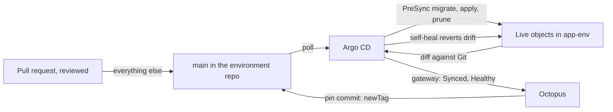

# Lab 21: Drift and Rollback

**Curriculum Section:** Section 06 (Operate/Execute - Recover Quickly)
**Estimated Time:** 40 minutes
**Type:** Experiment
**Builds on:** Lab 10 (stability monitoring), Lab 18 (follow a commit)

---

## Objective

Predict and observe what the platform does when the running state of an app differs from Git (drift), and how a bad release is undone (rollback). For each case, name the tool that detects it, the tool that corrects it, what Git contains afterwards and where the audit trail is.

The behaviour is the same for every app: the tenant chart renders every app Application with the same sync policy. App #1, `workorders`, is the worked example; the drills run on the conformance fixture `sandbox` first (CAP-GIT-001, CAP-OCT-007, CAP-GIT-010).

## Background

*Dynamic, pin and sync. The step Update Argo CD image tags finds the Applications annotated with the deployment's project and environment through the Octopus Argo CD gateway (outbound gRPC from the cluster), then commits `images[].newTag` to `gitops/apps/<app>/envs/<env>/<deployable>/kustomization.yaml` on main as Octopus, without triggering a sync. Argo CD's next poll (scoped by `manifest-generate-paths`) syncs, runs the PreSync `db-migrate` and rolls out; the gateway reports Synced and Healthy at the pin commit, which ends the step's 900-second wait; Verify version and Smoke test follow. A failed migration fails the sync while the old pods keep serving; a rollback redeploys the previous release; `platform-pin-writer` is the fallback writer.*

*Dynamic, an environment change as built: pull request, env-checks and the board workflow, merge, Argo CD's 30-second poll, sync and rollout; a `.octopus/` change reaches Octopus at the next release or runbook run instead. As built: env-checks trigger paused for demos; required-status rule pending ([source](../../design/diagrams/dyn-as-built-env-change.puml)).*

- **Git is the truth for Kubernetes.** Every app Application (`<app>-<deployable>-<env>`, `<app>-db-<env>`) syncs automatically with `prune: true` and `selfHeal: true` (ADR-D5). A change made directly in the cluster is reverted; a change merged to `main` is applied.
- **Octopus is the truth for what version runs.** It is the only writer of the pin fields in `gitops/apps/<app>/envs/<env>/<deployable>/`. Its deployment history says which release each environment runs, who approved it and when.
- **Rollback is a deployment.** Octopus "redeploy previous release" runs the older release's process again: its pin commit writes the older tags, the PreSync migration has nothing new to run (DbUp is forward-only), and Argo CD rolls the pods back. Argo CD's own rollback is refused on auto-synced Applications (E40), and self-heal would undo a `kubectl set image`.
- **Break-glass is recorded and time-bound.** Emergency paths are in [../runbooks/break-glass.md](../runbooks/break-glass.md): time-bound Kyverno `PolicyException` objects, direct cluster access for `platform-operators`, lifting a lock (ADR-D11, ADR-IR34 decision 25).

## Steps (online)

Drills run in `tdd` only, driven by a platform engineer; they are P2 exit drills for app #1. Students watch Argo CD read-only or the Octopus Live Object Status.

### Viewing Live Object Status in Octopus

Octopus shows Argo CD Live Object Status and sync status without extra setup: it needs Octopus 2025.4+ (sync status 2026.1+; the instance runs 2026.4), a connected Argo CD gateway, and an Argo CD account with `applications, get`, `logs, get` and `clusters, get` (granted to `octopus` in `argocd/bootstrap/values-*.yaml`). There is no feature toggle or project setting ([docs](https://octopus.com/docs/argo-cd/live-object-status)).

- UI: Project `workorders` (or `sandbox`) → Dashboard → select the environment cell of the latest release → the Live Status panel shows each Application's health and sync status (`InSync`/`OutOfSync`) and its child objects.
- API (read-only): `GET /api/Spaces-335/projects/Projects-943/environments/<env id>/untenanted/livestatus` with header `X-Octopus-ApiKey`. Environments: `tdd` Environments-584, `uat` Environments-583, `prod` Environments-582. On 2026-09-28 it returned `workorders-app-{tdd,uat,prod}` Healthy / InSync; `sandbox` (Projects-947) likewise.

### Step 1: Drift in the cluster

The platform engineer scales `ui-server` in `workorders-tdd` by hand (`kubectl scale deployment/ui-server --replicas=2`). Watch Argo CD mark `workorders-app-tdd` OutOfSync, then self-heal it back to the replica count in Git. Record the time to correction and where the event appears (Argo CD history; Octopus Live Object Status).

### Step 2: Drift in Git outside Octopus

A pull request that edits `newTag` in `gitops/apps/workorders/envs/tdd/app/kustomization.yaml` is a break-glass change: it needs platform-owner review, and it makes Git disagree with Octopus's record of what `tdd` runs. Discuss what Octopus shows until the next deployment, and why the bot-path audit does not fire (the author is a person, through a reviewed pull request).

### Step 3: A failed migration

The platform engineer deploys a release whose migration fails in `tdd`. Observe: the pin commit exists; the sync fails at the PreSync Job `db-migrate`; the Octopus deployment fails at the healthy verification of `update-argo-cd-image-tags`; `/_version` still reports the previous version. This is P2 exit drill 3 (CAP-GIT-010).

### Step 4: Roll back a bad release

The platform engineer deploys a release that migrates but fails `smoke-test`. Then, in Octopus, **redeploy previous release** to `tdd`. Observe the order: `wake-environment` → `update-argo-cd-image-tags` (commits the older tags; `read-deployment-secrets` runs alongside it) → PreSync `db-migrate` (no-op) → rolling update → `verify-version` and `smoke-test` (in parallel) → `acceptance-tests`. Time it; P2 exit drill 5 requires under 15 minutes from an awake cluster (CAP-OCT-007).

### Step 5: Read the audit trail

For Steps 1–4, find the evidence: Argo CD sync history, the environment-repo commits and their authors, the Octopus deployments and their logs.

## Offline variant: predict every handoff

Work from `gitops/platform/tenant/templates/applications.yaml`, `gitops/apps/workorders/`, `.octopus/apps/workorders/workorders/deployment_process.ocl`, the tool-boundary rules (`Kit.Boundaries`), `argocd/bootstrap/values-nonprod.yaml` and `CODEOWNERS`. For each scenario predict: **detected by**, **corrected by**, **Git afterwards**, **audit trail**.

| # | Scenario | Prediction | Check in |
|---|---|---|---|
| D1 | Someone runs `kubectl set image deployment/ui-server ui-server=<acr-name>.azurecr.io/apps/workorders/ui-server:2.5.700` in `workorders-uat`. | | `tenant.syncPolicy` in the tenant chart |
| D2 | Someone deletes ConfigMap `workorders-config-<hash>` in `workorders-tdd`. | | `prune`, `selfHeal` |
| D3 | A pull request removes the readiness probe from `gitops/apps/workorders/app/base/ui-server.yaml` and is merged. | | `CODEOWNERS`; ADR-D6 |
| D4 | The Octopus machine user pushes a commit to `main` that changes `newTag` and a `replicas` line. | | the bot-path audit (`PinWriterTests`) |
| D5 | An operator clicks Rollback on `workorders-app-tdd` in the Argo CD UI. | | E40; the sync policy |
| D6 | Release `2.5.745` fails `smoke-test` in `prod` after its pin commit. What is running, and what does on-call do? | | ADR-D5; Step 4 |
| D7 | During D6's rollback, what runs the migrator, and what does it change? | | ADR-IR34 decision 1 |
| D8 | Someone resizes the app database disk `disk-workorders-uat-db` in the Azure portal. | | `apps-plan` runbook |
| D9 | Someone adds an `argocd-image-updater` annotation to a file under `gitops/apps/workorders/` in a pull request. | | tool-boundary rules TB04 |
| D10 | Someone deletes the NetworkPolicy `platform-default-deny-ingress` in `workorders-tdd`. | | `gitops/platform/tenant/templates/networkpolicies.yaml` |

Answer key

- **D1.** Detected by Argo CD (live differs from Git); corrected by self-heal, which restores the pinned tag. Git is unchanged. Trail: Argo CD history; the Kubernetes audit log names who ran kubectl.
- **D2.** Argo CD recreates the ConfigMap from the generator output in Git (self-heal). Git is unchanged. Running pods keep running; new pods start once it exists again.
- **D3.** The merge is the change: platform owners reviewed it (CODEOWNERS on `gitops/apps/`), and a runtime-behaviour change in `base/` also needs the `all-environments` label. Argo CD applies it in all three environments at once; a change like this should roll through a component instead (Lab 19).
- **D4.** The commit lands (the bypass actor skips the branch ruleset, and no push ruleset restricts paths on a public repo), Argo CD applies it, and the next `platform-env/env-checks` run on `main` fails the bot-path audit. Correction is a reviewed revert; the incident gets a credential review.
- **D5.** Argo CD refuses a rollback on an auto-synced Application (E40), and self-heal would undo a manual sync to an older revision. Rollback is an Octopus deployment.
- **D6.** The new pods run: the Application is Healthy, but the app is not. On-call redeploys the previous release in Octopus. Kubernetes never runs anything that Git does not name.
- **D7.** The PreSync Job `db-migrate`, with the older migrator image: every script it holds is already journaled, so it changes nothing. The older code runs on the newer schema, which is why migrations follow expand/contract.
- **D8.** Argo CD cannot see it. The next `apps-plan` with `App.Name=workorders` in `infra-nonprod` shows the difference; `apps-apply` restores the Terraform state, or the change becomes permanent through a reviewed pull request (the disk size is a platform value in `terraform/apps/tier`).
- **D9.** `platform-env/env-checks` fails on TB04 (no Image Updater), so the pull request cannot merge: the ruleset requires `codefresh/env-checks`.
- **D10.** Self-heal of `tenant-workorders` recreates it: NetworkPolicies belong to the tenant chart, which the app cannot change (its AppProject denies the kind). Git is unchanged.

## Expected Outcome

- A table of drift and rollback cases with detector, corrector, Git state and trail.
- A measured rollback time from the drill (online) or a predicted one with its steps (offline).
- The reflex that rollback is "redeploy previous release" in Octopus, never a cluster command.

## Discussion

1. Why does self-heal make `kubectl` edits useless in named environments, and why is that desirable?
2. With the migration inside the sync, a failed migration leaves Git naming a version the cluster does not run. What tells on-call, and what closes the gap?
3. How does the bot-path audit compensate for a machine user that bypasses review?
