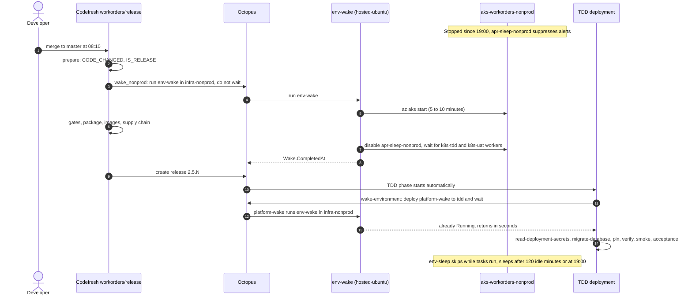

# Lab 23: Sleep and Wake: the First Job of the Day

**Curriculum Section:** Sections 06-07 (Operate/Execute & Reporting)
**Estimated Time:** 40 minutes
**Type:** Analyze + Operate
**Builds on:** Lab 18 (follow a commit), Lab 22 (environment lifecycle)

---

## Objective

Explain how the platform sleeps by default and wakes on the first Codefresh or Octopus job. Follow the first job of a working day: the release build wakes the nonprod cluster while CI runs, and the TDD deployment waits in `wake-environment` until the cluster is ready. For every handoff, name who acts, the identity used and the file that defines it.

Students observe with the `Developers` role in Octopus and read access to the Codefresh build log. The **offline variant** needs only a checkout of this repo.

## Background

User directive: stop what can be stopped when nobody needs it, turn it off at night, and do not restart until the first Codefresh or Octopus job. The design record is ADR-IR33; the operating procedure is [../runbooks/sleep-and-wake.md](../runbooks/sleep-and-wake.md).

**What sleeps.** The two AKS clusters, and everything inside them: Argo CD, ESO, the Octopus Argo CD gateway, Kyverno, the Octopus Kubernetes workers `k8s-<env>` and the app.

| Cluster | Octopus infrastructure environment | Carries |
|---|---|---|
| `aks-workorders-nonprod` | `infra-nonprod` | `tdd`, `uat` |
| `aks-workorders-prod` | `infra-prod` | `prod` |

**What never sleeps.** Azure SQL (DTU tiers cannot pause), ACR, Key Vault, Log Analytics and Terraform state (no compute), each cluster's load balancer and public IP, and the Codefresh runner cluster (another subscription).

**The pieces.**

| Piece | Where | Does |
|---|---|---|
| Runbook `env-wake` | Project `workorders-infrastructure`; pool `hosted-ubuntu`; account `Azure.LifecycleAccount` | Returns within seconds when the cluster runs. Otherwise `az aks start`, waits up to `Wake.TimeoutMinutes`, disables the alert suppression rule `apr-sleep-<cluster>`, waits for the `k8s-<env>` workers, writes `Wake.CompletedAt` |
| Runbook `env-sleep` | Same project, pool and account; hourly triggers `env-sleep-hourly-nonprod` and `env-sleep-hourly-prod` | Does nothing when `Sleep.Enabled` is false or a task is queued or executing. Otherwise sleeps outside the working window or after `Sleep.IdleMinutes` idle: enables `apr-sleep-<cluster>`, then `az aks stop` |
| Project `platform-wake` | Platform-owned; one step, `run-env-wake`, on `hosted-ubuntu` | Maps `tdd`, `uat` to `infra-nonprod` and `prod` to `infra-prod`, runs `env-wake` there through the Octopus REST API with `Platform.OctopusApiKey`, waits, fails when the wake fails |
| Step `wake-environment` | First step of the `workorders` process and of every runbook that needs a cluster | In the `workorders` process: a Deploy a Release of `platform-wake`, with no key. In the `workorders` runbooks: a keyless wait for the cluster, which says how to wake it. In the `workorders-infrastructure` runbooks: runs `env-wake` itself with the step-scoped key |
| Step `wake_nonprod` | `codefresh/workorders/pipelines/release.yml`, parallel with the gates | Asks Octopus to run `env-wake` in `infra-nonprod` and does not wait. It never fails the build |
| Rule `apr-sleep-<cluster>` | `terraform/environment` | Suppresses alert notifications while the cluster sleeps, so a stopped cluster never pages anyone |

**Working window** (`.octopus/workorders-infrastructure/variables.ocl`): `Sleep.WorkDays` `Mon,Tue,Wed,Thu,Fri`, `Sleep.WorkdayStart` `07:00`, `Sleep.WorkdayEnd` `19:00`, `Sleep.TimeZone` `America/Chicago`, `Sleep.IdleMinutes` `120`, `Wake.TimeoutMinutes` `20`. `Sleep.Enabled` is `true` for both classes, because this is a sample with no real users; a real production sets it to `false` for `infra-prod`.

**Who may start a cluster.** Only `env-wake`, with the lifecycle account. The deployment identities (`azure-oidc-deploy-<env>`) hold no Azure right that can start a cluster, and project `workorders` holds neither an Azure step for the wake nor the Space Manager key: its `wake-environment` deploys `platform-wake` (ADR-IR33, platform secrets never enter app projects). In `workorders-infrastructure` the wake step reads the cluster with the lifecycle account first, so the Terraform runbooks skip the wake while no cluster exists. `tool-boundaries.sh` TB17 to TB20 and `consistency.sh` C23 enforce this.

**By hand.** `SRE On-call` and `Platform Engineers` run `env-wake` before a demo or break-glass work, or `env-sleep` with the prompted `Sleep.Force` set to `true`, which skips the window and idle rules but never the task check (ADR-IR33).

## Steps (online)

A platform engineer drives; students watch.

### Step 1: Read the night

In Octopus, project `workorders-infrastructure`, open the last runs of `env-sleep` in `infra-nonprod`. Find the run that stopped the cluster and the decision it logged: outside the window, or idle. Note that it enabled `apr-sleep-nonprod` before it stopped the cluster.

### Step 2: The first merge of the day

Merge a small change to `master` of the application repo (or pick the first release build of the day). In the Codefresh build of `workorders/release`, open step `wake_nonprod`: it logs the queued `env-wake` task and ends at once. The gates run in parallel.

### Step 3: Watch the wake

In Octopus, open the `env-wake` task started by `AISF-Service-Account`. Record the time from `az aks start` to Running, the rule being disabled, the workers of `k8s-tdd` and `k8s-uat` turning Healthy, and `Wake.CompletedAt`.

### Step 4: The deployment finds the cluster awake

When the release reaches TDD, open the deployment. `wake-environment` is its first step: it deploys `platform-wake` to `tdd`, whose one step maps `tdd` to `infra-nonprod` and runs `env-wake`, and it finishes within seconds because the cluster already runs. The next step, `read-deployment-secrets`, runs on `k8s-tdd` inside the cluster.

### Step 5: The deployment waits

Repeat on a day when the release build is quicker than the cluster start, or when `wake_nonprod` was skipped. Now `wake-environment` waits: its task log shows the wake in progress, and the deployment stays in the step until the cluster runs (up to `Wake.TimeoutMinutes`, 20). The job is slower, never broken.

### Step 6: The next sleep decision

Open the next hourly `env-sleep` runs. While a deployment executes, the run skips. Inside the working window it stays awake until 120 minutes pass without a completed task or wake; at 19:00 it sleeps.

## Offline variant: predict every handoff

Work from `.octopus/workorders-infrastructure/`, `.octopus/workorders/`, `octopus/terraform/`, `codefresh/workorders/pipelines/release.yml`, `terraform/environment/monitoring.tf` and `contracts/platform-contracts.yaml` (`sleepWake`). Predict, then check.

| # | Question | Prediction | Check in |
|---|---|---|---|
| P1 | Tuesday 21:30: state of `aks-workorders-nonprod`, and what stops the SLO alert from paging? | | `env-sleep.ocl`; `terraform/environment/monitoring.tf` |
| P2 | Wednesday 08:10, a merge to `master`. Which step asks for the wake first, and does the build wait for it? | | `release.yml` step `wake_nonprod` |
| P3 | Octopus is unreachable during `wake_nonprod`. What happens to the build? | | `release.yml` |
| P4 | The TDD deployment starts at 08:30, after `env-wake` finished at 08:19. What does `wake-environment` do? | | `.octopus/workorders/deployment_process.ocl` |
| P5 | Which identity starts the cluster, and why can the TDD deployment identity not do it? | | `env-wake.ocl`; `tool-boundaries.sh` TB19 |
| P6 | Which worker pool runs the wake (`platform-wake` and the runbook wake steps), and why not `k8s-tdd`? | | contracts `sleepWake.runbookPool` |
| P7 | On-call runs `db-backup` in `uat` at 22:00. What happens first, and when does the cluster sleep again? | | `db-backup.ocl`; `env-sleep.ocl` |
| P8 | The 11:00 `env-sleep` run finds a TDD deployment executing. Decision? | | contracts `sleepWake.sleepRule` |
| P9 | The last task completed at 09:05; nothing runs afterwards. Which hourly run stops the cluster? | | `Sleep.IdleMinutes` |
| P10 | Which runbook never wakes the cluster although it runs daily? | | contracts `sleepWake.neverWake` |
| P11 | A schedule that runs `env-wake` at 07:00 every weekday would save the first job's wait. Why does the platform refuse it? | | contracts `octopus.scheduledRunbooks`; `consistency.sh` C23 |
| P12 | Which single change keeps prod awake all the time, and who reviews it? | | `.octopus/workorders-infrastructure/variables.ocl`; `CODEOWNERS` |
| P13 | What still costs money while nonprod sleeps? | | [../runbooks/sleep-and-wake.md](../runbooks/sleep-and-wake.md) |
| P14 | `env-apply` runs `env-wake` in its own project and environment, then waits for it. Why does the wake not queue behind the run that waits for it? | | `Octopus.Task.ConcurrencyTag` in `.octopus/workorders-infrastructure/variables.ocl` |
| P15 | At 10:00 on a Tuesday, on-call runs `env-sleep` with `Sleep.Force` = `true` while a UAT deployment waits at its sign-off. Decision? | | `env-sleep.ocl` step "Decide sleep" |

Answer key

- **P1.** Stopped: the 19:00 run of `env-sleep-hourly-nonprod` was outside the working window. It enabled `apr-sleep-nonprod` first, which suppresses alert notifications, then ran `az aks stop`.
- **P2.** `wake_nonprod` in `workorders/release`, right after `prepare` shows the build will release. It asks Octopus to run `env-wake` in `infra-nonprod` and does not wait: the gates run in parallel.
- **P3.** Nothing: the step logs a warning and exits 0 (`fail_fast: false`, no `strict_fail_fast`). The TDD deployment's own `wake-environment` step is the guarantee.
- **P4.** It deploys `platform-wake` to `tdd` and waits. That project's one step runs `env-wake` in `infra-nonprod` through the Octopus REST API; `env-wake` sees a running cluster and returns within seconds, so the deployment continues almost at once. Project `workorders` itself holds no key.
- **P5.** `env-wake`, with `Azure.LifecycleAccount` (`azure-runtime-provisioner` during phases 1–2, then `azure-oidc-env-lifecycle-nonprod`). `azure-oidc-deploy-tdd` holds only Key Vault and SQL roles on `rg-workorders-tdd`; TB19 fails any grant that could start a cluster, and any Azure account on `wake-environment`.
- **P6.** `hosted-ubuntu`, a dynamic Octopus Cloud pool. The `k8s-tdd` workers run inside the cluster, so they sleep with it and could never wake it. The `wake-environment` step of the `workorders` process runs no script at all: it deploys `platform-wake`.
- **P7.** `wake-environment` only waits: project `workorders` holds no key, so its runbooks cannot wake a cluster. On-call first runs `env-wake` in `infra-nonprod` (5 to 10 minutes), or the runbook waits up to 30 minutes and names both ways to wake. After the backup, the 23:00 `env-sleep` run finds no task running outside the window and stops the cluster again.
- **P8.** Skip: a deployment or runbook run in the cluster's environments is executing (every project there counts).
- **P9.** The 12:00 run. At 11:00 the cluster has been idle for 115 minutes, under `Sleep.IdleMinutes` (120); at 12:00 it has been idle for 175. The hourly `env-sleep` runs and `provisioner-credential-check` do not count as activity, or the cluster could never become idle; `env-sleep.ocl` skips them by task description [VERIFY].
- **P10.** `provisioner-credential-check`: it needs Azure sign-in only, not the cluster. `env-sleep` and `env-wake` never run `wake-environment` either.
- **P11.** The directive says not to restart until the first job, and many days have no job. A schedule may run only `env-sleep`, `rotate-sql-passwords` and `provisioner-credential-check`; C23 fails a trigger that runs `env-wake`, `env-apply` or `env-destroy`. `wake_nonprod` already warms the cluster during CI.
- **P12.** A pull request that sets `Sleep.Enabled` to `false` for `infra-prod` in `.octopus/workorders-infrastructure/variables.ocl`. `CODEOWNERS` routes that file to security owners alone (S4), so their approval is required. The contracts keep both values `true` for this sample, and C23 reports the difference as a warning.
- **P13.** Azure SQL, the load balancer and public IP, ACR, Key Vault, Log Analytics, the state storage, private endpoints, and the Codefresh runner cluster in its own subscription. Design §3.4 estimates nonprod at about $100 a month instead of about $515 always on, and the whole platform at about $325 instead of about $1,640 [UNVERIFIED].
- **P14.** Tasks that share a concurrency tag run one at a time, and the default tag is the project and environment, so `env-wake` would wait for the `env-apply` that waits for it. `env-wake` therefore runs under its own `Octopus.Task.ConcurrencyTag` [VERIFY how runbook runs default, design §12 Q23]. Design §7.2 makes it `cluster-power/#{Octopus.Environment.Id}`, shared with `env-sleep`, so a wake requested during a stop queues behind the stop.
- **P15.** Stay. A deployment waiting at a manual intervention counts as Executing [VERIFY, design §12 Q24], and `Sleep.Force` never overrides the task check. The approvers answer or cancel; the next hourly run decides again.

## Expected Outcome

- The first-job timeline drawn from memory: who wakes the cluster, who waits and for how long.
- The sleep rule stated in one sentence, with the variable that controls each part.
- The boundary: only `env-wake` starts a cluster, and nothing wakes on a schedule.

## Discussion

1. What would break if the wake ran on `k8s-tdd`? And why does `workorders` deploy `platform-wake` instead of calling `env-wake` itself?
2. Why does `env-sleep` enable the suppression rule before stopping the cluster, and `env-wake` disable it only after the start?
3. A developer's pull request build (`workorders/ci`) never wakes anything. Why is that right, and what would change if CI needed the cluster?
