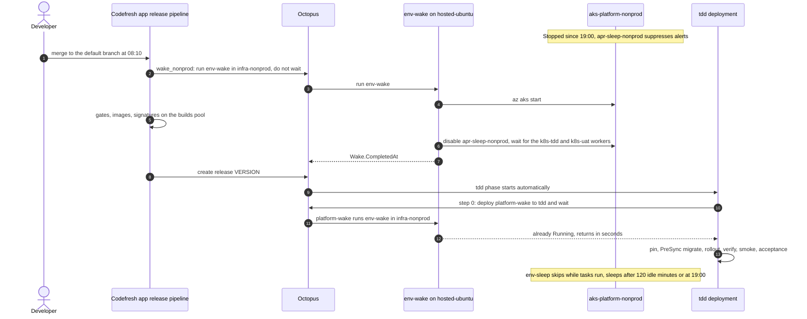

# Lab 23: Sleep and Wake: the First Job of the Day

**Curriculum Section:** Sections 06-07 (Operate/Execute & Reporting)
**Estimated Time:** 40 minutes
**Type:** Analyze + Operate
**Builds on:** Lab 18 (follow a commit), Lab 22 (environment lifecycle)

---

## Objective

Explain how the platform sleeps by default and wakes on the first Codefresh or Octopus job. Follow the first job of a working day: the release build wakes the nonprod cluster while its gates run, and the tdd deployment waits in its first step until the cluster is ready. For every handoff, name who acts, the identity used and the file that defines it.

Sleep and wake belong to the platform: every app gets the same behaviour through step 0 of its process and the wait guard of its runbooks, both scaffolded from the starters. App #1, `workorders`, is the worked example. Students observe with the `Developers` role in Octopus and read access to the Codefresh build log. The **offline variant** needs only a checkout of this repo.

## Background

User directive: stop what can be stopped when nobody needs it, turn it off at night, and do not restart until the first Codefresh or Octopus job. The design record is ADR-IR33 as amended by ADR-IR34; the operating procedure is [../runbooks/sleep-and-wake.md](../runbooks/sleep-and-wake.md).

*Dynamic, three ways a sleeping cluster meets its first job. The release pipeline's step `wake_nonprod` asks Octopus to run env-wake in `infra-nonprod` and never waits. Step 0 of every app deployment deploys `platform-wake`, whose keyed step runs env-wake in `infra-<tier>` and waits; the deployment continues once the cluster is Running and `apr-sleep-<tier>` is disabled. App runbooks hold no key: they wait up to `Wake.WaitMinutes` for the app to answer, then fail with guidance.*

*Dynamic, runbook env-sleep in `infra-<tier>`, started hourly by `env-sleep-hourly-<tier>` or by hand. Step Decide sleep applies the rules in order: `Sleep.Enabled`, a queued or running task, `Sleep.Force`, a sleep hold (tags on `rg-platform-<tier>-aks`, set by runbook `sleep-hold`), the working window, then idle time; it outputs `Sleep.Decision` and `Sleep.Reason`, and a dry run may simulate the clock with `Sleep.NowOverride`. Step Stop cluster runs only on a sleep decision and changes nothing in a dry run; otherwise it enables `apr-sleep-<tier>`, reads the task list again and stops the cluster without waiting; any exit before the stop is accepted disables the rule again.*

**What sleeps.** The two app clusters and everything inside them: Argo CD, ESO, the Octopus Argo CD gateway, Kyverno, the Octopus Kubernetes workers `k8s-<env>`, every app and every app database.

| Cluster | Octopus infrastructure environment | Carries |
|---|---|---|
| `aks-platform-nonprod` | `infra-nonprod` | `tdd`, `uat`, previews |
| `aks-platform-prod` | `infra-prod` | `prod` |

**What scales instead.** The build cluster `aks-platform-build` never stops: its `system` node runs the Codefresh Runner agent, and its `builds` pool scales from zero on the first job and back after 10 idle minutes (CAP-CF-003).

**What never sleeps.** The registry, vaults, workspaces, state and backup accounts, the database disks (no compute; the data waits on the disk), each cluster's load balancer and public IPs, and the build cluster's system node.

**The pieces.**

| Piece | Where | Does |
|---|---|---|
| Runbook `env-wake` | Project `platform-infrastructure`; pool `hosted-ubuntu`; account `azure-platform-lifecycle-<tier>` | Returns within seconds when the cluster runs. Otherwise `az aks start`, waits up to `Wake.TimeoutMinutes`, disables the alert suppression rule `apr-sleep-<tier>`, reports the `k8s-<env>` workers and requests a health check, not awaited, for a worker that is not healthy, writes `Wake.CompletedAt` (gap: it does not wait for the workers or the Argo CD gateway; tracked) |
| Runbook `env-sleep` | Same project, pool and account; hourly triggers `env-sleep-hourly-nonprod` and `env-sleep-hourly-prod` (minute 0, UTC) | Does nothing when `Sleep.Enabled` is false or a task is executing, cancelling or queued to start within 15 minutes, nor, unless forced, while a sleep hold lies ahead (runbook `sleep-hold`, at most 12 hours; conformance runs set one). Otherwise sleeps outside the working window or after `Sleep.IdleMinutes` idle: enables `apr-sleep-<tier>`, then `az aks stop --no-wait`. Prompted `Sleep.Force`, `Sleep.DryRun`, `Sleep.NowOverride` |
| Project `platform-wake` | Platform-owned; one step, `run-env-wake`, on `hosted-ubuntu` | Maps `tdd` and `uat` to `infra-nonprod` and `prod` to `infra-prod`, runs `env-wake` there through the Octopus REST API with `PlatformWake.OctopusApiKey`, waits, fails when the wake fails. Reads only `PlatformWake.*` and system variables (decision 17) |
| Step 0 `wake-environment` | Every app process that touches a cluster | A Deploy a Release of `platform-wake`, condition Always, with no key |
| Wait guard | Every app runbook that runs in a cluster | Waits up to `Wake.WaitMinutes` (default 30) for a sleeping cluster and says how to wake it; never wakes |
| Step `wake_nonprod` | Every app release pipeline (starter), parallel with the gates | Asks Octopus to run `env-wake` in `infra-nonprod` and does not wait; never fails the build |
| Rule `apr-sleep-<tier>` | `terraform/tier` | Suppresses alert notifications while the cluster sleeps, so a stopped cluster never pages anyone |

**Working window** (`.octopus/platform-infrastructure/variables.ocl`): `Sleep.WorkDays` `Mon,Tue,Wed,Thu,Fri`, `Sleep.WorkdayStart` `07:00`, `Sleep.WorkdayEnd` `19:00`, `Sleep.TimeZone` `America/Chicago`, `Sleep.IdleMinutes` `120`, `Wake.TimeoutMinutes` `20`. `Sleep.Enabled` is `true` for both tiers, because the platform serves no real users yet; a real production sets it to `false` for `infra-prod` (R29).

**Who may start a cluster.** Only `env-wake`, with the lifecycle account. App projects hold no Azure right that can start a cluster and no key: step 0 deploys `platform-wake` (platform secrets never enter app projects). tool-boundary rules TB17 to TB20 and consistency check C23 enforce this.

**By hand.** `SRE On-call` and `Platform Engineers` run `env-wake` before a demo or break-glass work, or `env-sleep` with `Sleep.Force` set to `true`, which skips the window and idle rules but never the task check. The conformance pipeline `conformance-arm` force-sleeps both clusters every weekday morning, so the nightly suite proves the wake on every run (CAP-OCT-008).

## Steps (online)

A platform engineer drives; students watch.

### Step 1: Read the night

In Octopus, project `platform-infrastructure`, open the last runs of `env-sleep` in `infra-nonprod`. Find the run that stopped the cluster and the decision it logged (`Sleep.Decision`): outside the window, or idle. Note that it enabled `apr-sleep-nonprod` before it stopped the cluster.

### Step 2: The first merge of the day

Merge a small change to the default branch of an app repository (or pick the first release build of the day). In the Codefresh build of `workorders/release`, open step `wake_nonprod`: it logs the queued `env-wake` task and ends at once. The gates run in parallel.

### Step 3: Watch the wake

In Octopus, open the `env-wake` task started by `AISF-Service-Account`. Record the time from `az aks start` to Running, the rule being disabled, the reported health of the workers of `k8s-tdd` and `k8s-uat` (a health check is requested for a worker that is not healthy, not awaited), and `Wake.CompletedAt`.

### Step 4: The deployment finds the cluster awake

When the release reaches tdd, open the deployment. Step 0 deploys `platform-wake` to `tdd`, whose one step maps `tdd` to `infra-nonprod` and runs `env-wake`; it finishes within seconds because the cluster already runs.

### Step 5: The deployment waits

Repeat on a day when the release build is quicker than the cluster start. Now step 0 waits: its child deployment shows the wake in progress, and the deployment stays there until the cluster runs (up to `Wake.TimeoutMinutes`). The job is slower, never broken.

### Step 6: The next sleep decision

Open the next hourly `env-sleep` runs. While a deployment executes, the run skips. Inside the working window the cluster stays awake until `Sleep.IdleMinutes` pass without a completed task or wake; at 19:00 it sleeps.

## Offline variant: predict every handoff

Work from `.octopus/platform-infrastructure/`, `.octopus/platform-wake/`, `.octopus/apps/workorders/workorders/`, `octopus/terraform/`, `codefresh/apps/workorders/pipelines/release.yml`, `terraform/tier/monitoring.tf` and `contracts/platform-contracts.yaml` (`sleepWake`). Predict, then check.

| # | Question | Prediction | Check in |
|---|---|---|---|
| P1 | Tuesday 21:30: state of `aks-platform-nonprod`, and what stops an SLO alert from paging? | | `env-sleep.ocl`; `terraform/tier/monitoring.tf` |
| P2 | Wednesday 08:10, a merge to an app's default branch. Which step asks for the wake first, and does the build wait for it? | | `release.yml` step `wake_nonprod` |
| P3 | Octopus is unreachable during `wake_nonprod`. What happens to the build? | | `release.yml` |
| P4 | The tdd deployment starts at 08:30, after `env-wake` finished at 08:19. What does step 0 do? | | `.octopus/apps/workorders/workorders/deployment_process.ocl` |
| P5 | Which identity starts the cluster, and why can no app project do it? | | `env-wake.ocl`; tool-boundary rules TB19, TB20 |
| P6 | Which worker pool runs the wake, and why not `k8s-tdd`? | | contracts `sleepWake.runbookPool` |
| P7 | On-call runs the app runbook `db-restore` in `uat` at 22:00. What happens first, and when does the cluster sleep again? | | `db-restore.ocl`; `env-sleep.ocl` |
| P8 | The 11:00 `env-sleep` run finds a tdd deployment of another app executing. Decision? | | `env-sleep.ocl` |
| P9 | The last task completed at 09:05; nothing runs afterwards. Which hourly run stops the cluster? | | `Sleep.IdleMinutes` |
| P10 | A developer's CI build of a pull request runs at 21:00. Does anything wake? What does the build use instead? | | `ci.yml`; `terraform/build` |
| P11 | A schedule that runs `env-wake` at 07:00 every weekday would save the first job's wait. Why does the platform refuse it? | | contracts `octopus.triggers`; consistency check C23 |
| P12 | Which single change keeps prod awake all the time, and who reviews it? | | `.octopus/platform-infrastructure/variables.ocl`; `CODEOWNERS` |
| P13 | What still costs money while both app clusters sleep? | | [../runbooks/sleep-and-wake.md](../runbooks/sleep-and-wake.md); design §3.5 |
| P14 | `env-apply` runs `env-wake` in its own project and environment, then waits for it. Why does the wake not queue behind the run that waits for it? | | `Octopus.Task.ConcurrencyTag` |
| P15 | At 10:00 on a Tuesday, on-call runs `env-sleep` with `Sleep.Force` = `true` while a uat deployment waits at its sign-off. Decision? | | `env-sleep.ocl` |

Answer key

- **P1.** Stopped: the 19:00 run of `env-sleep-hourly-nonprod` was outside the working window. It enabled `apr-sleep-nonprod` first, which suppresses alert notifications, then ran `az aks stop`.
- **P2.** `wake_nonprod` in the app's release pipeline. It asks Octopus to run `env-wake` in `infra-nonprod` and does not wait: the gates run in parallel on the builds pool.
- **P3.** Nothing: the step logs a warning and succeeds. The tdd deployment's own step 0 is the guarantee.
- **P4.** It deploys `platform-wake` to `tdd` and waits. That project's one step runs `env-wake` in `infra-nonprod` through the Octopus REST API; `env-wake` sees a running cluster and returns within seconds. The app project itself holds no key.
- **P5.** `env-wake`, with `azure-platform-lifecycle-nonprod` (`id-platform-lifecycle-nonprod`). App projects hold no lifecycle account (TB19) and no key (TB20); an app's deploy identity, when it has one, reaches only its own vault and resource group.
- **P6.** `hosted-ubuntu`, a dynamic Octopus Cloud pool. The `k8s-tdd` workers run inside the cluster, so they sleep with it and could never wake it.
- **P7.** Its wait guard waits: the runbook cannot wake a cluster. On-call first runs `env-wake` in `infra-nonprod`, or the guard waits up to `Wake.WaitMinutes` and then fails with guidance (CAP-OCT-011). After the restore, the 23:00 `env-sleep` run finds no task running outside the window and stops the cluster again.
- **P8.** Skip: any deployment or runbook run in the tier's environments counts, whichever app it belongs to.
- **P9.** The 12:00 run. At 11:00 the cluster has been idle for 115 minutes, under `Sleep.IdleMinutes` (120); at 12:00 it has been idle for 175. The hourly `env-sleep` runs do not count as activity, or the cluster could never become idle: `env-sleep.ocl` skips completed tasks whose description names `env-sleep` [VERIFY that task descriptions name the runbook].
- **P10.** Nothing wakes: CI needs no app cluster. The build runs on the build cluster's `builds` pool, which scales from zero for the job and back after 10 idle minutes.
- **P11.** The directive says not to restart until the first job, and many days have no job. The only schedules are the hourly `env-sleep` triggers; C23 fails a trigger that wakes, applies or destroys. `wake_nonprod` already warms the cluster during the build.
- **P12.** A pull request that sets `Sleep.Enabled` to `false` for `infra-prod` in `.octopus/platform-infrastructure/variables.ocl`. `CODEOWNERS` routes that file to security owners alone, so their approval is required.
- **P13.** The build cluster's system node, the load balancers and public IPs, the registry, vaults, workspaces, state and backup accounts, and the database disks. Design §3.5 gives the monthly totals, about $220 sleeping against about $1,010 always on for one app [UNVERIFIED].
- **P14.** Tasks that share a concurrency tag run one at a time, and the default tag is the project and environment, so `env-wake` would wait for the `env-apply` that waits for it. `Octopus.Task.ConcurrencyTag` of `platform-infrastructure` gives `env-wake` and `env-sleep` their own tag, `<environment-id>/cluster-power`, and every other runbook the tag `<environment-id>/<runbook>` [VERIFY how runbook runs default, design §12 Q23], so a wake requested during a stop queues behind the stop, and never behind the run that waits for it.
- **P15.** Stay. A deployment waiting at a manual intervention counts as Executing [VERIFY, design §12 Q24], and `Sleep.Force` never overrides the task check. The approvers answer or cancel; the next hourly run decides again.

## Expected Outcome

- The first-job timeline drawn from memory: who wakes the cluster, who waits and for how long.
- The sleep rule stated in one sentence, with the variable that controls each part.
- The boundary: only `env-wake` starts a cluster, nothing wakes on a schedule, and no app holds the right.

## Discussion

1. What would break if the wake ran on `k8s-tdd`? And why does an app deploy `platform-wake` instead of calling `env-wake` itself?
2. Why does `env-sleep` enable the suppression rule before stopping the cluster, and `env-wake` disable it only after the start?
3. With a dozen apps on one nonprod cluster, the first job of any app wakes it for all. What does that do to the idle rule, and to cost?
