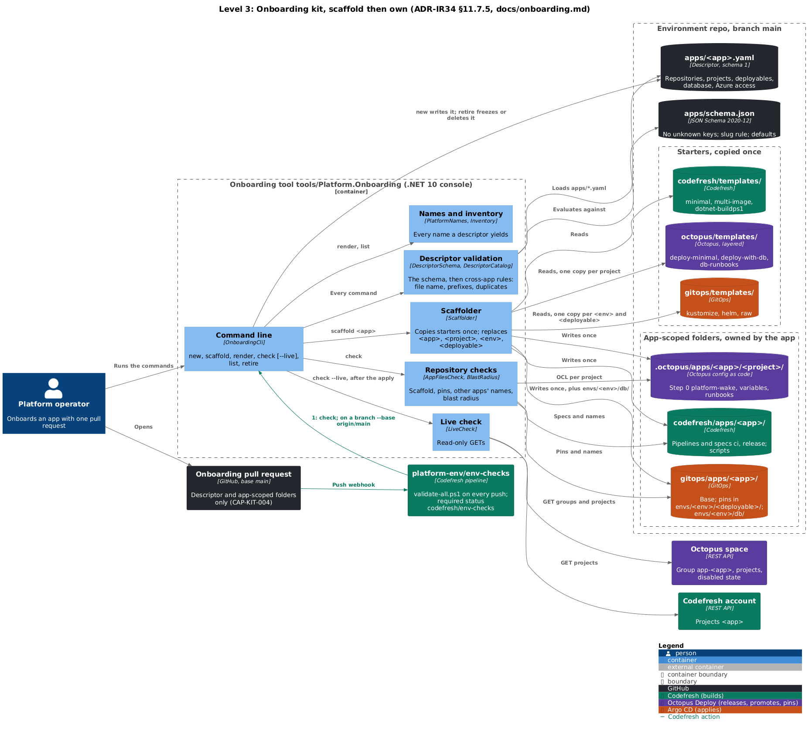
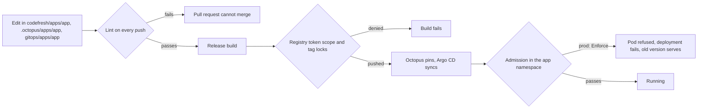

# Lab 24: Own the Pipeline

**Curriculum Section:** Section 04 (CI/CD Pipeline Design) and Section 06 (Operate/Execute)
**Estimated Time:** 50 minutes
**Type:** Build + Experiment
**Builds on:** Lab 18 (follow a commit), Lab 20 (promotion)

---

## Objective

After onboarding, an app's pipelines, Octopus process and manifests belong to the app ("scaffold, then own", ADR-IR34). Change a scaffolded pipeline the way a team would, then break each platform guarantee on purpose and watch which control refuses it: the lint on every push, the registry, or admission in the cluster. By the end, every guarantee has a named control and a place where its refusal shows.

The lab works on a local branch of the environment repo that is never pushed. App #1, `workorders`, is the example; a practice app scaffolded with the kit works the same way ([../onboarding.md](../onboarding.md)).

## Background

The starters are copied once. Nothing ties an app's files back to them, so the platform cannot rely on the templates to keep an app safe. It relies on three layers instead:



*Level 3, the onboarding kit. The operator runs `tools/Platform.Onboarding`: `new` writes `apps/<app>.yaml`; every command validates it against `apps/schema.json` and the cross-app rules; `scaffold` copies the Codefresh, Octopus and GitOps starters once into the app-scoped folders, which the app owns from then on. `check` verifies the scaffold, the pins, other apps' names and the blast radius; env-checks runs it on every push of the onboarding pull request; `check --live` reads the Octopus and Codefresh objects after the apply.*


*Dynamic, the step graph of `workorders/ci`. Both clones feed `prepare` (`VERSION`, `CODE_CHANGED`); six gates run in two chains (`build_sql`, then `acceptance`; `code_analysis`, `build_sqlite`, `qodana`, `security_scan`), so at most two heavy steps share the build node; `gate` waits for every chain, prints the TRX summary and applies the build-result rules: a docs-only change passes with the gates skipped; otherwise each required gate must write its success marker, and `security_scan` is advisory. The build result is the required status `codefresh/ci`.*

| Layer | Runs | Sees | Refuses with |
|---|---|---|---|
| Lint | `platform-env/env-checks` on every push; `pwsh scripts/checks/validate-all.ps1 all` locally | Files: pipelines, specs, OCL, manifests, descriptors | the consistency checks (`Kit.Consistency`) (C…), the tool-boundary rules (TB…), `Platform.Onboarding check` |
| Registry | Every push and delete | The token's scope map, tag locks | `denied` from the registry; a lock that blocks overwrite |
| Admission | Kyverno at every create in an app namespace | The running image: path, signature, SQL edition | A denied request; in nonprod (Audit) a policy report |

The handshake every app keeps (design §7.0):
- **M1** images at `apps/<app>/…`;
- **M2** a keyless signature and an SBOM from a release pipeline of that app;
- **M3** the Octopus release through `octopus_release`, with explicit `PACKAGES` and no `PACKAGE_VERSION`;
- **M4** never deploy.

Fork events stay off in every trigger.



## Part A: change the pipeline the right way

### Step 1: Read what the app owns

```bash
dotnet run --project tools/Platform.Onboarding -- render workorders
ls codefresh/apps/workorders/pipelines codefresh/apps/workorders/specs
ls .octopus/apps/workorders/workorders gitops/apps/workorders
```

### Step 2: Make a real change

Add a step to `codefresh/apps/workorders/pipelines/ci.yml` that publishes a code-coverage summary as a build annotation, or raise a timeout. Keep it inside the app's folder.

### Step 3: Check it

```bash
dotnet run --project tools/Platform.Onboarding -- check workorders
pwsh scripts/checks/validate-all.ps1 consistency
pwsh scripts/checks/validate-all.ps1 boundaries
```

All three pass: the change is the app's business. No starter, platform file or other app changed.

## Part B: break each guarantee

For each row: make the edit on the branch, run the named check, record the message, then revert with `git checkout -- <file>`. For the registry and admission rows, the platform engineer shows the evidence from the nightly conformance run instead: those controls act on real pushes and real pods.

| # | Break | Edit (app #1) | Refused by | Where the refusal shows |
|---|---|---|---|---|
| B1 | M1: push outside the app's path | `image_name: platform/ui-server` in `release.yml` | consistency check C25; then the registry (`cf-apps-release` writes only `apps/*`); in prod the registry-path policy | `validate-all.ps1`; CAP-AZ-002 |
| B2 | M1: push into another app's path | `image_name: apps/sandbox/web` | C25; the other app's tag locks; in prod the signer policy (its subject names the other app) | CAP-CF-007, CAP-AZ-001 |
| B3 | M2: drop the signature | Delete the signing commands of `supply_chain` | Nothing in the lint. Admission: prod Enforce refuses the unsigned image; nonprod Audit records it | The prod deployment fails at its healthy verification; CAP-AZ-001 |
| B4 | M2: sign from a pipeline not named `release` | Rename the spec to `workorders/publish` | Admission in prod (`subjectRegExp` ends in `/release(-[a-z0-9-]+)?`); C25 fails if `platform-octopus` stays attached | CAP-AZ-001; `validate-all.ps1` |
| B5 | Release pipeline named `release_prod` | `metadata.name: workorders/release_prod` in the spec | `Platform.Onboarding check` | `release pipelines are named 'release' or 'release-<x>'` |
| B6 | M3: a default package version | Add `--package-version 1.0` to the `octopus release create` command | C25 (M3) | `'octopus release create' passes --package-version` |
| B7 | M4: deploy from CI | Add a step with `type: deploy`, or `kubectl apply -f` | tool-boundary rules TB01, TB02 | `validate-all.ps1` |
| B8 | Fork pull requests | `pullRequestAllowForkEvents: true` in a trigger of `specs/ci.yml` | C25 | `trigger … allows fork events` |
| B9 | A second runtime | `runtimeEnvironment.name: my-runtime` | TB21 | `runtimeEnvironment.name is 'my-runtime'` |
| B10 | A cloud identity in CI | `az login --service-principal …` in a step | TB21 | `validate-all.ps1` |
| B11 | The Octopus key in CI | Attach context `platform-octopus` to `specs/ci.yml` | C25 | `platform-octopus is attached to release pipelines only` |
| B12 | Push to Git from the pipeline | `git push` in a step | TB16 | `validate-all.ps1` |
| B13 | A floating tag | `tag: latest` | TB06 | `validate-all.ps1` |
| B14 | Pin a digest | `digest: sha256:…` in `envs/tdd/app/kustomization.yaml` | `Platform.Onboarding check` | `pins a digest; pins are tags only (V3)` |
| B15 | Reach into another app | Namespace `sandbox-tdd` or store `sandbox-tdd` in a manifest | `Platform.Onboarding check`; C09; the AppProject at sync | `references app 'sandbox'` |
| B16 | A platform kind in the app folder | A `NetworkPolicy` or `ClusterRole` under `gitops/apps/workorders/` | C09; the AppProject `app-workorders` at sync | `validate-all.ps1`; Argo CD sync error |
| B17 | Skip the wake | Delete step 0 `wake-environment` from `deployment_process.ocl` | C23 | `the first step must be a Deploy a Release of platform-wake` |
| B18 | Borrow the platform key | `#{PlatformWake.OctopusApiKey}` in an app step | TB20 | `validate-all.ps1` |
| B19 | Another SQL Server edition | `MSSQL_PID=Developer` in a manifest | Admission `require-mssql-express` in app namespaces | CAP-AZ-003 |

## Part C: read the evidence

1. In the last nightly summary (`results/<date>-<run-id>/summary.md` on branch `conformance-results` of `<sandbox-app-repo>`), find CAP-AZ-001, CAP-AZ-002, CAP-AZ-003 and CAP-CF-007: the registry and admission layers proven against the sandbox.
2. For B3 and B4, explain why the lint cannot catch them: a signature is a property of a pushed image, not of a file. Which layer would catch B3 if prod ran Audit instead of Enforce?
3. Mark each row of Part B with the earliest layer that refuses it. Count the rows that only admission refuses.

## Offline variant

Do Part A and every lint row of Part B (B1, B2, B4 to B18) on a local branch; answer Part C from the capability catalogue ([../capabilities.md](../capabilities.md)) and the policies under `policies/kyverno/` and `gitops/platform/tenant/templates/signer-policy.yaml`.

<details>
<summary>Answer key (Part C)</summary>

1. The four capabilities list the tests that push the unsigned fixture `apps/sandbox/unsigned:0.0.0-fixture`, try a `workorders` image in `sandbox-prod`, try another `MSSQL_PID`, and read `writeEnabled` and `deleteEnabled` of every pinned tag.
2. The lint reads files; whether an image carries a valid signature from the app's release pipeline is known only after the push. With prod in Audit, nothing would stop B3: the policy report would record it, and only a person reading it would act. That is why the signer and registry-path rules enforce in prod from P1.
3. Lint: B1, B2, B5 to B18 (B4 only through the context). Registry: B1, B2. Admission only: B3, B4 (when the context is removed), B19.

</details>

## Expected Outcome

- A changed pipeline that passes every check, made entirely inside the app's folders.
- A table of guarantees, each with the layer that refuses a break and the message it gives.
- The understanding that "own the pipeline" is safe because the guarantees live outside the templates.

## Discussion

1. Why does the platform not regenerate an app's pipeline from the starter when the starter improves? What does an app gain by pulling improvements in by hand?
2. Which guarantees would a second, untrusted pipeline editor threaten that this single-operator platform accepts (design §13)?
3. B3 is refused only at admission, after the build, the release and two environments. What would it cost to catch it earlier, and where?
